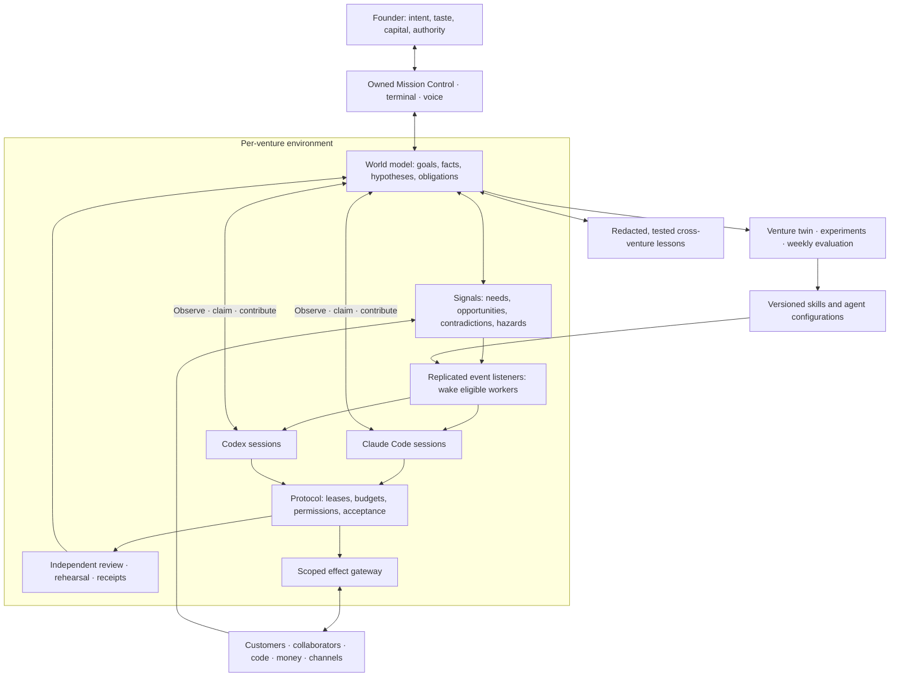

# Concept 3 — The Swarm (Codex advocate)

## 1. The idea in one paragraph

**Organising principle: change the shared environment so the next useful action becomes discoverable.** Each venture has a living world model containing goals, customers, evidence, obligations, uncertainties and unfinished work. Agents observe it, claim bounded contributions, leave verified artifacts and dissolve. Their traces attract complementary expertise, expose contradictions and inhibit unsafe actions. No agent assigns everyone’s work, owns the master plan or adjudicates every disagreement. The founder defines purpose and delegated authority; a deterministic protocol enforces that authority. Coordination intelligence lives in the workers and their shared environment. This is a proposed architecture, not a claim that autonomous, profitable swarms are already demonstrated. All numerical settings below are initial design parameters to test.

## 2. One mermaid diagram



## 3. How work flows

The shared records are small, typed and versioned:

```text
Mission {venture, goal, why, outcome_measure, baseline, constraints,
         authority_version, budget, deadline, stop_rule}
Claim   {subject, assertion, evidence_refs, confidence, valid_until}
Need    {mission, question, required_capabilities, dependencies, resources}
Lease   {need, session, resources, expires_at, fencing_token}
Proposal{mission, hypothesis, artifact_refs, read_versions, predicted_effect,
         acceptance_tests, reversal, dissent}
Receipt {proposal_hash, checks, approvals, external_result, observed_outcome}
```

Facts, hypotheses and decisions remain distinct. Two explanations may coexist; two authoritative balances may not.

1. **Intent becomes a question.** “Create a profitable agency serving overlooked customers” enters as a mission. An on-demand Venture Discovery Researcher proposes measurable outcomes and assumptions. A second worker checks whether the proposed mission preserves intent. Missing preferences become explicit uncertainty, not invented instructions.
2. **Questions recruit contributions.** Workers publish needs: discover customer pain, test willingness to pay, estimate delivery capacity. Independent hypotheses appear before workers see competing answers. No predefined research-to-build playbook is selected.
3. **Teams emerge around dependencies.** A Customer Economics Researcher supplies demand evidence. A Delivery Systems Engineer challenges margin assumptions. An Experience Designer produces a concrete offer. Their shared mission ID and dependency edges constitute the team.
4. **Unknown work creates capability demand.** If nothing matches a need, an Exploration Researcher investigates the field, proposes expertise and tool requirements, and opens a skill acquisition experiment. There is no “unsupported mission type.”
5. **Alternatives meet evidence.** Workers propose experiments, including a pre-mortem and strongest counterargument. A resource lease prevents incompatible experiments touching the same customers. Cheap reversible experiments can run concurrently.
6. **Acceptance closes the contribution.** An independent reviewer checks artifacts against the mission’s outcome contract. Code needs tested behavior; a refund needs a transaction receipt; research needs supported conclusions and uncertainty. Business outcomes remain pending until observation arrives.
7. **Progress changes the environment.** Accepted evidence strengthens useful paths; failed assumptions leave inhibition traces. Two consecutive experiments without measurable progress trigger a strategy challenge. At the stop rule, the mission closes, pivots within delegated authority, or presents a founder decision.

Scheduled heartbeats and external events start the same process. Self-generated initiatives must attach to an existing goal or consume a declared exploration allowance. Nothing earns unlimited continuation merely by producing tasks.

## 4. The founder’s seat

Mission Control is our app, with portfolio outcomes above agent activity: revenue collected, margin, customer progress, unresolved obligations, spend, forecast and founder minutes. It includes live sessions, artifacts, timelines, tasks, idea parking, calendar and mission board. “Why?” reveals the originating signal, evidence, authority and actual result.

Dragging **waiting → working** activates a mission’s budget and wake subscriptions. Dragging **working → done** requests closure verification; it cannot fabricate completion.

Each project has an autonomy switch backed by a versioned charter:

| Mode | Delegation |
|---|---|
| Founder-driven | Workers research, prepare and execute approved missions; strategic commitments return to the founder. |
| Autonomous | Workers originate and execute missions inside standing goals, spending limits and permitted action classes. |
| Paused | New effects stop; observation and explicitly permitted recovery continue. |

Publishing, contracting, spending and customer communication have separate grants. A fully autonomous agency can sell, deliver, invoice and support within its charter for a week without a founder decision. Expansion beyond that charter queues safely.

The founder sets taste, strategic direction, capital exposure and exceptions. He never assigns routine workers, resolves merge conflicts or approves ordinary delegated transactions. Initial attention budget: two ten-minute decision windows daily, with urgent calls only for explicitly defined threats. Silence never grants new authority.

**The AI co-founder is a recurring function, not a superior agent.** Independent Strategy Researcher, Customer Advocate and Venture Economist sessions publish a weekly board packet: investment choices, disconfirming evidence, proposed ventures and candid disagreement. They may initiate authorised experiments but cannot command peers or rewrite the charter.

Onboarding imports approximately 19 repositories through read-only discovery: dependencies, deployments, metrics, obligations and unknowns. Each receives a draft world model; the founder activates authority after reviewing a concise charter. A new project gets a blank charter and environment in minutes.

## 5. Agents

An agent identity is a configuration, instantiated only when useful:

```text
{title, expertise[], skill_versions[], memory_scope, tool_grants,
 runtime, sandbox_profile, evaluation_history, cost_envelope}
```

Claude Code and Codex implement the same worker contract. Either originates, designs, builds, sells, researches or reviews. Provider choice follows measured suitability, availability and experiment allocation; neither has permanent authority over the other.

A deterministic listener matches an unclaimed need to registered capabilities and launches a short session. The worker inspects the current world and chooses whether to claim it. Replicated listeners use atomic admission records to prevent duplicate launches. They neither invent plans nor judge strategy.

Start with one worker per bounded contribution; typically 2–5 concurrent workers per mission. Additional workers require independent questions, reserved budget and available resources. Tightly sequential reasoning stays with one session. Sessions terminate after publishing a contribution or durable checkpoint.

Hybrid specialties arise from repeated interface failures: **Customer Economics Engineer** combines interviews, pricing and instrumentation; **Reliability Experience Designer** joins incident analysis and product communication. Compare each hybrid against conventional teams on matched missions and budgets. Preserve multiple successful configurations instead of appointing a permanent winner.

Contractors, advisors and customers participate through scoped portals. Their evidence and commitments enter the same world model; sensitive records remain restricted, and human collaborators have an appeal route.

## 6. Coordination and non-interference

**Attention is a field, not a market.** Signals carry goal relevance, evidence strength, urgency, age and expiry. Initial admission order: hazards and obligations, blocked dependencies, outcome experiments, exploration. Within a class, ageing and round-robin venture allocation prevent starvation. No bids, transferable credits or agent rewards.

Only independently accepted outcomes reinforce a signal. Repeating an assertion cannot amplify it. Routine attention traces halve every 24 hours; obligations and safety constraints never evaporate. Reserve 10% of discretionary capacity for counterevidence and neglected opportunities.

**Authority is local and inspectable.** A resource map identifies the acceptance contract and eligible reviewers for each repository, customer account, dataset and channel. Maintainers hold expiring review duties, not command over workers. Cross-resource proposals declare their entire footprint before acquiring authority.

**Concurrency is transactional.** Use per-venture PostgreSQL records and append-only events, object storage for artifacts, isolated worktrees or containers, and stateless listeners. Acquire resource leases atomically in canonical order; initial expiry is five minutes with one-minute renewal. Monotonic fencing tokens make expired workers unable to publish or act. Notifications may repeat; record IDs deduplicate processing.

**Proposals may branch; effects serialize.** A per-resource merge queue checks current read versions, tests, reviewer independence and policy immediately before commit. Changed premises invalidate approval. Unrelated resources proceed concurrently. Multi-resource effects require reserved capacity and an explicit compensation plan; uncertain effects stop dependent execution.

**Disagreement has an exit.** Technical objections name evidence or a failed acceptance condition. A fresh reviewer tests the disputed claim. Competing strategies receive bounded experiments where possible; reversible ties use a predeclared selection rule. Irreversible value conflicts outside the charter reach the founder. Initial deadline: 30 minutes for routine disputes, then rotate reviewers or preserve the safe state. No silent approval for consequential actions.

All external effects pass through scoped adapters for email, voice, payments, social, ads, hosting and deployments. Workers lack bypass credentials. The gateway enforces cumulative exposure, margin floors, customer commitments and exact artifact-bound approvals. Idempotency keys plus reconciliation handle retries; an unknown payment result is reconciled before another attempt.

Any worker can raise a scoped hazard and pause affected dependents. An independent review clears it; repeated unsupported hazards trigger diagnosis. Venture and global kill switches revoke effect grants.

This deliberately replaces the repo’s central orchestrator with enforceable shared rules. The database is shared infrastructure, not a thinking boss. During a partition, uncertain writers lose authority; isolated research can continue.

## 7. Memory and learning

Each venture’s brain holds customers, competitors, metrics, decisions, forecasts, obligations and competing explanations. Claims retain provenance and validity intervals. Retrieval logs record what was loaded and cited in a decision; paired replay tests whether the memory actually helped.

Nightly consolidation proposes a new snapshot with contradictions resolved or preserved explicitly. Unused ordinary notes archive after 30 days. Contracts, safety knowledge and retention-bound records follow explicit retention rules. Deletion propagates through indexes and derived summaries. Cross-venture transfer exports abstract lessons only after provenance and disclosure checks.

**Skills begin with demand, not the existing collection.** Harvest upstream libraries, vendor documentation and capability-gap signals. Pin source and licence; inspect executable content; sandbox; compare with and without the skill on both runtimes; admit a version with measured limits. Agents author missing skills through the same process. Tool updates undergo contract tests before rollout.

Weekly improvement compares candidate memory, skills, team shapes and signal rules against a frozen benchmark plus fresh incidents. Keep final holdouts outside worker access. Report accepted outcomes per dollar, first-attempt success, repeated-run reliability, collateral damage, founder minutes and unresolved obligations. No demonstrated gain means “no demonstrated gain.”

The venture twin includes cloned repos, synthetic customers, mock payments and collaborator state. Inject duplicate events, stale premises, provider failures and malicious inputs. Simulated customer enthusiasm generates hypotheses; real demand validates them.

Budget includes subscriptions, metered inference, tools, retries, evaluation and rework. Reserve 15% for recovery; stop speculative launches when capacity tightens. Use permitted provider accounts and verified terms, without limit evasion. Restricted data is routed only to approved providers; credentials remain outside prompts. Founder-managed training settings are recorded and periodically checked.

## 8. A worked day in the life

Illustrative day; amounts are proposed caps, not observed performance.

| Hour | Venture and swarm activity | Authority, evidence and spend |
|---|---|---|
| 03:00 | **Beacon SaaS:** error signal wakes a Codex Reliability Engineer; Claude Code reviews a rollback rehearsal. | Standing incident grant permits rollback. Receipt restores service; incident becomes a regression case. $18 cap. |
| 08:00 | **Signal Studio, autonomous agency:** demand heartbeat recruits a Claude Customer Economics Researcher and Codex Delivery Systems Engineer. | Within its weekly charter, they validate an offer against capacity and margin. $20 cap. |
| 09:00 | Founder opens the portfolio: service recovered, agency operating, one strategic question. | Ten-minute window selects **Frontier Lab’s** research direction; no operational assignments. |
| 10:00 | **Frontier Lab, founder-driven:** Claude and Codex researchers independently develop explanations in an unfamiliar field. | Evidence skills expose a missing simulation capability. $35 cap. |
| 11:00 | Signal Studio sends permitted offers to opted-in prospects; a Customer Operations Specialist answers replies. | Contact leases prevent duplicates. Delivery dates reserve actual capacity. |
| 12:00 | Beacon competitors change pricing. A Venture Economist posts three hypotheses; an Experience Designer prepares variants. | Reversible experiment allowed; permanent pricing change requires founder authority. $25 cap. |
| 13:00 | Signal Studio receives an order, delivers a reviewed artifact and invoices. | Existing contract terms and charter suffice. Payment and delivery receipts update its world model. $30 delivery cap. |
| 14:00 | Frontier Lab’s workers acquire and test the missing simulation skill; a fresh reviewer rejects an unsupported conclusion. | Revised report retains dissent. Skill stays experimental until holdout evaluation. $25 cap. |
| 15:00 | Beacon’s overlapping patches contend for one schema resource. | One lease wins; the other worker tests migration recovery. No founder interruption. |
| 16:00 | Founder reviews Beacon’s pricing packet and Frontier Lab’s findings. | Ten-minute decision window; explicit choices resume only the affected proposals. |
| 17:00 | Signal Studio reconciles receipts, support commitments and margin; sessions dissolve. | Zero founder interventions that day. Unpaid invoices remain receivables, not revenue. |
| 20:00 | Recovery cases replay in the twin; consolidation proposes memory updates. | $20 cap. Total listed AI-work ceiling: $173; customer funds and operating spend remain separate. |

## 9. Where this concept is strongest, and where it is weakest

| Assessment | Design answer |
|---|---|
| **Strongest: discovering unfamiliar work.** No dispatcher must anticipate every specialty. | Capability gaps become research and acquisition signals. |
| **Strongest: portfolio resilience.** A dead session loses a lease, not the organisation’s plan. | Work resumes from durable evidence and obligations. |
| **Strongest: collective learning.** Useful contributions survive their authors. | Test transferable skills and world-model improvements across missions. |
| **Weakness: local optimisation and busywork.** | Require goal-linked outcome measures, protected exploration, competing theses and automatic strategy challenges. |
| **Weakness: coordination overhead can exceed useful work.** | Measure overhead; keep sequential tasks single-worker; batch signals and expand only for independent contributions. |
| **Weakness: popularity can masquerade as truth.** | Reinforce through external outcomes, preserve dissent, reserve counterevidence capacity and track evidence lineage. |
| **Weakness: maintainers can become hidden bosses.** | Expiring duties, inspectable authority, no task-assignment power, reviewer rotation and published appeal outcomes. |
| **Weakness: shared state can spread corruption.** | Version checks, provenance, venture isolation, independent acceptance and protected evaluation infrastructure. |
| **Weakness: commercial judgment has delayed feedback.** | Forecast explicitly, fund real distribution experiments, track obligations and reconcile profit with founder burden. |
| **Weakness: the protocol becomes critical infrastructure.** | Rehearse outages, restore snapshots, replay events and test stale-worker rejection before expanding authority. |

Build in successive proofs: shared records and isolated workers; independent acceptance and effect gateways; autonomous venture operations; then measured adaptation. Advancement requires crash, replay, leakage and week-long autonomy rehearsals. The destination retains every capability.

## 10. Portable mechanisms

1. **Evidence-linked world model:** goals, facts, hypotheses and obligations with separate authority and validity.
2. **Expiring attention traces:** discover useful work without popularity conferring permission.
3. **Fenced contribution leases:** temporary ownership with enforceable stale-worker rejection.
4. **Artifact-bound acceptance:** independent checks and current premises before shared or external effects.
5. **Capability-gap recruitment:** unknown work creates tested skills and hybrid expertise on demand.
6. **Autonomy charters:** project-level freedom expressed as concrete grants, budgets and exception boundaries.
7. **Read-and-outcome memory:** consolidation and forgetting judged by downstream usefulness.
8. **Counterfactual organisation replay:** compare teams, memory and coordination on the same missions before promotion.