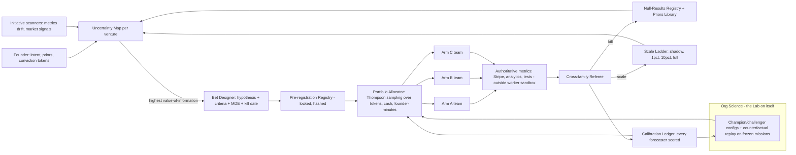

# C4 — The Lab: the organisation as a portfolio of experiments

*Round 1 advocate · 2026-09-30 · sourced claims cite the R0 briefs; all numbers are design targets [spec].*

## 1. The idea
Nothing in the Lab is "done because someone decided"; every commitment is a **bet** with a hypothesis, pre-registered
success and kill criteria, a budget and a kill date. When research, building and selling are near-free, the scarce
things are **judgment and evidence**, so the organisation's job is to turn founder intent into the *cheapest decisive
experiment*, run many in parallel, kill fast, and scale what survives. Agents are cheap, so the Lab runs **variants of
whole ventures at once** — 8 positionings, 3 prices, 2 channels as live micro-ventures — instead of arguing about one.
The Lab also experiments on **itself**: team shapes, hybrid roles, Claude vs Codex, memory policies are all arms.
**Organising principle: no belief without a pre-registered test; no spend without a kill date.**

## 2. System


## 3. How work flows (no playbook)
1. **Intent → Uncertainty Map.** "Can I run a legal-ops agency?" becomes 10–30 open questions, each tagged with
   *decision it would change* and *value of information* (VoI = P(answer flips decision) × stake). Questions that flip
   nothing are deleted — this is the anti-busywork filter (R0-E "an organisation that evolves its questions").
2. **Bet Designer** (a hybrid: experimental-design statistician + domain lens) picks the top-VoI question and writes a
   **Bet record**:
   ```yaml
   bet: legal-ops/b07   door: two-way   parent: thesis/legal-ops
   hypothesis: "SMB firms pay >=$900/mo for AI intake triage"
   prior: 0.30 (Priors Library: 11 past B2B pricing bets, 3 hit)
   arms: [A: $600 self-serve, B: $900 done-for-you, C: $1500 + SLA]
   metric: paid pilots signed (Stripe) ; guardrails: refund rate, complaint count
   success: >=3 paid pilots any arm by kill date ; kill: <1 across arms
   mde: 2 pilots/arm/100 qualified leads ; evidence_level: L4
   budget: {tokens: $140, cash: $400 ads, founder_min: 10}   kill_date: 2026-10-14
   referee_family: codex   (executors: claude)
   ```
3. **Registry locks it** (content hash). Amending criteria after data arrives is allowed but logged as a
   **forking-path amendment** and the result is down-weighted in the Priors Library.
4. **Allocator funds arms**; teams launch per arm in isolated worktrees/accounts. Only systems of record count — "3
   signed" from an agent is not evidence; the Stripe webhook is (R0-D: agents claim completion unverified).
5. **Referee** (other model family, read-only, hidden holdout metrics) rules: kill, extend once (with reason), or scale.
   Kill is the **default on the kill date** — a bet that is not affirmatively renewed dies.
6. **Everything writes back**: effect size + CI to the Priors Library, nulls to the Null-Results Registry, every
   participant's forecast to the Calibration Ledger. The next Uncertainty Map is updated; the loop repeats.

**Evidence ladder** — L0 opinion · L1 desk research · L2 calibrated simulation · L3 smoke test / waitlist · L4 paid pilot
· L5 retained revenue. Minimum rung by door: two-way ≥ L1, costly-reversible ≥ L3, one-way ≥ L4 **or** founder
conviction token. Simulated customers only earn L2 once their predictions have matched real outcomes (R0-E: human
simulations reach 85% of test–retest on surveys, not purchases).

## 4. The founder's seat
**Sees:** the **Portfolio Wall** — every live bet as a card (arm results with CIs, days to kill date, spend vs budget,
calibration of whoever proposed it), grouped by venture and by thesis; a weekly **Lab Notebook** (what was learned, what
died, what the org itself improved by). **Decides (≈5 open items max, R0-B):** new theses (intent), one-way doors,
scale steps above a cash threshold, kill appeals, and the **risk-appetite dial** per venture. **Never touches:** arm
design, two-way bets, team composition, tool choice.

**Conviction tokens** — 3 per month. Taste must not be outvoted by small-N data: the founder can fund a bet the evidence
disfavours, or veto a kill. Token bets are scored like any other, so the founder's own calibration becomes visible to him
(privately) and the Allocator learns where his taste beats the data.

**Autonomy per project = an experiment envelope**, not a toggle: `{max concurrent bets, max cash/week, door types
allowed, min evidence level, outbound channels, human-subject rules}`. An autonomous venture runs the full loop inside
its envelope; anything outside it becomes a decision packet with a default and deadline (R0-B "time-shifted founder").

## 5. Agents
An agent is a **config record**: title + expertise, model family, skills, memory slice, tools, sandbox, and **track
record = outcomes + Brier score**. Launched per arm, dissolved at kill/scale, leaving only findings. Standing roles are few and structural: Bet Designer, Allocator, Referee,
Org Scientist, Venture Steward (the AI co-founder seat — owns the thesis portfolio, proposes kills of the founder's pet
bets, runs the weekly board).

**Claude and Codex are equals by construction:** they are arms. The Allocator periodically funds the same task to
both; the Referee is always the *other* family (cross-family bias, R0-A); winners get more routing until the next round.

**Hybrid specialties are grown, not designed.** The Org Scientist spawns challenger configs (e.g. *pricing-psychologist
engineer*, *regulatory copywriter*, *growth-statistician*) and runs them against the classic split on matched tasks;
promotion is champion/challenger: beat the incumbent on frozen replays, then shadow, then bounded rollout (R0-E #16).

## 6. Coordination and non-interference
Experiments contaminate each other; the Lab treats that as a first-class risk.
- **Interference graph.** Every bet declares what it touches: audience segment, code paths, domains, sender reputation,
  price surfaces. The Allocator refuses to co-fund two bets whose footprints overlap unless they share one randomised
  split (a **traffic layer**: feature flags + audience partitions per venture).
- **Leases** per arm expiring at kill date; one merge queue per repo keyed on the Referee's verdict.
- **Andon** — any agent halts its arm when a guardrail metric breaches; the Allocator freezes dependents.
- **Human-subject rules (an internal "IRB").** No deceptive claims, disclosed waitlists, outbound volume caps per
  domain, no dark patterns, consent for recordings. Autonomous ventures cannot waive these.

## 7. Memory and learning
Memory holds **findings, not logs**: `{claim, effect size, CI, n, context, source bet, read count, expiry}`.
- **Priors Library** — base rates by task family ("cold-email reply rate, B2B, our ventures: 2.1% ± 0.9"), feeding every
  new bet's prior. Cross-venture sharing goes through a leak-checked abstraction step.
- **Null-Results Registry** — every killed bet, so no agent re-runs a dead idea without new reason. Unread findings decay
  after 90 days; contradicted ones are superseded, not deleted.
- **Org Science** measures weekly — outcomes per $, time-to-kill, Brier per config, founder minutes per decision — on
  a **frozen benchmark of replayed missions plus fresh cases**, holdouts hidden from optimisers (R0-E #3, #8), and by
  **counterfactual replay** (same snapshot, different team). A week with no gain says so in the Lab Notebook.

## 8. A day in the life (Thursday)
Ventures: **V1** micro-SaaS for dispute evidence (autonomous, envelope $300/wk), **V2** a design agency (founder-driven),
**V3** new thesis "AI intake for small law firms" (validation).
- **02:00** V1 andon: arm B's refund rate breaches guardrail; halted, arm A takes traffic. No page.
- **05:00** Org Science overnight: challenger *growth-statistician* config beat classic analyst+marketer on 14/20 replays
  at 0.7× cost; enters shadow on V2.
- **07:30** Founder opens the Wall (12 min): V3 shows 8 positioning variants live since Monday — 8 landing pages,
  $50 ads each; "for solo immigration lawyers" leads at 6.1% waitlist vs 1.4% median. He approves scaling it to L4 (paid
  pilots) — one decision.
- **09:00** V2: founder-driven client pitch. The Lab runs 3 proposal variants built overnight by mixed Claude/Codex
  teams; he picks one, spends a **conviction token** on the one the forecasters disliked because of client history.
- **11:00** V1 autonomous: pricing bet b12 hits kill date — no arm cleared +10% ARPU; auto-killed, null logged,
  next top-VoI question becomes a funded bet in 20 min, no founder.
- **14:00** Competitor launches in V3's space. Initiative scanner raises VoI on "does a free tier matter?"; Bet Designer
  registers a 5-day fake-door test (disclosed waitlist); 7 min founder review because it touches pricing publicly.
- **17:00** Weekly board (V1): Venture Steward proposes killing the founder's favourite feature bet — its CI excludes the
  target. Founder accepts the kill but asks for one extension with a sharper metric; logged as an amendment.
- **Day totals:** 31 bets live, 4 killed, 2 scaled, $412 tokens, $610 ad spend, founder 44 minutes.

## 9. Strongest / weakest
**Strongest:** learning over time, robustness to self-deception, unknown work (VoI turns any fuzzy goal into a next
experiment), founder leverage (decisions arrive with evidence levels and CIs).

| Weakness | Design answer |
|---|---|
| Can't A/B a hire, a lawsuit, a brand | **Forecast bets**: register predictions, decide by judgment, score later; rehearse in the twin (L2) |
| Small-N, noisy business metrics | Bayesian sequential tests with Priors Library; compute MDE upfront — if unreachable in budget, redesign or mark "judgment call" explicitly |
| Goodhart / metric gaming | Referee of other family, hidden holdouts, guardrail metrics, metrics only from systems of record |
| Local maxima, killed taste | Conviction tokens + a **moonshot sleeve** (20% of budget, 90-day kill dates, qualitative criteria) |
| Many variants confuse customers | Interference graph, per-venture traffic layer, IRB rules, variants retire by kill date |
| Speed on urgent work | Incidents skip the lab (andon + fix); prevention becomes a bet after |
| Cost of parallel arms | Allocator starts at the cheapest decisive rung; arms get funded by posterior, not equally |

## 10. Portable mechanisms
1. **Bet record + Pre-registration Registry** — hypothesis, criteria, MDE, budget, kill date, hashed before data.
2. **Default-kill on kill date** — work must be affirmatively renewed; kills busywork and zombies.
3. **Portfolio Allocator** — Thompson sampling across tokens, cash and founder-minutes; value-of-information ranking.
4. **Cross-family Referee over authoritative metrics** — the judge is never the builder's family; evidence comes from systems of record.
5. **Evidence ladder bound to door type** — makes "right altitude" and autonomy envelopes mechanical.
6. **Calibration Ledger** — every agent config and the founder scored on forecasts; weights allocation and launches.
7. **Org Science: champion/challenger + counterfactual replay** — hybrids, Claude vs Codex, team shapes as arms.
8. **Priors Library + Null-Results Registry + conviction tokens** — memory as findings, and taste kept explicit.
