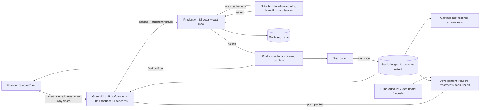

# C5 — The Studio

*R1 advocate · 2026-09-30 · Sources via R0-B/R0-E. Numbers are design targets.*

## 1. The idea
Every venture, client engagement or research question is a **production** on a **slate**. Eight **permanent departments** persist across productions: Development, Casting, Sets, Post, Distribution, Line Producing, Continuity and Standards. **Crews** are cast per production, work to a daily **call sheet**, deliver **dailies** of real output, then **wrap**. When a crew wraps, three things survive it: sets struck back to the backlot, believability updates, and a wrap report that names a changed mechanism. Budget and autonomy come from a **greenlight ladder**, not a playbook. Ongoing businesses run as **Series** under a showrunner, and a Series can be fully autonomous.
**Principle: productions are temporary, the lot compounds.** Production N+1 must start cheaper, faster and better cast than N.

## 2. System

## 3. How work flows (no playbook)
A founder intent ("are AI receptionists for dentists a business?") or a signal becomes a **logline** in Development.
1. **Coverage** (≤2 h, ≤$8). Three blind **readers**, drawn from both Claude and Codex, each return premise, comparables, failure modes and *pass/consider/recommend*. Disagreement is kept as signal.
2. **Treatment + table read.** The treatment states the hypotheses, the riskiest assumption, the kill criteria and which backlot sets can be reused. At the table read, a standing red-team cast plays competitor, regulator and angry customer.
3. **Pitch packet → Greenlight.** The packet carries the forecast with a confidence band, the budget per tranche, the backlot reuse %, the requested autonomy grade and any foreseen one-way doors.
4. **The ladder replaces the plan.** Inside a tranche the **Director** (single-threaded lead) picks the method. The ladder fixes only the evidence ("footage") that buys the next tranche:

| Tranche | Unlocks | Exit footage | Cap |
|---|---|---|---|
| T0 Development | research | coverage + treatment | $10 / 3 h |
| T1 Test shoot | prototype, page, 20 interviews | **test screening** vs kill criteria | $150 / 3 d |
| T2 Principal photography | build, payments, first customers | paying/retained users + Post PASS | $1.5k / 3 wk |
| T3 Release / Series pickup | ads, outbound, grade ≥ A2 | box office inside forecast band | per production |

A failed screening means **Shelve** (sets salvaged; logline to the **Turnaround list**, auto-revived if its trigger signal fires) or **Reshoot** (a pivot at the same tranche and cap). A production with repeating revenue gets a **Series pickup**, where a showrunner runs weekly **episodes** (brief → call sheet → dailies → air) against standing goals.

## 4. The founder's seat — Studio Chief
- **Sees:** the **Slate Board** (per production: stage, tranche, burn, forecast band, days since last circle) and a daily **Dailies Reel**, a 5–8 min auto-cut of real artifacts (screen recordings, pages, customer replies, diffs), never summaries. Phone or voice.
- **Decides:** T2+ greenlights, door-typed one-way doors (R0-B), and **circled takes**, meaning "this is the direction". Circles are the studio's main taste signal. **Notes** are Braintrust-style advisory: the Director logs each one *taken / declined / why*.
- **Never touches:** casting, sets, merges, scheduling, T0–T1 spend, or A3 episodes.
- **Final-cut grades (the autonomy switch):** **A0** founder directs · **A1** circles daily, greenlights every tranche · **A2** weekly dailies, one-way doors only · **A3** showrunner has final cut, monthly slate review, kill switch, budget and margin floors enforced in tools.
- **Attention Budget:** ≈20 min/day and ≤5 open decisions across the slate, rationed by the Line Producer like tokens. A production over its grade's allowance is flagged.

## 5. Agents — cast, not hired
**Cast record:** `{title, expertise, skills[], tools[], model_family, sandbox, memory_scopes[], reel[], believability{domain→score}, rate}`. Agents carry titles only ("Growth Engineer"). The **reel** (past accepted takes) is what Casting reads. Launched only per call-sheet slot, as a Claude Code or Codex session.
- **Claude and Codex are two equal talent pools.** For a new role, or when the two families are within 10% believability, both **screen-test** the same scene, blind-scored by Post. Winners are cast and losing takes are kept as data.
- **Hybrid crafts.** A craft registry holds fused roles (Pricing-Psychologist-Engineer, Regulatory-Copywriter, Support-Refund-Accountant). Each survives only while it beats the classic split crew on accepted outcome per dollar.
- **Crew templates per tranche, learned:** T0 is 3 readers. T1 is a Director, 2 makers and 1 Post. T2 is a Director, a 1st AD, ≤5 makers per lane and 2 cross-family Post. Past 5 lanes the production splits into a second unit with its own AD. **Second-unit swarms** shoot 3–10 variants in parallel, and each swarm ends at a verifier.

## 6. Coordination and non-interference
- **Call sheet.** The 1st AD agent writes one per production per day: who is called, which sets and paths each person holds, the scene, the done-evidence, and the wrap time.
- **Stage booking = leases.** Sets (repos, databases, ad accounts, domains, audiences) are booked with expiring *read/shoot/strike* scopes. Two productions never hold *shoot* on the same set at once.
- **Edit bay = the only merge path.** One Editor per production assembles, runs the whole-cut (all-up) test and cuts. It does not generate code.
- **Continuity.** The Script Supervisor checks dailies against the production bible (decisions, customer promises, pricing, voice). A continuity error blocks the reel.
- **Anti-cannibalism (Haier).** Shared audiences are declared at the pitch and metered by Distribution, e.g. ≤1 studio email per contact per week.
- **Andon = "cut!"** Any agent can halt its own lane and the lanes that depend on it. Every cut adds a five-whys line to the wrap report.

## 7. Memory and learning — the lot compounds
- **Backlot.** Each reusable asset is a set record: `{kind, version, provenance, productions_used[], reuse_count, last_used, known_faults[]}`. Kinds: code starters, payment stacks, brand kits, outreach sequences, eval scenarios, audience segments. **Striking at wrap is mandatory**: improvements come back as diffs. A set unused for 90 days is archived, and a set with rising faults is condemned. Target: **≥40% backlot reuse in T1 footage by week 12.**
- **Continuity bible** per production is its world model. Lessons cross productions only as abstracted **craft notes**, never raw records, so nothing leaks between productions.
- **Studio ledger.** Every greenlight carries a forecast, and each tranche exit logs the actual beside it. That produces a **calibration score** (Brier) per reader, committee and craft, which feeds Casting believability and Development's reader weights.
- **Weekly Studio Notes** (M&M with closure). The only valid output is a changed mechanism (a set, craft, crew template or ladder threshold) with an owner and a date. KPIs: cost per accepted take, logline→screening days, founder minutes per circle.
- **Monthly re-shoots:** replay a wrapped T1 with a different crew to A/B-test the organisation (R0-E).

## 8. A day on the lot
Slate:
- **Series "Clinic Voice"**: A3, an autonomous voice-receptionist agency with 14 clients.
- **"Ledgerly"**: A1, a fintech product at T2.
- **"Protein folding, fast"**: A0/T0, the founder learning a new field.
- 2 loglines in Development.

| Time | What happens |
|---|---|
| 03:10 | Clinic Voice call routing fails. The telephony lane calls cut. The showrunner casts an Incident Engineer (Codex, best telephony reel) and a Claude reviewer, and a backlot rollback set deploys in 11 min. The founder is not woken (A3, reversible). |
| 07:30 | 6-min reel: 3 Ledgerly onboarding variants, the Protein concept map, the incident card, and a split coverage on "B2B podcast agency". The founder circles variant B and adds the note "fewer fields". |
| 09:00 | The Editor merges B. Casting screen-tests a Pricing-Psychologist-Engineer against a PM+engineer pair on the paywall scene. |
| 11:00 | Async greenlight (4 founder-min): the podcast agency gets T1 with 55% reuse of Clinic Voice's outreach set and brand kit. Standards flags the overlap with the dentists audience, and the ruling is a cap of 1 touch per week. |
| 14:00 | The Clinic Voice showrunner mines client calls, finds 3 clinics asking for SMS reminders, and launches an episode arc inside its own budget. |
| 16:30 | The Protein tutor quizzes the founder. His answers update the bible's "founder knows" section. |
| 19:00 | Ledgerly's whole-cut test passes, but cross-family Post blocks the refund flow (no margin floor). A reshoot is scheduled overnight. |
| 23:00 | Wrap: 2 sets struck (paywall v4, a metered dentist segment), 1 craft note, and believability updated for 14 cast members. |

Founder total for the day: **19 minutes, 3 decisions.**

## 9. Strongest and weakest
**Strongest:**
- **Learning over time:** the backlot and calibration make each production measurably cheaper.
- **Founder leverage:** circles turn taste into a signal the system reads, instead of status meetings.
- **Unknown work:** the ladder fixes the evidence required, not the method.
- **Robustness:** tranches cap losses, and there is one merge path.

| Weakness | Design answer |
|---|---|
| Films end; businesses don't | **Series** mode: showrunner, episodes, renewal review every 90 days |
| Ceremony slows speed | T0–T1 self-greenlit under caps; auto-cut reel; async committee with lazy consensus after a 4 h silence window |
| Backlot breeds sameness | A **Location shoot** flag lets a production refuse sets for a stated reason, and an **Originals slate** reserves 20% of budget for productions with <10% reuse |
| Greenlight favours bankable over bold | Calibration charges *missed upside*: a revived turnaround that succeeds counts against whoever passed on it |
| Departments bottleneck | Departments are stores + policy + on-call heads launched in parallel; any queue over 1 h triggers andon |
| Crunch moves to founder attention | The Attention Budget is enforced, and a **completion guarantor** re-scopes an over-budget production before the founder is asked |

## 10. Portable mechanisms
1. **Greenlight ladder:** tranches of money *and* autonomy, each exit bought with footage, never a method.
2. **Dailies Reel + circled takes:** raw artifacts daily, with circles as the taste signal for Casting and Post.
3. **Backlot with mandatory strike:** reuse counts, fault tracking, 90-day archive.
4. **Screen tests:** Claude vs Codex and hybrid craft vs classic crew on identical scenes, blind-scored.
5. **Final-cut grades A0–A3 + Series/showrunner mode** for autonomous ventures.
6. **Call sheet + edit bay:** daily set leases and a single merge path with a whole-cut test.
7. **Greenlight calibration ledger:** forecast vs box office per reader, committee and craft, including missed upside.
8. **Completion guarantor:** an independent agent entitled to take over and re-scope a failing production.
