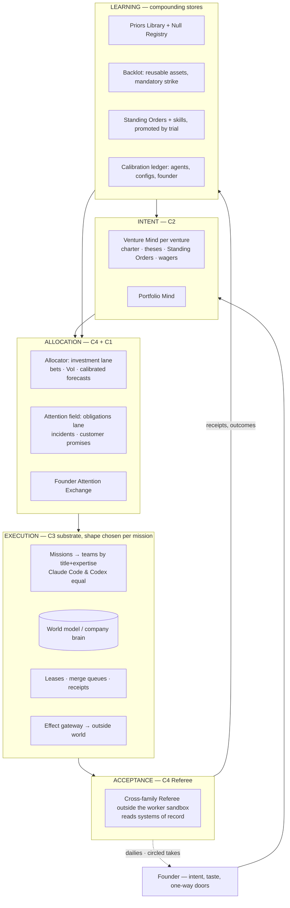

# Round 1 synthesis — the carried-forward architecture

*Orchestrator, 2026-09-30. Inputs: five concepts (C1 Market, C2 Co-founder, C3 Swarm [Codex], C4 Lab, C5 Studio) and two
independent judges (J1 Claude, J2 Codex). This is the frame Round 2 designs inside. Seats may challenge it — upward only.*

## 1. What the judges said

| Concept | J1 Claude | J2 Codex | Mean | Strongest mechanism (both judges agree) |
|---|---:|---:|---:|---|
| C1 Market | 43 | 44 | 43.5 | Framing Contract / independently settled Outcome Contracts |
| C2 Co-founder | 45 | 48 | 46.5 | Judgment compiled into Standing Orders; founder-model vs own-view split |
| C3 Swarm | 43 | **52** | 47.5 | Fenced leases + effect gateway + receipts — the most robust substrate |
| C4 Lab | **48** | 49 | **48.5** | Preregistered bets, default-kill, learning as the architecture |
| C5 Studio | 46 | 47 | 46.5 | Backlot with mandatory strike; Dailies Reel + circled takes |

**They disagreed on the spine** (J1: Lab; J2: Swarm) **and agreed on every graft.** The disagreement dissolves once you see
that each judge picked a different *layer*: J2 picked the execution substrate, J1 the learning-and-allocation discipline.
Both are needed and neither is the whole. The carried-forward design is therefore not "one winner with grafts" but
**four layers with separated authority**, J2's framing, filled with J1's grafts.

## 2. The organising principle

> **Separate the four authorities — Intent, Allocation, Execution, Acceptance — so that no agent both decides what matters,
> funds it, does it and judges it. Everything learned flows back as tested policy, reusable assets and calibrated priors.**

Working name for the whole: **the Compounding Organisation** (the practice it enables: vibe startuping).

## 3. The vocabulary (use these words; define new ones only if needed)

| Term | Source | Meaning |
|---|---|---|
| **Venture** | — | Any project: startup, agency, business, research, learning. Has a **Charter**: intent, autonomy level, budget, never-list, data boundary. |
| **Venture Mind** | C2 | Persistent, versioned record of a venture's theses, taste, Standing Orders, wagers and commitments. The **Co-founder seat** is any Claude or Codex session that loads it — a role, not a process. A **Portfolio Mind** spans ventures. |
| **Standing Order** | C2 | A decision policy (never a method) with `valid_until`, compiled from repeated founder/Mind decisions. KPI: share of decisions resolved by policy. |
| **Mission** | C3/C4 | The unit of funded work. Its **shape is chosen per mission** — solo, lead+workers, swarm, audition/tournament — because R0-A shows no shape wins everywhere. |
| **Bet** | C4 | A preregistered hypothesis with success and kill criteria and a kill date. Required only when a result enters the Priors Library, buys a tranche, or crosses a door type. Routine two-way work runs unregistered and is logged as observation. |
| **Framing Contract** | C1 | When no measure of success exists, the first mission buys one. |
| **Evidence ladder × door type** | C4 | Evidence required scales with irreversibility; sets both autonomy limits and founder altitude. |
| **Two lanes** | C3+C4 | **Obligations lane** (incidents, customer commitments) ordered by an attention field, never waits for a bet cycle. **Investment lane** funded by the Allocator. |
| **World model** | C3 | Evidence-linked per-venture company brain: customers, market, competitors, metrics, decisions. |
| **Lease / receipt / effect gateway** | C3 | Fenced leases stop stale workers; every outside-world effect passes one gateway (idempotent, budget- and policy-checked) and leaves a receipt. |
| **Referee** | C4 | Acceptance by the *other* model family from the builder, outside the worker's sandbox, reading systems of record (Stripe, CI, analytics) — never the worker's claims. |
| **Founder Attention Exchange** | C1 | Decisions compete for a fixed daily supply of founder minutes; two-way doors proceed on silence. |
| **Dailies Reel / circled takes** | C5 | Raw artifacts shown to the founder; what he circles becomes taste data. |
| **Backlot** | C5 | Versioned reusable assets (code, brand kits, audiences, infra). A mission must strike improvements back on wrap. |
| **Series mode** | C5 | Ongoing autonomous operation of a venture that never "ends". |
| **Ledger** | C1/C4 | One ledger for cost, forecasts, wagers and calibration. **No stakes and no transferable rewards** — they reward gaming the Referee (R0-A: evaluator hacking). |
| **Priors Library / Null Registry** | C4 | What the organisation believes, with evidence level; null results kept, not buried. Memory that no settled work cites decays (C1 royalties ⇄ read-and-use tracking). |

## 4. Resolved conflicts (binding for Round 2 unless challenged upward)
1. **No central boss, but not headless.** The Mind owns thesis and proposes allocation; it never holds verdict or merge
   authority. The Referee cannot be overruled by the Mind; the founder can overrule anything.
2. **One allocator, two lanes.** Obligations first (reserved capacity), then investment by the Allocator. Auditions
   (C1) choose approaches *inside* funded missions. Capacity is never spent twice.
3. **Departments are stores and policies, not standing agents.** The only persistent things are records: Minds, backlot,
   cast registry, ledger, world model. Every agent is launched on demand and dissolved.
4. **Kill dates stop hypotheses, never obligations.** Customer promises survive a killed bet via wind-down missions.
5. **Continuity without freezing mistakes.** The Fingerprint gate (C2) preserves *constraints*; outcomes may overturn past
   choices. It generalises to every config promotion — models, prompts, skills, identities.
6. **Standing Orders are policies.** One that dictates steps fails lint — the same rule the harness applies to playbooks.
7. **No span-of-control caps borrowed from humans** (R0-B). Fan-out is limited by verifier capacity (R0-A: MAST, 17.2× vs
   4.4× error amplification), not by a number of reports.
8. **Correlated failure is budgeted.** One defective skill or model deployed everywhere is a portfolio risk (J2).

## 5. What all five concepts missed — now required
Round 2 seats must pick these up (owner in brackets):
- **Legal-financial body** — entities, contracts, tax, books, banking, liability for autonomous actions [startup operator, external world].
- **Founder continuity** — founder state, dead-man switch, succession [autonomy].
- **Counterparty agents** — customers' and suppliers' agents; A2A commerce; inbound injection defence [multi-agent, engineering].
- **Reputation as a breakable asset** — AI disclosure, per-brand firewall, outbound claims standard, global kill [external world].
- **Model-release reflex** — re-benchmark every config; ask what the new capability makes possible [evals, skills].
- **Human task market** — humans hired for signatures, physical work, human-only calls, on the same ledger [external world].
- **Self-funding capital loops and exits** — revenue recycled to compute by treasury rule; sell / spin out / shut as designed outcomes [economics, operator].
- **A measure of "out-building thousands"** — e.g. FTE-equivalent output per founder-hour on matched deliverables [evals, vision].
- **Inter-venture economy** — ventures as each other's first customers [operator].
- **Missing-evidence audits, complementary-investment bundles, relationship repair, transferable operating-company packages** (J2) [lab/evals, allocator, operator].

## 6. What is still open for Round 2 to settle
- Autonomy levels: the concepts proposed A0–A4 (C2), A0–A3 + Series (C5), mandates (C1). **Autonomy seat decides.**
- Founder-contact classes: ENGINE-SPEC and SURFACES-SPEC disagree. **Surfaces seat and autonomy seat reconcile jointly** — surfaces owns the rendering, autonomy owns the classes.
- Runtime language, log store, sandbox: open. **Engineering seat decides**, starting from ENGINE-SPEC.
- Whether the Allocator uses Thompson sampling, VoI ranking, or both. **Mission-engine seat decides.**
