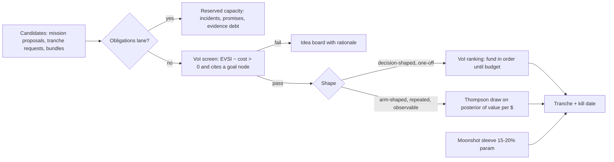
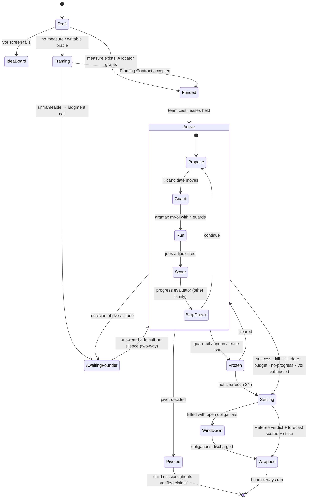
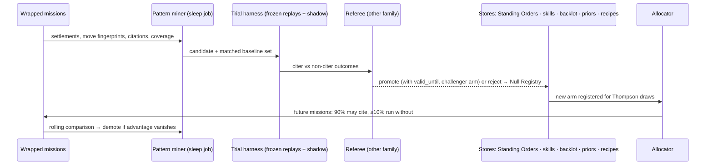

# S01 — The Mission Engine (Round 2 seat: mission-engine designer)

*2026-09-30. Designs inside R1-SYNTHESIS (four authorities: Intent · Allocation · Execution · Acceptance). Builds on
ENGINE-SPEC §3 (move library, planner, guard rules) and replaces two of its rules where Round 0 evidence contradicts
them. External claims cite the Round 0 briefs, which carry the URLs. All numbers not attributed to a source are design
parameters marked (param) — tune them, do not quote them as measurements.*

---

## 1. Summary

1. **A mission is a record, not a procedure.** It carries a question, a measure of success, stop/pivot/kill rules, a budget
   tranche and an evidence position. The engine never follows a script; a planner re-instantiated each cycle picks the next
   **move** from a typed vocabulary (ENGINE-SPEC §3.1), and deterministic guards constrain the choice.
2. **No measure, no money.** A mission whose success cannot be checked by something the workers cannot edit first runs a
   **Framing Contract** (C1) that buys a measure. Framing is a mission state, not a meeting.
3. **Two lifecycles, cleanly separated.** An outer **lifecycle** (Draft → Framing → Funded → Active → Settling → Wrapped, plus
   Frozen, AwaitingFounder, Pivoted, Killed, WindDown) owned by the engine; an inner **cycle** (choose move → run → score →
   stop-check) owned by the planner.
4. **The Allocator uses both, at different layers.** **VoI ranking decides eligibility and ordering** of decision-shaped work
   (which question is worth buying). **Thompson sampling sizes tranches** across arm-shaped work (comparable, repeated,
   observable bets — approaches, channels, configs, hybrids). A candidate must clear VoI > cost to enter the TS draw.
5. **Evidence ladder × door type** is one table that sets, for each consequence class, the minimum rung, the required
   challenge form, the Referee requirement and the founder's altitude. Decisions below their rung accrue **evidence debt**.
6. **Self-challenge follows the evidence:** sample-and-vote (mixed families) for *accuracy*; red team and pre-mortem only to
   *generate objections*, each of which must become a test or an accepted risk. Debate is demoted from decider to objection
   source (R0-A: debate fails to beat self-consistency at matched compute).
7. **Every mission forecasts itself** at funding; settlement scores the forecast. Calibration per planner config, per team,
   per founder feeds the Allocator.
8. **Patterns are learned, not written:** a miner reads settled missions and proposes Standing Orders (policy), skills
   (method), backlot assets, priors and move-recipes. Each is promoted by counterfactual trial, carries an expiry and a
   standing challenger, and is **never a gate** — a mission can always declare itself novel and run recipe-blind.
9. **Missing-evidence audits** attach a *coverage* figure to every outcome; low coverage caps the rung an outcome can earn.
10. **Complementary-investment bundles** let the Allocator fund superadditive bets together — all-or-none, with joint kill
    criteria — instead of starving each component below its decisive size.

---

## 2. The design

### 2.1 Mechanism: Mission record
**What it does.** The single unit of funded, open-ended work. Every other mechanism reads or writes it.
**Trigger.** Created by the Venture Mind (proposal), the initiative loop (signal), the founder (board drag / terminal), a
parent mission (child), or the obligations lane (incident, promise).

```ts
type DoorType = 'two-way' | 'costly-reversible' | 'one-way';
type Rung = 'E0'|'E1'|'E2'|'E3'|'E4'|'E5';        // see §2.6
type Lane = 'obligation' | 'investment' | 'moonshot';

interface Mission {
  id: Id; venture_id: Id; parent_id?: Id; pivoted_from?: Id; bundle_id?: Id;
  lane: Lane;
  goal_ref: Ref;                         // goal-tree node it serves; none → it is an idea, not a mission
  question: string;                      // one sentence, decision-shaped where possible
  decision_it_changes?: string;          // what someone will do differently; empty → VoI = 0 → not funded
  measure: MeasureSpec | { framing_contract: Id };   // §2.2
  success: Criterion[]; kill: Criterion[]; guardrails: Criterion[];
  door: DoorType; blast_radius: 'mission'|'venture'|'portfolio'|'public';
  evidence: { current: Rung; required: Rung; coverage: number /*0..1, §2.10*/; debt: EvidenceDebt[] };
  forecast: { p_success: number; by: string; cost_usd_p50: number; forecaster: ConfigRef };  // §2.8
  tranche: { usd: number; tokens_usd: number; cash_usd: number; founder_min: number;
             verifier_min: number; wall_clock_h: number; kill_date: string };
  shape: 'solo'|'lead+workers'|'swarm-readonly'|'audition'|'tournament';   // chosen per mission (R0-A)
  team: SeatRef[];                       // cast by the team-composition seat
  novelty: 'routine'|'adjacent'|'novel'|'declared-novel';  // declared-novel → recipe-blind (§2.9)
  state: MissionState; cycle_n: number;
  blackboard: Ref;                       // claims, options, objections, open questions
  registered_hash?: string;              // present when it is a Bet (§2.5)
  stop_rules: StopRule[];                // §2.7
  standing_orders_consulted: Ref[]; recipes_cited: Ref[]; backlot_used: Ref[];
}
```

### 2.2 Mechanism: Framing Contract
**What it does.** Converts "no measure of success exists" into a first, cheap mission whose deliverable is a **measure**,
never the answer. Grounded in C1 and R0-A's MAST finding that ~41.8% of multi-agent failures are specification failures.
**Trigger.** `measure` missing, or the measure's oracle is writable by the executing team, or the success criterion is
narrative ("understand the field", "a good brand").

```yaml
framing_contract:
  for_mission: M-0412
  deliverables:
    - oracle:        {kind: metric|exam|panel|pairwise|artifact-test, source: "who/what checks", writable_by_team: false}
    - candidates:    3 outcome statements, each with success, kill, and the decision it changes
    - cheapest_test: the lowest rung that could move the decision, with its cost
    - unmeasurable:  what stays a judgment call, named explicitly (routes to founder taste or forecast bet)
  budget: {usd: 5-8% of the parent's expected tranche (param), wall_clock_h: 4}
  accept_by: Referee (other family) + founder only if door ≠ two-way
```
Oracle kinds cover work with no metric: **exam** (a different family writes a held-out test — research, learning),
**pairwise** (founder 2-minute comparisons → Elo, for taste), **panel** (vote of k independent mixed-family judges against a
rubric), **forecast** (register a prediction now, score later — hires, lawsuits, brands; C4).

### 2.3 Mechanism: Lifecycle state machine
Outer lifecycle, owned by the engine; transitions are journal events (`mission.*`, ENGINE-SPEC §2.1).

| State | Entered when | Leaves when |
|---|---|---|
| Draft | proposed with a question | VoI screen passes → Framing or Funded; fails → idea board |
| Framing | measure missing/writable | Framing Contract accepted → Funded; unframeable → founder packet |
| Funded | Allocator grants tranche | team cast, leases acquired → Active |
| Active | cycles run | a stop rule fires (§2.7) |
| AwaitingFounder | decision above altitude | answered → Active; default-on-silence for two-way; expiry → refuse path |
| Frozen | andon / guardrail breach / lease lost | cleared → Active; not cleared in 24 h (param) → Settling |
| Settling | success, kill, budget, no-progress | Referee verdict + forecast scored → Wrapped |
| Pivoted | pivot decided | child mission created (inherits verified claims, not plan) |
| WindDown | killed but obligations exist | promises discharged → Wrapped (kill dates stop hypotheses, never obligations) |
| Wrapped | settlement written, strike done | terminal; Learn move has run |

### 2.4 Mechanism: Next-step selection (how a mission picks its own next steps)
Each cycle the planner (re-instantiated, compact state ≤ 8 KB, ENGINE-SPEC §3.2) returns **K = 3 candidate moves (param)**,
not one:

```ts
interface MoveCandidate {
  move: MoveType;                           // Understand|Research|Imagine|Challenge|Decide|Plan|Execute|Evaluate|Learn|Control
  targets: QuestionRef[];                   // which open questions it attacks
  expected_rung_gain: number;               // e.g. 0.5 = half a rung on the target
  p_changes_decision: number;               // planner's estimate
  cost: { usd: number; verifier_min: number; founder_min: number; wall_clock_h: number };
  why: string;                              // ≤ 280 chars, stored as rationale
  surprise: boolean;                        // planner flags a move outside cited recipes (§6 idea 4)
}
```
The engine scores `mvoi = p_changes_decision × stake_of_decision − cost_total` for each, applies guards (§2.11), and takes
the argmax. Ties within 10% (param) and no history → run the top two in parallel if both are read-only (a micro-audition).
The planner's estimates are scored at settlement (did the move change the decision?), so the planner config that
estimates well gets routed more. **This is the anti-busywork filter at move level:** a move whose `p_changes_decision` is
~0 cannot win unless it is the Learn move or a guard forces it.

A mission may also emit, instead of a move: a **child mission** (a sub-question worth its own tranche), a **tranche request**
(to the Allocator, with updated forecast), or a **bundle proposal** (§2.12).

### 2.5 Mechanism: Hypotheses, options and the Bet
- **Hypotheses** live on the blackboard as `{claim, prior, source, test, status}`. The Imagine family produces options
  blind and in parallel (N = 3–8, param), mixed families, so options are independent samples rather than one context's drift.
- **Registration is proportional.** Per R1 vocabulary, a hypothesis becomes a **Bet** (hashed, preregistered success/kill,
  MDE, kill date) only when its result will enter the Priors Library, buy a tranche above threshold, or cross a door type.
  Everything else still gets a **light forecast** (§2.8) — one line, no hash — so nothing escapes scoring.
- **Forking-path amendments** (C4) are allowed and logged; amended results enter the Priors Library down-weighted.
- **Unreachable MDE** at the funded budget forces a choice: rebudget, redesign the test, or mark the decision an explicit
  **judgment call** routed to the founder's taste or a forecast bet.

### 2.6 Mechanism: Evidence ladder × door type
Generic rungs, specialised per goal family (commercial, research, engineering, brand):

| Rung | Commercial | Research / learning | Engineering |
|---|---|---|---|
| E0 opinion | an agent believes it | a claim | a design |
| E1 desk | sourced desk research | sources verified | spec + prior art |
| E2 simulated | calibrated twin (only after its predictions matched real outcomes, C4) | held-out exam by other family | tests pass in sandbox |
| E3 behaviour | smoke test / waitlist / reply rate | explain-back to founder accepted | preview deploy + synthetic load |
| E4 commitment | paid pilot / signed LOI | used in a decision that settled well | canary in production |
| E5 retention | retained revenue ≥ 2 cycles | reused across ≥ 2 missions | stable at full traffic ≥ 14 d |

| Door | Min rung to commit | Required challenge (§2.11) | Referee | Founder altitude |
|---|---|---|---|---|
| two-way | E1 | none beyond guard rules | other family, async | never asked; appears in Dailies |
| costly-reversible | E3 | pre-mortem + assumption audit; vote if factual | other family, blocking | notified; default-on-silence 24 h (param) unless the venture's autonomy level delegates it |
| one-way | E4 **or** founder conviction token | pre-mortem + red team + k=5 mixed-family vote on each factual premise + reversal drill if partly reversible | other family + systems of record, blocking | **decides**, with packet: default, dissent, steelman of the loser |

The autonomy seat owns the autonomy levels; this table is the evidence half of that contract and is read by it.
**Evidence debt:** committing below the rung (allowed only with a founder token or an obligations-lane emergency) writes a
debt item `{decision, rung_had, rung_owed, due_by, owner_mission}`; the Allocator funds repayment missions from reserved
obligations capacity; unpaid debt past due raises the decision to the founder.

### 2.7 Mechanism: Stop, pivot and kill conditions
```ts
type StopRule =
  | { kind: 'success'; criteria: Ref[] }
  | { kind: 'kill'; criteria: Ref[] }                         // preregistered; default-kill on kill_date (C4)
  | { kind: 'kill_date'; date: string }                      // must be affirmatively renewed or it dies
  | { kind: 'budget'; pct: 100 }
  | { kind: 'no_progress'; cycles: 3 }                        // evaluator 'same', or rung velocity < 25% of prior (param)
  | { kind: 'voi_exhausted' }                                 // every candidate move has mvoi < 0
  | { kind: 'guardrail'; metric: Ref; bound: number }         // → Frozen (andon), not Killed
  | { kind: 'premise_broken'; premise: Ref }                  // a load-bearing assumption was falsified
  | { kind: 'superseded'; by: Ref }                           // parent goal changed
  | { kind: 'founder_stop' };
```
- **Kill** carries a steelman for continuing; **renewal** requires a new forecast and a reason that is not "sunk cost"
  (renewal rationale is checked by the Referee against the preregistration).
- **Pivot** = conclude + child mission with `pivoted_from`; inherits verified claims and objections, not plan or team.
- **Obligation missions** have no kill date: they stop on discharge, handover, or founder release.

### 2.8 Mechanism: Mission forecast and calibration
At Funded, the planner config, the lead seat, the Mind and (if involved) the founder each register `p_success` and
`cost_p50`. Settlement scores Brier and cost error. These feed: the Allocator's posteriors (§2.12), routing of planner
configs, and the founder's *private* calibration view (C4). Forecasts are cheap (one line) so they are universal.

### 2.9 Mechanism: Pattern learning without cages
**What it does.** Turns settled missions into reusable assets — and keeps those assets from becoming playbooks.
**Trigger.** Nightly sleep job over missions Wrapped since last run; weekly promotion review.

Five destinations, each with its own test:

| Candidate | Mined from | Promotion test | Form it takes |
|---|---|---|---|
| **Standing Order** (policy) | ≥ 5 (param) consistent founder/Mind decisions of one class | replay on held-out past decisions agrees ≥ 90% (param); founder approves once | a rule about *what to decide*, never steps (lint) |
| **Skill** (method) | a move sequence that recurred in ≥ 3 successful missions | isolated trial vs. no-skill baseline on frozen replays; executable + tests (R0-E: "a polished instruction file alone does not qualify") | skill package, optional |
| **Backlot asset** | artifacts struck on wrap | reused by ≥ 1 later mission within 60 d or decays | versioned asset |
| **Prior** | settled bets | effect + CI + coverage; nulls kept (Null Registry) | Priors Library entry |
| **Move-recipe** | common move-sequence fingerprint among winners | cited-vs-not comparison on matched missions | a *prior over sequences* the planner may cite |

**Anti-cage rules** (the reason this is not a playbook system):
1. **Never a gate.** No pattern can block a move. Guards (§2.11) are the only blocking rules and they are few, fixed, and
   about consequence, not method.
2. **Standing challenger.** Every promoted skill/recipe keeps a challenger arm: ≥ 10% (param) of eligible missions run
   without it (Thompson draws decide which), so its advantage is re-measured forever. If citers stop beating non-citers
   over a rolling 30 missions, it is demoted.
3. **Expiry.** Everything learned carries `valid_until` (the harness rule 9 generalised); expiry forces refresh, deprecate
   or waive.
4. **Declared-novel missions.** A mission may declare itself novel; the planner then receives no recipes (only priors and
   Standing Orders). The engine *also* forces recipe-blind runs on a random 5% (param) of routine missions.
5. **Diversity meter.** Entropy of move-sequence fingerprints per venture per month; a falling curve with flat outcomes is
   reported as lock-in (R0-E: DGM retains alternative lineages, including ancestors that initially underperform).
6. **Read-and-use accounting.** A pattern that no settled mission cites in 60 d (param) is consolidated or forgotten
   (founder direction 10; C1 royalties without transferable rewards).

### 2.10 Mechanism: Missing-evidence audit (shared with the evals seat)
**What it does.** An authoritative system of record can still describe a biased slice (J2). Every outcome carries a
**coverage** figure: of the population the claim is about, what fraction did the evidence actually observe?
**Trigger.** Any settlement claiming ≥ E3; weekly per venture; before any Priors Library write.

```yaml
missing_evidence_audit:
  claim: "trial→paid 6.4%"
  population: "all trial starts Sep 1–21"
  observed: {source: stripe+posthog, n: 212}
  expected: {source: signup log, n: 260}
  coverage: 0.815
  blind_spots_sampled:            # independent sampling of what the metric cannot see
    - abandoned checkouts (sample 20, 3 had payment errors)
    - silent customers (sample 15 accounts with no events)
    - unreported failed missions (census of Killed/Frozen without settlement)
  verdict: rung capped at E3 until coverage ≥ 0.9 (param)
  auditor_family: codex            # other family than the settling Referee's builder
```
The audit also runs a **dead-mission census**: missions that ended without a settlement (crashed, abandoned, orphaned)
are counted and sampled, because survivorship among settled missions otherwise inflates every prior.

### 2.11 Mechanism: Self-challenge, evidence-bound
| Purpose | Form | Evidence | Output that must exist |
|---|---|---|---|
| Is this factual premise true? | **Sample-and-vote**, k = 3 (costly-reversible) / 5 (one-way), independent contexts, both families | R0-A: voting explains most debate gains at matched compute | vote tally + dissent reasons |
| What could kill this? | **Pre-mortem** | objection generation only | each cause → kill criterion, guardrail, or accepted risk with owner |
| How would an adversary break it? | **Red team** (other family) | ENGINE-SPEC §3.3 | ≥ 3 failure paths or "none found, searched X"; no search record = unresolved |
| Are we fooling ourselves? | **Assumption audit** | MAST spec failures | each load-bearing assumption → cheapest test or accepted risk |
| Is the loser better? | **Steelman rival** | keeps pivots cheap | runner-up case on record |
| Objections we have not thought of | **Debate** (optional) | generates objections, not verdicts | objections list only; never decides |

Guard rules (deterministic, planner cannot override) — ENGINE-SPEC §3.2 kept, with two changes:
- Rule 4 changes from "irreversible Decide runs a cross-family debate" to **"irreversible Decide runs a k=5 mixed-family
  vote on each factual premise plus a red team for objections."**
- New rule 6: **"an objection may not be silently dropped"** — each resolves to test, criterion, or owned accepted risk.
- New rule 7: **challenge yield is measured** — objections that later proved true (found in post-mortems) per challenge form
  per $ — and the forms themselves become Thompson arms in Org Science, so the mix is learned, not assumed.

### 2.12 Mechanism: The Allocator — VoI then Thompson
**Decision:** both, layered, because they answer different questions.



- **VoI (decision-shaped work).** `EVSI ≈ Σ_outcomes P(o) × [value(best action | o) − value(current best action)]`, estimated
  from the Priors Library; fund in order of `EVSI / cost` until the investment budget for the period is spent. Explainable in
  one line to the founder, which matters because these are the items he sees.
- **Thompson sampling (arm-shaped work).** Beta/Gamma posterior on *verified value per dollar* for each arm (an approach,
  channel, price point, hybrid config, planner config, challenge form). Draw, fund the top draws, update on settlement.
  Prior comes from the Priors Library, *discounted by coverage* (§2.10). Delayed outcomes handled by crediting provisional
  E3 signals at a learned discount until E4/E5 arrive.
- **Scarce resources are allocated jointly.** Tranches are vectors — tokens, cash, **verifier minutes**, **founder minutes**,
  wall clock — and each draw is priced with shadow prices on the binding resources. Verifier minutes matter because fan-out
  is limited by verifier capacity, not headcount (R1 §4.7; R0-A 17.2× vs 4.4×).
- **Correlated-failure budget.** No more than 30% (param) of active tranche value may depend on one skill version, one model
  config, or one channel (R1 §4.8).
- **Exploration floor.** 10% of arm draws (param) go to arms with < 5 settlements; plus the moonshot sleeve (C4) with 90-day
  kill dates and qualitative criteria.
- **Founder conviction tokens** bypass the VoI screen, not the Referee.

### 2.13 Mechanism: Complementary-investment bundles (allocation side)
**What it does.** Some bets are worth little alone and much together — pricing page + onboarding flow + sales script; an
API + its docs + its first integration. Funding them independently starves each below decisive size and then kills them
for "no effect". **Trigger.** A mission proposes a bundle; or the miner detects that past bets in a class settled positive
only when co-funded.

```yaml
bundle:
  id: B-0031
  members: [M-0501 pricing-page, M-0502 onboarding-v2, M-0503 sales-script]
  complementarity: {estimate: 1.8, source: "priors: 4 past co-funded launches vs 9 solo", evidence: E2}
  funding: all-or-none           # a partial bundle is a different, re-scored bet
  joint_success: "trial→paid ≥ 6% on ≥ 200 trials in 21 d"
  joint_kill: "< 3.5% at day 21 across the bundle"
  member_kill: "any member fails its own done-test by day 10 → bundle re-scored, not auto-killed"
  attribution: "post-hoc Shapley on staged rollouts where feasible; otherwise bundle-level only, recorded as such"
  leases: shared traffic layer, one randomisation for all members
```
The Allocator scores the bundle as a single candidate with `value = complementarity × Σ members`, and the Referee settles it
at bundle level. Bundles are also the defence against a known allocator failure: myopic per-item VoI undervalues setup
work (docs, infra, instrumentation) whose value is entirely enabling.

---

## 3. Diagrams

### 3.1 Lifecycle state machine


### 3.2 From settled missions to reusable patterns


---

## 4. Interfaces

| Other part | Mission engine **needs** | Mission engine **gives** |
|---|---|---|
| Intent (Venture Mind, co-founder seat) | goal tree, theses, Standing Orders, never-list | mission proposals' outcomes, kill/pivot packets with steelman, mined Standing Order candidates |
| Autonomy seat | autonomy level per venture, founder-contact classes | door type + rung + required challenge per decision (§2.6) as input to its disposition table |
| Agent organisation / team composition | cast for a requested shape; record track records | seat requests, per-seat outcomes, Brier per config, challenge-yield per form |
| Memory seat | Priors Library, Null Registry, world model reads with read-tracking | settlements, coverage figures, citations (read-and-use signals), nulls |
| Skills/tools economy | skill packages with tests | skill candidates from recurring move sequences, citer-vs-non-citer data |
| Evals seat | frozen replay set, holdouts hidden from the miner, audit sampling tools | missing-evidence audits, dead-mission census, forecast scores |
| Economics seat | capacity by provider/bucket, shadow prices | tranche vectors, cost forecasts vs actuals, bundle funding |
| Engineering (ENGINE-SPEC) | journal, runner, leases, outbox, `mcp-mission` | `mission.*` events; MoveChoice schema v2 (K candidates) |
| Surfaces | — | board card per mission (state, rung, coverage, days to kill, forecast), packet renderings, Dailies |
| Acceptance (Referee) | system-of-record adapters | settlement requests with preregistration hash and coverage |

---

## 5. Worked examples

### 5.1 "Should I start a legal-ops agency?" (founder-driven venture, new)
*Costs and times are design estimates (param), not measurements.*
- **T+0, founder** types it in the terminal (30 s). Engine creates Draft M-A1; `decision_it_changes` = "start / don't".
- **T+2 min.** VoI screen: stake high, current p unknown → passes. No measure → **Framing**. Framing seat: one
  **Strategy Framer** (claude-sonnet-5) + **Measurement Designer** (Codex, gpt-6-astra), 3 h, ~$6. Deliverable: oracle =
  "≥ 3 paid pilots at ≥ $900/mo from ≥ 40 qualified conversations within 21 d" (E4); cheapest test = 8-positioning
  landing-page smoke test (E3, $400 ads); unmeasurable = "would I enjoy running it" → founder taste, flagged.
- **T+3 h.** Referee (Claude, since the framer's measure was drafted by Codex) accepts. Door: costly-reversible (ads, public
  pages). Founder notified; silence for 24 h = proceed (founder-driven venture still delegates two-way and notified classes).
- **Day 1.** Allocator: M-A1 is decision-shaped → VoI ranked, funded $140 tokens + $400 cash + 10 founder-min, kill date
  day 14. Planner (claude-opus-5) proposes {Research sweep, Imagine 8 positionings, Pre-mortem}; mVoI picks Imagine;
  8 positionings are **arm-shaped** → they enter a Thompson sub-allocation for ad spend.
- **Day 2–9.** Research swarm (5 read-only, mixed families) raises E1; landing pages live; Thompson shifts spend to
  "solo immigration lawyers" arm. Pre-mortem objection "bar-association advertising rules" → becomes a guardrail and a
  **Regulatory Copy Engineer** (hybrid record) review job; not dropped (rule 6).
- **Day 10.** Missing-evidence audit: coverage 0.7 (ad platform attribution loses 30% of clicks) → waitlist result capped at
  E3 with that caveat on the card.
- **Day 14.** Stop rule `success` for the E3 stage: planner requests next tranche for E4 pilots; forecast updated 0.30 →
  0.46. Founder spends 4 min approving (costly-reversible cash above threshold).
- **Memory writes:** Priors ("B2B legal waitlist conversion, n=…, coverage 0.7"), Null Registry (6 losing positionings),
  a backlot landing-page kit. Pattern miner notes the 8-arm smoke-test sequence (3rd occurrence) → skill candidate.
- **Founder total:** ~15 min over two weeks.

### 5.2 Autonomous micro-SaaS: churn uptick at night (autonomous venture)
- **02:10** Signal: 7-day churn +40% vs baseline. Initiative loop creates two missions: **obligation** M-O7 ("customers
  affected by failed exports get working exports") — no kill date, reserved capacity; **investment** M-I9 ("is churn caused
  by the export bug or by the new price?").
- **02:12** M-O7 is Funded instantly from reserved capacity; **Site Reliability Engineer** (Codex) + Referee (Claude)
  ship a fix behind a flag; effect gateway sends apology emails (two-way, templated, pre-approved Standing Order). ~$9.
- **02:30** M-I9: has a measure (Stripe cohorts) → Funded by VoI. Planner proposes {Research: cohort split; Challenge:
  vote on "export bug affected ≥ 60% of churners"; Imagine}. Vote k=3 mixed: 3/3 yes, but coverage audit finds 22% of
  churners had no export events at all → a second hypothesis (price) stays open.
- **03:40** Planner proposes a **bundle**: price-grandfathering email + export reliability page + in-app status banner;
  complementarity estimate 1.4 (E1, weak) → Allocator funds it as all-or-none, $38, kill day 10.
- **08:00** Dailies show both missions; founder reads 2 min, circles the banner copy. No decision required: all doors were
  two-way or covered by Standing Orders.
- **Day 10** settlement: churn back to baseline; Shapley attribution infeasible (co-launched) → recorded bundle-level only.
  Forecast scored; planner config's Brier improves; Standing Order candidate "grandfather existing customers on any price
  change during an incident" mined (2nd occurrence; needs 5).

---

## 6. Ideas the founder did not ask for

1. **Evidence debt as a first-class liability.** Decisions taken below their rung (founder tokens, emergencies) accrue debt
   with due dates, shown on the Portfolio Wall like technical debt. It makes speed an explicit trade instead of an invisible one.
2. **Reversal drills.** Before a costly-reversible commit (price change, DNS move, contract template), the mission rehearses
   the rollback in the twin and records rollback time. A door whose reversal is untested is reclassified one step toward one-way.
3. **Ghost planners.** For 5% of missions (param), a second planner config runs in shadow on the same state and proposes
   moves that are never executed; at settlement, counterfactual replay estimates which plan would have done better. This is
   how planner configs improve without risking real work.
4. **Surprise budget.** 10% of every tranche (param) is reserved for moves the planner flags `surprise: true` — outside any
   cited recipe. Their yield is tracked; if surprises never pay, the reserve shrinks; if they do, recipes are over-fitted.
5. **Question half-life.** Every open question on an Uncertainty Map decays in VoI as its decision deadline approaches; a
   question whose answer can no longer arrive in time is closed automatically ("too late to matter"), preventing research
   that finishes after the decision.
6. **Mission genome and diversity quota.** Move-sequence fingerprints make it possible to say "we have solved every
   validation problem the same way for 3 months" and to force recipe-blind runs — a measurable guard against the playbook
   cage creeping back through learning.

---

## 7. Risks (each with a design answer)

| Risk | Design answer |
|---|---|
| VoI estimates are themselves model guesses, so the screen is theatre | Planner's `p_changes_decision` is scored at settlement; configs with poor VoI calibration are down-weighted; VoI screen thresholds are TS arms in Org Science |
| Thompson sampling on delayed, small-N business outcomes learns slowly | Priors Library warm-starts posteriors; provisional E3 credit at a learned discount; hierarchical pooling across ventures of the same class (leak-checked abstraction) |
| Framing Contracts become a bureaucracy tax on small work | Rate: framing capped at 5–8% of tranche; two-way missions under $25 (param) with an obvious artifact-test skip framing |
| Learned patterns re-create the playbook cage | Six anti-cage rules (§2.9): never a gate, standing challenger, expiry, declared-novel, diversity meter, read-and-use decay |
| Voting with correlated models just repeats one error | Mixed families required; votes must use independent contexts and different retrieval seeds; correlation measured on past votes and k raised where agreement is uninformative |
| Coverage audits are expensive | Sampled (15–20 items), run only at ≥ E3 claims and before Priors writes; audit cost is a line in the tranche |
| Bundles become a loophole to fund weak members | Complementarity estimate must cite priors; bundles are all-or-none and settled jointly; members failing their own done-test trigger re-scoring |
| Planner optimises for cheap moves that look like progress | Narrative-free progress evaluator (other family) plus rung velocity (§2.14) |
| Obligations starve investment forever | Reserved capacity is a cap as well as a floor; exceeding it raises a founder packet on venture health, not silent starvation |

---

## 8. Open decisions (with recommendations)

1. **Hierarchical pooling of Allocator posteriors across ventures.** Faster learning vs leakage and false transfer.
   *Recommend:* pool only abstracted, leak-checked task-family priors (e.g. "landing-page smoke test, B2B"), with a
   per-venture shrinkage weight learned from how well pooled priors predicted that venture's outcomes.
2. **Who owns the Framing Contract Referee when the founder is the only valid judge (taste)?** *Recommend:* pairwise oracle
   (2-minute comparisons) counts as founder-accepted; no founder in 72 h → mission parks on the idea board, never runs on an
   agent-invented measure.
3. **K (candidate moves per cycle) and ghost-planner rate.** Higher K improves choice and costs tokens. *Recommend:* K=3,
   ghost rate 5%, both registered as Org Science arms so the numbers are learned, not fixed.

---

## 9. Challenge to the synthesis (upward only)

1. **"Bet only when it crosses a threshold" leaves most work unscored.** Keep full preregistration proportional, but make a
   **light forecast universal** (§2.8). Scoring every mission is what makes the Allocator, planner routing and the founder's
   calibration learn from the 80% of work that is routine.
2. **The Allocator must allocate verifier and founder minutes, not only money and tokens.** R1 §4.7 names verifier capacity
   as the true fan-out limit; an allocator blind to it will fund more work than can be accepted. Tranches are vectors with
   shadow prices (§2.12).
3. **ENGINE-SPEC guard rule 4 (cross-family debate on irreversible decisions) is contradicted by R0-A** — replaced by
   vote-on-premises plus red-team-for-objections (§2.11): more independent samples, and every objection must terminate.
