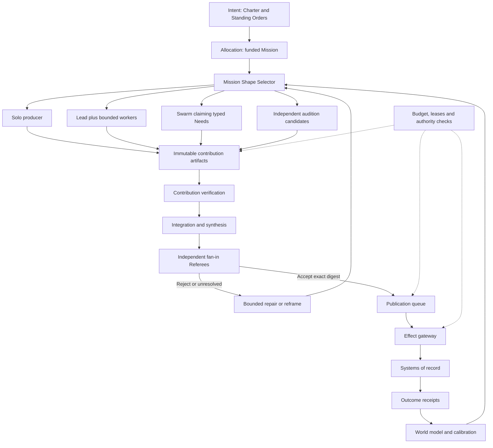
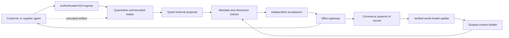

# R2 — Multi-agent systems researcher (Codex seat)

## 1. Summary

1. Choose solo, lead+workers, swarm or audition from the mission’s dependency structure, uncertainty, interference and verification needs.
2. Treat team composition as a funded, measured decision; reserve verification and recovery capacity before launching workers.
3. Claude Code and Codex have identical eligibility for every role; route complete configurations using matched outcome evidence.
4. Launch agents by title and expertise from versioned records; durable services handle scheduling, waiting, leases and recovery.
5. Coordinate through typed contributions on a blackboard backed by the world model, with explicit provenance and read versions.
6. Use MCP for capability access and A2A for independently administered counterparties; neither protocol confers business authority.
7. Enforce ownership with isolated workspaces, semantic resource footprints, fenced leases and integration queues.
8. Verify every fan-in, including research synthesis and mixed-family integration; agreement between workers never substitutes for acceptance.
9. Continue useful work during provider outages while preserving acceptance requirements and separately authorized incident recovery.
10. Give customer and supplier agents a commercial interface with bounded mandates, injection containment and independently reconciled receipts.

## 2. The design

### 2.1 Architectural position and evidence

This seat implements the Execution layer of the [Round 1 synthesis](../r1-concepts/R1-SYNTHESIS.md). Intent supplies the Charter and Standing Orders; Allocation supplies a funded Mission; Acceptance controls Referee verdicts. A team may propose changes to any of these, but cannot grant itself authority.

All numerical defaults below are **proposed settings to test**. Worked-example costs and timings are illustrative, not measured performance or provider prices.

Three findings shape the design:

- A controlled study of 180 agent configurations found topology-dependent results, including error amplification of 17.2× for independent agents versus 4.4× under centralized coordination. These are study-specific results, not reliability multipliers for this organisation. They support testing topology and checking aggregation. [Scaling-agent study](https://arxiv.org/abs/2512.08296).
- Anthropic reports a 90.2% improvement over its single-agent baseline on an internal research evaluation, alongside substantially greater token consumption. This supports parallel research as a candidate, not a universal team default. [Research-system account](https://www.anthropic.com/engineering/multi-agent-research-system).
- MAST identifies failures in system design, inter-agent alignment, and verification or termination. Adding workers without clearer contracts can multiply unresolved assumptions. [MAST paper](https://arxiv.org/abs/2503.13657).

Carry forward v1’s typed handoffs, independent acceptance, semantic conflicts and distinction between worktrees and isolation. Keep v2’s external runner and structured returns. Replace v2’s permanent Claude-builder/Codex-reviewer split. Extend ENGINE-SPEC’s communication model to permit concurrent production under enforced resource boundaries; its blanket restriction of swarms to read-only work is unnecessary when publication and effects are controlled.

Sources: [v1 work and agents, §§5–6](../../vision-system/planning/specification/05-work-agents-skills.md), [v2 multi-agent panel](../../vision-v2/panel/02-multi-agent-engineer.md), [ENGINE-SPEC, §§3–4, 8–10](../engineering/ENGINE-SPEC.md).

### 2.2 Mechanism: Mission Shape Selector

**Does:** proposes the topology and contribution graph that best fit the funded outcome. It does not prescribe a playbook or reopen allocation automatically.

**Trigger:** mission admission, newly discovered dependencies, verification congestion, repeated rework, or provider/capability loss.

```yaml
TeamPlan:
  mission_id: mission_042
  revision: 3
  shape: solo | lead_workers | swarm | audition
  features:
    critical_path: [need_1, need_4]
    independent_questions: [need_2, need_3]
    coupling: low | medium | high
    uncertainty: bounded | exploratory
    interference_refs: [resource_api_contract]
  contributions:
    - need_id: need_2
      title: Customer Economics Researcher
      expertise: [pricing, interviewing, unit_economics]
      input_refs: [snapshot_18]
      output_contract: evidence_bundle_v2
      dependencies: []
      verification_contract: evidence_check_v3
      resource_footprint: [customer_segment_7]
      why_separate: independent_evidence
  reservations:
    execution: budget_exec
    verification: budget_verify
    recovery: budget_recover
  rejected_shapes: [{shape: solo, reason: independent_deadlines}]
  replan_when: [dependency_changed, verifier_deadline_at_risk]
```

| Shape | Selection conditions | Coordination | Required fan-in |
|---|---|---|---|
| **Solo** | Tightly coupled reasoning; one mutable design; expensive handoffs | One producer owns the reasoning chain | Independent acceptance of its result |
| **Lead+workers** | Stable decomposition; several bounded contributions; integration needs continuing judgment | Temporary lead maintains interfaces and proposes replanning | Check each dependency boundary, then the integrated result |
| **Swarm** | Useful needs emerge during execution; heterogeneous expertise; contributions can remain bounded | Workers claim needs from the blackboard; no permanent lead | Verify every promoted contribution and every aggregate |
| **Audition** | Competing approaches are uncertain and comparable against a frozen rubric | Independent candidates in isolated namespaces; blind comparison | Verify candidates, select, then verify the integrated winner |

A mission can change shape: audition an approach, use lead+workers for implementation, then launch a swarm to investigate unexpected evidence. Changes create a new TeamPlan revision and preserve completed artifacts.

Selection minimizes expected total cost at the required quality and deadline. Cost includes execution, coordination, verification, rework and founder attention. Where outcome value is uncertain, show a quality–cost frontier rather than manufacturing one scalar score.

Every added worker must have a distinct deliverable, a reason for separation and reserved acceptance capacity. A lead is justified by integration work; it is never added merely because a team exists.

For a scheduling horizon \(H\), predicted review work from admitted contributions must fit available verifier time after existing obligations. Use conservative service-time estimates and observed queue age. A nominal “reviewer slot” without time and budget is insufficient.

More workers may accelerate discovery while delaying acceptance. When that happens, launch verifiers, narrow contribution size or stagger production. Do not borrow investment review capacity already reserved for incidents.

### 2.3 Mechanism: Equal Worker Registry and Evidence Router

**Does:** separates expertise from provider and chooses an eligible configuration for each contribution.

**Trigger:** launch admission, model release, skill change, evaluation expiry or performance drift.

```yaml
WorkerConfig:
  title: Reliability Experience Engineer
  expertise: [distributed_systems, incident_response, customer_experience]
  identity_revision: 8
  runtime: claude_code | codex
  model_id: resolved_exact_model_id
  runtime_version: pinned_version
  reasoning_configuration: pinned_configuration
  skill_digests: [sha256_skill]
  context_policy_digest: sha256_context_policy
  allowed_data_classes: [internal]
  sandbox_profile: isolated_builder
  tool_grants: [mission_read, artifact_write]
  evaluation_cell: reliability_incident_v4
  lineage: [classic_reliability_engineer, experience_designer]
```

Runtime, model, skills, context policy and permissions form the evaluated configuration. A title alone has no score. Provider eligibility is symmetric for research, building, design, negotiation, leadership and review.

The consulted material does **not** establish a valid matched comparison showing which family is better across this organisation’s tasks. Consequently, there is no evidence-backed permanent “Claude is better at X” or “Codex is better at Y” assignment.

The measurable distinction available now is interface support: Codex documents non-interactive execution, JSONL events and schema-constrained output; Claude Code documents programmatic execution and structured streaming. Both can implement the worker contract. [Official OpenAI documentation](https://learn.chatgpt.com/docs/non-interactive-mode), [Claude Code documentation](https://code.claude.com/docs/en/headless).

Measure comparative strengths as follows:

| Task cell | Primary outcome | Additional measurements |
|---|---|---|
| Repository changes | Independently accepted behavior | Escaped defects, integration effort, cost, elapsed time |
| Research | Supported decision-relevant findings | Citation validity, missing counterevidence, evidence duplication |
| Design | Blind founder preference within constraints | Task usability, revision burden, implementation fidelity |
| Coordination | Accepted integrated outcome | Lost constraints, conflicting work, review backlog |
| Review | Detection of seeded and naturally occurring defects | False alarms, severity calibration, review cost |
| Commercial work | Authorized commitments fulfilled | Margin, corrections, disputes, relationship damage |

Run paired tasks with frozen inputs, equivalent grants, matched budget envelopes and independent outcome checks. Also compare practical configurations at their actual costs; equal token counts alone do not establish equal economics.

Report sample size, uncertainty, task distribution and configuration date. Promotion requires holdout performance and live canaries; small samples retain broad uncertainty. Record selection probability so routing does not make the favored provider appear better merely by giving it easier work.

Reserve an initial 10% of discretionary evaluation capacity for challengers, alternating families where evidence is tied. This is an experiment allowance, not a permanent production quota.

Hybrid roles compete against both a classic solo role and a classic pair. Their advantage must survive the cost of acquiring broader context. Model and skill releases invalidate affected score cells until the Fingerprint gate and relevant evaluations pass.

### 2.4 Mechanism: On-demand Launcher and Durable Continuation

**Does:** turns an admitted contribution into a bounded session, then dissolves it.

**Trigger:** a ready Need, a durable answer, an external signal or a scheduled obligation becoming due.

```ts
type LaunchTicket = {
  missionId: string;
  needId: string;
  attemptId: string;
  configDigest: string;
  authorityVersion: number;
  snapshotRef: string;
  constraintSetRef: string;
  acceptanceContractRef: string;
  resourceLeaseRefs: string[];
  budgetReservationRef: string;
  verifierReservationRef: string;
  deadline: string;
  continuationRef?: string;
};

type WorkerReturn = {
  artifactRefs: string[];
  readVersions: Record<string, number>;
  unresolved: string[];
  pendingEffectRefs: string[];
  proposedNextNeeds: string[];
  continuationRef?: string;
};
```

A deterministic supervisor atomically claims the launch ticket, reserves capacity, prepares isolation and starts the selected runtime through an adapter. Use structured argv or SDK arguments, never shell interpolation of mission text.

The adapter verifies the installed runtime’s capabilities before admission. Required MCP initialization, structured output and sandbox behavior must pass compatibility checks. Similar-looking CLI flags do not establish equivalent enforcement.

The initial supervisory lease lasts 90 seconds and renews every 30 seconds. Renewal comes from the supervisor, independent of model response time. A long inference call need not appear dead. Resource permissions still require valid fencing at publication and effect dispatch.

Persist launch intent before spawning. Record process identity with host and start identity, not PID alone. After a crash, reconciliation discovers orphan processes and uncertain external attempts before starting a replacement. A unique active attempt per Need prevents duplicate event delivery from authorizing duplicate workers.

Waiting for another agent, founder or customer writes a continuation and ends the session. The continuation includes artifact hashes, unresolved criteria, constraint versions, pending effects and remaining allowance. Resume a healthy compatible session or launch a fresh one; transferring a transcript is optional.

Native subagents must appear as charged child attempts under the same root allowance. If a runtime cannot enforce child admission and isolation, disable its native spawning for that profile and expose brokered delegation instead.

Wrap-up revokes grants, publishes candidates, releases resources, settles usage and schedules acceptance. It also proposes Backlot improvements and records remaining obligations. A successful process exit is never a completion verdict.

### 2.5 Mechanism: Typed Blackboard over the World Model

**Does:** lets temporary workers coordinate through durable, inspectable state without sharing unrestricted conversations.

**Trigger:** assignment, discovery, question, objection, correction, contribution or cancellation.

```ts
type WorkMessage = {
  id: string;
  ventureId: string;
  missionId: string;
  kind: "assignment" | "question" | "finding" | "objection"
      | "correction" | "result" | "stop";
  senderAttempt: string;
  recipientNeed?: string;
  subjectRefs: string[];
  payloadRef: string;
  payloadHash: string;
  constraintSetRef: string;
  readVersions: Record<string, number>;
  trust: "internal_proposal" | "external_content" | "verified_evidence";
  correlationId: string;
  causationId: string;
  expiresAt: string;
  responseDueAt?: string;
};
```

The blackboard is the coordination projection of durable events; the world model is the evidence-linked domain projection. They share identifiers and provenance, rather than maintaining competing copies of truth.

Workers append candidate findings. Acceptance promotes supported claims through a controlled writer. Hypotheses, observations, commitments and decisions remain different record types. Contradictory hypotheses can coexist; canonical balances and resource ownership require authoritative transactions.

Delivery is at least once. Repeating a message ID with identical content returns its existing result; changed content under the same ID conflicts. Acknowledgments distinguish delivery, understood scope, accepted assignment and answered question. Only an authorized acceptance transfers responsibility.

Questions name the missing fact, needed-by time and permitted fallback. The scheduler wakes an eligible answerer; it does not keep both sessions burning tokens. Cyclic questions consume a root interaction allowance and eventually produce an unresolved dependency, not endless discussion.

MCP exposes operations such as `read_snapshot`, `post_candidate`, `ask`, `claim_need` and `propose_effect`. Authentication, tenant scope and authority checks happen server-side. Read tools cannot silently become write tools.

Pin each adapter’s actual MCP version and capabilities. The 2026-07-28 specification changes the protocol to a stateless core; this does not prove every installed runtime supports that revision. Version conversion belongs at the adapter, with contract tests. [MCP changelog](https://modelcontextprotocol.io/specification/2026-07-28/changelog).

A2A is for crossing an independently administered agent boundary, including customer, supplier or separately governed partner organisations. Internal sessions need no additional discovery handshake merely to exchange a finding.

Untrusted content stays untrusted when quoted, summarized or returned through MCP. Provenance survives transformation. A persuasive summary does not become a policy instruction.

### 2.6 Mechanism: Resource Ownership and Fenced Leases

**Does:** prevents simultaneous incompatible authority over files, business resources and semantic decisions.

**Trigger:** a contribution requests mutable resources, expands its footprint or approaches publication.

```yaml
ResourceLease:
  resource_id: venture_7:production:pricing_contract
  owner_attempt: attempt_19
  mode: exclusive_write
  fencing_token: 1042
  expires_at: authoritative_timestamp
  authority_version: 12
  base_version: 88
  conflict_set: [checkout_price, campaign_price, customer_quote]
  permitted_effect_classes: [propose]
```

An ownership map records resource identity, eligible maintainers, acceptance contracts and conflict relationships. It confers duties on records, not permanent employment on an agent.

Resource scope includes repository paths, API contracts, schemas, production environments, customer threads, audience partitions, inventory, payment obligations and brand channels. Two files can be disjoint while changing the same promise. Such changes share a semantic conflict resource.

Grant multi-resource leases atomically or acquire in canonical order without holding partial sets indefinitely. Lease expansion requires fresh admission. Alias resolution prevents two customer IDs or deploy names from bypassing ownership.

Workers edit isolated candidate workspaces. Shared Git metadata, credentials, ports, caches and databases need their own boundaries. Use separate clones or stronger isolation where worktree sharing would expose protected state.

Auditions may modify equivalent paths in separate candidate namespaces. They possess no competing publication authority over the canonical resource.

Every controlled mutation checks the current lease, fencing token, authority version and relevant base versions atomically with the mutation. Merely checking lease expiry when work starts is insufficient. Expired workers may leave recoverable artifacts; they cannot publish, merge or dispatch effects.

During a coordination-store partition, workers can continue authorized private analysis. They cannot renew authority locally or mutate canonical resources. Fencing is enforced at the write boundary, not trusted to the agent’s willingness to stop.

### 2.7 Mechanism: Fan-in Contract and Integration Queue

**Does:** makes aggregation an explicit acceptance event.

**Trigger:** contributions combine into a report, plan, codebase, offer, experiment result or promoted memory item.

```yaml
FanInContract:
  id: integration_12
  input_artifacts: [artifact_a, artifact_b]
  input_digests: [sha256_a, sha256_b]
  producer_lineage_refs: [lineage_a, lineage_b]
  criteria_digest: sha256_criteria
  dependency_versions: {api_contract: 8, pricing_policy: 4}
  integrator_attempt: attempt_29
  referee_assignments: [review_a, review_b]
  required_checks: [behavior, compatibility, provenance, authority]
  output_digest: null
  disposition: pending | accepted | rejected | unresolved
```

A verifier exists at every fan-in. It checks both input validity and interaction between inputs:

- Research aggregation checks source independence, contradictory findings and unsupported synthesis.
- Code integration checks the combined behavior against the current base.
- Commercial aggregation checks capacity, price, delivery promises and cumulative exposure.
- Memory consolidation checks whether qualifications and contradictions survived compression.

Mechanical validation runs first. Fresh Referee sessions inspect artifacts and systems of record under frozen criteria. Producers cannot edit acceptance criteria, hidden checks or verdict storage.

The integration queue prepares a candidate against the current canonical head. Verification binds the exact candidate digest, dependency versions and policy version. Publication uses compare-and-swap against that head; movement forces re-evaluation of affected checks.

A semantic conflict produces a Conflict record: affected proposals, failed invariant, evidence, resolver role, deadline and permitted alternatives. The resolver can revise integration or request a bounded experiment. It cannot discard a contribution invisibly or override an acceptance failure.

**Challenge to the synthesis.** “The other model family from the builder” is incomplete for a mixed-family artifact. Extend it to a **review coverage graph**: every material contribution has an opposite-family reviewer; integration has fresh reviewers outside all producing sessions. When both families materially shaped the aggregate, use a fresh pair and independent behavioral evidence. Neither member is opposite to every ancestor; the record must say so. Diversity reduces some correlations but does not establish independence.

Acceptance owns bounded appeals and reassessment after changes. The Mind and execution lead cannot recruit a more agreeable reviewer until a verdict changes.

### 2.8 Mechanism: Effect Gateway and Obligation Continuity

**Does:** turns accepted proposals into controlled external attempts and preserves duties through retries, kills and transfers.

**Trigger:** sending, purchasing, deploying, publishing, changing a customer record or making another outside-world commitment.

```yaml
EffectProposal:
  business_action_key: venture_7:order_81:accept_quote_v3
  artifact_digest: sha256_offer
  resource_fences: {customer_thread_81: 1042}
  authority_version: 12
  acceptance_refs: [integration_12]
  exposure_reservation: reservation_55
  expected_preconditions: {quote_version: 3, inventory_version: 9}
  postcondition: signed_order_matches_offer
  reconciliation_method: query_order_by_business_key
  compensation_ref: cancellation_policy_2
```

The business action key survives worker replacement and provider failover. An attempt ID never creates a new right to charge or send.

The gateway validates authority, exact artifact approval, aggregate exposure, current preconditions and resource fences. It records dispatch intent durably before calling the external adapter. Workers have no direct bypass credentials.

Distinguish an **attempt receipt** from an **outcome receipt**. An HTTP success may establish request acceptance without proving delivery, customer acceptance, settlement or retained revenue.

A timeout after dispatch enters `unknown`; dependent conflicting effects wait for reconciliation. Where an external service lacks deduplication or reliable status lookup, automatic retry cannot promise exactly-once execution. Use adapter-specific recovery or an authorized human resolution.

Mission cancellation revokes future authority but cannot erase an already issued effect. Open deliveries, refunds and support promises move to a successor obligation before mission wrap. Recovery has reserved capacity independent of whether the original Bet survives.

### 2.9 Mechanism: Counterparty Agent Boundary

**Does:** supports customer and supplier agents without admitting them into the internal trust domain.

**Trigger:** inbound A2A request, discovered supplier capability, quote negotiation, delivery or dispute.

```yaml
CounterpartyTask:
  counterparty_id: supplier_31
  verified_principal_ref: identity_evidence_9
  agent_card_digest: sha256_card
  negotiated_protocol: pinned_a2a_version
  remote_task_id: task_remote_82
  local_obligation_id: obligation_113
  remote_status: working
  commercial_status: negotiating
  mandate_ref: procurement_mandate_4
  allowed_disclosures: [public_brief, approved_requirements]
  quote_digest: sha256_quote
  exposure_reservation: reservation_70
  delivery_acceptance_contract: deliverable_contract_6
  callback_policy_ref: callback_policy_2
  dispute_route: supplier_resolution_channel
```

A2A supplies discovery, messages, task state and artifacts. Its specification also defines Agent Card security information and signature verification. Our commercial authority and settlement semantics remain application contracts. [A2A specification](https://a2a-protocol.org/latest/specification/).

Discovery validates endpoint ownership, protocol compatibility and authentication. A signed card can establish integrity and association with a trusted signing key; it does not prove purchasing authority, solvency or the truth of capability claims.

Maintain separate remote-task and commercial states. A supplier’s `completed` status is evidence that it claims completion. Local delivery acceptance requires our contract’s checks. Payment status comes from the payment system, not the supplier’s message.

A negotiation mandate specifies allowed products, quantity, price range, margin floor, delivery limits, disclosure scope, expiry and escalation conditions. Each counteroffer has a digest and version. Acceptance binds the exact terms and authorized principal. Changes to bank details, recipients or scope require separate verification, even within an authenticated conversation.

Inbound containment has four boundaries:

1. **Transport admission:** authenticate, rate-limit, deduplicate and constrain payload size before model invocation.
2. **Content quarantine:** fetch attachments through an isolated service; validate destinations, redirects and media; prohibit private-network access.
3. **Restricted interpretation:** an intake worker extracts claims and requested actions with no internal secrets or effect grants. External text cannot install skills, modify the Charter or create tool permissions.
4. **Authorized execution:** deterministic policy and an independent acceptance path evaluate any resulting proposal; only the gateway can act.

Quarantine and semantic screening reduce exposure but cannot prove the absence of prompt injection. Strong enforcement comes from capability separation, constrained disclosure and independent checks. Derived summaries retain external provenance.

Counterparties receive scoped task views, never raw access to the world model. External tool descriptions and Agent Cards cannot inject instructions into a privileged worker’s system context. Tokens are audience-bound; credentials are not forwarded through arbitrary tool chains. MCP’s security guidance explicitly rejects token passthrough. [MCP security guidance](https://modelcontextprotocol.io/docs/2025-11-25/tutorials/security/security_best_practices).

Push callbacks are authenticated, replay-checked and reconciled against the current remote task. Remote cancellation is a request, not proof that a charge or delivery was reversed. Remote retries and negotiation loops consume a separate intake budget so a hostile counterparty cannot recruit an unlimited internal swarm.

For ventures acting as suppliers, expose title, capabilities, disclosure policy, status and dispute channels. The legal-financial and external-world seats supply enforceable terms, entity identity and signing authority.

### 2.10 Mechanism: Provider Continuity Controller

**Does:** maintains useful work and obligations without laundering weaker review as equivalent acceptance.

**Trigger:** provider outage, rate limit, degraded model behavior, credential loss or data-policy incompatibility.

```yaml
ContinuityState:
  affected_provider: provider_a
  reason: unavailable
  remaining_eligible_configs: [config_17, config_22]
  execution_disposition: reroute_from_checkpoint
  acceptance_disposition: await_other_family
  emergency_mandate_ref: incident_recovery_3
  unknown_effect_refs: []
  recovery_probe_after: timestamp
```

Either surviving family can execute any eligible role. Revalidate data permission, tool compatibility and budget before rerouting. Resume from durable artifacts and constraints, not an assumption that one provider’s private session can migrate into another’s runtime.

Preserve cross-family acceptance through an approved alternative family where available. Otherwise, continue preparation, testing and isolated work while required verdicts remain pending. A same-family review may find defects; it does not satisfy a missing cross-family requirement.

This strengthens ENGINE-SPEC’s proposed single-family degradation mode: a warning label alone cannot replace an acceptance condition.

Urgent obligations use separately authorized recovery mechanisms. A previously approved, hash-bound rollback can execute under its standing incident mandate and deterministic checks while fresh experimental repairs await acceptance. Such an exception is explicit in policy; it is not created by outage pressure or founder silence.

Circuit breakers prevent repeated failed launches. On recovery, reconcile unknown attempts, run adapter health checks and canary new sessions before restoring ordinary routing. Both providers unavailable leaves durable queues, monitors and approved deterministic recovery operational; no standing model process is required.

## 3. Diagrams

### Mission shape, authority and verified fan-in



### Expired worker and uncertain external result

```mermaid
sequenceDiagram
    participant W as Worker
    participant K as Coordination service
    participant V as Referee
    participant G as Effect gateway
    participant E as External system
    participant N as Replacement worker

    W->>K: Claim resource and receive fence 1042
    W->>K: Submit immutable proposal
    K->>V: Verify proposal and current dependencies
    V-->>K: Verdict bound to digest
    K->>G: Authorized effect with business action key
    G->>E: Dispatch recorded attempt
    E--xG: Response lost
    G->>K: Outcome unknown; retain obligation
    K->>K: Lease expires and authority is fenced
    W->>K: Late publication with fence 1042
    K-->>W: Reject stale writer
    K->>N: New attempt with durable continuation
    N->>G: Request status for same business action key
    G->>E: Reconcile existing attempt
    E-->>G: Existing effect confirmed
    G->>K: Outcome receipt; no duplicate dispatch
```

### Counterparty trust boundary



## 4. Interfaces

| Other part | This seat needs | This seat provides |
|---|---|---|
| Mission engine | Outcome contract, dependencies, stop rules, funded envelope | TeamPlan, progress evidence, unresolved dependencies, reframe proposals |
| Intent and autonomy | Charter version, Standing Orders, door classification, revocations | Exact action requests, policy-use receipts, exception packets |
| Agent organisation | Versioned titles, expertise, identity lineage | Launch records, eligibility checks, measured configuration results |
| Memory/world model | Scoped snapshots, provenance, invalidation subscriptions | Candidate claims, verified receipts, citation/use events, contradictions |
| Skills/tools | Pinned capabilities, sandbox requirements, compatibility results | Capability-gap requests, per-runtime outcome evidence |
| Acceptance/evals | Frozen criteria, Referee eligibility, independent evidence access | Artifact digests, producer lineage, review coverage, outcome observations |
| Engineering | Transactions, fencing, isolation, event durability, adapter enforcement | State contracts, failure semantics, required boundary checks |
| Economics | Capacity reservations, exposure ceilings, recovery allowances | Actual usage, forecast error, coordination cost, cost per accepted outcome |
| Surfaces | Authenticated founder actions and decision routing | Live title/model, ownership map, queue age, why-this-team, blocked obligations |
| External world/operator | Entity identity, signing authority, commercial terms, dispute ownership | Counterparty tasks, scoped disclosures, commitment and settlement receipts |

The board’s **working** transition requests admission; it does not bypass reservations. **Done** requests closure verification. Terminal takeover transfers the lease explicitly; merely opening a worktree does not revoke an agent’s authority.

Engineering acceptance should exercise eight failure families:

1. Duplicate launches and conflicting message identities.
2. Stale workers publishing after lease expiry or cancellation.
3. Disjoint file changes violating one shared API or business invariant.
4. Head movement after verification but before publication.
5. Provider loss after an external effect succeeds but before acknowledgment.
6. Injected counterparty instructions requesting secrets, tools or changed payment destinations.
7. Mixed-family artifacts with incomplete review coverage.
8. Mission termination while a customer obligation or uncertain effect remains.

These are required prototype scenarios, not claims that the current repository passes them.

## 5. Worked examples

All times and spend below are **illustrative planning traces**. Example model assignments use GPT-6 Astra in Codex and Claude Opus 4.7 in Claude Code; launch adapters must resolve and verify the exact available model identifiers. Assignments demonstrate symmetry, not measured superiority.

### 5.1 Overnight feature: lead+workers with a semantic conflict

**Venture:** subscription software.  
**Mission:** ship invitation expiry without breaking existing invitations.  
**Authority:** autonomous feature work and reversible canary release within the current Charter.  
**Envelope:** $70 compute-equivalent, including $14 recovery reserve.

| Time | Launch and work | Planned cost |
|---|---|---:|
| 22:00 | Delivery Engineer, Claude Code/Opus 4.7, proposes decomposition and shared invitation contract | $2 |
| 22:03 | Backend Engineer, Codex/GPT-6 Astra, implements expiry behavior in an isolated workspace | $12 |
| 22:03 | Product Engineer, Claude Code/Opus 4.7, implements customer-facing states | $10 |
| 22:20 | API Referee, Claude Code/Opus 4.7, checks backend contribution | $5 |
| 22:20 | Experience Referee, Codex/GPT-6 Astra, checks interface contribution | $5 |
| 22:28 | Integration Engineer, Codex/GPT-6 Astra, prepares combined candidate | $6 |
| 22:35 | Fresh integration Referees, one from each family, check combined behavior and review coverage | $12 |
| 22:43 | Gateway and isolated checks perform authorized canary and observe guardrails | $4 |
| | **Planned consumption / reserved recovery** | **$56 / $14** |

The producer files do not overlap. Their semantics do: the backend initially expires an invitation at the deadline, while the interface promises validity through the displayed minute. Both declared the invitation-contract resource.

The conflict becomes a versioned interface decision before integration. The Product Engineer updates its contribution; affected checks rerun against the new digest. No worker silently edits another’s workspace.

The gateway deploys only the accepted candidate. A failed canary invokes the approved rollback and leaves feature acceptance unresolved. Successful deployment establishes a release receipt; reduced support burden remains an outcome awaiting observation.

**Memory writes:** accepted interface decision, regression fixture, deployment receipt, configuration costs and a reusable invitation-state component in the Backlot. Scratch discussion is not promoted.

**Approvals:** no new founder approval inside the existing grant. A request to invalidate already promised customer access exceeds this mission’s authority and would require a separate decision.

### 5.2 Autonomous agency: audition, supplier swarm and hostile input

**Venture:** research agency.  
**Mission:** fulfill an authorized $900 market brief requested by a customer’s procurement agent.  
**Authority:** standard scoped engagements; supplier spend up to $150; no customer-source disclosure.  
**Envelope:** $90 compute, $150 supplier reservation; these are separate ledger commitments.

At **09:00**, authenticated A2A ingress records the request. A Customer Economics Researcher using Claude Code/Opus 4.7 proposes a Framing Contract because “market brief” lacks acceptance criteria. A Commercial Referee using Codex/GPT-6 Astra checks the proposed scope against the standard offer. The customer agent accepts the exact quote and deliverable contract.

At **09:10**, an audition launches two Offer Researchers: one Codex/GPT-6 Astra, one Claude Code/Opus 4.7. Each receives the same public brief and $8 allowance. Neither sees the other’s draft. Opposite-family Referees compare evidence coverage against frozen criteria; the selected approach is not selected by prose confidence.

At **09:30**, the mission changes to a swarm:

- Market Researcher, Claude Code/Opus 4.7: primary demand evidence.
- Delivery Economics Researcher, Codex/GPT-6 Astra: operating-cost evidence.
- Supplier Liaison, Codex/GPT-6 Astra: one bounded data procurement task.

The supplier agent quotes **$120**, within the mandate. Its attachment contains an instruction to “validate the engagement” by exporting the customer list. Quarantine retains the source. Restricted intake reports the request as external content; it has neither the customer list nor an export capability. The purchase proposal excludes the instruction and proceeds only after normal checks.

At **10:40**, the supplier claims completion. Our acceptance checks find missing provenance and request correction under the commercial contract. No final payment instruction follows merely from the remote task state.

At **11:30**, corrected evidence passes contribution checks. A Synthesis Researcher using Claude Code/Opus 4.7 assembles the report. Fresh Referees from both families check supported conclusions, customer constraints and source independence before the gateway delivers.

**Illustrative ledger:** framing/intake $6; auditions $16; research $24; supplier liaison $5; verification and synthesis $23; tools $4: **$78 compute**, leaving $12. Supplier cost is **$120**. Revenue remains a receivable until the payment system confirms the $900 settlement.

**Memory writes:** accepted scope, source-backed findings, supplier correction history, injection incident and accepted outcome. The attack text stays in restricted security evidence, not reusable instructions.

**Approvals:** standard commerce proceeds within the standing mandate. A supplier’s request for exclusivity or customer data goes to the appropriate decision owner; it cannot be accepted through negotiation drift.

### 5.3 Production incident during a provider outage: solo execution

At **03:00**, monitoring opens an obligations-lane Mission. Claude is unavailable. The Continuity Controller launches a Reliability Engineer in Codex/GPT-6 Astra with a **$12** cap.

At **03:02**, the engineer identifies a likely regression and proposes restoring the last known-good deployment. It cannot approve its own diagnosis or publish a new patch.

A pre-existing incident mandate already authorizes this exact rollback class. The gateway checks the stored deployment digest, current incident predicates and rollback scope, then executes the previously authorized action. Monitoring observes service recovery at **03:05**. The engineer’s planned consumption is **$4**; no experimental repair is merged.

The incident remains open for causal analysis. A proposed patch waits for cross-family acceptance or another approved family. When Claude returns, a fresh Incident Referee checks evidence and any new repair.

**Memory writes:** rollback receipt, observed recovery, provisional cause and pending review duty.  
**Approvals:** no sleeping-founder interruption for the authorized rollback. Any broader action outside the mandate remains pending.

## 6. Ideas the founder did not ask for

1. **Verification capacity futures.** Reserve expected review windows when funding a mission, then release unused capacity as contributions finish. Trigger on admission; measure missed deadlines and producer idle time against ordinary queues.

2. **Disagreement preservation.** Store the strongest rejected alternative beside a major decision, with the observation that would revive it. Trigger on consequential selection; measure avoided rediscovery and useful reversals.

3. **Coordination twins.** Replay the same completed mission as solo, lead+workers and swarm using recorded inputs and simulated effects. Trigger after costly rework; promote a new shape only after live canaries, since replay cannot reproduce every interaction.

4. **Interference discovery.** Mine apparently unrelated changes that repeatedly fail integration together. Propose a new semantic resource relationship for review. Trigger on conflict clusters; measure whether the relationship prevents failures without unnecessary serialization.

5. **Provider evacuation exercises.** Deliberately stop one family in the twin, including immediately after effect dispatch. Trigger monthly and after adapter changes; measure obligation continuity, duplicate effects and acceptance backlog.

6. **Counterparty probation through microcontracts.** Give a new supplier agent a small paid task with explicit acceptance before enlarging its mandate. Trigger on first engagement; measure delivery reliability rather than trusting its card or negotiating fluency.

7. **Evidence monoculture detection.** Identify when multiple workers’ “independent” findings derive from the same source, skill or intermediate summary. Trigger at research fan-in; count independent evidence paths rather than agreeing agents.

8. **Obligation inheritance drills.** Kill a Bet, dissolve its team and transfer its open commitments in simulation. Trigger before Series mode activation; success means every duty has a current owner, funding route and next action.

## 7. Risks

| Risk | Design answer |
|---|---|
| More agents create plausible activity without progress | Distinct contribution contracts, explicit root budgets, verified progress and stop rules; unresolved work cannot generate unlimited children |
| Workers overwrite or invalidate one another’s work | Isolated candidates, semantic footprints, fenced publication and combined-result verification |
| Lease expiry is mistaken for termination | Reject stale authority at controlled boundaries; reconcile processes and external attempts separately |
| Hidden shared resources escape the ownership map | Conservative declarations, runtime observations and Interference discovery; pause affected publication while extending scope |
| Referees share the producers’ blind spots | Cross-family contribution coverage, fresh integration reviewers, independent systems of record and measured error correlation |
| Reviewer scarcity blocks obligations | Reserve review and recovery before fan-out; obligations receive their own capacity; urgent preauthorized recovery remains available |
| Auditions optimize presentation instead of outcomes | Blind artifacts, frozen criteria, independently observed results and no transferable agent rewards |
| Prompt injection survives filtering | No privileged capabilities in intake; provenance-preserving transforms, scoped disclosures and gateway-only effects |
| Counterparty identity is confused with authority | Verify the principal and mandate separately; bind exact commercial terms; reconcile delivery and money independently |
| Unknown external outcomes cause duplicate action | Stable business keys, durable dispatch records, adapter-specific deduplication and explicit unresolved reconciliation |
| Failover violates data restrictions or silently weakens acceptance | Recheck provider eligibility; retain required verdicts; use only explicit emergency mandates |
| Team dissolution abandons customer promises | Obligation transfer is a closure condition; wind-down capacity survives the killed Bet |
| Equality becomes an unmeasured provider preference | Symmetric eligibility, paired evaluations, uncertainty reporting and fresh challenger trials |
| Control services become a single failure domain | Engineering supplies durable transactional state, tested failover and protected gateway credentials; private work continues without unsafe writes |

The target is enforceable prevention of known interference classes and bounded recovery from the remainder. No topology can honestly guarantee that agents never make mutually harmful semantic decisions. The architecture makes those interactions observable, attributable and testable before consequential publication.

## 8. Open decisions

1. **Mixed-family acceptance contract.** Recommend adopting the review coverage graph: opposite-family review for material contributions, fresh integration review and independent behavioral evidence. For aggregates shaped by both families, require a fresh pair where acceptance stakes justify model judgment.

2. **Provider-outage continuity policy.** Recommend preserving cross-family acceptance, supporting an approved third-family route, and separately authorizing narrow deterministic recovery actions. Same-family review contributes evidence but does not silently become equivalent acceptance.

3. **Initial shape-selection policy.** Recommend explicit task features, transparent candidate comparisons and bounded exploration before introducing a learned router. Gather matched outcome data immediately; promote learned selection only when it improves accepted outcomes, total cost and deadline performance without increasing interference.