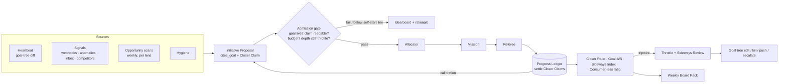
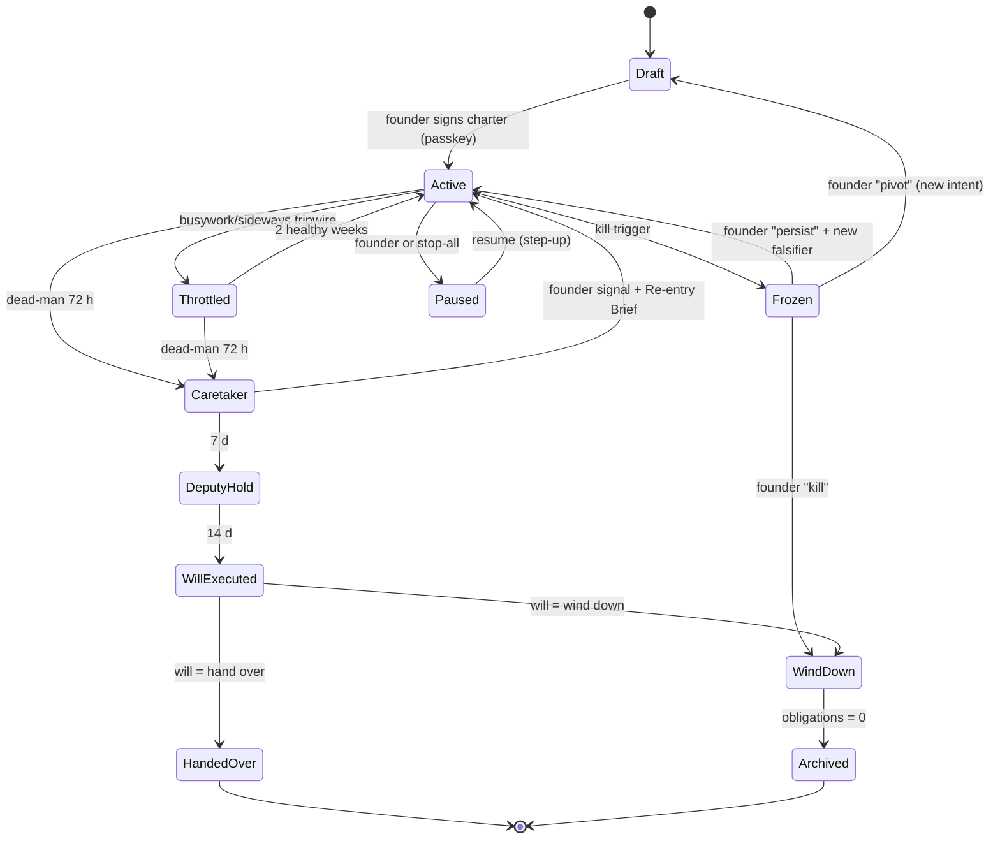

# S03 — Autonomy and Alignment

*Round 2 seat: Autonomy and Alignment Designer · 2026-09-30 · [S] = speculation.*

## 1. Summary

1. **The autonomy scale is settled as A0–A4, but a level is a *preset*, not the whole setting.** A venture's autonomy is a
   signed **Charter envelope** = level (A0–A4) × a **six-domain grant vector** (build · publish · spend · contract ·
   customer contact · people) × an **operating mode** (Episodic or Series) × a C1-style **mandate** (capital, pre-listed
   one-way doors, packets per week, kill trigger). C2's A0–A4, C5's A0–A3 + Series and C1's mandates all fit inside it;
   none of them is thrown away.
2. **Founder contact has two axes, not one list.** *Demand* (Decide · Know) is separate from *altitude* (Interrupt ·
   Nudge · Brief · Record). ENGINE-SPEC's "ask" is a demand, not an altitude, and SURFACES-SPEC had no demand axis. Asks
   bid on the **Founder Attention Exchange**, which is priced in minutes. Pushes draw on a separate interrupt budget.
3. **The initiative engine** turns standing goals, heartbeats, signals and scans into **Initiative Proposals**. Each one
   must cite a goal node and carry a **Closer Claim**: a predicted, dated change in that node's metric. Nothing an
   autonomous venture starts for itself goes unregistered.
4. **The Progress Ledger settles every Closer Claim.** Sideways motion and busywork show up as measured ratios, and they
   throttle initiative automatically. Nobody has to judge them by eye.
5. **The Co-founder seat** is any session that loads a Venture Mind. It owns the thesis, the opportunity order, the
   weekly board meeting and the dissent register. It disagrees through **wagers**, which are settled by the Referee and
   never by itself.
6. **A decision-rights matrix** covers 22 decisions and 8 holders. Every decision in it has one owner, and the effect
   gateway enforces the matrix; prompts do not.
7. **The never-list is short: seven lines.** Everything else, including money and one-way doors, can be delegated through
   the charter by pre-listing it.
8. **The system acts in one of four principal modes** — Instrument, Staff, Partner and Proxy — with Proxy-founder only
   at A4. It never acts *as the founder's person*.
9. **Founder continuity** has four parts: a **Founder State** model, a tiered dead-man switch (Caretaker at 72 h, Deputy
   at 7 d, Continuity Will at 14 d), and succession that can only narrow authority.
10. **Challenge to the synthesis:** add a **Constitution layer** above Intent. It holds the charters, the never-list,
    autonomy levels and the Continuity Will, it is writable only with the founder's passkey, and the gateway reads it.
    Without it, the Mind at A4 can edit the limits that bind it.

## 2. The design

### 2.1 Charter Envelope — the per-venture autonomy switch, settled

**What it does.** It replaces "a switch" (founder direction, item 3) with a contract, which is what R0-B found Haier's
autonomous units run on (R0-B §#3: *budget, user, scoreboard, escalation list*). The **level** is a one-word handle the
founder can change in one tap. The **grant vector** is what the gateway actually reads. R0-D (§recommendation 94)
separately recommends separate permissions for building, publishing, spending, contracting and customer communication.

| Level | Name | Initiative | Default grant vector (build/publish/spend/contract/contact/people) | Founder cadence | Principal mode |
|---|---|---|---|---|---|
| **A0** | Founder-driven | none — founder starts every mission | R1 / ask / ask / ask / ask / ask | live, per mission | Instrument |
| **A1** | Assisted | proposes to idea board; runs approved missions end to end | R2-notify / ask / ≤ mission budget / ask / drafts only / ask | daily Call Sheet | Staff |
| **A2** | Delegated | starts investment missions inside standing goals | R2 / R3 after trust ladder / ≤ weekly envelope / pre-listed / templated / ask | daily Brief + weekly board | Staff |
| **A3** | Autonomous | runs the venture against its goal tree; proposes new goals | R2 / R3 / envelope + treasury rules / pre-listed one-ways / full within claims standard / human task market ≤ cap | weekly board, Interrupt-only | Partner |
| **A4** | Proxy-founder | also *sets* sub-goals and re-allocates across them; may kill its own bets and missions | as A3 + may amend its own goal tree below charter intent | weekly board; monthly charter review | Proxy |

**Operating mode** is orthogonal to level. *Episodic* ventures end: a validation, a client project, a research question.
*Series* ventures run indefinitely: an agency or a SaaS (C5). Series mode adds rostered obligations, on-call rotations
(launched on signal, never standing) and monthly margin floors. **Paused**, **Caretaker** and **Wind-down** are *states*,
not levels (§2.10). This resolves SURFACES-SPEC's three-state mode switch: `founder-driven` = A0–A1,
`autonomous` = A2–A4, `paused` = a state.

```yaml
# constitution/charters/dispute-desk.yml   (writable only with founder passkey; see §9)
venture: dispute-desk
intent: "Win Stripe disputes for micro-SaaS; reach $8k MRR at ≥70% gross margin by 2027-03-31"
level: A3
mode: series
grants:                       # ceiling per domain; the gateway reads THIS, not the level
  build:    {max_risk: R2}
  publish:  {max_risk: R3, requires: trust_ladder, brand: dispute-desk}
  spend:    {weekly_usd: 400, per_effect_usd: 120, refunds: {per_customer_usd: 99, monthly_usd: 600}, margin_floor: 0.55}
  contract: {preapproved: [stripe-tos, vercel-pro, resend-tos], max_annual_usd: 1200}
  contact:  {cold_outreach: false, customer_support: true, disclosure: ai_disclosed}
  people:   {human_task_market: {per_task_usd: 150, monthly_usd: 500}, employment: never}
mandate:
  founder_minutes_week: 30
  packets_week_max: 3
  kill_trigger: {goal_p_below: 0.15, for_days: 14, or_drawdown: 0.30}   # auto-freeze → packet, never auto-kill venture
one_way_doors_prelisted: [raise-price-≤20%, sunset-feature-with-30d-notice]
never_list: constitution/never.yml@v3     # referenced, not copied
deputy: {human: "named trusted person", scope: [stop, caretaker, wind-down]}
valid_until: 2026-12-31       # charters expire like claims; expiry → A1 until re-signed
signed: {by: founder, passkey_assertion: "…", at: 2026-10-01}
```

**Trigger.** A founder signs it, with a passkey plus a reason. It is re-signed when it expires. It is **auto-demoted**
one level when a tripwire fires (§2.8, §2.10). A demotion never needs the founder, because it is always the safe
direction. A promotion always needs the founder.

### 2.2 Principal modes — acting *as* a founder vs *as part of* a company (item 4)

| Mode | Whose authority | Speaks as | Example |
|---|---|---|---|
| **Instrument** | Founder's, per command | nobody (produces artifacts) | "Draft three decks" at A0 |
| **Staff** | Delegated per mission | a titled role in the venture ("Support Engineer, Dispute Desk") | A1–A2 missions |
| **Partner** | The co-founder seat's own view, which the founder may overrule | "AI co-founder, Dispute Desk" | A3 board pack, dissent |
| **Proxy** | The founder's operating authority *inside the charter* | "Dispute Desk" (the venture), AI-disclosed, stamped with charter clause | A4 re-allocation, killing its own bets |

**Rule:** no mode ever speaks as the founder's *person* — not his name, voice, likeness or personal accounts. Doing so is
on the never-list (§2.7). "Acting as a founder" means holding the founder's *role* inside a venture. It never means
wearing his identity. Every Proxy action is stamped `acted_as: proxy · charter: dispute-desk@7 §grants.spend`.

### 2.3 The Venture Mind and the Co-founder seat

The **Co-founder seat** is any Claude Code or Codex session that loads a Venture Mind. It is a role, not a process
(synthesis §3). Incarnations alternate family by default, and the **Shadow seat** runs from the other family (C2).

**Owns:** the thesis and its kill criteria · the opportunity order for A2+ · the goal tree *below* charter intent (A4 may
amend it; A3 proposes amendments) · the weekly board meeting · the dissent register · the wager ledger (it opens wagers;
the Referee settles them) · the Standing Order drafts. **Does not own:** verdicts (the Referee), money above the envelope
(the treasury rule), its own charter (the Constitution), or merges (the merge queue).

**Cadence** (all launched on schedule. None of this is a standing process):

| Cadence | Session | Output | Founder cost |
|---|---|---|---|
| Heartbeat (A2 1×/day, A3 4×/day, A4 6×/day) | Initiative scan, Sonnet-class, ≤$0.40 | Initiative Proposals (§2.5) | 0 |
| Daily 06:30 | Portfolio seat reconciles Mind journals | Call Sheet (≤3 items/venture) | read 3–5 min |
| **Weekly board meeting** (Mon 08:30; voice optional) | Opus-class Co-founder + Shadow red-team + Referee digest | **Board Pack** (below) | 20–30 min live |
| Monthly | **Outside Board** (C2): contrarian investor, customer proxy and regulator seats, hired by title | Believability-scored dissent | 10 min read |
| Quarterly | Charter review | Re-sign / amend / demote | 15 min |

**Board Pack agenda (fixed order, so the founder learns where to look):**
1. **Are we closer?** Goal tree with Δdistance per node, spend per node and the Closer Ratio (§2.8).
2. **Obligations** — promises due, at risk and broken.
3. **Bets** — opened, killed, scaled, and the Null Registry entries added.
4. **Wagers** — resolved this week, with calibration for the founder and the Mind per domain.
5. **Dissent** — at most 3 items, each a formal dissent (§2.4).
6. **Asks** — decisions that cleared the Exchange for this meeting.
7. **Promotions offered** — trust-ladder rungs, Standing Orders, level changes. Always *offered*, never applied.
8. **What I would stop** — the Co-founder's top kill candidate, even when it is not asking.

### 2.4 Disagreement — dissent, wagers and the escalation ladder

```ts
type Wager = {
  id: string; venture: string; opened_by: "cofounder"|"founder"|"shadow";
  question: string;                    // falsifiable
  founder_call: string; mind_call: string; shadow_call?: string;
  metric: {source: "stripe"|"posthog"|"ci"|"crm"|string; query: string};   // Referee reads systems of record
  resolves_on: string;                 // ISO date
  stakes: "none";                      // synthesis §3: no stakes, no transferable rewards
  outcome?: "founder"|"mind"|"neither"|"void"; settled_by: "referee";
};
type Dissent = {
  decision_id: string; strength: "note"|"objection"|"strong_objection";
  evidence: string[]; would_change_my_mind: string; cost_if_i_am_wrong: string; cost_if_you_are_wrong: string;
  check_back: string; wager_id?: string;
};
```

**Escalation ladder.** (1) The Co-founder recommends; the founder decides. (2) If the founder overrules on a
`strong_objection`, a wager opens automatically and appears on the calendar at its check-back date. (3) The dissent may
be re-raised only with new evidence, and the dedupe is enforced on evidence hashes. (4) Calibration scores per domain
move *default routing*, meaning who gets asked first and how much a packet is pre-filled. They never move *authority*.
(5) After three consecutive lost wagers by the founder in one domain, the board pack says so once, plainly, and proposes
a Standing Order. The founder may decline it. Declining is recorded, and it is not re-offered for 60 days.

### 2.5 The initiative engine — how an autonomous venture creates its own work

Four sources feed one queue:

| Source | Trigger | Examples |
|---|---|---|
| **Standing goals** | Heartbeat diff of goal-tree distance (C2's *Why-Not-Yet scan*) | "MRR node is 38% from target and slipped 2 weeks" |
| **Signals** | Webhooks, metric anomalies, inbox, canaries, competitor watch | dispute win rate fell from 64% to 51%; competitor price change |
| **Opportunity scans** | Weekly, one scan per lens (growth, product, cost, risk, adjacency) | "3 support tickets ask for PayPal disputes" |
| **Hygiene** | Charter-declared maintenance | dependency CVEs, backlot strike debt, expiring Standing Orders |

```yaml
# InitiativeProposal
id: ip_2026-10-03_0412
venture: dispute-desk
source: {kind: signal, ref: posthog:anomaly/win_rate_pnr}
cites_goal: g.revenue.retention.win_rate        # REQUIRED; admission refuses without a live node
closer_claim:                                   # REQUIRED — the anti-busywork contract
  metric: win_rate_product_not_received
  baseline: 0.51
  predicted: 0.60
  by: 2026-10-17
  p: 0.55                                       # calibrated against this seat's history
lane: investment                                # obligations lane skips EV ranking (synthesis §3)
ev: {value_usd_month: 310, cost_usd: 42, founder_minutes: 0, voi: 0.3}
door: two_way
risk_max: R2
needs_bet: false                                # true if entering the Priors Library or crossing a door type
genealogy: {parent_mission: null, depth: 0}
```

**Admission gate** (deterministic code, not a model):
1. `cites_goal` resolves to a live node in the goal tree.
2. A `closer_claim` is present, has a date inside the goal's horizon, and its metric is readable by the Referee.
3. It fits the budget hierarchy (portfolio → venture → goal → mission) and the grant vector.
4. `genealogy.depth ≤ 3`, unless the parent's Closer Claim settled positive.
5. The venture is not under an **initiative throttle** (§2.8).

A proposal that passes becomes a Mission for the Allocator, if the level allows self-start. A proposal that fails, or
sits below the level's self-start line, goes to the idea board with its rationale. **Signals that fire but produce no
proposal are logged as "seen, declined — why"**, so nothing is silently ignored.

### 2.6 Goal trees

```yaml
# ventures/dispute-desk/goals.yml  (below charter intent; A4 may edit, A3 proposes, A0–A2 founder edits)
root: {id: g, text: "$8k MRR at ≥70% GM by 2027-03-31", metric: mrr_usd, target: 8000, owner: charter}
nodes:
  - {id: g.revenue.acquisition, parent: g, metric: new_paying_week, target: 6, weight: 0.4}
  - {id: g.revenue.retention,   parent: g, metric: logo_churn_month, target: "<0.04", weight: 0.35}
  - {id: g.revenue.retention.win_rate, parent: g.revenue.retention, metric: win_rate_all, target: 0.68,
     causal_link: {to: logo_churn_month, evidence: bet_0031, strength: 0.6}}   # why this node serves its parent
  - {id: g.margin, parent: g, metric: gross_margin, target: 0.70, weight: 0.25, floor: 0.55}
```

Each edge carries a **causal link** with an evidence level. A child node whose link to its parent was never evidenced is
marked **speculative**, and at most 30% of a venture's investment spend may flow to speculative nodes. This stops an
autonomous venture from optimising a proxy it invented itself.

### 2.7 The never-list (seven lines, enforced in the effect gateway)

Nothing on this list is delegable at any level, in any mode or state. Everything *not* on it can be delegated by
pre-listing it in a charter.

1. **Change authority.** Charters, levels, grant ceilings, the never-list, the Continuity Will, or promoting a trust rung.
2. **Be the founder's person.** Use his name, voice, likeness or personal accounts; sign or speak as him.
3. **Create or end a legal person or a liability.** Form or dissolve an entity; grant equity; take debt; give a personal
   guarantee; sue or settle.
4. **Move money across a boundary.** Between ventures, or to or from the founder, or outside the treasury rules.
   Movement inside the envelope is delegable.
5. **Destroy what cannot be restored.** Delete production data without a verified restorable copy; shut down a venture
   that has live customers.
6. **Edit the judges.** Change evals, the Referee, gates, hooks, the gateway, or its own logs. Create, share or rotate
   root credentials.
7. **Employ or dismiss a person**, or act where a mistake could harm someone's health, safety or legal standing (medical,
   legal or financial advice to an individual).

v2's nine items are reconciled as follows. *Contact* and *publish* now sit in the grant vector, with a claims standard
and AI disclosure. *Migrations* and *provider mode* moved to R4 one-way doors that can be pre-listed. *Customer-call
consent* moved to a gateway invariant that always applies. What remains here is the set of actions that change who holds
power or cannot be undone.

### 2.8 Alignment: "are we closer?", sideways motion, busywork

**The Progress Ledger** settles every Closer Claim on its date. The Referee reads the systems of record. Four measures,
computed per venture per week:

| Measure | Definition | Healthy | Tripwire |
|---|---|---|---|
| **Closer Ratio** | settled claims that moved the metric in the predicted direction ÷ settled | ≥ 0.45 [S] | < 0.25 over 3 weeks |
| **Goal-delta per $** | Σ weighted Δdistance ÷ spend | rising or flat | falls 3 weeks running |
| **Sideways Index** | missions completed ÷ max(ε, root Δdistance) over 4 weeks | < 8 [S] | > 20 with root Δ ≈ 0 |
| **Consumer-less Artifact Ratio** | artifacts no later mission, customer or founder read within 14 d ÷ artifacts produced | < 0.3 | > 0.5 |

Signs of busywork, each detected in code:
- **Self-referential loops** — missions whose goal node is the harness or the venture's own tooling, above 25% of spend.
- **Genealogy runaway** — mission chains at depth ≥ 4 with no positive settlement anywhere up the chain.
- **Claim inflation** — a seat whose Closer Claims have Brier > 0.3 gets its `p` shrunk toward the base rate
  automatically.
- **Metric-proxy drift** — a node improves while its causal parent does not move over two horizons. The node is flagged
  **decoupled**, and its causal link is downgraded.
- **Motion masquerade** — high commit, PR or post counts while root Δ ≈ 0. The board pack shows activity and progress
  side by side, and never activity alone.

**Throttle.** Any tripwire moves the venture's self-start line up one notch: A3 behaves as A2 for initiative, *not* for
obligations. A **Sideways Review** mission is then opened. It is Opus-class, a different family from the Co-founder's
last incarnation, and it gets ≤$15 and 45 minutes. It must return one of: *re-aim* (goal-tree edit), *kill* (bets),
*push through* (with a named falsifier), or *escalate*. The throttle lifts when the next two weekly Closer Ratios clear
the healthy line.

**Kill and pivot logic.** Bets die on their kill date (synthesis §3). Ventures hit a kill trigger that **freezes** new
investment and opens a Kill/Pivot packet. The packet always has three options: *kill* (with wind-down missions for
obligations), *pivot* (a new intent, which is a charter change), and *persist* (the founder states a new falsifier). The
Co-founder must state which one it would pick. Shutting down a venture with live customers is on the never-list, so this
packet always reaches the founder.

### 2.9 Founder contact classes — the reconciliation, and the Founder Attention Exchange

**The disagreement.** ENGINE-SPEC §5.4 has four classes: *interrupt · ask · tell · log*, with asks capped at ≤10/day and
*expiry = refuse*. SURFACES-SPEC §3.3 has *Interrupt · Nudge · Brief · Record*, with a nudge budget of 3/day and
learned demotion. They are not rival names for one list. ENGINE's *ask* says what the founder must **do**. SURFACES's
levels say how hard the system **reaches** him. Merging them into one list caused two defects. First, an ask was either
pushed (which spends interrupt budget on something non-urgent) or not pushed (so a deadline-bound ask waited for the
Brief). Second, the 10/day ask cap and the 3/day nudge cap counted different things, and neither counted minutes.

**The resolution: every founder contact is a pair.**

| | **Interrupt** (push max, call after 5 min unacked) | **Nudge** (push, quiet hours honoured) | **Brief** (Home, daily, board pack) | **Record** (on demand) |
|---|---|---|---|---|
| **Decide** (DecisionPacket) | deadline < 1 h *and* cost of delay > $X or harm | clears Exchange, expires < 4 h | clears Exchange, batched into a decision window | — (a decision is never only recorded) |
| **Know** | P0: prod down in revenue venture, spend cap breached, stop unconfirmed, security event, promise breaks < 1 h | co-founder "needs you this week"; throttle fired | shipped, decided, auto-actions, trends | everything else |

- **Classes are owned here, and rendering is owned by SURFACES.** Names follow SURFACES, because they describe the
  experience. Demand follows ENGINE, because it describes the obligation. The engine assigns `{demand, altitude}`. A
  surface may escalate the altitude and may never demote it (SURFACES §5 already says this).
- **Budgets.** *Interrupts* are never budgeted: they are defined narrowly and audited weekly, and each false Interrupt
  is a board-pack line. *Nudges* keep a 3/day budget; overflow folds into the Brief with a stated line. *Decide* items
  are rationed by the Exchange **in minutes**, which replaces the 10/day count.
- **Silence semantics.** This was the third conflict: ENGINE "expiry = refuse", C1 "two-way runs on silence", C3
  "silence never grants new authority". It is resolved by door type. On expiry, a packet takes its **pre-declared
  default** *only if* that default is a two-way action already inside the charter. Anything that would expand authority,
  cross a one-way door, or touch the never-list **refuses** on expiry. The packet shows which rule will apply before the
  founder sees it.

**Founder Attention Exchange.**

```ts
type AttentionBid = {
  packet_id: string; venture: string; demand: "decide";
  minutes_est: number;                         // calibrated from the founder's history per packet type
  ev_usd: number; cost_of_delay_usd_per_day: number; deadline: string;
  default_on_expiry: {action: string; door: "two_way"} | "refuse";
  cofounder_view: string; founder_model_view: {option: string; match_p: number};  // C2 split
  shadow_concurs: boolean;
};
// clearing, run at each decision window (default 08:00 and 17:00, 10 min each — C3)
priority = (cost_of_delay_usd_per_day * days_to_deadline_penalty + ev_usd * p_needs_founder) / minutes_est
```

- **Supply** is the founder's daily minutes, set by the founder (default 20 min/day, plus 30 min for the weekly board)
  and **scaled by Founder State** (§2.10): ×1 Available, ×0.5 Focus, ×0.25 Travel, ×0 Offline.
- **Venture quotas** come from the charter (`founder_minutes_week`). An A3 venture that overspends its quota raises its
  own bar, which pushes it to compile Standing Orders rather than ask.
- **Below the clearing price**, a packet gets its default and deadline, or is re-batched for the board meeting.
- **Altitude learning** (from SURFACES): an item dismissed within 3 s, five times, is *proposed* for demotion in the
  board pack and never applied silently. A one-tap "why ask me this?" opens a Standing Order draft, so the question
  stops recurring.

### 2.10 Founder continuity — founder state, dead-man switch, succession

**Founder State** is inferred and confirmable. Inputs are calendar free/busy (read-only), the latency of his last ack,
explicit status (voice: "I'm travelling till Thursday") and overload signals: rising dismiss rate, falling looked-at
rate, open Decide items above supply for 3 days.

```yaml
founder_state: {value: travel, since: 2026-10-06T07:00, until: 2026-10-09, source: explicit,
                supply_multiplier: 0.25, interrupt_policy: p0_only, confidence: 1.0}
# values: available | focus | travel | offline_planned | overloaded | unreachable | incapacitated
```

- **Overloaded** is detected, not declared. The response is to **raise defaults**, not to push harder: A3/A4 ventures
  batch everything into the next board pack, and the Co-founder proposes Standing Orders for the three most repeated
  packet types.
- **Dead-man switch** (tiers run on *unplanned* silence. An `offline_planned` period with a return date suspends the
  clock until that date + 24 h):

| Unacked since last founder signal | Tier | What changes |
|---|---|---|
| 24 h with an Interrupt pending | **Reach** | Call, SMS and email in sequence; Nudges fold into the Brief |
| 72 h | **Caretaker** | All ventures: no new investment missions; obligations lane only; spend capped at run-rate; A4 behaves as A3 and cannot amend its goal tree; public output limited to already-scheduled items |
| 7 d | **Deputy** | The charter-named human Deputy (optional; a trusted person) is notified with a sealed briefing. Deputy powers are *stop, caretaker, wind-down, pay due bills* and nothing else |
| 14 d | **Continuity Will** | Executes the founder-signed Continuity Will per venture: *hold* (caretaker indefinitely, up to runway), *wind down* (honour obligations, refund, notify, archive), or *hand over* (transfer the operating-company package to a named successor, a legal act the Deputy performs as a human) |

**Rules.** Succession can only **narrow** authority, never widen it. No tier ever unlocks a never-list line. The Mind may
not pretend the founder is present: all outbound messages in Caretaker and later carry the venture's own identity only.
Any founder signal (passkey, voice with caller ID, a signed Telegram command) resets the switch and produces a
**Re-entry Brief**: what happened, what was held back, and which decisions are waiting, ranked by the Exchange.

### 2.11 Decision-rights matrix

**D** decides · **P** proposes · **V** veto (blocks, but cannot substitute a decision) · **E** executes · **I** informed ·
blank = no role. One **D** per row. "≥A3" means the Mind holds D at that level and the founder holds D below it.

| # | Decision | Founder | Co-founder seat (Venture Mind) | Portfolio Mind | Allocator | Mission Lead | Referee | Shadow seat | Effect gateway |
|---|---|---|---|---|---|---|---|---|---|
| 1 | Charter, level, grants, never-list, Continuity Will | **D** | P | P | | | | | E (reads) |
| 2 | Demote level (tripwire) | I | P | | | | | | **D** (automatic) |
| 3 | Venture intent (root goal) | **D** | P | | | | | | |
| 4 | Goal tree below intent | D <A4 | **D** A4 · P A3 | I | | | | V (speculative nodes) | |
| 5 | Theses, kill criteria | V | **D** | I | | | | P | |
| 6 | Open an investment mission | D at A0–A1 | **D** ≥A2 | | E (funds) | | | | |
| 7 | Obligations-lane mission | I | I | | **D** (reserved capacity) | E | | | |
| 8 | Budget split across ventures | **D** (envelope) | P | P | E | | | | |
| 9 | Budget within a venture | V | **D** | | E | | | | |
| 10 | Mission shape, team, model family | | P | | | **D** | | | |
| 11 | Merge to main | | | | | P | **D** (merge queue) | | |
| 12 | Accept as done / settle a Closer Claim | | | | | | **D** | | |
| 13 | Settle a wager | | | | | | **D** | | |
| 14 | Kill a bet (kill date) | V | **D** | | E | | I | | |
| 15 | Kill / pivot / persist a venture | **D** | P (must pick) | P | E (freeze) | | | P | |
| 16 | Two-way external effect within grants | I (Brief) | **D** | | | E | | | E |
| 17 | Pre-listed one-way door | I | **D** ≥A3 · P below | | | | | V | E |
| 18 | Non-listed one-way door | **D** | P | | | | | P | E |
| 19 | Never-list item | **D** (only) | P | | | | | | E (refuses otherwise) |
| 20 | Promote a trust rung or Standing Order | **D** | P | | | | I (evidence) | | |
| 21 | Human hire (task market) inside cap | I | **D** | | E | P | | | E |
| 22 | Stop anything | **D** (any surface) | D (own venture) | D | | D (own lane: andon) | | | E |

**Enforcement.** Rows 1, 2, 16–19 and 21 are enforced in the effect gateway against the Constitution. Row 11 is enforced
by the merge queue, and rows 12–13 by the Referee, which runs outside the worker sandbox. Everything else is enforced by
admission code that checks the caller's seat against this table, loaded as `constitution/rights.yml`. A prompt never
enforces a row.

## 3. Diagrams

**3.1 Initiative → alignment loop**



**3.2 Venture state machine (levels are settings; these are states)**



**3.3 A contact from event to founder**

```mermaid
sequenceDiagram
  participant V as Venture event
  participant E as Engine classifier
  participant X as Attention Exchange
  participant S as Surfaces
  participant F as Founder
  V->>E: event (+ packet if Decide)
  E->>E: demand ∈ {decide, know}; altitude by rules, then model
  alt Know
    E->>S: {know, altitude}
  else Decide
    E->>X: AttentionBid (minutes, cost of delay, default)
    X->>X: clear at next decision window × Founder State
    X-->>E: cleared | defaulted | batched to board
    E->>S: {decide, altitude}
  end
  S->>F: render (may escalate, never demote)
  F-->>S: act / dismiss / "why ask me?"
  S-->>E: reaction → altitude learning (proposed, never applied)
```

## 4. Interfaces

| Part | I need from it | I give it |
|---|---|---|
| **Mission engine / Allocator** | Takes Initiative Proposals as input; respects the two lanes; reports spend per goal node | Admission gate, self-start line per level, throttle state, Closer Claims to fund against |
| **Agent organisation** | Seat launch with the Venture Mind loaded; the Shadow seat from the other family; Mission Lead authority fields | Principal mode and charter clause for every seat's stamp; decision-rights table |
| **Memory / world model** | Venture Mind store (journaled writes, nightly reconcile); goal tree; causal-link evidence; read receipts | Wagers, dissent and calibration records; the Founder State history; Standing Order drafts |
| **Referee / evals** | Settlement of Closer Claims and wagers from systems of record; Brier per seat | Metric queries attached to every claim; "decoupled node" flags for eval review |
| **Engineering / effect gateway** | Enforcement of grants, the never-list and silence semantics; derived risk class (ENGINE §5.2) | `constitution/` schema (charters, never.yml, rights.yml, continuity.yml) as the gateway's policy input |
| **Surfaces** | Rendering of `{demand, altitude}`; decision windows; passkey step-up; the board-pack page; the voice board meeting | Contact classes (§2.9); Founder State; Re-entry Brief; the "why ask me?" hook |
| **Economics** | Hierarchical budgets, treasury rules, degraded modes | Founder-minutes as a priced resource; minutes per venture per week; the attention cost of a level |
| **External world** | Identity per brand, AI disclosure, claims standard | Principal mode on every outbound effect; Caretaker restrictions on publishing |
| **Human collaborators** | Scoped access for the Deputy and the successor | Deputy powers list; hand-over trigger |
| **Simulation / twin** | Replay of a venture week under a proposed level | Level-promotion evidence requirement (§6, idea 3) |

## 5. Worked examples

### 5.1 Dispute Desk (A3, Series) — a signal becomes a mission, and a busywork tripwire fires

- **Mon 02:10.** The heartbeat (Sonnet 5, $0.31) diffs the goal tree. `g.revenue.retention.win_rate` sits at 0.51
  against a target of 0.68. An Initiative Proposal cites that node with a Closer Claim of 0.51 → 0.60 by Oct 17,
  p = 0.55 (the seat's claims are well calibrated, Brier 0.19). It passes admission and the Allocator funds it at $42.
- **02:20–04:05.** The Mission Lead (Claude Opus 5) picks an *audition* shape: a Payments Evidence Engineer (Codex) and
  a Dispute Copy Analyst (Claude) build 2 variants. The Referee (the other family from the winner) replays them on 40
  historical disputes. B wins at 61%. The merge queue merges B behind a flag. Contact: `{know, brief}`. The founder is
  not woken.
- **Mon 09:12.** A customer asks for a $140 refund. The charter allows $99 per customer, so the gateway refuses the
  effect. A packet is bid on the Exchange: 1.5 min, cost of delay $140 plus a churn risk of ~$30/day, and a default of
  "refund $99 + $41 credit" (a two-way action inside grants). It clears the 17:00 window. The founder taps approve in
  40 s.
- **Week 3.** The Progress Ledger shows 14 missions done, root MRR Δ ≈ 0, Sideways Index 23, and 41% of spend on
  internal tooling nodes. **Throttle.** A Sideways Review (Codex, $11, 38 min) returns *re-aim*: the win-rate node
  improved, but churn did not move, so its causal link is downgraded to speculative. Churn is price-driven, not
  dispute-driven. The Review proposes a new node (`g.revenue.retention.annual_plan_mix`) and a Bet. Contact:
  `{decide, brief}`, placed on the board-pack agenda as item 6.
- **Mon board meeting (24 min, voice).** The founder accepts the re-aim and rejects annual pricing. The Co-founder files
  a `strong_objection`, and a wager opens: "logo churn ≥ 4.5% in Nov without annual plans", settled by the Referee from
  Stripe on Dec 1. **Founder minutes that week: 29, against a quota of 30.** Memory writes: 3 Mind journal entries, 1
  wager, 1 goal-tree amendment, 1 Null Registry entry (win rate does not drive churn at this scale).

### 5.2 The founder disappears for 9 days (three ventures)

The founder is at A1 for Studio, A3 for Dispute Desk and A4 for Clinic Voice. On Oct 6 he says "travelling till Thursday"
(`offline_planned` until Oct 9). The clock is suspended until Oct 10 at 07:00.

- **Oct 10, 07:00.** No signal. Clinic Voice has an Interrupt pending: a telephony provider changed its terms. **Reach**
  tier fires: a call, then SMS, then email. Nothing is acknowledged.
- **Oct 12, 07:00 (72 h).** **Caretaker.** All three ventures stop new investment missions. Clinic Voice drops to A3
  behaviour and cannot amend its goal tree. Obligations continue: 14 clients are served, and a routing incident at 03:10
  is fixed by an Incident Engineer (Codex) with a backlot rollback. That is reversible and inside grants, so no contact is
  made beyond Record. Studio's client deliverable due Oct 14 is shipped because it was already scheduled. A new pitch is
  held back.
- **Oct 17 (7 d).** The **Deputy**, a trusted person named in the charters, receives a sealed briefing. Their powers are
  stop, caretaker, wind-down and paying due bills. They pay the Vercel invoice through the treasury rule and do nothing
  else.
- **Oct 19.** The founder returns (passkey on laptop). The switch resets. His **Re-entry Brief** runs to 1 page: 11 days,
  $1,380 spent (run-rate), 0 obligations broken, 6 decisions waiting (ranked by the Exchange, 14 min in total), 9
  initiatives held with their proposals intact, and a note on the provider-terms issue with a draft response. Nothing
  shipped under his name while he was away, and no authority expanded.

### 5.3 A4 acting as founder — killing its own bet

Clinic Voice (A4) had a Bet: "dental clinics convert at ≥8% from a cold-call demo". On the kill date the Referee settles
it at 3.1%. The Co-founder, in Proxy mode, kills the bet, re-allocates $600/week from `g.acquisition.dental` to
`g.acquisition.vets`, and amends its goal tree. Its Closer Claim for the new node is marked speculative until evidence
lands. The actions are stamped `proxy · clinic-voice@4 §goal_tree, §grants.spend`. Contact: `{know, brief}`. The
founder's cost is 20 seconds in the board pack, where the change sits under "decided under policy".

## 6. Ideas the founder did not ask for

1. **Autonomy Balance Sheet per venture** (after R0-D's suggestion). Profit, founder minutes, unresolved obligations,
   recovery costs and Closer Ratio sit on one page, so "autonomous" is a measured number. The measure is **autonomy yield
   = value created ÷ founder minutes**, tracked weekly and compared across ventures.
2. **Level auctions.** A venture *earns* promotion by bidding its own track record. The Co-founder files a Promotion
   Case: 8 weeks of Closer Ratio, wager calibration, zero never-list attempts and a twin replay. The founder only accepts
   or rejects it. Without evidence, promotion is never offered.
3. **Twin rehearsal before promotion.** Before A2 → A3, the twin replays the last 4 weeks as if the venture had been at
   A3. The founder sees what would have happened differently: effects taken, money moved, contacts avoided.
4. **Founder Taste Weather.** A daily one-line forecast: "you'll likely overrule on pricing today (3 open, your pattern
   is +12%)". It lets him notice his own biases. It is built from the wager ledger and founder-model calibration.
5. **Dissent dividend.** A quarterly page listing every formal dissent, who was right, and what each side's error cost
   in dollars. This makes the relationship with the Co-founder seat auditable, like an investor reviewing a partner.
6. **"Stop asking me this" as a compiler.** One tap turns the last 5 similar packets into a draft Standing Order, and the
   Referee back-tests it on those packets before the founder signs it.
7. **Intent drift detector** (R0-B). An independent sampler compares 20 random actions per week against the charter
   intent, blind to which venture produced them, and scores intent fidelity. A score below threshold triggers the
   throttle, as busywork does.
8. **Founder Sabbath mode.** The founder schedules deliberate absence, for example a week each quarter, which tests the
   dead-man tiers *for real* and yields a measured "survivable weeks without founder" number per venture.
9. **Cross-venture attention trade.** Ventures under quota can lend unused founder minutes to others at the board meeting.
   The founder sees the trade and can refuse it. This exposes which ventures cost him the most attention.

## 7. Risks

| Risk | Design answer |
|---|---|
| **The Mind edits its own limits** at A4 | Constitution layer writable only with the founder's passkey (§9); gateway reads it; never-list line 1 |
| **Closer Claims gamed** — the seat predicts tiny, safe deltas to keep its ratio | Claims are weighted by node weight × predicted Δ; the Referee flags seats whose claims sit mostly below the noise floor; goal-Δ per $ is tracked alongside the ratio |
| **Proxy optimisation** — metric moves, reality doesn't | Causal links with evidence levels; decoupled-node detection; ≤30% spend on speculative nodes; Outside Board monthly |
| **Founder rubber-stamps** | Looked-at rate shown; approvals made without opening the evidence are not counted as trust signals; Taste Weather; the Exchange caps minutes, so he is not flooded |
| **Silence misread as consent** | Silence semantics by door type; every packet states before delivery whether expiry means "default" or "refuse" |
| **Alert fatigue** — he mutes everything (SURFACES R9) | Two-axis classes; the Interrupt set is narrow and audited weekly; nudge budget; demotions proposed, not applied |
| **Busywork throttle strangles real exploration** | Exploration budget: 15% of investment spend exempt from the Sideways Index when tagged `explore` with a stated learning question and a Null Registry target |
| **Dead-man switch fires falsely** (lost phone) | Tiers are graded; only Caretaker is automatic before 7 d; any authenticated signal resets it; Caretaker only narrows authority |
| **Deputy abuse** | Deputy powers are a closed list; every Deputy act is recorded; the founder can reverse it on return; the Deputy cannot change a charter |
| **Correlated judgment** — Mind and Shadow share blind spots (Vend) | Shadow from the other family; monthly Outside Board by title; Intent drift sampler; wagers settled by the Referee, not by either seat |
| **Level too coarse for a mixed venture** | Grant vector per domain; the level is only a preset |

## 8. Open decisions

1. **Should A4 exist at launch, or only after the first venture earns it?** *Recommendation:* the level exists in the
   schema from day one, and the first A4 promotion requires a Promotion Case (idea 2) with ≥8 weeks at A3. The
   destination stays full, and the evidence comes first.
2. **Human Deputy: required or optional?** *Recommendation:* optional. Without a Deputy, the 7-day tier goes straight to
   an indefinite Caretaker hold capped at runway, and the 14-day tier is limited to *hold* or *wind down*, because
   hand-over needs a human legal act.
3. **Default founder-minute supply.** *Recommendation:* 20 min/day plus a 30-min board meeting, re-derived monthly from
   actual looked-at minutes. It follows C3's two 10-minute windows, and it is the founder's to change.

## 9. Challenge to the synthesis

**Add a fifth authority, the Constitution, above Intent.** The synthesis separates Intent, Allocation, Execution and
Acceptance, but it leaves unstated **who may change the rules that separate them**. At A4 the Venture Mind holds
operational intent. If charters, grant ceilings, the never-list and the decision-rights table live inside the Mind, or
in any store an agent can write, then the separation is a convention and not a structure. This is the same lesson the
harness already learned: an agent that can edit what it reviews will review what it can edit.

- **Constitution** = `constitution/{charters, never.yml, rights.yml, continuity.yml}`. It is signed with the founder's
  passkey, versioned and hash-pinned. The effect gateway and admission code read it; no agent writes it. The Mind may
  only *propose* amendments, as DecisionPackets.
- **Intent is layered**, which the synthesis draws as a single founder → Intent arrow. The founder holds **charter
  intent** (the root goal). The Mind holds **operational intent** (the goal tree below it) at A3 and above. The layering
  is what makes "the system acts as a founder" (item 4) possible without making it the founder.
- **Continuity belongs in the Constitution, not the Mind.** A succession rule the Mind could edit is not a succession
  rule.

The resulting shape is **Constitution → Intent → Allocation → Execution → Acceptance → Learning**, with Learning never
writing to the Constitution directly. Its proposals reach the founder as promotions to decide, in the board pack.
