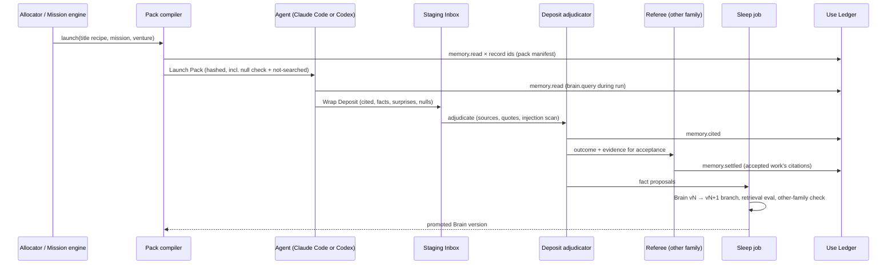
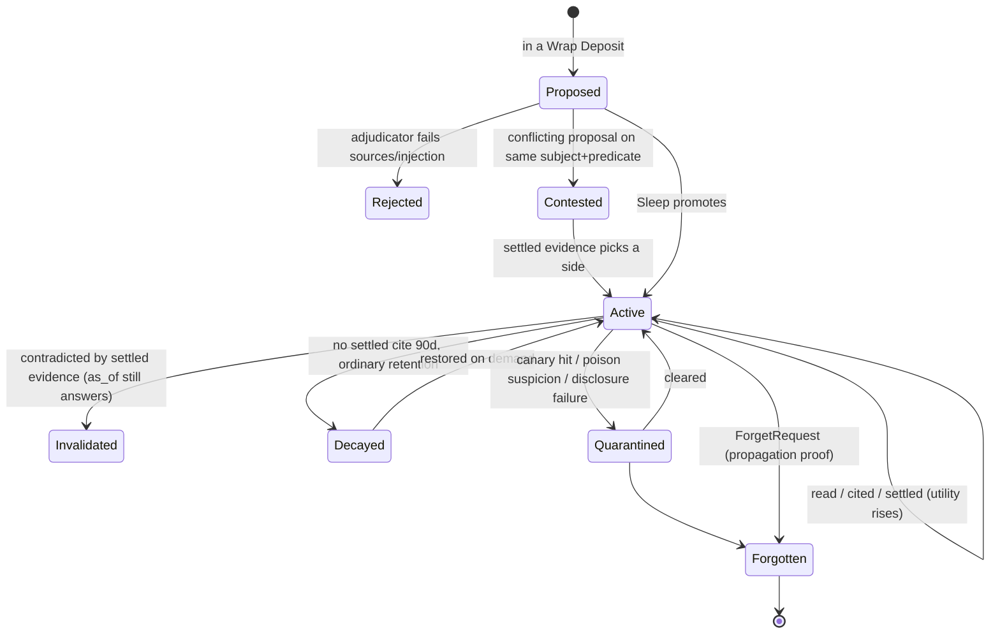
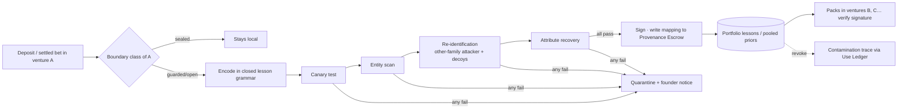

# S04 — Memory and Knowledge Architecture

*Round 2 seat: Memory and Knowledge Architect · 2026-09-30 · designs inside R1-SYNTHESIS (the Compounding Organisation).
Builds on ENGINE-SPEC §6, which already has the layers, read-tracking, nightly sleep and a lesson pipeline. This seat goes
further in six places: typed knowledge records, the Use Ledger that proves influence, the Launch Pack compiler, the Wrap Deposit
contract, the Lesson Airlock that settles cross-venture transfer, and the storage decision.
Speculative numbers are marked [S].*

## 1. Summary

1. **Two records per venture, kept apart.** The **Brain** (world model) holds *what is true*: entities, bi-temporal facts,
   metrics mirrors, obligations and competing explanations. The **Venture Mind** holds *what we intend*: charter, theses,
   Standing Orders, wagers and taste. The Mind cites the Brain and may never write to it. Truth and intent have different writers.
2. **Everything is a typed record with provenance and validity.** Nine kinds: Entity, Fact, Explanation, Question, Decision,
   Obligation, Prior, Null, Lesson. Free-text notes exist only as staging material, never as canonical memory.
3. **The Use Ledger proves influence, not only recall.** It records four events: *read → cited → settled → counterfactual*. A
   record earns standing only when work the Referee accepted cited it. Paired replay checks, on a sample, whether it changed the result.
4. **No store without a reader.** Any store or record class with no declared consumer and no settled citation in 30 days
   fails the **Orphan lint**. That is how "no write-only logs" gets enforced.
5. **Consolidation writes a new Brain version, like dreaming.** Nightly Sleep produces Brain vN+1 as a reviewable diff. The
   other model family checks supersession. Promotion requires no regression on the retrieval eval. Old versions are kept read-only.
6. **Five forgetting verbs:** decay, invalidate, redact, forget (true deletion with a propagation proof), quarantine. Each is
   governed by retention class, and obligations never decay.
7. **Launch Pack compiler.** Every launched agent gets a budgeted, hashed pack built from its title recipe. The pack always
   carries a *null check* and a *not-searched* list. The **Wrap Deposit** contract says what it must leave, or its mission cannot close.
8. **Lesson Airlock: cross-venture learning without leakage, made enforceable.** It has a threat model, boundary classes
   (sealed / guarded / open) and a **closed lesson grammar** instead of prose. Four disclosure tests: canaries, entity scan,
   cross-family re-identification and attribute recovery. Signed lessons, escrowed provenance and revocation with a contamination trace.
9. **Priors Library and Null Registry** are pooled with hierarchical partial pooling. The pooled estimate is also the
   privacy-safe way to share across ventures.
10. **Storage decision: versioned files are canonical** (git per venture `brain/` plus the portfolio store), with a derived SQLite
    FTS5 + sqlite-vec index and a bi-temporal schema natively. **Graphiti is a derived projection, adopted on a measured trigger.**
    **Mem0 is removed as "primary".** It is not a system of record, it was never configured, and the independent number is 32%.

## 2. The design

### 2.1 The Record Map — what exists, where, and who may write it

| Store | Scope | Holds | Canonical form | Writers | Readers |
|---|---|---|---|---|---|
| **Brain** | one venture | Entities, Facts, Explanations, Questions, Obligations, Decisions (as records), Metric Mirrors | `ventures/<v>/brain/**/*.yml`, git | Deposit adjudicator, Sleep job, Referee (settled facts) | Launch Packs, Mind, Allocator, Referee |
| **Venture Mind** | one venture | Charter, theses, Standing Orders, wagers, taste, commitments | `ventures/<v>/mind/`, git (C2 layout kept) | Co-founder seat via founder-visible PR; founder | Every pack in the venture |
| **Portfolio Mind** | all ventures | Allocation thesis, founder model, cross-venture wagers, venture **board summaries** | `~/.agentvibe/portfolio/mind/` | Portfolio Co-founder seat, founder | Portfolio sessions only |
| **Priors Library** | portfolio | Pooled base rates by task family | `~/.agentvibe/portfolio/priors/` | **Airlock service only** | All packs (read-only) |
| **Null Registry** | venture + portfolio | Killed and inconclusive bets | venture `brain/nulls/`; airlocked copies in portfolio | Referee on bet settlement | Planner, every pack (null check) |
| **Lesson store** | portfolio | Airlocked Lessons in closed grammar | `~/.agentvibe/portfolio/lessons/` | **Airlock service only** | All packs (read-only) |
| **Episodic journal** | venture | Events, transcripts, blackboards, deposits | Journal + blobs (engineering seat owns) | Engine | Sleep, replay, audit |
| **Use Ledger** | all | read / cited / settled / counterfactual events | Append-only event stream, `memory.*` | Engine (never agents) | Sleep, ranking, Orphan lint, dashboards |
| **Staging Inbox** | venture | Wrap Deposits not yet adjudicated | `ventures/<v>/brain/_inbox/` | Any launched agent (its own deposit only) | Deposit adjudicator |
| **Provenance Escrow** | portfolio | Lesson → source-venture mapping | Encrypted, `~/.agentvibe/escrow/` | Airlock | Founder, audit, revocation job |

**Hard rules.** (1) The Mind never writes the Brain. A thesis cites facts; it does not make them true. (2) No agent writes
canonical memory directly. Agents write deposits, and adjudication promotes them, the same way code reaches `main` through a merge queue.
(3) One session means one venture root. No worker session ever mounts two venture Brains. Portfolio sessions see only
board summaries and airlocked material.

### 2.2 Typed records — the knowledge schema

Every record shares one envelope. What varies is the body.

```ts
type Envelope = {
  id: string;                 // ulid, stable across versions
  kind: 'entity'|'fact'|'explanation'|'question'|'decision'|'obligation'|'prior'|'null'|'lesson';
  venture: string | 'portfolio';
  // bi-temporal (Graphiti's model, natively in files)
  valid_from: string; valid_to: string | null;        // world time: when it was true
  recorded_at: string; invalidated_at: string | null; // system time: when we learned / un-learned it
  supersedes?: string[]; superseded_by?: string;
  evidence: { grade: 'E0'|'E1'|'E2'|'E3'|'E4';        // C4 evidence ladder: hunch → observed → measured → tested → replicated
              sources: Array<{ ref: string; quote?: string; accessed?: string; system_of_record?: string }> };
  sensitivity: 'public'|'internal'|'confidential'|'sealed'|'personal';
  retention: 'ordinary'|'obligation'|'legal'|'safety'|'pinned';
  author: { title: string; family: 'claude'|'codex'|'founder'|'human'; mission?: string };
  use: { reads: number; cites: number; settled_cites: number; last_settled: string|null; utility: number }; // computed, never agent-written
};
```

Bodies (abridged):

```yaml
fact:        { subject: ent_cust_acme, predicate: pays_monthly_usd, object: 29, unit: USD, confidence: 0.95 }
entity:      { type: customer|competitor|segment|channel|offer|person|supplier, name, aliases[], attributes{} }
explanation: { question: q_why_churn, claim: "churn is onboarding-driven", predicts: [{metric, direction, by}],
               weight: 0.55, rivals: [expl_price_driven] }     # competing world models, reweighted on evidence
question:    { text, decision_it_unblocks, voi_estimate, owner_title, status: open|answered|moot }
decision:    { question, choice, alternatives[], rationale, door: one-way|two-way, decided_by, standing_order?: so_id }
obligation:  { counterparty, promise, due, source_contract, survives_kill: true }
prior:       { task_family, metric, context: {feature: value}, dist: {type: beta, a, b} | {type: normal, mu, sigma},
               n_obs, n_ventures_bucket: '1'|'2-3'|'4+', pooled: true }
null:        { bet, hypothesis, conditions{}, verdict: true_null|underpowered|implementation_failure|confounded,
               achieved_power, mde, resurrection_requires: [string] }
lesson:      { grammar_version: 1, family, condition{}, pattern, direction, effect_bucket, evidence_grade, support_bucket }
```

**Metric Mirrors, not metric copies.** Metrics live in systems of record: Stripe, PostHog, CI. The Brain stores a pointer, a
query, and a **snapshot at each decision that cited it**, so replay can show what the decider saw. It never stores a
hand-maintained number.

**Explanations are first-class.** Every key question keeps at least two rival explanations with falsifiable predictions (R0-E:
"competitive world models"). When the Referee settles evidence, weights move by a simple Bayes update. A strategy change must
name the explanation it relies on.

### 2.3 The Use Ledger — read, cited, settled, counterfactual

| Event | Emitted when | By |
|---|---|---|
| `memory.read` | Record placed in a Launch Pack or returned by a retrieval call | Pack compiler / retrieval service |
| `memory.cited` | Record id appears in the output's `evidence[]`, or its content matches the diff/answer (hash/n-gram) | Deposit adjudicator |
| `memory.settled` | The citing work was **accepted by the Referee** and, for bets, its outcome resolved | Referee settlement hook |
| `memory.counterfactual` | Paired replay with the record withheld changed the verdict or the output materially | Weekly influence sampler |

**Utility** = exponentially decayed `settled_cites` (half-life 60 d [S]) + 3 × counterfactual wins − penalties for being cited
in work the Referee rejected. Ranking in packs uses `relevance × utility × validity`. This merges C1's royalties with
C3/C4's read counts in one provenance record, which is what J2 asked for.

**Influence sampler.** Each week, 5% of accepted missions [S] are replayed in the twin with their top-3 cited records withheld.
If the output does not change, the records were decorative, and their utility is marked down. This is the measurement R0-C §3
says nobody makes.

**Orphan lint (the graveyard detector).** Runs nightly:
- A **store** with no declared consumer, or with zero `memory.read` in 30 d, fails the lint. The engineering seat wires the
  lint into `npm run check` style gates.
- A **record class** with writes but zero `settled` in 90 d triggers a review: stop writing it, or fix what reads it.
- **Read-often, never-cited** records (≥10 reads, 0 cites) are flagged for rewrite. Usually they are too long or too vague.
- **Write-to-settled ratio** per store is a weekly self-improvement KPI. Target < 5 : 1 by week 12 [S].

### 2.4 Consolidation — Sleep writes a new Brain

```yaml
sleep_job:
  cadence: nightly per venture; plus on-demand after a pivot or a large ingest
  model: claude-sonnet-5 or codex (alternates by night so neither family's biases own the Brain)
  budget: $0.40 per venture-night cap [S]; skipped in degraded mode (economics seat)
  inputs: Brain vN, Staging Inbox, Use Ledger deltas, journal since last sleep
  ops: [ADD, UPDATE, INVALIDATE, MERGE, SPLIT, DECAY, REWRITE, NOOP]   # Mem0 taxonomy + bi-temporal INVALIDATE
  output: branch brain/sleep-<date> with a ≤1 KB "what the company learned" note
  gates:
    - retrieval_eval: recall@8 not lower; supersession correctness 100%; leak rate 0
    - supersession_check: the other family reviews every INVALIDATE touching a decision, prior or obligation
    - obligations: may never DECAY or INVALIDATE without a Referee-settled fulfilment or release record
  promote: fast-forward merge; vN kept read-only; rollback = checkout vN
```

An LLM runs at **mutation time**, not only at write time. ForgetEval found this is where intent-aware deletion works (78–85%
deletion, 91.7–93.2% overall). Conflict-gated invalidation follows SleepGate: superseded facts damage retrieval, so they are
invalidated and removed from the default index, and stay queryable only with `as_of`.

### 2.5 The five forgetting verbs

| Verb | Effect | Trigger | Reversible |
|---|---|---|---|
| **Decay** | Out of default index; stub remains (`evict-memory.mjs` discipline) | utility < θ and no settled cite in 90 d; `retention: ordinary` only | Yes (restore) |
| **Invalidate** | `valid_to`/`invalidated_at` set; still answerable "as of" | Contradicting settled evidence | Yes |
| **Redact** | Field-level removal of personal/sealed data; record kept | Sensitivity reclassification, data-policy rule | No for the field |
| **Forget** | True deletion across files, git history (filter), index, blobs, packs cache, backups; tombstone = hash + reason | ForgetRequest from founder, customer (GDPR) or contract end | No, by design |
| **Quarantine** | Removed from packs pending review; readers of it are traced | Poisoning suspicion, canary hit, failed disclosure test | Yes |

A ForgetRequest returns a **propagation proof**: a list of every location checked and a zero-hit search for the record's
distinguishing tokens. It is a receipt like any other effect.

### 2.6 Launch Pack compiler — context assembly

An agent is a record `{title, expertise, model, skills@ver, memory_scope, tools, sandbox}`. The pack is compiled from its
**title recipe** plus the mission brief. It is deterministic given inputs, so it can be replayed, and it is hashed.

```yaml
pack_recipe: { title: "Pricing Economist", budget_kb: 32 }   # Opus/Codex-large 40 KB, Sonnet 32, Haiku 12 [S]
sections:                         # order = priority when trimming
  - charter_slice:      {max_kb: 2}   # intent, never-list, door limits, data boundary
  - mission_brief:      {max_kb: 3}   # goal, success/kill criteria, budget, lease scope
  - standing_orders:    {match: task_family, max: 8}
  - null_check:         {required: true}  # nulls for this task_family+context, or "none apply" with the query shown
  - priors:             {match: task_family, max: 6}
  - facts:              {rank: relevance×utility×validity, as_of: now, max_kb: 10}
  - explanations:       {for_questions: mission.questions}
  - prior_attempts:     {same mission lineage, deposits only}
  - lessons:            {airlocked, max: 5}
  - taste:              {founder corrections verbatim, max_kb: 2}
  - not_searched:       {required: true}  # stores/scopes deliberately excluded — "not searched ≠ not found"
manifest: {pack_hash, record_ids[], versions[], brain_version}   # emits memory.read for each id
```

Retrieval during the run is allowed through a scoped tool (`brain.query`, `brain.as_of`) that emits `memory.read`. The sandbox
enforces scope: other venture roots are denied at the filesystem, as ENGINE-SPEC §9 specifies. Claude Code and Codex get
**the same pack**, as files plus an AGENTS.md-style header, so memory stays equal across families.

### 2.7 Wrap Deposit — what every agent must leave behind

```yaml
deposit:                     # written to brain/_inbox/<mission>/<agent>.yml; mission cannot close without it
  outcome: {status, artifacts[], receipts[]}
  cited: [record ids actually relied on]            # checked against output; false citations are penalised
  learned_facts: [{proposed fact body, sources[] with quotes}]   # proposals, not truth
  decisions: [{question, choice, rationale, door}]
  surprises: [{expected, observed, record_that_predicted_wrong?}]   # the highest-value memory
  nulls: [{what did not work, conditions}]
  questions_opened: [{text, decision_it_unblocks}]
  backlot_strikes: [{asset, change}]               # C5 mandatory strike
  handoff: "≤10 lines"
```

The **Deposit adjudicator** is a Haiku-class job with deterministic checks. It verifies sources exist, quotes match, cited ids
were in the pack or were queried, and there is no instruction-shaped content in facts (MINJA defence, ENGINE-SPEC §6.2). It then
routes: routine facts go to Sleep, facts touching decisions/priors go to other-family review, and outcomes go to the Referee.
**External content enters only as quoted sources**, never as a Standing Order, a skill or a preference.

### 2.8 Priors Library and Null Registry

- **Hierarchical pooling.** Each prior is a posterior with partial pooling across ventures (venture effects shrunk toward the
  portfolio mean). A new venture starts from the pooled prior, and ventures with more data move away from it. The pooled
  hyperparameters are the *only* numeric thing that leaves a guarded venture. They are bucketed, and noised when fewer than 3
  ventures contribute (§2.9).
- **The null check is mandatory.** A planner proposing a bet must cite matching nulls or show the query that found none.
  Re-running a nulled idea requires `resurrection_requires` to be satisfied, meaning something named has changed.
- **Null verdicts are typed.** `underpowered` is not `true_null`, which keeps a small-N failure from becoming dogma. This extends C4.
- **Expiry.** Priors carry `valid_until` (claim-ledger Rule 9 discipline). On expiry they are refreshed from new settled bets,
  deprecated, or waived with a date.

### 2.9 The Lesson Airlock — cross-venture learning without leakage

R0-C §6 and J2 are right that "abstraction" alone is no guarantee. The Airlock makes the problem tractable in three steps. It
names **who the adversary is**. It shrinks **the channel** from free prose to a closed grammar. It **tests** each release
against attacks and keeps it **revocable**.

**Threat model.** Leakage matters for four readers: (a) humans with scoped access to venture B (contractors, co-founders,
clients, advisors); (b) counterparties and their agents; (c) buyers of a venture on exit; (d) anything published. The founder
himself is not an adversary, so founder-only surfaces may show everything.

**Boundary classes (set in the Charter):**

| Class | Exports | Imports | Default for |
|---|---|---|---|
| **sealed** | Nothing, not even lessons. Its Null Registry stays local | Airlocked lessons and priors | Client/agency work, NDA, regulated data |
| **guarded** | Grammar lessons + bucketed/noised prior contributions, after all four tests | Yes | Founder ventures with outside humans or exit potential (**recommended default**) |
| **open** | Lessons + exact prior contributions (still grammar-only) | Yes | Founder-only research/learning ventures |

**Closed lesson grammar.** A lesson is a tuple over controlled vocabularies, not text:
`family ∈ TaskFamilies`, `condition ⊂ ContextFeatures` (e.g. `buyer: smb`, `channel: cold_email`, `price_band: 10-50`),
`pattern ∈ Patterns` (e.g. `annual_discount_offered`), `direction ∈ {+,−,0}`, `effect_bucket ∈ {small, medium, large}`,
`evidence_grade`, `support_bucket ∈ {1, 2-3, 4+}`. Vocabulary additions go through a founder-visible PR. The channel capacity
is then bounded and countable, roughly log2 of the grammar's cardinality, which is about 40 bits per lesson [S], and
names, quotes and numbers cannot be expressed at all. A free-text `note` is allowed only in `open` ventures.

**The four disclosure tests** (all must pass; any failure → quarantine + founder notice):
1. **Canary test (deterministic).** Every guarded/sealed Brain is seeded with synthetic canary entities: fake customer names,
   unique strings, a fake price. Any export or any output in another venture containing a canary token fails outright, and
   the Use Ledger traces which pack carried it.
2. **Entity scan (deterministic).** The source Brain's entity dictionary plus a NER pass. Any hit is rejected. Grammar
   lessons pass trivially; this test exists for `open` notes and for board summaries.
3. **Re-identification test (cross-family attacker).** A fresh session of the *other* family gets the lesson and the board
   summaries of all ventures plus 2 synthetic decoys, and names the source. Pass if accuracy over 20 paraphrase trials stays
   within the chance band (binomial 95%). A lesson that is **only** identifying (for example, "the only B2B venture") is held
   until `support_bucket ≥ 2-3`, or released only to ventures whose charter has no outside humans.
4. **Attribute-recovery test.** The attacker gets a list of the source's must-not-disclose facts, masked, and tries to recover
   them with and without the lesson. Pass if recovery gain ≤ 5 percentage points [S].

**Enforceable boundaries.** The portfolio lesson/prior stores are writable only by the Airlock service's sandbox profile.
Packs accept only lessons carrying the Airlock's signature (hash of lesson + test results). The lesson → source mapping lives in
the **Provenance Escrow**, which is readable by the founder and the revocation job only. **Revocation.** If a lesson is later
found leaky, or a venture is sold or reclassified sealed, the lesson is quarantined. The Use Ledger lists every pack and output
that read it (a **contamination trace**). Affected outputs still unpublished are re-run without it, and published ones are
listed for the founder.

**On exit.** A sold venture's Brain and Mind export whole, because of the sealed boundary. Its lessons stay in the portfolio
only if the sale contract allows it. The escrow is what makes that clause executable.

### 2.10 Venture Mind and Portfolio Mind as records

The C2 layout is kept: charters, theses, taste, wagers, standing-orders, commitments, fingerprint heldout. Four additions:
- **Theses cite Brain ids and Explanations.** A thesis whose cited facts are invalidated is marked `stale-premise`
  automatically and appears on the next board agenda.
- **Board summary** per venture (≤2 KB, grammar- and entity-scanned). This is what the Portfolio Mind sees, so
  cross-venture strategy never needs raw Brains.
- **Portfolio Mind** holds the allocation thesis, the portfolio founder model and cross-venture wagers. It reads priors,
  lessons and board summaries only.
- **Mind reads are use-tracked too.** A Standing Order never consulted in 60 days is proposed for retirement. One overridden by
  outcomes twice is proposed for revision (Fingerprint gate, C2).

### 2.11 Knowledge concurrency — leases for facts, not only code

Parallel swarms write deposits concurrently. Adjudication takes an **entity-level lease** (C3's fenced lease, reused).
Conflicting proposals on the same `(subject, predicate)` are not last-write-wins. They become a **contested** fact with both
values, their sources, and a Question record, which the next pack for that entity must surface. The Brain has a merge queue
exactly as code does.

### 2.12 Storage decision

**Decision: versioned files are canonical. A derived index serves retrieval. The temporal graph is a projection adopted on a
trigger. Mem0 is not primary and not a system of record.**

| Criterion | Versioned files (git) + SQLite FTS5/sqlite-vec | Graphiti (Neo4j/FalkorDB) | Mem0 |
|---|---|---|---|
| Diffable, reviewable consolidation | Yes (PR per Sleep) | Partial | No |
| Bi-temporal validity | In schema, natively | **Native, best-in-class** | None (R0-C) |
| Sandbox-enforceable isolation | Filesystem deny per venture root | DB auth only | Service-side |
| Equal for Claude Code and Codex | Both read files | Needs MCP | Needs MCP |
| True deletion with proof | Files + history filter + index | DB delete, weaker for derived summaries | LLM-decided |
| Data stays on our machine (data policy) | Yes | Yes if self-hosted | Hosted default |
| Measured retrieval | Our golden set | 75.1% LoCoMo third-party | **32.4% independent OSS** |

Why: canonical memory must satisfy "no graveyard", deletion and isolation first, and retrieval quality second. Retrieval
quality can be bought later with a projection, because the files hold everything the projection needs. **Graphiti trigger:**
a venture's golden-set recall@8 < 0.85, or > 2,000 facts, or a multi-hop question class failing > 20% [S]. Graphiti is then
built *from* the files nightly, and its answers carry record ids, so use-tracking still works. **Mem0** stays available as a
candidate extractor in the Sleep job only if it beats the incumbent on our own golden set. It is never a store. The harness
confirms this: TARGET-ARCHITECTURE already records "Mem0: DELETE". AGENTS.md records that 16 deleted routines called Mem0
while none had it configured. CLAUDE.md's "Mem0 (primary)" line is an unedited template default, and this seat recommends
changing it.

## 3. Diagrams

**3.1 The memory loop for one launched agent**



**3.2 Lifecycle of a record**



**3.3 The Lesson Airlock**



## 4. Interfaces

| Part | Memory **needs from** it | Memory **gives to** it |
|---|---|---|
| **Mission engine / Allocator** | Mission briefs with task_family and questions; bet preregistrations; kill/settle events | Priors (bet priors), Null check results, Question records with VoI inputs, Explanation weights |
| **Agent organisation / identity** | Title recipes (pack sections, budgets, memory_scope) | Per-record track data: which configs' citations settle. Agent calibration feeds the identity record |
| **Autonomy** | Door types and data-boundary class from the Charter; who may issue ForgetRequests | `stale-premise` alerts on theses; contested facts touching one-way doors escalate |
| **Acceptance / Referee** | Settlement events; systems-of-record access for Metric Mirrors | Evidence bundles with record ids and snapshots; supersession reviews |
| **Coordination** | Fenced leases, merge queue | Entity-level knowledge leases; contested-fact protocol |
| **Skills / tools** | Skill outcome events | Skill loads recorded in the Use Ledger (same `read→settled` chain), so the skills economy and memory share one telemetry |
| **Surfaces (Mission Control)** | Rendering | Brain Diff (weekly), "why did it do that" = the pack manifest + cited ids, Graveyard dashboard (write:settled ratios, orphans), Forget receipts |
| **Engineering** | Journal, blob store, sandbox profiles per venture root, the Airlock sandbox profile, `memory.*` event types | Schemas above; retrieval eval harness; Orphan lint |
| **Economics** | Budget caps for Sleep, influence sampler, Airlock tests; degraded-mode signal | Cost per pack, cost per settled citation, memory spend per venture |
| **Simulation / twin** | Forked-Brain mounts; shadow outbox | Brain snapshots at any `as_of`; synthetic stakeholders **labelled synthetic, never evidence** (evidence grade blocked at E0) |
| **Self-improvement / evals** | Weekly slot | Memory policies are Lab arms (pack recipes, decay thresholds, Sleep model); retrieval, leak and influence metrics |
| **Human collaborators** | Scoped identities | Scoped Brain views generated by the same entity scan, so contractors see a filtered projection, never raw files |
| **Safety / data policy** | Provider terms, training-off state | Sensitivity labels drive which model/provider may receive a record (for example, `personal` never leaves the subscription accounts with training off) |

## 5. Worked examples

All costs and times are [S], sized from ENGINE-SPEC budgets.

### 5.1 A pricing bet in an autonomous venture, and the lesson that crosses

**Venture:** Dispute Desk (Stripe-dispute micro-SaaS, guarded, autonomous). **Mission:** "Test annual plan at 2 months free."

| t | What happens | Model | Cost | Memory effect |
|---|---|---|---|---|
| 09:00 | Allocator funds bet; Pack compiler builds pack for **Pricing Economist** (hybrid: pricing + behavioural econ + Stripe billing) | Codex (gpt-6-astra) | $0.02 | 31 KB pack: 2 Standing Orders, **null check** returns one hit ("annual 20% off, Q2, underpowered, n=41"), pooled prior "annual uptake SMB 10–50 USD: Beta(6, 44)", 14 facts, not-searched: other ventures |
| 09:05 | Economist designs the test; resurrection of the null is allowed because `resurrection_requires: ["traffic > 400/wk"]` is now met (Metric Mirror shows 520) | Codex | $1.10 | `memory.read` × 22; cites 6 |
| 09:40 | **Billing Engineer** implements the plan behind a flag; the Referee (Claude Opus 5) accepts the diff via CI | Claude Code Sonnet 5 / Opus 5 | $2.30 | Deposit: 1 fact proposal (Stripe price id), 0 surprises |
| +14 d | Bet settles: uptake 19% vs prior mean 12%; Referee reads Stripe directly | Opus 5 | $0.60 | `memory.settled` on the 6 cited records; prior posterior updated; the old null is **invalidated** by a successor record (not deleted) |
| +14 d night | Sleep promotes Brain v212; Airlock encodes the lesson `{family: pricing, condition: {buyer: smb, price_band: 10-50, billing: monthly_default}, pattern: annual_months_free, direction: +, effect_bucket: medium, evidence_grade: E3, support_bucket: 1}` | Sonnet 5 + Codex attacker | $0.35 | Canary ✓, entity ✓, re-ID: attacker 4/20 against 5 candidates (chance band) ✓, attribute recovery +1 pt ✓ → signed, escrowed |
| +15 d | A new venture's **Growth Operator** gets the lesson and the updated pooled prior in its pack; no Dispute Desk fact is visible | — | — | Weekly Brain Diff shows the founder 3 lines; he circles the lesson (taste data) |

Founder minutes: about 1 (circle in Dailies). Approvals: none. The bet was a two-way door inside the charter's budget.

### 5.2 A sealed agency client, a competitor launch, and a blocked leak

**Venture:** client agency engagement for a fintech (sealed; client contractor has a scoped portal). **Trigger:** the client's
competitor launches a feature at 07:10.

| t | What happens | Model | Cost | Memory effect |
|---|---|---|---|---|
| 07:12 | Signal scanner (obligations lane: a customer promise to report competitor moves within 24 h) launches **Competitive Analyst** | Claude Sonnet 5 | $0.90 | Pack from the client Brain only; imports 2 portfolio lessons (allowed: sealed imports) |
| 07:40 | Analyst deposits 5 competitor facts with quoted sources; one proposal conflicts with an existing fact (competitor pricing) | — | — | Contested fact created with both values + a Question |
| 08:00 | **Brand Strategist** (Codex) drafts the client briefing; the Referee (Claude) accepts it against the sources | Codex | $1.40 | Contested fact surfaced in pack; briefing cites both, flags the conflict |
| 08:05 | A mis-configured recipe in another founder venture tries to pull "fintech positioning lesson" derived from this engagement | — | — | **Airlock refuses at source:** sealed ventures export nothing. Had a hand-written note slipped through, the **canary** "Verasol Payments" seeded in the client Brain would have tripped the canary test |
| Engagement end +30 d | Contract ends; the founder issues a ForgetRequest per the client contract | Haiku 4.5 | $0.05 | Brain, blobs, index, pack caches, backups purged; **propagation proof** filed as a receipt; tombstones keep hashes and reason only |

Founder minutes: 2 (approve the ForgetRequest, a one-way door). The client's contractor saw only the scoped projection throughout.

### 5.3 The graveyard catches itself (week 6)

The Orphan lint fires on `brain/meetings/`. An early recipe wrote meeting notes nightly: 340 writes, 212 reads, **0 settled
cites**. The weekly self-improvement run proposes three arms: (a) stop writing them, (b) write only decisions from meetings,
(c) keep as-is. Arm (b) wins on the influence sampler: 3 counterfactual wins in 40 replays, against 0 for the other two. The
recipe changes, and 338 notes decay to stubs. Write:settled for the venture drops from 11:1 to 6:1.

## 6. Ideas the founder did not ask for

1. **The Weekly Brain Diff.** A reel of "what the company now believes that it didn't last week", in the Dailies. It shows
   facts added and invalidated, explanation weights moved, and nulls filed. The founder circles or strikes lines. A strike
   becomes a quarantined record plus a taste datum. This turns memory review into a two-minute habit instead of an audit.
2. **Surprise-first memory.** Every pack carries the system's *expectation* for the mission, meaning the prior plus the
   explanation's prediction. Every deposit records the *surprise*. Prediction error is the highest-value thing to remember,
   so Sleep ranks surprise-bearing records first, and a venture with zero surprises in a month is flagged as either stagnant
   or not measuring.
3. **The Graveyard Walk before every one-way door.** Before a one-way-door decision, a Haiku job retrieves every null,
   invalidated thesis and struck take that resembles it, and shows them in one screen of the DecisionPacket. It is a pre-mortem
   fed by the organisation's own failures.
4. **Canary economy.** Canaries do more than detect leaks. Some are planted *false facts* with known answers. If an agent
   cites one in real work, it is relying on unvalidated memory. That gives a standing, measurable poisoning and staleness
   detector per venture.
5. **Founder recall line.** "What did we decide about refunds in Dispute Desk and why?" works by voice, phone or terminal. It
   answers from Decision records with `as_of` history and the pack manifest that produced the decision. Memory serves the
   founder directly, not only the agents.
6. **Right-to-be-forgotten as a product capability.** Every venture inherits governed forgetting with propagation proofs, so
   GDPR-grade deletion is on from day one. Could be a separate venture of its own [S]: R0-C says governed forgetting "exists only
   in research".
7. **Brains as sellable assets.** Because Brains are sealed-exportable records with Metric Mirrors and settled decision
   history, a venture sold or spun out (R1 §5 "transferable operating-company packages") ships with its institutional memory
   intact, and the buyer can verify it.
8. **Memory policies as Lab arms.** Pack recipes, decay half-lives and Sleep model family are A/B'd against each other on the
   influence sampler. Memory improves by experiment, not by opinion.
9. **Cold-start Brains for the 19 repos.** Onboarding runs a read-only scout that seeds Entities, Obligations (from contracts,
   READMEs, invoices) and Questions ("what is this repo for, who pays?"). Every seeded fact is E1 until a settled mission
   cites it, so imported memory must earn its place like everything else.
10. **Portfolio uncertainty map.** The union of open Questions across ventures, ranked by VoI. When two ventures share an
    unknown, one bet answers both, and the Airlock carries the answer.

## 7. Risks

| Risk | Design answer |
|---|---|
| **Memory poisoning** via web content, customer email, counterparty agents (R0-C: injected content persists as "trusted memory") | External content enters only as quoted `source` records at E0–E1. It cannot become Standing Orders, skills or preferences. There is an adjudicator injection scan, canary false facts, and quarantine with a contamination trace |
| **Leakage through lessons** in small portfolios (three ventures make "the B2B one" identifying) | Closed grammar, re-ID test with decoys, `support_bucket` hold, sealed class, escrowed provenance and revocation. The threat model restricts where leakage matters, and founder-only surfaces are exempt |
| **Consolidation corrupts truth** (Sleep merges wrongly or invalidates a correct fact) | Sleep writes a new version on a branch. Other-family review for decisions, priors and obligations. The retrieval eval includes supersession tests. One-command rollback |
| **Correlated failure**: one bad Sleep prompt or model deployed to every venture | Alternate families nightly. Staged rollout of Sleep changes (one venture, then all), gated by leak and recall evals. Budgeted as a portfolio risk (R1 rule 8) |
| **Use Ledger gamed**: agents cite everything to look grounded | Citation is checked against content overlap. Citing work the Referee rejected penalises utility. The counterfactual sampler measures real influence |
| **Packs grow until they drown the agent** | Hard per-title KB budgets, ordered trimming, and read-often-never-cited detection. Budgets are Lab arms |
| **Forgetting something needed** (a decayed fact turns out critical) | Decay keeps stubs and restore. Obligations, legal and safety retention never decay. Invalidated facts stay answerable via `as_of` |
| **Files don't scale** past thousands of facts per venture | The derived index plus the Graphiti projection trigger. Canonical files remain the source of truth, so migration is a rebuild, not a port |
| **Stale Metric Mirrors** (a source API changes) | Mirrors carry a query contract test. A failing mirror returns `unresolved`, never a cached number presented as current (Rule 10) |
| **Human collaborators see too much** | Scoped projections generated by the same entity scan and boundary classes. Raw Brain files are never mounted for humans |

## 8. Open decisions

1. **Default boundary class for founder-owned ventures.** *Recommendation: `guarded`.* `open` is faster, but a venture gains
   outside humans or a buyer later, and reclassifying after the fact needs revocation. Starting guarded costs about $0.35 per lesson.
2. **May Sleep auto-promote without other-family review?** *Recommendation: yes for ADD/MERGE/DECAY/REWRITE on ordinary
   facts. Always review INVALIDATE or any change touching decisions, priors, obligations or Standing Orders.* Revisit when the
   influence sampler has 8 weeks of data.
3. **Graphiti trigger thresholds** (recall@8 < 0.85, > 2,000 facts, multi-hop failure > 20%). *Recommendation: adopt as
   written. Run a one-day spike in Round 4 on the largest imported repo's Brain to measure all three before the build commits.*

## 9. Challenge to the synthesis

**Upward challenge 1 — a fifth separated authority: Record.** The synthesis separates Intent, Allocation, Execution and
Acceptance, and places the world model inside Execution. That lets the layer doing the work also author what the organisation
believes is true about the world, which is the same conflict of interest the four-way split exists to prevent. **Proposal:**
the Brain is a shared substrate under all four layers, with its own write authority: deposits propose, the adjudicator
and Sleep promote, the Referee settles. Neither the Mind (intent) nor the workers (execution) may write canonical facts. In
one line: *what we want, what we do, and what we believe is true have three different writers.*

**Upward challenge 2 — the Brain must be runnable, not only queryable.** Explanations with predictions, Metric Mirrors with
`as_of` snapshots and typed Questions make the Brain a predictive model of the venture. The simulation seat should run the
digital twin *from* the Brain. Each forecast the twin makes is scored against what happens, and the calibration becomes the
Brain's own quality metric, alongside recall. A world model that never predicts cannot be wrong, and so cannot improve.

**Upward challenge 3 — "Priors Library + Null Registry" should include the organisation itself.** Priors about *agent
configurations* (which title recipe settles work in which task family) and *memory policies* belong in the same library, pooled
the same way. Then team composition and memory design learn at the same rate as pricing does.
