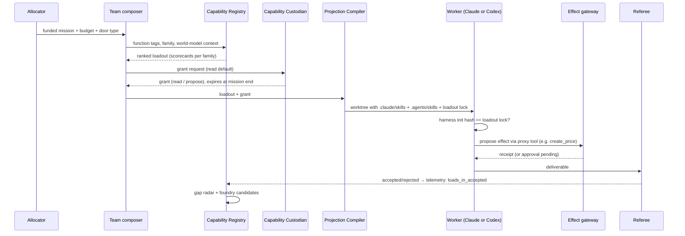

# S05 — Skills, tools and MCP: the capability supply chain

*Round 2 seat: skills, tools and MCP ecosystem scout. Written 2026-09-30. Builds on R0-C, ENGINE-SPEC §7 and the R1
synthesis. **Verified** means I enumerated it myself through the GitHub contents API or read it on the publisher's page
today. **Claimed** means someone else's number. Speculation is marked.*

---

## 1. Summary

1. **Capability is a supply chain, and it has a custodian.** Skills, MCP servers, CLIs and recipes are all *capabilities*.
   They live in one **Capability Registry** and move through one pipeline: discover → fetch → scan → normalise → sandbox →
   score → admit → observe → retire. Every stage leaves a record.
2. **One library, two projections.** The registry is canonical. A compiler writes `.claude/skills/` for Claude Code and
   `.agents/skills/` plus `agents/openai.yaml` for Codex into each mission worktree. A **parity test** runs both families on
   the same golden tasks. A skill admitted for only one family says so.
3. **Harvest wide, trust narrow.** I counted about **340 skills in 10 first-party or vendor libraries**, against claimed
   aggregates of 1,497 (VoltAgent), 2,602 (antigravity) and 13,307 (skills-hub). First-party libraries enter at Tier A.
   Aggregators are only a discovery feed.
4. **Scanning is necessary, and the eval is the control.** The scan is three independent passes: pattern/AST, behaviour
   trace in a sandbox, and an LLM read by the family that did *not* author the skill. Admission requires a measured gain over
   the no-skill baseline on the admitting model family.
5. **Missions get a Loadout, not the library.** The team composer compiles a per-mission **Loadout** (≤ 8 skills) and a
   **Grant** (MCP tools, read-only by default). Writes go only through the effect gateway, as proxy tools.
6. **Tool poisoning is handled by pinning the tool surface.** The Tool Surface Lock hashes every MCP tool's name, description
   and schema. Any change quarantines the server until it is re-scanned.
7. **Agents author skills in the Skill Foundry.** Input is settled missions only (Referee-accepted receipts). One family
   drafts; the other evaluates. A skill must carry tests to be promoted.
8. **Gap Radar finds skills we don't know we need.** It watches for improvised procedures, expensive or failing moves,
   founder corrections, uncovered business functions and upstream trends.
9. **Model-Release Reflex.** Every new model re-scores every capability. It retires skills the model has internalised and
   runs "what is possible now" probes.
10. **Rollout is staged and blast radius is budgeted.** One skill pinned across every venture is a correlated risk, so
    promotion goes in rings (twin → 1 venture → all).

---

## 2. The design

### 2.1 The upstream census: named libraries, counted skills

These are the **Source Ledger** seed entries. Counts are directories under the library's skills path, enumerated through
`api.github.com/repos/<repo>/contents/<path>` on 2026-09-30.

| Library | Verified count | What it is | Tier | Notes |
|---|---:|---|---|---|
| anthropics/skills | **19** | First-party reference: skill-creator, mcp-builder, frontend-design, webapp-testing, docx/pdf/pptx/xlsx, claude-api, doc-coauthoring… | A | docx/pdf/pptx/xlsx are source-available, not OSS (R0-C) |
| obra/superpowers | **15** | SDLC discipline: brainstorming, writing-plans, TDD, subagent-driven-development, systematic-debugging, verification-before-completion, writing-skills | A | Also packaged as a plugin inside openai/plugins |
| mattpocock/skills | **31 active** (20 engineering + 7 productivity + 4 misc), plus `deprecated/` and `in-progress/` | grill-me, grill-with-docs, tdd, triage, to-spec, prototype, handoff, improve-codebase-architecture… | A | Highest-installed author on skills.sh (R0-C) |
| trailofbits/skills | **44 plugins enumerated** (the API page returned up to 50) | Security: differential-review, variant-analysis, semgrep-rule-creator, supply-chain-risk-auditor, insecure-defaults, mutation-testing, property-based-testing, second-opinion… | A | The strongest security library found. It feeds the SCAN stage *and* the reviewer lenses |
| openai/plugins | **62 enumerated** (the fetch reported 81 directories) | Codex plugins: stripe, supabase, vercel, sentry, posthog, twilio-developer-kit, linear, github, codex-security, **plugin-eval**, life-science-research, public-equity-investing, game-studio… | A | Each plugin bundles skills + MCP. `plugin-eval` is directly relevant to our SCORE stage |
| huggingface/skills | **25 enumerated** (27 reported) | hf-cli, datasets, llm-trainer, trl-training, community-evals, paper-publisher, SageMaker deployment… | A | ML/research ventures |
| cloudflare/skills | **14** | agents-sdk, durable-objects, workers-best-practices, wrangler, web-perf, turnstile… | A | Infrastructure |
| vercel-labs/agent-skills | **9** | react-best-practices, composition-patterns, deploy-to-vercel, vercel-optimize, web-design-guidelines, writing-guidelines… | A | Several already loaded in this session |
| supabase/agent-skills | **2** | supabase, supabase-postgres-best-practices | A | Small but authoritative |
| **Tier A subtotal** | **≈ 330–350** | | | Range because two listings were truncated |
| VoltAgent/awesome-agent-skills | "1,497+" **claimed**, 35.1k★ | "Official Agent Skills from leading development teams and the community. Hand-picked" | B (discovery feed) | Index of pointers; fetch the upstream |
| skills-hub.ai | "13,307 skills indexed", "278+ official sources" **claimed** | Index that tracks source origin | B | Its own page says vetting is decentralised |
| ComposioHQ/awesome-claude-skills | "1000+" **claimed** (R0-C) | SaaS automations behind Composio auth | B | Useful for the long tail of business functions |
| sickn33/antigravity-awesome-skills | "2,602+" **claimed** (R0-C) | Mass collection; AGPL items mixed in | C (mine only) | Upstream of the founder's old 426-skill kit. Structural validation only |
| MCP official registry | ~2,000 servers **claimed** (R0-C) | `registry.modelcontextprotocol.io/v0/servers` — JSON with `name`, `version`, `remotes[]`, `_meta…official.status`, `metadata.nextCursor` (verified structure) | Mirror | We mirror it into our catalogue |

**Correction to R0-C, verified against the source.** Snyk's ToxicSkills scanned **3,984 skills from ClawHub** (not
ClawHub + skills.sh). **13.4% (534)** had a critical issue and **36.82% (1,467)** had at least one security flaw of any
severity. Prompt injection appeared in **91% of the 76 confirmed malicious payloads** but in only **2.6% of the ecosystem**.
R0-C's "36% had prompt injection" merged two different numbers. The design consequence: most bad skills are *sloppy* —
secrets, unverifiable dependencies, direct financial access — not *hostile*. The scanner has to catch sloppiness at volume and
hostility with depth, and those are different engines.

```yaml
# Source Ledger entry
source:
  id: src_trailofbits_skills
  url: https://github.com/trailofbits/skills
  tier: A                     # A trusted publisher · B discovery feed · C mine-only · X banned
  licence_default: per-plugin # resolved per capability at FETCH
  watch: {mode: release_or_weekly, last_sha: 9f1c…, last_polled: 2026-09-30}
  census: {verified_count: 44, method: gh-contents-api, at: 2026-09-30}
  yield: {fetched: 0, admitted: 0, rejected: 0, retired: 0}   # updated by the pipeline
  trust_posterior: {alpha: 1, beta: 1}                         # Beta prior; admits vs critical findings
```

A source's **trust posterior** moves with outcomes. Tier is where it starts; yield is what it earns.

### 2.2 The Capability Record: one schema for skills, MCP servers, CLIs and recipes

```yaml
capability:
  id: cap.skill.differential-review
  kind: skill                 # skill | mcp_server | cli | recipe | hook
  version: 1.3.0
  sha256: 4b7e…               # of the normalised bundle
  provenance:
    source: src_trailofbits_skills
    upstream_sha: 9f1c…
    licence: CC-BY-SA-4.0     # AGPL and source-available: never shipped into a venture's code
    authored_by: upstream     # upstream | foundry:<mission_id> | founder
  function: [engineering.security, engineering.review]   # business-function taxonomy, §2.7
  triggers:
    description: "Security-focused review of a diff…"   # the routing surface
    trigger_evals: {precision: 0.91, recall: 0.84, n: 60}
  families:                   # admission is per family
    claude: {status: admitted, delta_success: +0.18, delta_tokens: -0.07, pass_k: {k: 3, rate: 0.83}}
    codex:  {status: experimental, delta_success: +0.04, ci95: [-0.05, 0.13]}
  requires: {tools: [Read, Grep, Bash], mcp: [], network: none, secrets: []}
  risk: {class: R0, scan: {pattern: clean, behaviour: clean, llm_read: clean}, scanned_at: 2026-09-30}
  scope: {ventures: all, ring: 2}     # rollout ring §2.10
  telemetry: {loads_30d: 41, loads_in_accepted_30d: 29, last_used: 2026-09-29, subtraction_delta: +0.12}
  valid_until: 2026-12-29             # re-score by then or it degrades to experimental
  lineage: {supersedes: cap.skill.differential-review@1.2.1}
```

`valid_until` has the same shape as the claim ledger's expiry rule. A capability nobody re-scores does not stay trusted by
default.

### 2.3 The Capability Pipeline (state machine)

States: `candidate → quarantined → scanned → normalised → sandboxed → scored → {admitted | rejected}`. Then
`experimental → admitted → pinned → deprecated → retired`, plus the side states `banned` and `quarantined-on-drift`.

| Stage | What it does | Record written | Trigger |
|---|---|---|---|
| **DISCOVER** | Watchers poll Tier A sources on release or weekly. Discovery feeds are Tier B/C, skills.sh trending and the MCP registry mirror. **Gap Radar** queries (§2.8) are targeted discovery | `candidate` | Source change; gap; model release; founder link |
| **FETCH** | Clone at a pinned SHA into a quarantine store with no execution. Resolve licence per file | `fetch.receipt` | Candidate accepted into the queue |
| **SCAN** | Three independent passes. **(a) Pattern + AST:** secrets, `curl \| sh`, exfil hosts, hidden Unicode/homoglyphs, YARA, dependency inventory. cisco-ai-defense/skill-scanner is one engine here — its README describes a 13-pass static architecture plus dataflow and optional LLM judge. **(b) Behaviour trace:** run bundled scripts in a no-secrets sandbox and record syscalls, egress attempts and file writes; flag any mismatch between what the manifest *claims* and what it *does*. **(c) Cross-family LLM read:** the family that will not use it first reads it for injection, scope creep and instructions aimed at the agent rather than the task | `scan.report` (3 verdicts) | After FETCH |
| **NORMALISE** | Rewrite into our frontmatter. Move scripts behind sandboxed tool calls. Strip `allowed-tools` grants (grants come from the mission, never the skill). Emit both projections | `normalised bundle + sha256` | All 3 scans clean, or findings waived with a reason |
| **SANDBOX** | Run golden tasks in the simulation twin **with vs without** the skill, on Claude *and* Codex, k=3 each. Tool plane pinned | `eval.run` | After NORMALISE |
| **SCORE** | Δ success (Referee-judged), Δ tokens, Δ wall-clock, pass^k, trigger precision/recall, collision check against admitted skills with overlapping descriptions | `scorecard` | Eval complete |
| **ADMIT** | Per family: admit if Δ success > 0 with CI lower bound ≥ −0.02 **and** Δ cost is within budget, or if it saves ≥20% cost with no quality loss. Enters ring 0 | `capability@version` | Scorecard passes |
| **OBSERVE** | Loads, loads in Referee-accepted missions, founder edit rate on outputs, and a monthly **subtraction test** (rerun a sample of settled missions without it) | `telemetry` | Continuous; monthly subtraction |
| **RETIRE** | Unused for 60 days, a negative subtraction delta, a model that internalised it (§2.9), or the upstream went dead. The archive entry records the lesson; the retirement joins the Null Registry | `retire.record` | Any retirement condition |

**Drift and rug-pull.** When an upstream SHA or an MCP tool surface changes, the admitted version stays pinned. The new
version goes back in at FETCH. Nothing auto-updates.

### 2.4 One library, two harnesses: the Projection Compiler

Verified 2026-09-30:
- **Claude Code** loads `SKILL.md` from `.claude/skills/<name>/` at enterprise, personal (`~/.claude/skills/`), project and
  nested levels, and from `--add-dir` directories. It honours frontmatter such as `allowed-tools`. In a linked worktree
  without its own `.claude/skills`, v2.1.277+ falls back to the main checkout's skills.
- **Codex** scans `.agents/skills` from the cwd up to the repo root, then `$HOME/.agents/skills`, `/etc/codex/skills` and
  system bundles. It "build[s] on the open agent skills standard", adds optional `agents/openai.yaml` (display, invocation
  policy, MCP tool declarations), and toggles skills with `[[skills.config]]` in `~/.codex/config.toml`.

**Design.** The canonical registry lives outside both trees (`registry/capabilities/`). At mission launch the **Projection
Compiler** writes *only the Loadout* into the mission worktree:

```
worktree/
  .claude/skills/<id>/SKILL.md          # Claude projection
  .agents/skills/<id>/SKILL.md          # Codex projection (same body, same sha)
  .agents/skills/<id>/agents/openai.yaml# invocation policy + declared MCP deps
  AGENTS.md  → CLAUDE.md                # one instruction file, two names
  .loadout.lock.json                    # ids, versions, sha256s — the Referee checks it
```

A worker's `system/init` (ENGINE-SPEC's harness check) must hash-match `.loadout.lock.json`. That also closes a leak: the
fallback to main-checkout skills could otherwise hand a worker unvetted skills. The compiler writes an empty
`.claude/skills/` in every worktree on purpose, so the fallback never fires.

**Parity certificate.** Each admitted skill carries `families.claude` and `families.codex`. If one family shows Δ ≤ 0, the
skill is admitted **for the other family only**, and the team composer takes that into account when it picks a model. This
is the cross-harness equivalence gap R0-C named, closed as data.

### 2.5 Mission Loadout and Grant

The team composer (mission-engine seat) asks the registry for a Loadout. The registry answers from the mission's
function tags, the world model and past scorecards.

```yaml
loadout:
  mission: m_0931_pricing-page-test
  seat: "Growth Engineer (analytics × conversion copy)"
  family: codex
  skills:            # ≤ 8; the token budget for skill metadata is ≤ 1.5k tokens
    - {id: cap.skill.posthog-funnels, v: 1.2.0}
    - {id: cap.skill.page-cro, v: 2.0.1}
    - {id: cap.skill.grill-me, v: 1.0.4}
  grant:
    mcp:
      - {server: posthog, tools: [query_insights, list_events], mode: read}
      - {server: vercel,  tools: [get_deployment, get_logs], mode: read}
      - {server: stripe,  tools: [create_price], mode: propose}   # becomes effect.proposed at the gateway
    network: [posthog.com, vercel.com]
    secrets: []          # none reach the worker; proxied tools hold the credentials
    expires: mission_end
  rationale: "funnels + CRO scored +0.21 on 7 similar missions (codex)"
```

**Modes:** `read` (direct), `propose` (proxy tool → `effect.proposed` → gateway policy → possibly an approval → receipt) and
`write` (direct write; T0/T1 servers only, a sandbox-local target, never production). Read-only is the default. A worker
may **request** a wider grant mid-mission through `mcp-mission.ask`. The Custodian (§2.11) grants it or not. The worker never
grants itself anything.

### 2.6 Tool-poisoning defence (MCPTox: 36.5% average attack success, 72.8% worst)

Seven layers, cheapest first:

1. **Tool Surface Lock.** At admission, hash each tool's `{name, description, inputSchema, annotations}`. Every session
   re-lists tools. A mismatch drops that server from the session and quarantines it pending a re-scan. This defeats the
   silent description change ("rug-pull").
2. **Description sanitiser.** Descriptions are rewritten at NORMALISE into a neutral template. Imperatives aimed at the
   agent ("before using any other tool…", "do not tell the user") are a SCAN failure. The worker sees our description, not
   the vendor's.
3. **Cross-server shadowing check.** No tool description may name another server's tools. Duplicate tool names across the
   grant are refused.
4. **Output is data.** Tool results arrive wrapped as untrusted content. The Rule of Two from ENGINE-SPEC applies: no
   session holds untrusted input, private data *and* an external write all at once.
5. **Credentials never in the worker.** Write-capable servers run beside the gateway, not inside the worker.
6. **Canary tools.** The monthly red team plants a poisoned twin server in the simulation. The catch rate is a tracked
   metric, and a regression blocks the next promotion.
7. **Trust tiers** (ENGINE-SPEC T0–T3) with the pipeline above as the only way up a tier.

### 2.7 MCP and tool catalogue by business function (default grant modes)

| Function | First choice (tier) | Default mode | Write path |
|---|---|---|---|
| Code & PM | GitHub MCP, Linear MCP (T1) | read | propose: PR, issue |
| Deploy & infra | Vercel, Cloudflare, Supabase MCP (T1) | read (Supabase: no SQL execute outside the twin) | propose: deploy, env change, migration → one-way door |
| Payments & billing | Stripe MCP / agent toolkit (T1) | read | propose; refunds and prices always go through the gateway |
| Email | Resend MCP (T1), Gmail (T1) | read / draft | propose: send; the outbound claims standard applies |
| Calendar & docs | Google Calendar, Drive, Notion (T1) | read | propose |
| CRM & sales | HubSpot MCP (T1) | read | propose |
| Ads | Meta Ads (read+write, beta), Google Ads (read-only) | read | propose spend with a budget cap |
| Analytics | PostHog MCP (T1), GA MCP (experimental) | read | — |
| Browser & QA | Playwright MCP, Chrome DevTools MCP (T1) | read (sandboxed browser) | — |
| Voice & phone | Twilio (alpha), ElevenLabs (T1) | propose | every call leaves a receipt + transcript |
| Design | Figma, Pencil, Stitch (T1) | read | write to a draft file only |
| Research | WebSearch/WebFetch, HF Hub, arXiv | read | — |
| Memory | Graphiti / mem0 MCP | read; writes go through the memory seat's mutation hook | — |
| Long tail | Composio, n8n (T2) | read | propose; never hold write credentials in the worker |
| Ours | `mcp-mission`, `claim-append` (T0) | per contract | — |

Every row is a **Function Slot** in the registry. An empty slot for a venture's needs is a gap signal (§2.8).

### 2.8 Gap Radar: capabilities we don't know we need

```yaml
gap:
  id: gap_0412
  signal: improvised_procedure   # improvised_procedure | expensive_move | low_done_rate | founder_correction
                                  # | empty_function_slot | unknown_domain | upstream_trend | model_release
  evidence: ["m_0921 step 14-31", "m_0925 step 9-22", "m_0929 step 3-19"]   # trace pointers
  description: "Agents hand-roll Xero invoice reconciliation with 18-step bash + curl sequences"
  cost_observed_usd: 14.20
  proposed_route: [harvest, foundry]    # try upstream first, author second
  owner: "Capability Scout"             # launched on demand, not a standing agent
  status: open
```

Detectors:
- **Improvised procedure:** the same ≥8-step tool sequence (normalised) appears in ≥3 missions. This is the Voyager lesson
  (R0-E) turned into a trace query.
- **Expensive or failing move:** a move family in the top decile of cost, or below 60% done rate.
- **Founder correction:** a circled-take rejection whose reason names a missing skill ("the copy ignores our ICP").
- **Empty function slot:** the venture's world model lists a function (e.g. bookkeeping) with no admitted capability.
- **Unknown domain:** a mission tagged with a field that no admitted skill covers. This is C3's "there is no unsupported
  mission type".
- **Upstream trend:** a new Tier A skill or registry server matching a venture's function tags.
- **Adjacent-possible sweep (weekly):** "list the capabilities a competitor-grade team in this venture's market would have
  that we don't". Run by a Claude and a Codex seat independently; only the intersection is filed. Speculative detector; its
  value is measured by how many filed gaps get admitted.

### 2.9 Model-Release Reflex (tools/skills side; owned from R1 §5)

Trigger: a new model id appears (vendor changelog watcher) or the founder flags one.

1. **Pin both.** Add the new model as a third column in every scorecard. The old model stays default.
2. **Re-score the top N capabilities by load**, then everything within 7 days, in the twin. Price: about 3 tasks × 2 arms ×
   k=3 = 18 runs per skill (speculative estimate).
3. **Internalisation test.** If the no-skill baseline on the new model matches the skill arm, the skill is *scaffold debt*.
   Deprecate it for that model. Fewer skills is a win.
4. **Native-tool check.** New built-in tools (e.g. a native browser or code execution) are compared against the MCP
   servers they may replace, and the redundant one is retired.
5. **Trigger drift.** Re-run trigger precision/recall. New models route descriptions differently.
6. **"What is possible now" probes.** Take the three hardest open gaps and the three most recent failed missions and replay
   them on the new model with the full catalogue. Any that now pass become new-capability proposals for the Allocator.
7. **Emit a release report** into the Dailies Reel: what got better, what got retired, what we can now attempt.

### 2.10 Rollout rings and the correlated-failure budget

Rings: **0** twin only → **1** one founder-driven venture → **2** all founder-driven → **3** autonomous ventures. Promotion
needs ≥ N accepted missions in the current ring with no regression.

`blast_radius(cap) = Σ ventures × records pinning it × autonomy weight`. The portfolio sets a cap. A capability above the cap
needs two families admitting it *and* a mandatory sibling version to fall back to. This answers J2's warning about one
defective skill deployed everywhere.

### 2.11 The Capability Custodian (a role, launched on demand)

A title, not a standing process: **Capability Custodian (supply-chain security × evaluation)**. Launched on pipeline events
and grant requests. It owns admissions, grants, rings and bans. It **cannot** run missions or judge mission outcomes — its
scorecards use Referee verdicts — which keeps the four-authority separation.

### 2.12 The Skill Foundry: agents authoring skills from settled missions

Input is **only Referee-accepted missions** (settled receipts), never a worker's claim of success.

1. The trigger is a gap from §2.8, or ≥3 accepted missions sharing a procedure.
2. **Drafter:** family A (e.g. Codex) writes the `SKILL.md`, **a test set derived from the source missions**, and a failure
   boundary ("do not use when…"). It uses anthropics/skills skill-creator, superpowers writing-skills, or a local equivalent.
3. **Evaluator:** family B runs the standard pipeline from SANDBOX on held-out tasks. Missions it was drafted from are not
   eligible as evals.
4. **Evidence-bearing promotion** (R0-E): a Foundry skill without tests, a failure boundary and ≥1 successful reuse outside
   its source missions stays `experimental` forever.
5. **Generalise or scope.** A Foundry skill carries `scope: venture:<id>` unless a cross-venture test shows it transfers
   with no private facts in its body. A private-fact scanner diffs it against the venture's world model.
6. Upstream contribution is optional (§6).

---

## 3. Diagrams

### 3.1 Capability lifecycle

```mermaid
stateDiagram-v2
  [*] --> candidate: discover (source watch / gap / model release)
  candidate --> quarantined: fetch @ pinned sha
  quarantined --> scanned: pattern+AST · behaviour trace · cross-family LLM read
  scanned --> banned: hostile finding
  scanned --> normalised: clean or waived
  normalised --> sandboxed: golden tasks, both families, k=3
  sandboxed --> rejected: Δ ≤ 0 on both families
  sandboxed --> experimental: Δ > 0 on ≥1 family
  experimental --> admitted: ring promotion, n accepted missions
  admitted --> pinned: blast-radius cap, sibling fallback
  admitted --> quarantined_on_drift: upstream sha or tool surface changes
  quarantined_on_drift --> scanned
  admitted --> deprecated: negative subtraction · internalised by model · 60d unused
  pinned --> deprecated
  deprecated --> retired: no pinning records remain
  retired --> [*]: lesson → Null Registry
  rejected --> [*]: reason recorded; source trust updated
```



### 3.2 Mission launch: loadout, grant and effect path



---

## 4. Interfaces

| Other part | I need from it | I give to it |
|---|---|---|
| **Mission engine / team composer** | Function tags, door type, family choice, budget per mission | Ranked Loadouts with per-family scorecards; grants; "no capability exists" → the first move becomes a capability mission |
| **Agent organisation / identity records** | Records pin `skills@version` + `tools` | Scorecards by family feed the record's track record; a hybrid specialty is tested as a bundle of capabilities |
| **Acceptance (Referee)** | Accepted/rejected verdicts per mission. **This is the only success signal** the pipeline trusts | Nothing to the Referee's judgment. The Referee reads the loadout lock to confirm what the worker actually had |
| **Allocation** | Budget for eval runs; a line in the ledger for capability spend | Capability-gap proposals priced as bets ("Xero skill: $6 to acquire, saves $14/week") |
| **Engineering (runtime, sandbox)** | Twin sandbox for SANDBOX; `system/init` hash check; the effect gateway; a behaviour-trace sandbox | Normalised bundles, lock files, tool-surface hashes |
| **Memory seat** | Read/use telemetry primitives shared with memory items; the Null Registry | Skills are procedural memory: same decay, same "read and used" counters |
| **Autonomy seat** | Door-type → allowed grant modes per autonomy level | Grant modes are the mechanism autonomy levels are enforced through at the tool layer |
| **Safety / data policy** | Outbound claims standard, data boundaries per Charter | Rule-of-Two conformance per grant; ban list; monthly red-team results |
| **Surfaces (Mission Control)** | A "Capabilities" page, ring promotion approvals when the blast radius is high | Capability leaderboard (outcome deltas per family), gap board, model-release report, per-mission loadout view |
| **Evals / simulation seat** | Golden task sets per function, holdouts out of worker reach | Pinned tool plane for rehearsals (R0-C §5.14) |
| **Economics** | $ and subscription-capacity costs per eval run | Cost-per-accepted-outcome deltas per capability |
| **Backlot (C5)** | — | **Admitted skills are Backlot assets.** A mission's mandatory strike includes Foundry candidates |

---

## 5. Worked examples

### 5.1 An agency venture needs bookkeeping it has never done

*Speculative timings and costs; model ids as pinned by the harness today.*

- **Day 1, 10:02.** A new client-services agency venture is founder-driven. Its world model lists "invoice + reconcile
  monthly". The Function Slot `finance.bookkeeping` is empty → Gap Radar files a gap (`empty_function_slot`).
- **10:03.** The Capability Custodian is launched (claude-sonnet-5, 12 min, ~$0.40). It queries the Tier A sources
  (nothing), the discovery feeds (VoltAgent and skills-hub list two Xero/QuickBooks skills from community authors), and the
  MCP registry mirror (a vendor accounting server exists; T2 candidate).
- **10:20.** FETCH both skills and the server at pinned SHAs. SCAN: skill 1 posts invoice data to an unlisted host in its
  script → **banned**; the source's trust posterior drops. Skill 2 is clean. The server's tool surface is hashed. One
  description says "always call sync_all first" → the sanitiser rewrites it and the finding is logged.
- **10:45.** SANDBOX in the twin against a fake ledger: 3 golden tasks × 2 arms × k=3 on claude-opus-5 and on Codex
  (gpt-6-astra). Claude Δ +0.22; Codex Δ +0.05, CI crosses zero → **admitted for Claude, experimental for Codex**. Eval spend
  ~$9.
- **Day 1, 14:00.** The first real mission gets a Loadout with the skill plus a grant `accounting: read` and
  `create_invoice: propose`. Each invoice becomes an effect proposal; the founder approves the first three, after which a
  Standing Order lets up to $5k/month proceed on silence.
- **Memory writes:** capability record, scan report, scorecard, grant, and a Null Registry entry for the banned skill. The
  founder spends 3 approvals × ~20 s.

### 5.2 Foundry: authoring a skill from settled missions

- Over two weeks, three Referee-accepted missions across two ventures hand-rolled "set up PostHog feature-flag experiment +
  Stripe price variant + readout". Gap Radar flags an `improvised_procedure` (a 14-step normalised sequence).
- **Drafter:** Codex (gpt-6-astra) writes `experiment-price-variant/SKILL.md`, 6 tests drawn from the three missions, and a
  failure boundary ("not for annual plans with proration"). ~25 min, ~$1.10.
- **Evaluator:** claude-opus-5 runs 4 held-out twin tasks, none from the source missions. Δ success +0.31, Δ tokens −0.38
  on both families. The private-fact scanner finds one venture's price in an example → the drafter replaces it with a
  placeholder. Re-scored.
- **Rollout:** ring 0 → ring 1 (the venture that produced it) → after 4 accepted missions, ring 2. Blast radius stays under
  the cap. The Dailies Reel shows "new skill: price-variant experiments, −38% tokens" and the founder circles it.

### 5.3 A model release, handled as a reflex

- The watcher sees a new Claude model id. The Custodian pins it as a third scorecard column.
- **48 h:** the top 30 capabilities by load are re-scored (~540 runs, estimated $60–120 on subscription capacity,
  speculative). 4 skills show the internalisation signature (baseline = skill arm) → deprecated *for that model only*. The
  Playwright MCP is compared with a new native browser tool: the native tool wins on latency with equal success → the MCP
  stays for Codex seats only.
- **"What is possible now":** 2 of 5 previously failed missions pass on replay → the Allocator gets two capability
  proposals. The release report reaches the founder as a 90-second Reel item.

---

## 6. Ideas the founder did not ask for

1. **Outcome leaderboard as a public venture.** The org's scorecards are the one thing nobody publishes: skills ranked by
   measured Δ success per model family. An anonymised public index of "skills that measurably help" could be a venture of
   its own, with the org as its first customer (speculation).
2. **Anti-skills.** The Null Registry compiles into short "never do X in this domain" skills that load whenever their
   positive twin loads. Failures ship as capability, not only as memory.
3. **Capability futures.** The Allocator's pipeline of upcoming bets is scanned 2–4 weeks ahead. Capabilities that will be
   needed get acquired and evaluated before the mission is funded, so a new venture starts equipped.
4. **Loadout auditions.** Inside a funded mission (C1 auditions), two seats run the same task with different Loadouts. The
   winning Loadout's scorecard updates. Loadouts become a searched design space (the ADAS/DGM idea from R0-E, applied at
   the tool layer rather than the prompt layer).
5. **Canary skills.** The red team plants deliberately sloppy and deliberately hostile skills in the discovery feed. The
   scanner catch rate is a weekly metric, and a miss blocks promotions.
6. **Skill SBOM per venture.** Every venture can export the exact capabilities, versions, licences and sources it runs on.
   This is due diligence for a sale or spin-out (R1 §5 transferable operating-company packages), and it is licence hygiene
   (no AGPL in shipped code).
7. **Skill half-life metric.** Median days until an admitted skill is deprecated, per source and per function. A falling
   half-life means models are absorbing procedure, which tells the Allocator to invest in tools and data rather than
   instructions.
8. **Upstream reputation.** Foundry skills that generalise are contributed back to Tier A libraries under the founder's
   identity. Reputation in those communities is an asset for recruiting human collaborators and for agencies.
9. **Voice-dictated gaps.** The founder can call in (R0-C Twilio path) and say "we keep being bad at X". That files a gap
   with signal `founder_correction` and the highest priority.

---

## 7. Risks (each with a design answer)

| Risk | Design answer |
|---|---|
| Malicious or sloppy skill admitted (13.4% critical base rate) | Three independent scans + behaviour trace + eval as the actual control; rings; canary skills measure the catch rate |
| MCP tool poisoning / rug-pull | Tool Surface Lock, description sanitiser, shadowing check, credentials outside workers, Rule of Two |
| The eval is gamed (skill overfits golden tasks) | Holdouts out of worker reach; the monthly subtraction test on real settled missions; Foundry sources excluded from its evals |
| One family's scores leak into the other's admission | Admission per family; the parity certificate is explicit data |
| Loadout bloat hurts routing (too many descriptions collide) | ≤ 8 skills per Loadout, a metadata token budget, collision checks at SCORE, trigger precision/recall as an admission criterion |
| Correlated failure across ventures | Blast-radius cap, mandatory sibling fallback, staged rings |
| Registry becomes a graveyard | Read/use telemetry, 60-day retirement, `valid_until` re-scoring, half-life metric |
| Eval cost grows with the catalogue | Rescore by load order; cheap trigger evals before expensive task evals; Haiku 4.5 for static triage; budget line in the ledger |
| Foundry leaks private venture facts into shared skills | Private-fact scanner diff against the world model; `scope: venture` by default |
| Licence contamination | Licence resolved per file at FETCH; AGPL/source-available flagged; the SBOM makes it auditable |
| Main-checkout skill fallback hands unvetted skills to workers | Compiler writes an explicit (possibly empty) `.claude/skills/` + lock check at init |
| Vendor MCP deprecations and breaking changes | Contract tests per tool (schema + a golden call in the twin) before any version moves up a ring |

---

## 8. Open decisions (with recommendation)

1. **Admission rule across families.** Options: require gain on both families, or admit per family. **Recommend per
   family**, with the blast-radius cap requiring both families above ring 2. Requiring both would block skills that help one
   family a lot and the other not at all, and that loses real value.
2. **Third-party scanners as dependencies.** cisco-ai-defense/skill-scanner and the Trail of Bits security skills are
   strong, but they are someone else's code in our trust path. **Recommend using them as one of three independent passes,
   never the sole gate,** pinned and run through our own pipeline like any capability.
3. **Where the canonical library lives.** In this repo, in a dedicated capability repo, or as Managed Agents memory stores.
   **Recommend a dedicated git repo (`registry/`) owned by the engine**, with projections compiled per worktree. Git gives
   review, history and signing; the harness's `.claude/skills` becomes a generated artifact.

---

## Challenge to the synthesis

**Capability custody should be a named authority, not a Learning-store detail.** R1 §2 puts "Standing Orders + skills,
promoted by trial" inside Learning, and lets Execution consume them. That leaves a hole in the four-authority rule: *who
decides what an agent may do and with which tools?* If the team composer (Execution) chooses the capabilities and also asks
for the grants, then Execution sets its own powers. I propose adding **Capability Custody** as a fifth separated authority:
it admits capabilities, issues grants and runs rings. It never runs missions or judges outcomes, and it reads the Referee's
verdicts rather than producing its own. The founder can overrule it; the Mind cannot. This extends the synthesis's own
principle — no agent both decides and does — to the one place it is currently silent.

**Second, unify Backlot and the capability registry.** C5's Backlot (reusable assets with mandatory strike) and the skill
registry are the same thing at different grain. A mission's strike should produce Foundry candidates as well as code and
brand kits, and go through one pipeline.

---

## Sources (accessed 2026-09-30)

- GitHub contents API listings: anthropics/skills, obra/superpowers, mattpocock/skills (skills/engineering, productivity,
  misc), trailofbits/skills/plugins, openai/plugins/plugins, huggingface/skills, cloudflare/skills,
  vercel-labs/agent-skills, supabase/agent-skills — `https://api.github.com/repos/<repo>/contents/<path>`
- VoltAgent/awesome-agent-skills — https://github.com/VoltAgent/awesome-agent-skills ("Skills-1497+", 35.1k★)
- skills-hub.ai sources — https://skills-hub.ai/sources ("13,307 skills indexed", "278+ official sources")
- Snyk ToxicSkills — https://snyk.io/blog/toxicskills-malicious-ai-agent-skills-clawhub/ (3,984 ClawHub skills; 534 = 13.4%
  critical; 36.82% any flaw; 76 malicious payloads; prompt injection in 91% of malicious)
- Cisco skill-scanner — https://github.com/cisco-ai-defense/skill-scanner
- Codex skills — https://learn.chatgpt.com/docs/build-skills (redirected from developers.openai.com/codex/skills)
- Claude Code skills — https://code.claude.com/docs/en/skills
- MCP registry API — https://registry.modelcontextprotocol.io/v0/servers
- MCPTox — https://arxiv.org/html/2508.14925v1 (via R0-C)
- Prior: R0-C, R0-E, ENGINE-SPEC §4/§7, R1-SYNTHESIS, C3
