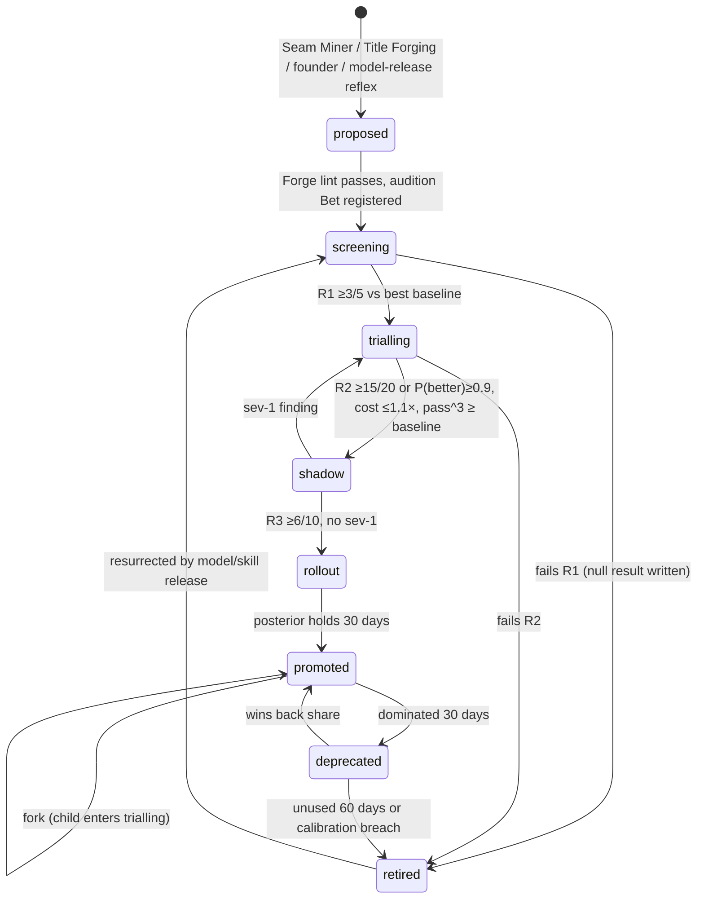
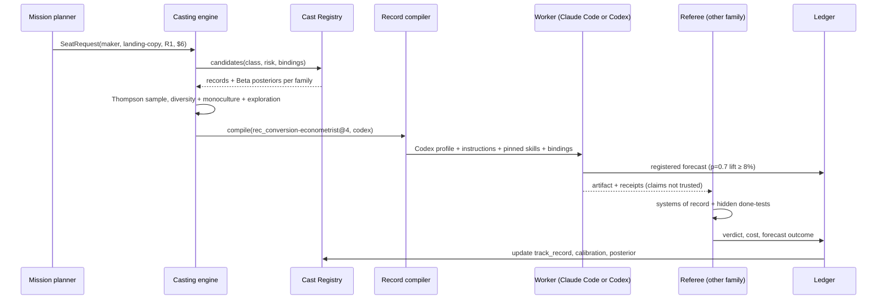
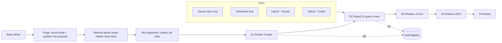

# S06 — Agent identity records and hybrid specialties

*Round 2 seat: hybrid-specialty designer. 2026-09-30. Designs inside R1-SYNTHESIS (four separated authorities, cast
registry as a persistent record, Referee from the other family, one ledger). Extends ENGINE-SPEC §4.1–4.2.*

---

## 1. Summary

1. An agent is a **record, not a process**: title + expertise fusion + knowledge bindings + pinned skills + memory scopes +
   tools + per-family model preference + sandbox + risk ceiling + track record + calibration + lineage. Launch compiles it
   into a Claude Code agent definition or a Codex profile; dissolution writes back to it.
2. Every hybrid must declare a **Fusion Thesis**: the named seam between classic roles it removes (the handoff it kills)
   and the corpora it binds that no human could hold at once. No seam, no hybrid.
3. **Knowledge bindings** are the AI-native part: a hybrid fuses fields *and* the venture's own data (transcripts, tickets,
   Stripe history, repos). Bindings make hybrids venture-local by default; forks carry them, portfolio lessons do not.
4. **The Generalist Null**: every hybrid must beat not only the classic split crew but a generic engine with all the relevant
   lenses loaded. Otherwise the title is decoration.
5. **Audition Ladder** replaces a bare 3-of-5: Screen (3 of 5, a cheap filter) → Paired Trial (≥15 of 20 paired wins or
   posterior ≥0.9, cost non-inferior) → Shadow (10 live missions) → Bounded Rollout (≤25% casting share) → Promoted.
6. Arms always include **hybrid-on-Claude and hybrid-on-Codex** as separate cells; the Referee is the other family from the
   maker, plus deterministic done-tests and systems of record.
7. **Seam Miner** proposes hybrids from observed handoff failures in mission journals; founder and Co-founder may also forge.
8. **Casting** is Thompson sampling over a Beta posterior per record × task class × family, under a diversity constraint and
   a monoculture cap (no record >40% of one task class portfolio-wide).
9. Lifecycle: proposed → screening → trialling → shadow → rollout → promoted → (forked | deprecated | retired). Retirement
   writes a null result to the Null Registry; nothing is silently deleted.
10. Eighteen hybrids are specified below, each with a falsifiable experiment.

---

## 2. The design

### 2.1 Identity Record v2 (extends ENGINE-SPEC §4.1)

What changes from the ENGINE-SPEC record: expertise becomes a weighted **fusion** with a thesis; **knowledge bindings**
are separate from memory scopes (a binding is a corpus the agent is expected to *reason over*, not a place it may read);
calibration is a first-class trait; the record carries its **done-tests** and **retire triggers**; status is explicit.

```yaml
id: rec_conversion-econometrist@4
title: Conversion Econometrist                 # what the founder sees; never a personal name
kind: hybrid                                   # classic | hybrid | composite
status: promoted                               # proposed|screening|trialling|shadow|rollout|promoted|deprecated|retired
fusion:
  fields:                                      # weights steer the compiled prompt's emphasis and skill budget
    - {field: conversion-copywriting, weight: 0.35}
    - {field: bayesian-ab-statistics, weight: 0.25}
    - {field: behavioural-economics, weight: 0.20}
    - {field: customer-voice-mining, weight: 0.20}
  thesis: >
    Kills the copywriter→analyst→researcher handoff: copy is written already sized for detectable lift,
    phrased in customers' own words, with the bias it exploits named and the ethics check done.
  seam_killed: [copywriter/analyst, analyst/researcher]
knowledge_bindings:                            # corpora it reasons over; read-use tracked (memory seat)
  - {corpus: venture:customer-transcripts, mode: retrieve, min_citations_per_artifact: 3}
  - {corpus: venture:ab-history, mode: full-scan}
  - {corpus: portfolio:priors/conversion, mode: retrieve}
lenses: [growth, customer, evidence]
skills: [{id: ab-power-calc, version: 2.1.0, sha256: "…"}, {id: jtbd-coding, version: 1.3.0, sha256: "…"}]
memory_scope: {read: [venture:brain, venture:customers], write: [mission:blackboard]}
tools: {builtin: [Read, Grep, Glob, Write, Bash], mcp: [mission, posthog-readonly, stripe-readonly]}
model:
  claude: claude-opus-5
  codex: gpt-6-astra
  prefer: evidence                             # evidence | claude | codex — evidence = casting posterior decides
sandbox: P1
risk_ceiling: R1
limits: {max_turns: 40, wall_clock_min: 45, budget_usd_equiv: 6}
done_tests:                                    # what the Referee checks; the worker cannot see hidden ones
  visible: [power-calc-present, >=3 transcript citations per claim]
  hidden_ref: hidden/conv-econ@4               # held by the Referee, rotated monthly
track_record:
  by_task_class:
    landing-copy: {n: 31, done: 0.84, founder_edit: 0.09, cost_per_done: 2.1,
                   by_family: {claude: {n: 17, done: 0.88}, codex: {n: 14, done: 0.79}}}
calibration:                                   # proper scoring on its own registered forecasts
  brier: 0.17
  overconfidence: +0.06                        # mean(stated p) − hit rate
  n_forecasts: 58
lineage: {derived_from: [rec_copywriter@6, rec_growth-eng@3], experiment: exp_031, forks: [rec_conversion-econometrist@4+vx-b2b]}
retire_triggers: {dominated_days: 30, unused_days: 60, calibration_brier_above: 0.28, pass3_below: 0.5}
fingerprint: {constraints: [no-dark-patterns, disclose-ai-in-outbound]}   # C2 Fingerprint gate: preserved across versions
```

**Kinds.** *Classic* (one field, e.g. Engineer — the founder: "an engineer is a good enough title"); *hybrid* (fused
fields, one session); *composite* (a record that compiles to a fixed cross-family pair — e.g. a Claude maker and a Codex
critic sharing one fusion thesis; auditioned as a unit).

**Trigger:** created by the Forge (§2.3); versioned on any change to fusion, bindings, skills or model; every version change
re-enters the ladder at the rung its diff demands (§2.6).

### 2.2 Seam Miner — where hybrids come from

A scheduled scan (weekly, and on every mission dissolve) over mission journals and blackboards. It counts **handoff
failures**: a finding posted by seat A that seat B misread, re-asked, or ignored; a rework loop crossing two titles; a
Referee rejection whose cause spans two lenses; founder edits that correct one role's output with another role's knowledge.

```ts
type SeamCandidate = {
  seam: [title: string, title: string];      // e.g. ["Copywriter", "Data Analyst"]
  task_class: string;                         // e.g. "landing-copy"
  incidents: { mission_id: string; kind: "misread"|"reask"|"rework"|"xlens-reject"|"founder-xfix"; cost_usd: number }[];
  handoff_tax_usd_30d: number;                // summed cost of those incidents
  proposed_fusion: { field: string; weight: number }[];
  proposed_bindings: string[];
};
```

**Trigger to forge:** handoff tax over 30 days ≥ 3× the expected audition cost for that class, or ≥5 incidents. Other
sources: the Co-founder's Title Forging at hire time (C2), the founder by voice ("I want someone who is half lawyer, half
growth hacker"), and the **model-release reflex** (§2.8), which asks what fusion a new capability makes affordable.

### 2.3 Forge — writing a candidate record

A Forge mission (≤20 min, ≤$3) drafts the record: fusion thesis, bindings, a skill set (drawn from the skills economy; may
request a new skill), and **its own audition set proposal**. The audition set is then *finished by someone else*: the
Referee family builds the hidden done-tests, so a record never writes the exam it sits. Lint rules: title must be
derivable from the fields (no "Growth Ninja"); thesis must name a seam; every binding must exist and be within the
venture's data boundary; no personal names; `model` declares both families.

### 2.4 Audition Ladder — proving it

C2 proposed "win 3 of 5 bake-offs". Under a null of no difference, P(≥3 of 5) = 0.50 — a coin flip. That is fine as a
cheap *screen* and wrong as a *promotion* bar. The ladder:

| Rung | What | Sample | Pass bar | Typical cost |
|---|---|---|---|---|
| R1 Screen | Replayed tasks from the class, all arms | 5 tasks × arms | Hybrid wins ≥3 of 5 vs best baseline, no arm catastrophe | $15–40 |
| R2 Paired Trial | Paired, blind, budget-matched, in the twin (simulation seat) | ≥20 tasks (40 for noisy classes) | ≥15 of 20 paired wins (one-sided sign test p≈0.021) **or** Bayesian P(better) ≥0.9; cost per done ≤ 1.10× baseline; pass^3 ≥ baseline | $80–250 |
| R3 Shadow | Runs beside the cast team on live missions; output not shipped | 10 live missions | Referee prefers shadow ≥6 of 10; no severity-1 finding | ≈1.3× those missions' cost |
| R4 Rollout | Real casting at ≤25% share of the class | 30 days | Posterior stays ahead; founder edit rate not worse | normal |
| Promoted | Casting posterior decides share freely (under monoculture cap) | — | — | — |

**Arms (always):** (A) classic split crew with real handoffs; (B) **Generalist Null** — one generic maker with every lens the
hybrid claims loaded; (C) hybrid on Claude; (D) hybrid on Codex; (E, for composite records) hybrid maker + other-family
critic. Arms are budget-matched in dollar-equivalents, not turns. C vs D is always reported: it is the organisation's
running Claude-vs-Codex evidence per task class, and it sets `model.prefer`.

**Judging.** Order of authority: (1) systems of record (Stripe, CI, analytics, twin outcome); (2) hidden deterministic
done-tests; (3) a two-judge panel, one per family, blind to arm, disagreement → third judge; (4) founder labels only for
taste classes, rationed through the Founder Attention Exchange. **pass^3** (all three repeat runs succeed; τ-bench's
reliability metric, R0-E) is reported beside mean done-rate because a hybrid that is brilliant once and wrong twice is
worse than a steady classic.

**Registration.** An audition that can promote a record is a **Bet** (synthesis §3): preregistered success and kill
criteria, kill date. Results enter the Priors Library; losses enter the Null Registry.

### 2.5 Promotion, fork, retire

- **Promote** at R4 exit. Emits a Dailies item: one line, the effect size, the Claude/Codex split.
- **Fork** when (a) a venture's bindings make it diverge (`@4+vx-b2b`), (b) one family wins a task class and the other wins
  another — fork into family-specialised variants rather than averaging, (c) a sub-class emerges where the parent is
  dominated. Forks inherit the parent's posterior discounted to effective n=5 (a prior, not a verdict) and must clear R2.
- **Deprecate** when dominated for 30 days on its main class; still castable for exploration share.
- **Retire** on any retire trigger. Exit record: what it was for, where it lost, to whom. Written to the Null Registry
  ("Hybrid X did not beat Generalist Null on class Y, n=20, Δ=−3%") so no one re-forges it blindly. The record file stays
  in git; casting ignores it.
- **Resurrect**: a model release or a new skill can re-open a retired record at R1.

### 2.6 Re-audition on diff

| Record diff | Re-enters at |
|---|---|
| Model version bump (either family) | R1 on both families, then R2 if R1 moves by >10% |
| Skill major version | R2 |
| Fusion weights / thesis change | R2 |
| New knowledge binding | R3 (shadow) — bindings change behaviour on live data |
| Prompt wording only | R1 |
| Constraint (fingerprint) change | Founder gate, then R2 |

### 2.7 Cast Registry and Casting

The **Cast Registry** is a git-versioned store (`registry/records/*.yaml`, `registry/auditions/*.jsonl`) plus a derived
index (Postgres view) keyed by task class. It is one of the synthesis's persistent records, alongside Minds, backlot, ledger
and world model.

**Casting** fills seats requested by the mission planner:

```ts
type SeatRequest = {
  mission_id: string; seat: "lead"|"maker"|"critic"|"scout"|"judge"|"imagine";
  task_class: string; risk_class: "R0"|"R1"|"R2"|"R3";
  budget_usd: number; must_family?: "claude"|"codex"; exclude_family?: "claude"|"codex";
  bindings_needed: string[];
};
type CastDecision = {
  record: string; family: "claude"|"codex"; reason: "exploit"|"explore"|"audition"|"diversity"|"degraded";
  posterior: { mean: number; n: number }; alternatives: { record: string; mean: number }[];  // for "why did it do that"
};
```

Algorithm: (1) filter by task class, risk ceiling ≥ seat risk, bindings available, sandbox allowed by the Charter;
(2) Thompson-sample each record × family from Beta(done+1, fail+1) weighted by cost-per-done; (3) apply constraints —
critic/judge family ≠ maker family; monoculture cap (≤40% of a task class across the portfolio, synthesis §4.8 correlated
failure); exploration floor (≥10% of seats go to records with n<10); (4) under a tight budget or provider limit, fall to
the record's **understudy** (§6) and log `degraded`. Casting never picks a record the founder has vetoed for that venture.

### 2.8 Model-release reflex (synthesis §5)

On a new model from either family: re-run R1 for every promoted record on both families overnight in the twin; then ask a
Forge mission "what fusion is now affordable that was not?" (e.g. longer context lets a hybrid bind a whole repo history).
Budget: capped share of the investment lane (open decision 3).

---

## 3. Diagrams

### 3.1 Record lifecycle



### 3.2 Casting and write-back within a mission



### 3.3 Audition flow



---

## 4. The hybrids (18)

Common protocol unless stated: arms A–D from §2.4; paired, budget-matched; judged by systems of record, hidden done-tests,
and a two-family blind panel; R2 sample shown. "Replaces/augments" names the classic seats the hybrid displaces in a cast.
Speculation: all effect expectations are hypotheses to be tested, not claims.

| # | Title | Knows (fusion + bindings) | For | Replaces / augments | Experiment (task · metric · n) |
|---|---|---|---|---|---|
| 1 | **Conversion Econometrist** | Growth copywriting × Bayesian A/B stats × behavioural economics × the venture's customer transcripts and A/B history | Copy that is already sized for detectable lift and phrased in customer words | Copywriter + CRO analyst + UX researcher | **Retro-prediction:** given 24 past A/B tests (outcome hidden) pick the winner and forecast lift; **live:** 6 new tests. Metric: winner accuracy, Brier on lift, live lift. n=24 retro + 6 live. Pass: accuracy ≥ baseline+15pts. |
| 2 | **Churn Forensic Accountant** | Revenue accounting × support-ticket semantics × product telemetry × survival analysis; binds Stripe + tickets + events | Explain every churned dollar and price the save | Finance analyst + CS lead + data analyst | 30 churned accounts from history; referee-labelled root cause (labelled beforehand by founder sample of 10 + CS notes). Metric: cause agreement, $ recoverable forecast vs 60-day win-back actual. n=30. |
| 3 | **Regulatory Growth Copywriter** | Advertising and privacy law corpora (FTC endorsement guides, CAN-SPAM, GDPR/ePrivacy consent rules) × persuasive copy × consent-flow front-end code | Outbound copy and consent UX that converts and survives review | Copywriter + counsel review + frontend dev | 20 campaigns seeded with 3 planted violations each. Metric: violations caught (recall) and conversion proxy (panel preference) — must hold both. n=20. Counsel remains a human gate for one-way doors. |
| 4 | **Pricing Psychologist-Engineer** | WTP methods (Van Westendorp, Gabor–Granger, conjoint) × anchoring/decoy effects × billing code (Stripe/Paddle) × unit economics | Design, ship and instrument a price change end to end | Pricing consultant + billing engineer + finance | 20 twin pricing scenarios with simulated buyer populations grounded in transcripts; metric: simulated revenue per visitor vs twin optimum, plus billing-code done-tests. n=20; then 2 live changes as R3. |
| 5 | **Reliability Experience Designer** | SRE incident response × UX writing × customer comms × status-page + support history | Fix the incident and the customer's experience of it in one loop | SRE + support lead + comms | 20 twin fire drills (3 a.m. class). Metric: time to mitigation, customer-comms quality (blind panel), follow-up ticket volume in sim. n=20. |
| 6 | **Customer Evidence Compiler** | Qualitative coding (grounded theory) × JTBD × acceptance-test writing (Gherkin) × codebase map; binds interviews | Turn raw interviews into specs whose tests quote customers | UX researcher + PM + QA | 20 interview bundles → spec + tests. Metric: share of acceptance tests traceable to an utterance, founder edit distance, downstream rework in 30 days. n=20. |
| 7 | **Competitive Cartographer** | Competitive intel × changelog/pricing-page diffs × game theory × hiring-signal reading | Forecast competitor moves and pre-position | Competitive analyst + strategy consultant | 40 dated, preregistered forecasts about named competitors, resolved at 90 days. Metric: Brier vs Generalist Null and classic. n=40 per arm (C and D forecast independently). |
| 8 | **Activation Behaviour Engineer** | Activation analytics × habit-formation models × onboarding front-end code × lifecycle email | Ship onboarding changes that move day-7 activation | Growth PM + lifecycle marketer + frontend dev | 20 replayed onboarding tickets in twin (synthetic users from event logs) + 3 live flags. Metric: sim activation delta, done-tests, live day-7 delta. n=20+3. |
| 9 | **Threat-Cost Modeler** | AppSec × actuarial loss modelling × the venture's own attack surface and data map | Rank security work by expected loss, not severity labels | Security engineer + risk/insurance analyst | 20 twin codebases with seeded vulns of known exploitability and blast radius. Metric: expected-loss-weighted recall at fixed effort budget. n=20. |
| 10 | **Metric Semantics Ethnographer** | SQL/dbt × how each document, meeting and dashboard *uses* a metric × governance | Find and fix silent metric-definition drift | Analytics engineer + BI analyst | Seeded warehouse + doc corpus with 15 planted definition conflicts; 20 tasks. Metric: conflicts found, fixes that pass reconciliation tests. n=20. |
| 11 | **Deal Conversation Strategist** | Negotiation theory × the venture's CRM history × objection corpus × pricing authority limits | Run sales threads to close within policy | SDR + sales engineer + deal desk | 30 twin negotiations against buyer agents grounded in real transcripts (counterparty seat). Metric: simulated close rate × margin kept, policy violations = 0. n=30; live reply-rate R3. |
| 12 | **Procurement Bid Tactician** | Public procurement rules × proposal writing × budget justification × evaluator scoring rubrics | Win tenders and grants for agency ventures | Bid writer + finance + compliance | 20 past public tenders with published scoring; blind scoring by panel using the tender's rubric. Metric: rubric score, compliance defects. n=20. |
| 13 | **Codebase Archaeologist-Migrator** | Full git history of the founder's repos × dependency graphs × migration tooling × test synthesis | Import and modernise the ~19 existing repos | Staff engineer + tech writer + test engineer | 20 migration tasks across the repos. Metric: PR merged by Referee without revert in 14 days, tests added that fail on the pre-migration code. n=20. |
| 14 | **Field Compressor** | Learning science (retrieval practice, spacing) × literature mapping × a model of what the founder already knows (circled takes, notes) | "Learn a new field fast" for the founder | Tutor + research analyst | 6 fields × 2 arms, crossover on the founder is costly, so use 12 proxy learners (simulated from founder notes) + 2 real founder fields. Metric: 7-day retrieval quiz by other-family examiner. n=12+2. |
| 15 | **Ad Auction Creative Scientist** | Visual design × ad-auction mechanics × bandit allocation × brand kit | Creative and budget allocation that lowers CPA | Media buyer + designer + analyst | 4 live campaigns, capped spend, arms as ad-set splits (traffic layer from C4) + 20 replayed creatives against historical CTR. Metric: CPA, historical CTR rank correlation. n=20+4. |
| 16 | **Support Economist** | Support resolution × refund policy × LTV modelling × tone | Resolve tickets while pricing each concession | Support agent + finance approver | 60 replayed tickets. Metric: panel-rated resolution, $ conceded vs policy-optimal, escalation precision. n=60. |
| 17 | **Evidence Auditor** | Epistemics × statistics × source verification × the Priors Library | Find missing or weak evidence before a Bet is scaled | Augments the Referee; replaces ad-hoc reviewer lens | 30 claim packets with seeded flaws (p-hacking, survivorship, dead sources). Metric: flaw recall, false-alarm rate. n=30. |
| 18 | **Taste Cartographer** | The founder's circled-take history × design critique × brand strategy | Predict what the founder would circle; pre-sort dailies | Augments designer + creative director; cuts founder minutes | Held-out 100 dailies items. Metric: AUC predicting circled takes; live: founder minutes per decision. n=100. Must never replace the founder's circle — it orders the reel. |
| 19 | **Infra Cost Engineer** | Cloud and API pricing × profiling × code × the ledger's spend history | Cut spend per outcome without latency regressions | FinOps + backend engineer | 20 cost tickets on twin services with load tests. Metric: $ saved at p95 latency ≤ baseline. n=20. |

**Why these are AI-native.** Each fuses 3–4 fields and a live venture corpus. A human with all of them is rare and cannot
re-read 400 transcripts before each draft; a session can. The claim to test is not "fusion is smarter" but "removing the
handoff removes its loss" — which is exactly what the Generalist Null and the classic split crew separate.

**Claude vs Codex on every row.** C and D run as independent cells. Hypotheses only (speculation, to be falsified): code-
heavy fusions (4, 8, 13, 19) may favour one family, corpus-reasoning fusions (1, 2, 6, 7) the other. The registry learns
this per class and sets `model.prefer: evidence`; it never hard-codes it.

---

## 5. Interfaces

| Part | Needs from it | Gives to it |
|---|---|---|
| Mission engine | `SeatRequest` per seat; task class taxonomy; mission shape | `CastDecision` with alternatives (for explainability) |
| Allocator | Audition budget from the investment lane (Org Science tranche) | Audition Bets with VoI estimates |
| Referee / Acceptance | Hidden done-tests authored by other family; verdicts | Record's visible done-tests; cross-family constraint |
| Memory seat | Read-use tracking per binding; decay | Bindings list; citations per artifact; unused bindings flagged for removal |
| Skills economy | Pinned versions; release events | Skill demand from Forge; per-skill attribution in audition results |
| Simulation / twin | Replay sets, synthetic populations, buyer agents, fire drills | Task sets and arms to run |
| Ledger / economics | Cost per done per family; provider limits | Calibration per record; understudy use in degraded mode |
| Autonomy | Risk classes; Charter sandboxes and data boundary | `risk_ceiling` per record; vetoes respected |
| Surfaces | Cast page in Mission Control | Registry view: status, posteriors, Claude vs Codex split, lineage tree, retire queue |
| Engineering | Record compiler (Claude agent def / Codex profile) | Record schema and lint rules |
| Venture Mind / Co-founder | Title Forging requests | Promotions and retirements as dailies items |
| Human task market | — | Human collaborators get identity records on the same schema (kind: human), same track record |

---

## 6. Worked examples

### 6.1 Casting a pricing change for an autonomous SaaS venture

Tuesday 09:10. The Allocator funds Bet "annual plan with 2-month discount lifts cash collected ≥12% in 30 days"
($40 cap, door type two-way). The planner requests: lead, maker (pricing, R2 because billing code), critic, judge.

- **Casting:** maker → Pricing Psychologist-Engineer@2 on **Codex** (posterior 0.78, n=14 vs Claude 0.71, n=11;
  Thompson draw favoured Codex). Critic → Conversion Econometrist@4 on **Claude** (the other family, which is
  required; it holds the transcript binding the pricing copy must cite). Judge → Referee on Claude, reading Stripe. Lead → classic Lead.
- **Time/cost:** 09:10–10:05 maker builds Paddle/Stripe plan + checkout copy + experiment flag ($4.60); critic finds a decoy
  plan that violates the Fingerprint constraint "no dark patterns" ($1.20); maker revises ($1.10).
- **Approvals:** none at build (two-way). The price going live crosses "customer-visible price" → Founder Attention Exchange
  item, 1 minute, silence-proceeds after 4 h per Charter.
- **Memory writes:** blackboard posts; registered forecast p=0.64 on ≥12%; at day 30 the Referee reads Stripe (+9%, miss).
  Ledger updates: maker's calibration (Brier contribution 0.41), done=true (built correctly) but forecast missed.
  Priors Library: "annual discount 2-mo: +9% cash, n=1 venture". Record track records +1.

### 6.2 A new hybrid is born overnight

Seam Miner (Sunday scan) finds 7 incidents over 30 days in venture "Agency-A": Growth PM specs onboarding changes, Frontend
Engineer implements, Lifecycle Marketer's emails contradict the new flow; handoff tax $86 vs expected audition cost $180 →
below the 3× bar, but 7 ≥ 5 incidents → forge.

- **Forge** (Claude, 14 min, $2.40) drafts Activation Behaviour Engineer@1, bindings: event logs, email templates, onboarding
  code. Hidden done-tests authored by a Codex judge seat ($1.80).
- **R1** Monday 01:00–01:40 in twin: 5 tasks × 4 arms, $31. Hybrid wins 4/5 vs best baseline (Generalist Null).
- **R2** 02:00–05:30: 20 paired tasks, $190. Hybrid-Codex 15/20 vs Null, hybrid-Claude 13/20. Result: Codex variant passes,
  Claude variant **forks** as `@1+claude` and stays in trialling with 20 more tasks queued.
- **Founder sees**, in Monday's dailies: "New title: Activation Behaviour Engineer (Codex) cleared paired trial 15/20 vs
  generalist, cost 0.94×. Shadowing on the next 10 onboarding missions." Zero decisions asked. He can veto in one tap.

### 6.3 Model release

A new Claude model ships. Reflex: 14 promoted records × R1 on the new model overnight ($410 capped). Three records improve
>10% on Claude and re-enter R2; one (Metric Semantics Ethnographer) flips `model.prefer` from Codex to Claude after R2.
A Forge asks what new fusion is affordable; it proposes a composite "Codebase Archaeologist + Evidence Auditor" that binds
all 19 repos' histories at once — enters R1.

---

## 7. Ideas the founder did not ask for

1. **The Generalist Null** as a mandatory arm. The honest competitor to a hybrid is not a human job title; it is a generic
   engine with the same lenses. If the hybrid cannot beat it, the fusion is decoration and is retired.
2. **Seam Miner** — hybrids grown from measured handoff tax, not invented by taste. The org designs its roles from its own
   failures.
3. **Understudies.** Every promoted record gets a cheap understudy (Haiku-class or smaller Codex), distilled from its passing
   traces and auditioned on the same set. Degraded mode (limits hit) casts understudies with a known, measured quality gap
   instead of silently degrading the champion.
4. **Record crossover.** Two promoted records whose seams are adjacent can be bred: fields unioned, weights averaged, and the
   child auditioned. Lineage trees in the Cast page show which fusions keep winning.
5. **Calibration as a casting gate.** An overconfident record (overconfidence > +0.10) is cast only with a mandatory critic;
   a well-calibrated one earns lighter review. Review capacity — the real limit on fan-out (synthesis §4.7) — is spent where
   the records are least honest about themselves.
6. **Humans on the same registry.** Contractors and advisors get records (kind: human) with track record and calibration on the
   same ledger, so the casting engine can compare "hire a human for this" against a hybrid on equal terms.
7. **External Agent Cards from records.** A venture's counterparty-facing agent (A2A edge) publishes a signed card generated
   from its record — title, scope, risk ceiling — so outside agents know exactly what it may commit to.
8. **Null Registry for roles.** Retired hybrids leave a searchable "this fusion did not work for this class" entry. Most orgs
   forget failed reorganisations; this one cannot.
9. **Title honesty lint.** The title shown to the founder is generated from the fusion fields and checked by the linter, so
   titles cannot drift into marketing.

---

## 8. Risks (each with a design answer)

| Risk | Design answer |
|---|---|
| Overfitting to replay sets | Hidden holdout rotated monthly; 20% of R2 tasks are fresh from the last 14 days; shadow rung on live work |
| Workers hacking evaluators (R0-A: METR, DGM) | Records never author their own tests; hidden done-tests held by other family; no-edit-own-tests hooks; systems of record outrank judges |
| Registry sprawl | Proposals capped by audition budget, not by count; 60-day unused retirement; Seam Miner's 3× handoff-tax bar |
| Monoculture / correlated failure | ≤40% share per record per class portfolio-wide; ≥10% exploration; both families kept warm per class |
| Venture data leaking via bindings | Bindings are venture-scoped; forks carry them, portfolio records bind only abstracted priors; compiler refuses cross-venture bindings |
| Small-n false promotions | Ladder with sign-test/posterior bar; Bet preregistration; forks start with discounted prior |
| Judge family bias in Claude-vs-Codex cells | Two-family blind panel + deterministic tests; report both families' judge scores separately |
| Taste Cartographer replacing founder taste | It orders the reel, never circles; its AUC is shown to the founder weekly; drift alarm if founder overrides >30% |
| Title theatre (roles that sound smart) | Generalist Null + title honesty lint + fusion thesis must name a measurable seam |

---

## 9. Challenge to the synthesis

Upward, not smaller:
1. **Replace "3 of 5 bake-offs" as a promotion bar.** Under the null it passes half of useless hybrids. Keep it as rung R1
   of a four-rung ladder; promotion needs a paired trial with a stated statistical bar plus shadow and rollout.
2. **Make the cast registry a Learning-layer store, peer of the Priors Library.** The synthesis lists it among persistent
   records; it should also be where Claude-vs-Codex evidence per task class lives, so family routing is learned, not argued.
3. **Add composite records.** A cross-family pair with one fusion thesis is a unit of expertise that neither single record
   nor ad-hoc team captures; audition it as one.

---

## 10. Open decisions

1. **Promotion statistic at R2** — sign test (≥15/20) or Bayesian P(better) ≥0.9. *Recommendation:* Bayesian as the gate
   (handles unequal n and continuous metrics), sign test reported alongside for readability.
2. **May knowledge bindings include the founder's personal email and calendar?** *Recommendation:* no by default; only the
   Taste Cartographer and Co-founder seat, founder opt-in per venture, read-only, read-use tracked.
3. **Audition budget share.** *Recommendation:* 6% of investment-lane capacity as a floor, rising to 12% in the week after a
   model release; unspent audition budget does not roll into missions.
