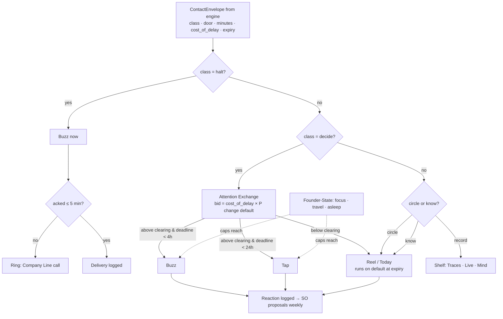
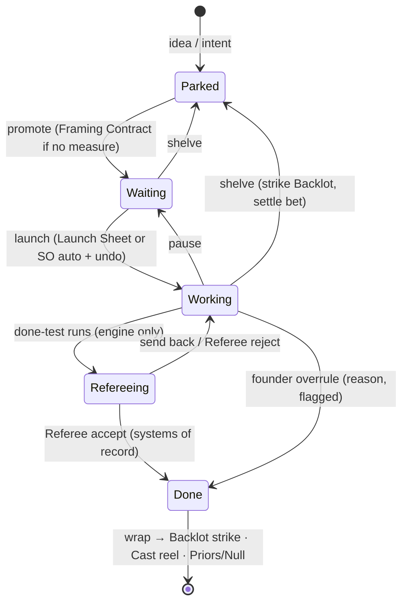
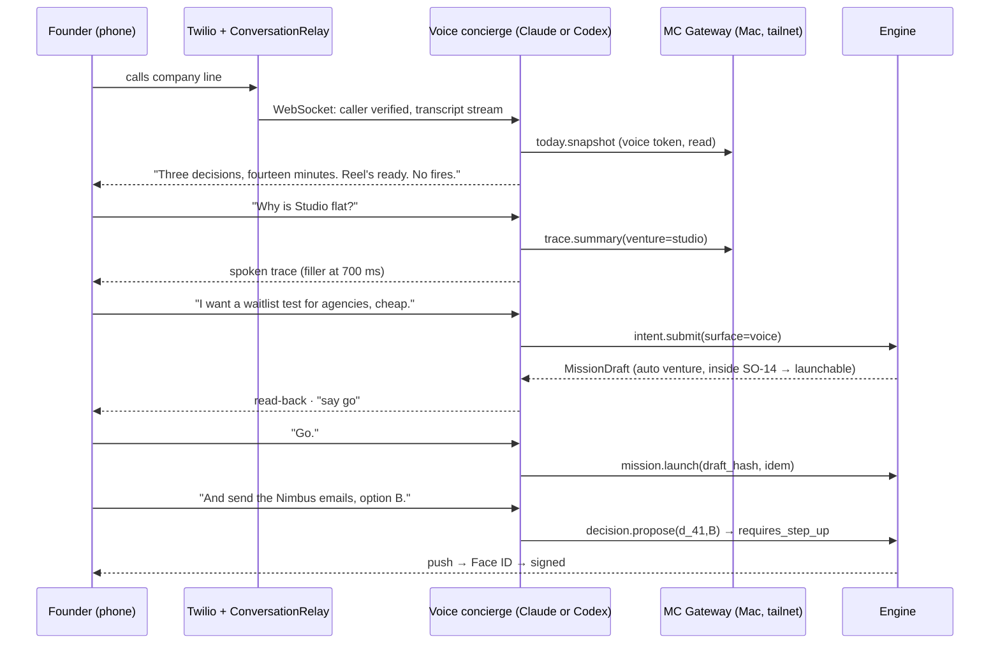

# S07 — Surfaces and voice: Mission Control page by page, every reach point, and the contact grammar

*Round 2 seat: Surfaces and Voice Designer · 2026-09-30 · designs inside R1-SYNTHESIS (four authorities, two lanes,
Referee, Founder Attention Exchange, Dailies Reel). Starts from `engineering/SURFACES-SPEC.md` (keeps its one-authority /
many-projections architecture, SSE + command API, passkey step-up, view-server invariants) and from today's
`mission-control/` (Fleet, Sessions, Inbox, Dispatch, Belief, Conflicts views; read-only server on :4300; trust list).*

---

## 1. Summary — the design in ten lines

1. **One app, one event log, many projections.** Mission Control (desktop Tauri + phone PWA) is the owned centre; terminal,
   chat, voice, push, email, calendar and three new surfaces are *projections plus command clients* — none holds state.
2. **Sixteen pages in four groups** — NOW (Today, Decisions, Dailies, Live, Updates), WORK (Missions, Tasks, Calendar,
   Ideas), COMPANY (Ventures, Venture Mind, Cast, Skills), TRUTH (Traces, Spend), plus Settings/Autonomy.
3. **The board launches teams.** Dragging Waiting → Working issues `mission.launch`; the composer's cast (titles, Claude/Codex
   mix, opposite-family Referee, shape, lane, bet-if-needed) is shown on a one-screen Launch Sheet — skipped inside an
   autonomous venture's Standing Orders, with a 10-second undo.
4. **Done is the Referee's column, not the founder's.** Nothing reaches Done on a worker's claim; a founder drag to Done is
   recorded as an **overrule** with a reason, never as acceptance.
5. **Contact grammar reconciles ENGINE-SPEC and SURFACES-SPEC** by splitting what they conflated: *what the founder is asked
   to do* (class — autonomy seat owns) from *how hard the surface reaches* (reach — this seat owns). Five classes
   (**Halt · Decide · Circle · Know · Record**) × five reaches (**Ring · Buzz · Tap · Reel · Shelf**).
6. **One currency for attention: minutes, not counts.** ENGINE's "≤10 asks/day" and SURFACES' "3 nudges/day" become one
   daily **minute supply** that the Founder Attention Exchange clears; Halt is never budgeted.
7. **Taste is its own channel.** Circled takes on the Dailies Reel are cheap (≈2 s each), never block work, and feed Cast,
   Standing Orders and the Venture Mind — the highest-leverage founder signal per second in the system.
8. **Voice is a company line:** Twilio number + **ConversationRelay** (~$0.08/min all-in, R0-C) with *our* brain (Claude or
   Codex behind the same tool relay), OpenAI Realtime over SIP kept as a latency fallback. Voice proposes; a passkey disposes.
9. **Every surface answers "why".** Any number, card or sentence on any surface opens its causal trace (Traces page) and
   can be replayed or re-run in the simulation twin.
10. **Three new surfaces:** the **Office Window** (ambient light + e-ink), the **Wrist Grammar** (haptic yes/no for two-way
    doors), and **Office Hours** (agents book founder time with a paid bid). Spatial Room and Founder-State sensing follow.

---

## 2. The design

### 2.1 Mechanism: the Contact Grammar (reconciliation of ENGINE-SPEC §5.4 and SURFACES-SPEC §3.3)

**The disagreement.** ENGINE-SPEC: four classes *interrupt / ask / tell / log*, "ask" = DecisionPacket, ≤10/day, expiry =
refuse. SURFACES-SPEC: four altitudes *Interrupt / Nudge / Brief / Record*, decisions orthogonal, budget 3 nudges/day. Both are
right about half: ENGINE classifies **the founder's obligation**, SURFACES classifies **delivery intrusiveness**. Mixing them
produced two budgets in different units and no home for taste.

**The reconciliation (surface side).** Two axes, two owners, one budget.

| Class (autonomy seat owns semantics) | What the founder is asked to do | Blocks work? | Budget |
|---|---|---|---|
| **Halt** | Nothing is required — the system has already stopped or is safe-stopping; he must *know now* | no (already stopped) | never budgeted |
| **Decide** | Choose among options on a DecisionPacket (incl. refuse/delay; no-answer default stated) | only the dependent step | minutes, via Exchange |
| **Circle** | Mark taste on raw takes; optional | never | ≈2 s per take, own small supply |
| **Know** | Read; may steer | never | folded into Reel/Today |
| **Record** | Nothing; pull only | never | none |

| Reach (surface seat owns) | Rendering | Allowed classes |
|---|---|---|
| **Ring** | outbound phone call (ConversationRelay) | Halt (unacked ≥5 min), Decide only if cost-of-delay > founder's ring price |
| **Buzz** | time-sensitive push, watch haptic 3-tap | Halt, Decide above clearing price |
| **Tap** | passive push / Telegram message / watch 1-tap | Decide below clearing price with deadline < 24 h |
| **Reel** | the next Dailies Reel / Today page / board pack | Decide (default-on-silence), Circle, Know |
| **Shelf** | Traces, Live, Venture Mind — pull only | Record, everything else also |

The engine emits `{class, door_type, cost_of_delay, expiry, venture, minutes_est}`; the **Reach Router** (surface-side,
deterministic, no model) picks the lowest reach that still meets the deadline given the founder's state and today's remaining
minutes. The autonomy seat can therefore change *classes* per venture without touching surfaces, and surfaces can add a new
reach (a wearable) without renegotiating classes.

```ts
// Engine → surfaces
type ContactEnvelope = {
  id: string; venture: string; class: 'halt'|'decide'|'circle'|'know'|'record';
  door: 'two_way'|'one_way_reversible_cost'|'one_way';   // from evidence ladder × door type
  minutes_est: number;            // founder minutes to handle well (packet author's estimate, calibrated)
  cost_of_delay_per_h: number;    // $ or capacity-equivalent, Allocator-computed
  expires_at?: string; on_silence: string;  // mandatory for decide
  subject_hash?: string;          // what a passkey would sign
  cause: { correlation_id: string; causation_id: string };
};
// Surface → founder (router output, logged so "why did my phone ring?" is answerable)
type Delivery = { envelope: string; reach: 'ring'|'buzz'|'tap'|'reel'|'shelf';
  channel: 'call'|'ntfy'|'watch'|'telegram'|'today'|'reel'|'email'; reason: string; at: string };
```

**Founder Attention Exchange, rendered.** Daily supply is set in Settings as *minutes by weekday* (default 45 min Mon–Fri,
10 min weekends). Each Decide packet bids `cost_of_delay × P(founder changes the default)` per minute. Packets above the
clearing price get Buzz/Tap; below it they ride the Reel with the default-on-silence. The Decisions page shows the clearing
price, so the founder *sees* the market and can raise supply for a day ("I have an hour") in one gesture.

**Learning without drift.** Every delivery logs the founder's reaction (opened / acted / changed-default / dismissed < 3 s).
A packet type whose default was accepted ≥ 8 of 10 times is proposed as a **Standing Order** in the weekly board pack —
proposed, never applied silently. This is the surface feeding C2's judgment compiler.

### 2.2 Mechanism: the Global Shell

```
┌───────────────────────────────────────────────────────────────────────────────────────────┐
│ ◆ MC  [Venture: All ▾]   ⌘K  I want…                ● 7 runs  ⚖ 3 · 14m  ◔ 52%  ✦ reel  ⏻ │
├────────────┬───────────────────────────────────────────────────────────────┬──────────────┤
│ NOW        │                                                               │ VENTURE MIND │
│  Today     │                                                               │ (rail, ≤3)   │
│  Decisions3│                     page content                              │ ⟂ I'd push   │
│  Dailies ✦ │                                                               │   back on …  │
│  Live     7│                                                               │ ◎ I noticed …│
│  Updates   │                                                               │ ✕ I'd stop … │
│ WORK       │                                                               │              │
│  Missions  │                                                               │ [Ask] [Hide] │
│  Tasks    2│                                                               │              │
│  Calendar  │                                                               │              │
│  Ideas   14│                                                               │              │
│ COMPANY    │                                                               │              │
│  Ventures  │                                                               │              │
│  Mind      │                                                               │              │
│  Cast      │                                                               │              │
│  Skills    │                                                               │              │
│ TRUTH      │                                                               │              │
│  Traces    │                                                               │              │
│  Spend     │                                                               │              │
│ ⚙ Settings │                                                               │              │
└────────────┴───────────────────────────────────────────────────────────────┴──────────────┘
 ⚖ 3 · 14m = three decisions costing ~14 of today's 45 founder-minutes   ✦ = reel ready   ⏻ = scoped stop
```

Rules carried from SURFACES-SPEC and today's MC: venture scope always visible; ⏻ reports *requested → acknowledged →
confirmed*; every figure says *measured* or *estimated + source*; no pixel-office theatre. New: **every element carries a
`⌥-click → Trace`** gesture, and the ⚖ counter is in *minutes*, not items.

### 2.3 The sixteen pages

Each page lists its job, wireframe, the commands it issues, and the events it reads. Routes are stable URLs; filters live in
the query string.

#### P1 · Today — the briefing (`/`)
Job: *what changed, what's owed, what needs me, what's unknown* — rendered from the record, every line linked.

```
┌ Today · Wed Oct 7 · since you looked (22:14 → 07:02) · minutes today 45 (used 0) ──────────┐
│ ⚖ DECIDE (3 · ~14 min · clearing price $6/min)        │ HALTS overnight: 0                  │
│  1 Nimbus  Outbound 12 intros  4m  exp 11:00 → NOT sent│ OBLIGATIONS LANE                    │
│  2 Ledger  Price A/B/C         6m  exp Fri  → stay A   │  2 customer promises due ≤48h ✓ on  │
│  3 Studio  Kill bet b_19?      4m  exp Sun  → kill     │  1 incident closed (03:10, auto)    │
├────────────────────────────────────────────────────────┼─────────────────────────────────────┤
│ ✦ DAILIES READY  11 takes · 6 min · [Play on phone]    │ BETS (investment lane)              │
│ ARE WE CLOSER?                                         │  b_12 Nimbus referral  ▲ 0.62→0.71  │
│  Nimbus  20 paying teams   11 → 12  ▲                   │  b_19 Studio waitlist  ▼ kill date 3d│
│  Studio  problem-validated flat 3 wk ⚠ sideways        │  b_21 Ledger pricing   ◷ collecting │
├────────────────────────────────────────────────────────┴─────────────────────────────────────┤
│ OMITTED & CONTESTED  • Referee (Codex) rejected #214 twice, builder (Claude) re-scoped ▸    │
│  • 2 sources unreachable → claims unresolved ▸ • Venture Mind dissent on Studio pricing ▸   │
│ SPEND  capacity ◔ 52% wk · API $4.10/$25 · cost per outcome ↓ 9% vs last week               │
└──────────────────────────────────────────────────────────────────────────────────────────────┘
```
Absence > 48 h switches to **Re-entry**: direction changes, promises, spend, decisions made on silence (with their
defaults), what reading does *not* re-authorise.

#### P2 · Decisions — the Founder Attention Exchange (`/decisions`)
```
┌ Decisions · supply today 45 min · bids 7 · clearing $6.0/min · [+15 min today] ────────────┐
│ ABOVE THE LINE (will reach you)                                      bid/min  min  expires │
│  Nimbus  Send 12 intro emails · one-way (reputation)                 $14.0    4   11:00   │
│  Ledger  Choose pricing A/B/C · one-way-ish                           $8.5    6   Fri     │
│  Studio  Kill bet b_19 at kill date · two-way                         $6.1    4   Sun     │
│ ─────────────── clearing line ─────────────────────────────────────────────────────────── │
│ BELOW (will run on default unless you open it)                                            │
│  Nimbus  Swap QA seat to Codex (3 losses in a row) → default: swap     $1.2    1   Thu     │
│  Keel    Archive 4 stale skills → default: archive                     $0.3    1   Mon     │
│ SHAPE OF YOUR DAY  ████████████░░░░░░░░ 14/45 min                                         │
└────────────────────────────────────────────────────────────────────────────────────────────┘
/decisions/:id — WHAT EXACTLY (artifact + sha) · WHY NOW · OPTIONS incl. refuse/delay · VENTURE MIND view
(never pre-selected; red-teamed by the other family first) · IF SILENT · EVIDENCE LEVEL vs DOOR · [A ⏎ Touch ID] [B] [C]
[Ask a question] [Why am I being asked?] → offers to draft a Standing Order that would have answered it.
```
Commands: `decision.dispose{packet, option, sig}`, `exchange.supply.adjust`, `standing_order.propose`.

#### P3 · Dailies — the reel with circled takes (`/dailies`)
Raw artifacts, never summaries (C5): screen recordings, rendered pages, diffs, customer replies, charts, audio clips.
```
┌ Dailies · Wed · 11 takes · 6m12s · [▶ Play all] · keyboard: ←/→ take · C circle · N note ─┐
│ ┌──────────────────────────────────────────────┐  TAKE 4/11 · Ledger · onboarding           │
│ │                                              │  variant B of 3 · made by Product engineer │
│ │        ▶ 0:21 screen recording               │  (Codex) · Referee: Claude ✓ a11y ✓       │
│ │        (signup → first invoice)              │  alternatives: A ▸  C ▸                    │
│ │                                              │  [◯ Circle]  [✕ Not this]  [✎ Note]        │
│ └──────────────────────────────────────────────┘  note → "fewer fields"  taken ✓           │
│ STRIP  ◯ ◯ ◉ ◉ ◯ ✕ ◯ ◯ ◯ ◯ ◯     circled 2 · rejected 1 · 8 unmarked (neutral, not approval) │
│ WHERE CIRCLES GO  Cast reel (+1 Product engineer/Codex) · Mind taste log · SO candidate ▸   │
└────────────────────────────────────────────────────────────────────────────────────────────┘
```
Rules: an unmarked take is *not* approval (no silent labels); notes are logged *taken / declined / why* by the mission lead;
the reel is cut per venture, never interleaved; ≤ 8 min, the cutter drops lowest-novelty takes first and lists what it
dropped.

#### P4 · Live — agents at work (`/live`, `/live/:run`)
```
┌ Live · 7 runs · 3 missions · [claude ▾ codex ▾] [lane: all ▾] ─────────────── ⏻ scope ───┐
│ MISSION Nimbus · "Team invites" · shape lead+workers · lane invest · bet b_12 · 1h12m     │
│ ┌ Engineer (product)   ┐ ┌ Engineer (API)    ┐ ┌ Referee · Codex (read-only)          ┐  │
│ │ claude-opus-5 · lease│ │ codex · lease     │ │ ◷ waiting: done-test frozen ✓         │  │
│ │ app/invites/** ▶ edit│ │ api/invites/** ▶  │ │ reads: CI, prod-staging DB, Stripe tst│  │
│ │ turn 14/30 · 22k tok │ │ bun test 7/9      │ │                                       │  │
│ │ [Steer][Pause][Stop] │ │ [Steer][Pause]    │ │ [Open]                                │  │
│ └──────────────────────┘ └───────────────────┘ └───────────────────────────────────────┘  │
│ MISSION Studio · "Why is signup flat?" · shape swarm ×4 researchers · blackboard 9 · ⚠2  │
│ MISSION Ops · incident i_33 · lane OBLIGATION · closed 03:21 · receipts 3 ▸              │
└────────────────────────────────────────────────────────────────────────────────────────────┘
```
Run detail keeps SURFACES-SPEC's three panes (timeline · focus · context) and adds **lease map**, **receipts list** (every
outside effect through the gateway) and **memory read/used** chips. Verbs: Steer (acknowledged by quote), Pause, Stop,
Fork variant (other family), Swap seat, Take over in terminal.

#### P5 · Traces — "why did it do that", replay (`/traces`, `/traces/:event`)
```
┌ Trace · "Nimbus sent 12 intro emails" · receipt rx_9f1 ────────────────── [Graph] List ──┐
│ ◀ CAUSES                                                                                   │
│  Oct 1  Venture Mind thesis T3 "design partners before SSO"  (founder circled, take 7)    │
│  Oct 6  Allocator funded bet b_12 · VoI 0.41 · forecast 3 replies ±2                       │
│  Oct 7 07:40  Composer cast: Growth writer (Claude) + Referee (Codex)  alt: pair ▸         │
│  Oct 7 08:05  Standards check: claims standard ✓ · 2 recipients flagged competitor ✗       │
│  Oct 7 09:02  Decision d_41 option B (send 10) · signed ⌂ Touch ID · looked-at 41 s        │
│  Oct 7 09:03  Effect gateway · idempotency k_77 · 10 sends · receipt rx_9f1                │
│ ▶ EFFECTS  3 replies (Stripe/CRM, read by Referee) · bet b_12 posterior 0.62 → 0.71       │
│ COUNTERFACTUALS  [Replay run ▶] [Re-run in twin with policy SO-14 ▸] [Diff vs today's SOs] │
└────────────────────────────────────────────────────────────────────────────────────────────┘
```
Replay scrubs tool calls with file state per step; **Re-run in twin** sends inputs to the simulation seat's sandbox with a
different cast/policy and shows outcome diffs. Every "why" answer on voice/chat is this page, spoken.

#### P6 · Updates — the change feed (`/updates`)
Job: *what happened*, at Know/Record class — the chronological, filterable projection (shipped, merged, published, learned,
retired, promoted). Distinct from Today (curated) and Traces (causal).
```
┌ Updates · [All ▾] [shipped ☑ decided ☑ learned ☑ retired ☑ auto ☑] · group: day ──────────┐
│ 09:03  Nimbus   ⇪ sent 10 intro emails (d_41, you)                          receipt ▸     │
│ 08:40  Keel     ⊕ skill "stripe-webhook-idempotency" v2 promoted (trial 9/10)  ▸          │
│ 03:21  Ops      ✓ incident i_33 closed · rollback set from Backlot · no founder contact ▸  │
│ 02:10  Studio   ✎ Null result recorded: "pricing page A/B no effect" → Null Registry ▸   │
│ 23:00  All      ⟲ wrap: 2 sets struck to Backlot · cast believability updated ×14          │
│ [Subscribe this filter → Telegram] [→ weekly email]                                       │
└────────────────────────────────────────────────────────────────────────────────────────────┘
```

#### P7 · Spend & usage (`/spend`)
Capacity (subscription windows) and money kept apart; the headline is **cost per settled outcome**, and a new column shows
**founder-minutes per outcome** — the "out-building thousands" measure lives here.
```
┌ Spend · 7 days · All ─────────────────────────────────────────────────────────────────────┐
│ CAPACITY  Claude ▓▓▓▓▓▓░░░ 58% 5-h window (est., ccusage) · Codex ▓▓▓░░ 31% · floor 25%    │
│ MONEY     API $41.20 · voice $2.88 (36 min × $0.08) · SaaS $0 · caps $25/day · treasury ↺ │
│ BY OUTCOME          settled  capacity  money  founder-min  per outcome                    │
│  Feature shipped        4      31%     $12      9          7.8% · $3.00 · 2.3 min         │
│  Interviews synthesised 9       6%      $0      4          0.7% · $0    · 0.4 min         │
│  Bet settled (any way)  3      11%      $6      12         3.7% · $2.00 · 4.0 min         │
│  No outcome ⚠           3       7%      $4      1          waste → post-mortem ▸           │
│ CORRELATED EXPOSURE  skill "zod-forms" v3 in 61% of runs · model opus-5 in 70% ⚠ budget ▸ │
│ DEGRADED MODE  off · at 85%: obligations lane only, reviews continue, heartbeats pause     │
└────────────────────────────────────────────────────────────────────────────────────────────┘
```

#### P8 · Tasks — what's owed (`/tasks`)
Missions are funded work *by agents*; Tasks is everything owed *by a human* — the founder's own to-dos, founder-only acts
(signatures, calls, bank), human-task-market jobs (contractors), and customer promises from the obligations lane.
```
┌ Tasks · owed by humans · [mine 2] [contractors 3] [promises 5] ───────────────────────────┐
│ MINE        ☐ Sign Delaware annual report (Keel legal) · 3 min · due Oct 12 · ⧉ DocuSign  │
│             ☐ 15-min call with Acme's CTO (they asked for a human) · Thu 14:00 ✆          │
│ CONTRACTORS ◐ Photographer · product shots · $180 · ledger ✓ · due Fri · portal ▸         │
│ PROMISES    ● Nimbus → Acme: SSO beta by Oct 20 (from sales call, receipt ▸) on track     │
│             ● Ledger → 9 interviewees: summary email by Oct 9 · mission m_88 working      │
│ Every task that an agent could do shows [Delegate → mission draft]                         │
└────────────────────────────────────────────────────────────────────────────────────────────┘
```

#### P9 · Ideas — the parking lot (`/ideas`)
SURFACES-SPEC's cards + map kept; added: **first look** is a cheap read-only run; ideas carry a **trigger** (C5 turnaround
list) that auto-revives them when a signal fires; 60-day fade proposes archive, never deletes silently.
```
┌ Ideas · 14 · sort: heat ▾ · [Cards] Map ──────────────────────────────────────────────────┐
│ "Invoice chaser for agencies"  from ✆ voice · 🔥3 · first look: overlaps Ledger 60%       │
│   worth it if: 5/10 agencies say yes · revive trigger: Ledger churn reason = "chasing" ◎   │
│   [Frame → bet]  [Merge into Ledger]  [Park with trigger]  [Kill → Null Registry]          │
│ "Sell MC as a product?"         from ⌘K · first look: 3 comparables, market $?  ▸         │
└────────────────────────────────────────────────────────────────────────────────────────────┘
```

#### P10 · Calendar — goals, missions, founder time (`/calendar`)
```
┌ Calendar · October · Week ▾ · layers ☑ goals ☑ bets ☑ missions ☑ founder ☑ office hours ─┐
│ GOAL ━━━━━━━━━━ Nimbus 20 paying teams by Oct 31 (12 ▲) ━━━━━━━━━━━━━━━━━━━━━━━━━━━━━━━ │
│ BET  ─ b_19 Studio waitlist ───────────✝ kill date Sun (auto-kill unless evidence ≥ E2)    │
│  Mon 5          Tue 6            Wed 7             Thu 8               Fri 9               │
│  ◆Referral      ⚖ d_41 exp 11    ◆Invites mstone   ☎ Board 10:00(voice) ◆Price readout      │
│                 ⌚ Office hrs 16:00 · 3 bids ▸     ✎ dissent check-back · Venture Mind     │
│  ░ focus block (no Buzz)  ░ focus block            ░ focus                                 │
└────────────────────────────────────────────────────────────────────────────────────────────┘
```
Drag a Waiting mission onto a day → `mission.schedule`. Kill dates are first-class events. Focus blocks lower reach
(Buzz → Reel) automatically; Halt still gets through. ICS publish one-way; writes only board meeting, office hours, focus.

#### P11 · Missions — the board that launches teams (`/missions`)
Columns: **Parked | Waiting | Working | Refereeing | Done**, with a lane badge (⚑ obligation / ◇ investment) and shape icon.
```
┌ Missions · All · group: venture ▾ · ⌘N ────────────────────────────────────────────────────┐
│ PARKED│ WAITING (4)        │ WORKING (3)          │ REFEREEING (2)      │ DONE (wk 9)         │
│  14 ▸ │ ┌ Nimbus ◇ b_12 ──┐│ ┌ Nimbus ◇ lead+2 ──┐│ ┌ Ledger ◇ ────────┐│ ✓ Keel skill v2    │
│       │ │Referral loop v1 ││ │Team invites       ││ │Pricing page copy ││ ✓ Ops i_33 ⚑       │
│       │ │cast: proposed ▸ ││ │▓▓▓▓▓░ 5/8 checks  ││ │Referee: Codex    ││ ✗ Studio A/B (null)│
│       │ │~2h · ~150k tok  ││ │◔12% · 1h12m       ││ │✓3 ✗1 re-work ↺   ││   → Null Registry  │
│       │ └─────────────────┘│ └───────────────────┘│ └──────────────────┘│                    │
│       │ ┌ Studio ●auto ⚑ ┐│ ┌ Studio ◇ swarm×4 ─┐│                     │                    │
│       │ │Competitor watch ││ │Why signup flat?   ││                     │                    │
│       │ │⏲ series · daily ││ │blackboard 9 · ⚠2  ││                     │                    │
│       │ └─────────────────┘│ └───────────────────┘│                     │                    │
└───────┴────────────────────┴──────────────────────┴─────────────────────┴────────────────────┘
```
**Launch Sheet** (on Waiting → Working, or `m →`):
```
┌ Launch · "Referral loop v1" · Nimbus (founder-driven) · lane ◇ investment · bet b_12 ──────┐
│ SHAPE  lead+workers (composer: 0.71 vs swarm 0.52 on similar missions ▸)                    │
│ CAST   ● Engineer (product)       claude-opus-5   writes  lease app/referral/**  reel 31/84% │
│        ● Growth engineer (hybrid: SQL+copy+psych) codex  writes  lease content/ref/**       │
│        ● Referee                  codex→ swapped to claude (builders mixed; rule: ≠ lead)   │
│ BACKLOT reuse: "referral-starter" v3, brand kit Nimbus v5 → 46% reuse · strike on wrap ✓    │
│ BUDGET ≤150k tok · ≤2h · ◔ after 64% · money $0 · stop at 2 continuations                  │
│ DONE WHEN (frozen before work) link issues · attribution row in DB · e2e green clean checkout│
│ BET  success: ≥8 referred signups/14 d · kill: <2 by Oct 21 · evidence needed: E2          │
│ DOORS none expected · outbound: never without you                                          │
│ [Launch ⏎] [Audition: run Claude-lead vs Codex-lead, Referee picks] [Cheaper] [Edit] [Esc] │
└────────────────────────────────────────────────────────────────────────────────────────────┘
```
Drag semantics (each drag = command with preview):

| Drag | Command | Notes |
|---|---|---|
| Parked → Waiting | `mission.promote` | Framing: if no measure of success exists, the draft becomes a **Framing Contract** mission first |
| Waiting → Working | `mission.launch` | Launch Sheet; **skipped** in `auto` ventures inside Standing Orders with 10-s undo toast |
| Working → Waiting | `mission.pause` | lists runs paused, leases kept or released |
| Working → Refereeing | *not draggable* | engine moves it when done-test runs |
| Refereeing → Done | *not draggable* | Referee verdict only |
| any → Done | `mission.overrule_accept` | founder can overrule anything — requires reason, recorded as **overrule**, excluded from calibration of the Referee as a positive |
| Refereeing → Working | `mission.send_back` | note becomes a steer |
| any → Parked | `mission.shelve` | Backlot strike still required; bet → settle as abandoned |
| ⚑ obligation card → Parked | refused | kill dates stop hypotheses, never obligations → offers **wind-down mission** |

Keyboard parity: `m` + arrows; `⏎` confirms; `a` = audition.

#### P12 · Ventures — portfolio (`/ventures`)
```
┌ Ventures · 5 · Portfolio Mind: 1 proposal ▸ ─────────────────────────────────────────────┐
│ NAME     MODE        STAGE      GOAL          BETS  7d CAP/$     FOUNDER-MIN  HEALTH      │
│ Nimbus   ●A3 auto    Revenue    12/20 ▲       3     22% / $38    31           ● ok         │
│ Studio   ●A2 auto    Validated  flat 3wk ⚠    2     9% / $12     8            ◐ sideways   │
│ Ledger   ○A0 driven  Discovery  9/15 ▲        1     14% / $3     64           ● ok         │
│ Keel     ○A1 driven  Harness    —             0     18% / $0     22           ● ok         │
│ Finfun   ⏸ wound down (promises kept 4/4) · Backlot salvage 3 sets                         │
│ INTER-VENTURE  Ledger is Nimbus's invoicing vendor · 1 cross-sale ▸                        │
└────────────────────────────────────────────────────────────────────────────────────────────┘
```
`/v/:id` = Charter (intent, autonomy level, budget, never-list, data boundary), goal tree with "are we closer?", heartbeats
and signals, bets, trust ladder per capability, and the **autonomy switch** (passkey + reason; never-list renders as locked
rows; rung promotions show streak, reversals, looked-at rate).

#### P13 · Venture Mind — the co-founder seat (`/mind`, `/v/:id/mind`)
```
┌ Venture Mind · Studio · v47 · Portfolio Mind ▸ ──────────────────────────────────────────┐
│ THESES           T1 "creators pay for audience data" E2 ▼ weakening (2 nulls)              │
│                  T2 "agencies are the wedge"        E1 ▲ (founder circled 3 takes)         │
│ STANDING ORDERS  SO-14 "reply to churned users within 24h" · 31 decisions resolved · to Dec │
│                  SO-15 (proposed) "auto-kill A/B tests with <200 visitors at day 7" [Sign] │
│ DISSENT          ⟂ "Your pricing call (Sep 30) contradicts T2" · evidence ▸ · check-back Oct 14│
│ FOUNDER MODEL vs OWN VIEW   agrees 78% · disagreements this month 5 · I was right 2 / 3     │
│ [Talk (voice)] [Ask in chat] [Convene board] [Diff Mind v46→v47] [Fingerprint gate ▸]      │
└────────────────────────────────────────────────────────────────────────────────────────────┘
```
The Mind's view is always labelled; single-family opinions are red-teamed by the other family before they reach this page.

#### P14 · Cast — the agent registry (`/cast`)
```
┌ Cast · 31 records · [Roster] Hybrids  Screen tests  Calibration ──────────────────────────┐
│ TITLE / EXPERTISE                      FAMILY   REEL  ACCEPT  REWORK  BRIER  $/OUTCOME    │
│ Engineer (product)                     both     31    84%     0.4     —      $2.10        │
│ Growth engineer (SQL+copy+psychology)  codex    9     78%     0.6     0.18   $0.80        │
│ Referee (product acceptance)           both     44    finds 1.9 P1/run · overruled 2      │
│ Pricing psychologist-engineer (new)    claude   2     screen test vs PM+eng pair ▸        │
│ SCREEN TEST st_07  hybrid vs pair · n=12 blind · hybrid 8-3-1 · cost −38% [promote ▸]     │
│ CORRELATION  Engineer(product) runs on opus-5 in 70% of missions — family mix target 60/40 │
└────────────────────────────────────────────────────────────────────────────────────────────┘
```
Record card: skills@versions, memory scopes, tools/MCP grants, sandbox profile, default model per family, reel of circled
takes, believability by domain.

#### P15 · Skills (`/skills`)
```
┌ Skills · 212 active · pipeline: 14 candidates · 6 in trial · 3 retiring ───────────────────┐
│ PIPELINE  harvested ▸ scanned ▸ sandbox-eval ▸ trial (A/B in live missions) ▸ promoted     │
│           14         11 (2 blocked: exfil)  6         4                                    │
│ SKILL                         v   USED 30d  WIN vs none  AUTHOR           STATUS           │
│ stripe-webhook-idempotency    2   23        +18% accept  agent (Keel m_71) promoted today  │
│ zod-forms                     3   61% runs  +4%          upstream         ⚠ correlated     │
│ seo-meta-writer               1   0         —            upstream         fade 60d → retire│
│ [Author from this trace ▸]  [Model-release reflex: re-benchmark all on opus-5.5 ▸]         │
└────────────────────────────────────────────────────────────────────────────────────────────┘
```

#### P16 · Settings & autonomy (`/settings/*`)
Sections: Profile & passkeys · **Attention** (minute supply by weekday, focus blocks, ring price, quiet hours, who may Ring)
· **Contact grammar** (class × reach matrix per venture, read-only defaults from the autonomy seat, founder overrides logged)
· Autonomy defaults & never-list · Budgets, treasury rule & degraded modes · Providers (Claude, Codex, voice, data classes
per provider, training-off attested with date) · Surfaces (Telegram, ntfy, phone numbers, watch, Office Window) ·
**Founder continuity** (dead-man interval, delegate, what continues/stops if silent ≥ N days) · Trusted projects (today's
`bun run trust`, read-only with the command) · Kill switches (Stop-all, revoke surface tokens, disable voice, per-brand
outbound kill) · Audit log.

### 2.4 Beyond the app — terminal, chat, mobile, voice

**Terminal.** Two forms. (a) `av` CLI/TUI — every MC command, scriptable, SSH-able; (b) an **MC MCP server** loaded into
the founder's own Claude Code or Codex session so he can say "what's blocking Nimbus?" inside the editor.
```
$ av today
⚖ 3 decisions · 14 min  ✦ reel 11 takes  ● 7 runs  ◔ 52%
$ av decide d_41 --option B        # opens browser for Touch ID (hardware key works headless)
$ av board move m_90 working       # prints the Launch Sheet, [y/N/e]
$ av why rx_9f1 --depth 4          # the Trace, as a tree
$ av take-over r_8f2               # cd into the worktree, lease handed to you
```

**Chat (Telegram).** Intent in, Mission Draft out; `/today`, `/stop`, `/why <thing>`, reply-to-steer. One-tap disposal only
for two-way doors below a money threshold; anything else deep-links to the PWA packet for passkey. Voice notes in Telegram
are transcribed into the same intent pipeline.

**Mobile (PWA).** Three tabs only: **Decide** (Exchange, swipe = option, long-press = evidence, Face ID on commit),
**Reel** (vertical full-screen takes, tap = circle, swipe-down = not this), **Stop** (scoped, three-state). Everything else
behind a menu.
```
┌──────────────────────────┐
│ ⚖ 3 · 14 min      ⏻      │
│ ┌──────────────────────┐ │
│ │ Nimbus · 4 min       │ │
│ │ Send 12 intro emails │ │
│ │ exp 11:00            │ │
│ │ silent → NOT sent    │ │
│ │ Mind: B (2 look like │ │
│ │  competitors)        │ │
│ │ [A] [B] [Refuse]     │ │
│ └──────────────────────┘ │
│  ◀ swipe for next        │
│ [Decide] [Reel ✦] [Stop] │
└──────────────────────────┘
```

**Voice and phone — the Company Line.**

| Layer | Choice | Cost | Why |
|---|---|---|---|
| Carrier | Twilio number (inbound + outbound) | ~$0.014/min out (R0-C) | numbers, SMS fallback |
| Bridge | **Twilio ConversationRelay** (Twilio STT/TTS, WebSocket to us) | +~$0.07/min (R0-C, citing quiq.com) → **~$0.08/min all-in** | the brain stays in our harness |
| Brain | **Voice concierge**: a fast Claude *or* Codex-family model with read tools over projections; anything deeper becomes an engine intent | model tokens | founder item 6 — voice is I/O, not a third brain |
| Fallback | OpenAI Realtime over SIP (SURFACES-SPEC D7) | $0.06–0.11/min (R0-C) | if measured turn latency on ConversationRelay p95 > 1.5 s |

At founder volumes (say 40 min/day incl. two outbound briefings) that is ~$3.20/day ≈ $96/month — cost is irrelevant,
controllability is the design goal (R0-C §4 speculation, adopted). This **challenges SURFACES-SPEC D7**, which chose
OpenAI Realtime as v1: that puts one provider's model as the brain of every call; ConversationRelay keeps both families
eligible behind the same tool relay.

Voice verbs (kept from SURFACES-SPEC §4.3, extended): hear Today; "why X" (reads the Trace); "I want…" → Mission Draft read
back; park idea; steer; pause; **stop any scope**; **circle by voice** ("circle take four") during a spoken reel; approve =
*propose* → push → Face ID. Never by voice: autonomy changes, credentials, irreversible merges, never-list items. Safety:
caller-ID allowlist + passphrase for anything beyond read; read-back before commit; no web fetch during calls; transcripts
30 days, audio not stored by us.

### 2.5 Surfaces that don't exist yet (five designed, three buildable now)

1. **The Office Window (ambient).** A lamp (Hue/LED strip) and an e-ink panel by the desk. Colour = worst open class
   (none/blue Know/amber Decide above line/red Halt); pulse rate = runs working; e-ink shows three numbers: *decisions ·
   minutes · fires*, and the day's one headline. Zero interaction except a physical Stop button (a Flic button bound to
   `stop --scope all`, three-state echoed on the e-ink). Cost: < $150 hardware; a kiosk route + one MQTT adapter.
2. **The Wrist Grammar (wearable).** Watch haptics as a language: 1 tap = Tap-reach item, 2 = reel ready, 3 long = Halt.
   Raise-to-answer shows *one* two-way-door packet with its default; **crown-yes / crown-no** disposes it (two-way doors under
   the money threshold only — no passkey needed because it is reversible and receipt-logged, and the "undo" window is 1 h).
   Turns a 45-minute supply into a few extra minutes of dead time recovered daily.
3. **Office Hours (agent-to-founder briefings).** Agents cannot ping the founder; they **bid for a slot** in a daily 20-min
   Office Hours block on the calendar. The bid carries the question, why a human is needed, and cost-of-delay. The top 3
   bids get 5-min spoken or on-screen sessions ("Referee (Codex) on Ledger: I keep rejecting the builder's claims about
   Stripe proration — I think the spec is wrong, not the code"). Lost bids fold into the Reel. This makes the Exchange
   conversational and gives dissent a scheduled voice.
4. **The Walk (long-form voice with the Venture Mind).** A 20-minute outbound call during a walk: the Mind presents two
   theses and one kill, the founder thinks aloud, the transcript is compiled into Standing Order candidates and circled
   theses. Board meetings become walks by default if the founder chooses.
5. **The Spatial Room.** Vision-Pro-class room where each venture is a wall: goal trees as physical depth, runs as lit
   stations, the Backlot as shelves. Trigger: ≥ 5 autonomous ventures *and* a measured case that the portfolio review takes
   > 30 min on 2-D. Recorded as a choice, designed now so the event model already carries spatial anchors (`venture`,
   `mission`, `lane`) and nothing needs retrofitting.
6. **Founder-State input (surface as sensor).** Not a display: calendar, focus mode, travel, and optionally sleep data set
   the reach ceiling automatically (in flight → Reel only; asleep → Halt only via Ring after 15 min unacked; sick day →
   supply 5 min). Feeds founder continuity: silence past the dead-man interval triggers the autonomy seat's succession rules
   and shows a re-entry brief on return.

---

## 3. Diagrams

### 3.1 Contact routing — class × reach



### 3.2 Mission card state machine (board)



### 3.3 Company Line — founder calls in



---

## 4. Interfaces

| Part | Surfaces need | Surfaces give |
|---|---|---|
| **Autonomy seat** | the class taxonomy, per-venture class matrix, door types, never-list, dead-man rules | reach rendering, reaction telemetry (opened/acted/changed default), SO proposals from repeated defaults |
| **Mission engine / Allocator** | `mission.*` commands honoured with previews; `team.composed` with rationale + alternatives; bet records; cost_of_delay per packet; lanes | drag/schedule/audition commands; founder-minutes spent per mission (a real cost line) |
| **Agent organisation / Cast** | cast records, reels, believability, screen-test results | circled takes attached to the take's author record; overrule events |
| **Acceptance / Referee** | verdicts with system-of-record evidence; which family refereed | the only UI path to Done that bypasses it is the recorded overrule |
| **Memory / world model** | read/use events per item; Mind versions and diffs; Null Registry | circles, notes and decisions as taste data; Forget/Consolidate commands |
| **Skills** | pipeline states, trial results, correlation exposure | "author skill from this trace" requests |
| **Engineering** | SQLite event log with `seq`, `causation_id`, `correlation_id`, `class`, `door`; idempotent command API with three-state effects; step-up bound to `subject_hash` | view server stays read-only (keeps today's `crosscheck.test.ts` / `write-barrier.test.ts` invariants); gateway is new code |
| **Economics** | capacity samples marked measured/estimated; money per effect; treasury rule | founder-minutes as a measured scarce input; voice minutes × $0.08 |
| **Simulation** | twin re-run API | "Re-run in twin" button from any Trace |
| **External world / safety** | receipts from the effect gateway; per-brand kill | kill switches on every surface; Stop is the one un-stepped-up command |

Event additions this seat asks for: `contact.envelope`, `contact.delivered`, `contact.reaction`, `take.circled`,
`take.noted{taken|declined}`, `mission.overruled`, `officehours.bid`, `founder.state`.

---

## 5. Worked examples

### 5.1 A Wednesday morning, 07:30–07:48 (18 founder-minutes)

| Time | Surface | What happens | Cost / records |
|---|---|---|---|
| 07:30 | Office Window | amber lamp, e-ink "3 · 14m · 0" | — |
| 07:31 | Phone PWA, Reel tab | 11 takes, 6 min. Circles Ledger onboarding **variant B** (by Product engineer, Codex; refereed by Claude), notes "fewer fields"; rejects one Studio landing hero | `take.circled` ×2 → Cast reel +1, Venture Mind taste log; note logged *taken* by the Ledger mission lead at 09:00 |
| 07:38 | Decide tab | d_41 Nimbus emails: reads Mind's note (2 recipients are competitors), picks **B (send 10)**, Face ID | packet signed sha 9c1e…; effect gateway sends at 09:03, receipt rx_9f1 |
| 07:42 | Decide tab | Ledger pricing: opens evidence, **delays to Fri** with note "wait for 3 more interviews" | bet b_21 kill date unchanged; delay logged |
| 07:44 | Desktop, Missions | drags "Referral loop v1" Waiting → Working. Launch Sheet: Engineer (product) claude-opus-5 + Growth engineer (hybrid) codex, Referee claude; 46% Backlot reuse; ≤150k tok, ≤2 h. Presses **Audition** | two parallel leads, ~$0 API (subscription), ◔ +9%; Referee picks at 10:40 |
| 07:47 | — | Studio bet b_19 kill packet stays below the clearing line → will kill on Sunday by default | Null Registry entry pre-drafted |
| Total | | 18 of 45 minutes used; 27 carried into Office Hours at 16:00 | founder-min per outcome recorded on Spend |

### 5.2 03:10 incident in an autonomous venture (Nimbus, A3)

03:10 Stripe webhook failures spike. Engine opens obligations-lane mission; composer casts Incident engineer (Codex, best
payments reel) + Referee (Claude, reads Stripe dashboard via read-only MCP). Envelope: `class=know`, door two-way
(rollback set from Backlot), cost_of_delay high but **handled** → Founder-State = asleep → reach **Shelf + Reel**; no Buzz.
03:21 closed, receipts ×3. 07:02 Today shows it in "Obligations lane: 1 incident closed (auto)" with Trace link. **Had the
rollback failed** (stop not confirmed at 03:25), class escalates to **Halt** → Buzz → unacked 5 min → Ring at 03:31: the
concierge says "Nimbus payments are failing and the automatic rollback did not confirm. I've paused new signups. Say
'details', 'call me in 15', or 'stop Nimbus'." Call cost ≈ 3 min × $0.08 = $0.24.

### 5.3 The founder, driving, dictates a new venture probe (Company Line, 7 min, $0.56)

"I want to know if dentists would pay for missed-call text-back." Concierge (Claude-family) submits intent; engine frames it
as a **Framing Contract** (no success measure yet) → Mission Draft: sourcer-style Market researcher (Codex) + Customer
voice analyst (Claude), 90 min, read-only, no outbound; *not* inside any venture's SOs, so it is a new venture → requires
**Decide** with passkey. Concierge reads back, pushes the packet; founder approves at a red light is **refused by design**
(Founder-State = driving caps reach to Reel) — the packet waits on the Reel and is approved at 09:10 with Face ID. The idea
appears on the Ideas board with trigger "revive if Framing result ≥ E1".

---

## 6. Ideas the founder did not ask for

1. **Minutes as currency on every surface.** The ⚖ counter, Spend's founder-min per outcome, and the Exchange's clearing
   price make the founder's time the visibly scarcest input — the honest metric for "one founder out-building thousands".
2. **"Why am I being asked?"** on every packet, which drafts the Standing Order that would have answered it — the UI is the
   judgment compiler's main input.
3. **Circle by voice and by wrist** — taste capture in dead time, the cheapest high-value signal in the organisation.
4. **Office Hours with bids** — agents (including the Referee and the Mind) compete for scheduled founder conversation
   instead of interrupting.
5. **Overrule is a first-class, visible act** — a founder drag to Done is flagged, reviewed monthly ("you overruled the
   Referee 4 times; 3 were right, 1 shipped a bug"), and calibrates the founder as well as the agents.
6. **Correlated-exposure widget** on Spend and Cast — one skill or one model in >60% of runs is shown as a portfolio risk.
7. **Stop has a physical button** (Office Window) and every surface echoes three-state confirmation.
8. **Replay → twin → diff** as a one-click habit from any Trace: "what would the new Standing Order have done last week?"
9. **The Walk** — board meetings as walking calls whose transcripts compile into Standing Order candidates.
10. **Founder calibration panel** — the founder's own forecasts and decisions scored like any agent's, private by default.

---

## 7. Risks (each with a design answer)

| Risk | Design answer |
|---|---|
| Surface sprawl — twenty surfaces, all half-built | One contract (envelope + command API); a surface ships only as projection + command client with its own invariant test; build order below gates each on a real mission using it |
| Reel becomes theatre (pretty clips, no signal) | Takes are raw artifacts only; the cutter lists what it dropped; circle rate and "circles that changed a decision" reported weekly; unmarked ≠ approval |
| Exchange mis-prices (important packet stays below the line) | Door type floors: a one-way door is never below the line regardless of bid; packets expiring below the line are listed on Today with their default; weekly audit of defaults later reversed |
| Wrist/voice approvals become reflexes | Only two-way doors under a money threshold on wrist; 1-h undo; looked-at rate shown on rung promotions; passkey for all else |
| Voice attack surface (spoofing, injection, social engineering) | Allowlist + passphrase + `auth_level=voice`; read-back; no web fetch during calls; consequential = propose only |
| ConversationRelay latency worse than Realtime | Measured on M10 milestone; switch to Realtime SIP fallback behind the same tool relay if p95 > 1.5 s — brain choice unaffected |
| Founder-State sensing feels invasive | Opt-in per signal, local-only, displayed in Settings with what it changed today |
| Single Mac = single point of failure | Voice edge keeps a 60-s Today snapshot and can say "the company is unreachable"; out-of-band Stop via push action + physical button over tailnet |
| Contact classes drift between autonomy and surface seats | Class matrix is data (YAML, linted) owned by autonomy; reach router is code owned by surfaces; a test pins that every class has a reach for every Founder-State |

Build order (sequencing, not shrinking): **S0** contract + envelope + Stop · **S1** Today, Decisions/Exchange, Live, Stop,
ntfy, `av` · **S2** Missions board + Launch Sheet, Ventures, Spend, Tasks, Telegram · **S3** Dailies Reel, Company Line
(ConversationRelay), PWA, Calendar · **S4** Traces+replay+twin, Venture Mind, Cast, Skills, Updates · **S5** Office Window,
Wrist Grammar, Office Hours, Walk · **S6** Spatial Room and Founder-State at their triggers.

---

## 8. Challenge to the synthesis

**Add taste and minutes to the Founder Attention Exchange.** R1 defines the Exchange for decisions only and inherits two
budgets in incompatible units from the engineering specs. I propose (a) the Exchange trades in **minutes**, and it is the
*only* founder-attention budget in the system; (b) **Circle** becomes a distinct contact class with its own tiny supply,
because taste is the founder's highest-leverage signal and must never compete with decisions for the same minutes;
(c) **Halt** is outside the market entirely. This is bigger, not smaller: it makes founder attention a priced, visible,
measured resource that the Allocator can plan against.

**Add Founder-State as an input to autonomy.** The synthesis treats the founder as a constant endpoint. Surfaces can sense
availability; reach, and in extremis autonomy (founder continuity), should respond to it.

---

## 9. Open decisions (≤ 3)

1. **Voice bridge v1: ConversationRelay (brain ours, both families) vs OpenAI Realtime SIP (lowest latency, one provider as
   brain).** *Recommend ConversationRelay*, Realtime as measured fallback.
2. **Default minute supply and ring price.** *Recommend 45 min weekdays / 10 weekends; Ring only for Halt, or for Decide
   with cost_of_delay > $200/h*, revisited after four weeks of reaction data.
3. **Can the wrist dispose two-way doors without a passkey?** *Recommend yes*, under a $50 threshold, reversible only, 1-h
   undo, receipts — and never for outbound or publish.
