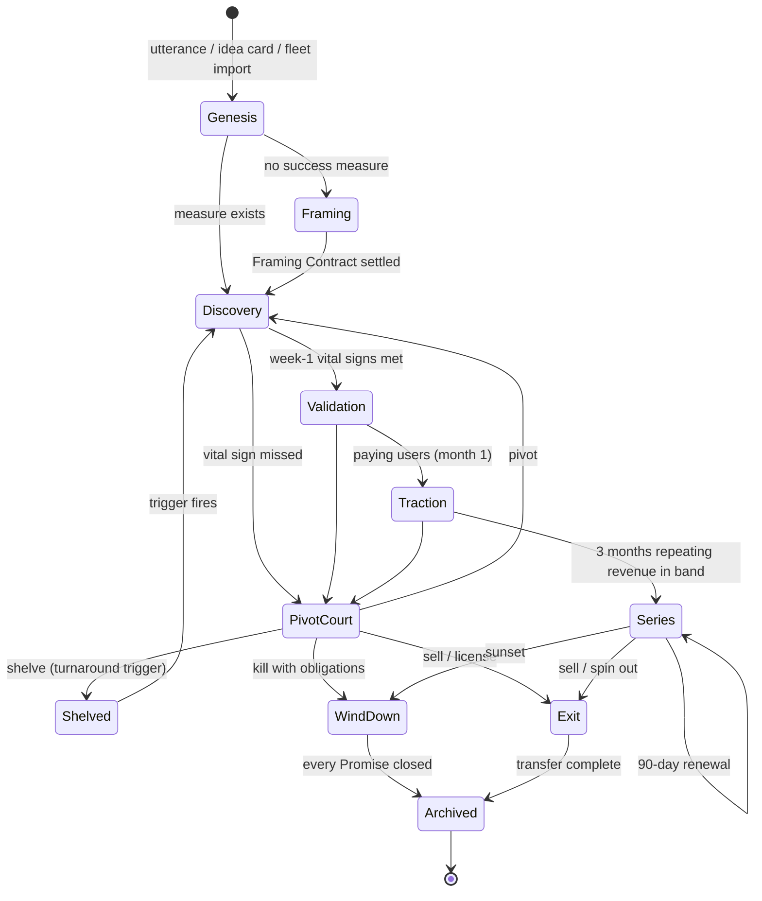
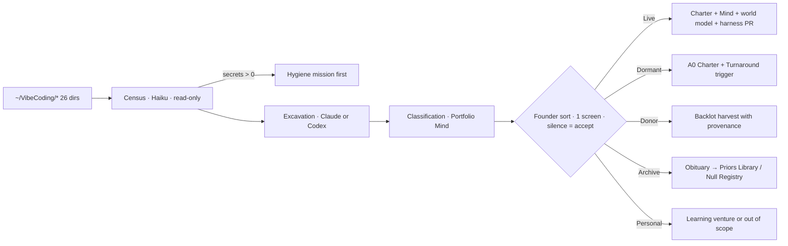

# S08 — Startup Operator: vibe startuping in practice

*Round 2 seat · 2026-09-30 · Designs inside R1-SYNTHESIS (four separated authorities). Numbers are design targets unless
sourced; sourced figures come from R0-D and are founder/vendor reports, not audits. Nothing here is legal or tax advice:
the design says where a licensed human must sign, not what the law says.*

---

## 1. Summary

1. **A venture is born from a sentence in under ten minutes** (Venture Genesis): the founder's intent becomes a Charter,
   a Venture Mind, a repo from the Backlot, a budget, an autonomy level and a first funded mission — Framing Contract
   first when no measure of success exists. No playbook; **Kind Priors** (startup, agency, service, research, learning)
   are calibrated starting beliefs, overwritten by evidence.
2. **The founder's ~19 repos (26 directories today) enter through Fleet Import**, a read-only census → excavation →
   classification → adoption pipeline that turns each repo into a live venture, a dormant venture, an asset donor to the
   Backlot, or an archive — never a silent install into all of them.
3. **Every venture runs a Stage Clock**: week 1, month 1, quarter 1, year 1, each with numeric **Vital Signs** per kind
   (e.g. startup week 1: ≥15 problem conversations, ≥1 payment attempt). Missing a vital sign opens a Pivot Court, not a panic.
4. **Seven operating loops** — Demand, Ship, Deal, Promise (support), Capital, Seats (hiring humans and agents), Pivot —
   run in both lanes of the Allocator, and a venture that earns repeating revenue enters **Series mode** with weekly episodes.
5. **Every venture has a Body**: an Entity Graph, a Contract Registry, per-entity double-entry Books reconciled from
   systems of record, a Tax & Compliance Calendar, per-venture bank accounts and virtual cards, and an **Authority
   Matrix** that states which autonomous actions the entity is liable for and who signs.
6. **A fifth authority — Custody — holds money, signatures and legal identity** (Challenge below). The Allocator
   allocates; Custody disburses against mandates. No agent both spends and books.
7. **An Inter-venture Economy** makes ventures each other's first customers at arm's length: real invoices, market-priced,
   disclosed, capped at 30% of any venture's revenue so internal demand never fakes product-market fit.
8. **Exits are designed outcomes**: every venture continuously maintains an **OpCo Pack** — entity, contracts, books,
   customers, world model, tested agent workforce, measured founder burden — so sell, spin out, license or shut is a
   mission, not a scramble.
9. **Relationship Repair** is a first-class loop: a Harm Register, a repair protocol with remedy authority, and a
   prevention replay across every venture before the same harm spreads.
10. **Portfolio mode** runs 3–7 ventures at once on shared services with firewalls, targeting ≤45 founder-minutes/day total.

---

## 2. The design

### M1 — Venture Genesis (a new venture in minutes)

**What it does.** Converts one founder utterance (terminal, Mission Control, voice) into a running venture. Genesis is a
mission, not a wizard: a Genesis Operator (Sonnet 5 or Codex, whichever the cast registry ranks higher for genesis)
drafts, the founder confirms three things, the rest defaults.

**The three founder confirmations** (≤3 minutes): the one-line intent, the autonomy level (A0–A4 per the autonomy seat),
and the monthly budget cap. Everything else — name candidates, never-list, data boundary, entity stance — is proposed and
proceeds on silence (two-way door).

**Trigger.** Founder utterance matching "start / try / explore / validate X", an Idea Board card dragged to *working*,
or an Initiative-engine proposal the founder circles.

```yaml
# ventures/<slug>/charter.yml — compiled by Genesis, versioned, founder-signed fields marked *
slug: clinic-voice
kind: agency            # startup | agency | service | research | learning | hybrid
intent*: "Is an AI receptionist agency for dental clinics a business I'd want to own?"
autonomy*: A1           # moves to A2/A3 only by evidence ladder
budget*: { monthly_usd: 600, tranche: T0, compute_share: 0.15 }
framing_contract: pending   # first mission buys the measure of success if none exists
never_list: [cold calls under founder's name, medical advice, storing patient PHI before BAA]
data_boundary: { own_repo: true, reads_backlot: [outreach-set, brand-kit-lite], shares_to_portfolio: craft_notes_only }
entity_stance: none_yet     # none_yet | dba_under_holding | own_entity  (Body M5 decides the trigger)
kind_priors: agency@v7      # calibrated starting beliefs, never steps
stage_clock: { started: 2026-10-01, week1_due: 2026-10-08 }
repair_contact: founder     # who a harmed party reaches (M9)
```

**Genesis sequence (target 8 min wall clock, ≤$3):**
1. Parse intent → propose kind, name, three candidate measures of success (Framing Contract seed).
2. Backlot draw: pick a starter set (repo template, brand kit, landing page, payment stack stub) by kind and reuse score.
3. Create repo + worktree + Venture Mind + world model skeleton (customers, market, competitors, metrics, decisions).
4. Coverage: three blind readers (≥1 Claude, ≥1 Codex) — premise, comparables, failure modes, recommend/consider/pass.
5. First missions queued: Framing Contract, 20-conversation discovery sprint, one landing page with a real payment or
   waitlist button. Registered as a Bet with kill date.
6. Founder sees one card: *"Clinic Voice is live at A1. First reel tomorrow 07:30. Kill date 2026-10-29 unless ≥3
   clinics agree to a paid pilot."*

**Kind Priors (not playbooks).** A prior is a belief with evidence level, e.g. *agency@v7: "first revenue usually comes
from warm network within 14 days (evidence: 2 own ventures, 3 external reports, confidence 0.4)"*. Missions read priors
to set Vital Sign targets; outcomes update them. A prior that dictates steps fails the same lint as a Standing Order.

### M2 — Fleet Import (the founder's existing repos)

**What it does.** Brings every directory under `~/VibeCoding/` into the organisation without breaking any of them.
Today that is 26 directories (census 2026-09-30: e.g. `Beamix`, `adamos`, `FinFunapp`/`finfun`, `StoryBite`, `realestate`,
`etsyc`, `N8N`, `noam-website`, `ghostb`, plus `_reference` and a worktree archive). v2's J11 fleet census is the seed.

**Pipeline — five stages, each reversible until stage 5:**

| Stage | Worker (title) | Output | Cost/repo | Writes to repo? |
|---|---|---|---|---|
| 1 Census | Fleet Surveyor (Haiku 4.5) | last commit, languages, LOC, deploy targets, `.claude/` drift, secrets scan, licence | ~$0.05 | no |
| 2 Excavation | Repo Archaeologist (Sonnet 5 or Codex) | what it is for, who used it, revenue traces (Stripe keys, analytics IDs), open promises, reusable assets | ~$0.60 | no |
| 3 Classification | Portfolio Mind session (Opus 5) | one of **Live / Dormant / Donor / Archive / Personal** with reasons | ~$0.20 | no |
| 4 Founder sort | founder, 1 screen | drag-sort confirmations; silence = accept | 5–10 min total | no |
| 5 Adoption | Adoption Engineer (Codex or Claude, cast by record) | per class, below | $1–8 | **yes, by PR** |

**Adoption by class:**
- **Live** → full venture: Charter, Mind, world model seeded from excavation, harness installed by PR (never force-push),
  Stage Clock set to the *actual* stage (a revenue-bearing repo enters at Series-candidate, not week 1).
- **Dormant** → Charter with `autonomy: A0`, a Turnaround trigger (a signal that revives it), no heartbeat.
- **Donor** → assets harvested into the Backlot with provenance (`from: realestate@a1b2c3`), repo archived read-only.
- **Archive** → one-page obituary into the Priors Library (what was tried, why it stopped) — the Null Registry gets
  the founder's own history, which is the best prior data he owns.
- **Personal** (notes, learning, websites) → learning-kind ventures or out of scope, founder's choice.

**Rules.** One repo = at most one venture. Secrets found in census open a Hygiene mission before anything else (v2 red
team named "a secret leaked in one of 19 repos"). Import never pushes to a default branch.

### M3 — Stage Clock and Vital Signs (numbers targets per stage)

**What it does.** Gives every venture a clock with numeric vital signs per kind. A missed vital sign is an input to the
Pivot Court (M4.7), never an automatic kill — kill dates stop *bets*, not ventures with obligations (synthesis §4.4).

| Horizon | Startup (product) | Agency | Service business | Research project |
|---|---|---|---|---|
| **Week 1** | 15 problem conversations; 1 landing page live; ≥1 payment attempt or ≥30 qualified waitlist; Framing Contract settled | 30 targeted prospects contacted (opt-in channels); 5 calls booked; offer page + price | 1 offer, 1 booking/payment path, 3 warm leads | question stated; 25 sources triaged; 3 falsifiable hypotheses |
| **Month 1** | 3 paying users or 10 committed pilots; weekly ship cadence; activation measured | 2 paid pilots; delivery SOP-as-policy; gross margin ≥50% | 5 paying customers; NPS-like score from ≥5 | 1 experiment run; 1 written finding with evidence level |
| **Quarter 1** | $1k MRR or kill/pivot decision; D30 retention ≥20% | 5 retained clients; ≥60% margin; founder ≤2 h/wk | $3k/month; repeat rate ≥30% | publishable result or null logged |
| **Year 1** | $10–30k MRR; ≥40% "very disappointed" (n≥30); founder ≤3 h/wk at A3 | $15k MRR; 10–20 clients; A3 Series | self-running at A3; margin floor held 12/12 months | body of work cited ≥1 external time; spun into a venture or closed |

**Autonomy balance sheet** (per R0-D §5, reported weekly by every venture): collected revenue, MRR, gross margin,
founder-minutes, intervention count, open obligations, recovery cost. **Independence** is measured, never claimed.

**Portfolio-level targets (year 1):** 3 ventures at A3 Series; ≥1 venture profitable after compute; founder ≤45 min/day
across all ventures; ≥40% Backlot reuse in new-venture week-1 footage (C5 target); ≥8 ventures killed cheaply
(≤$300 each) — a healthy portfolio kills more than it keeps.

### M4 — The seven operating loops

Each loop is **policy + stores + launched agents**, not a department. Obligation work runs in the obligations lane
(reserved capacity); growth work competes in the investment lane.

1. **Demand loop (find customers).** Channel bets, each a preregistered Bet: "LinkedIn opt-in content to clinic
   managers yields ≥3 calls/week at ≤$40 CAC". Titles: Demand Researcher, Channel Engineer (hybrid: growth + code for
   programmatic SEO, scrapers, enrichment), Outreach Writer. Every contact passes the effect gateway: opt-in rules,
   frequency caps across ventures (≤1 touch per contact per week portfolio-wide), AI disclosure. Output to world model:
   `Contact`, `Segment`, `ChannelResult`.
2. **Ship loop.** Missions → worktrees → merge queue → Referee from the other family → deploy. Nightly "dark factory"
   window for A2+ ventures; preview links land in the Dailies Reel.
3. **Deal loop (sell).** A Deal Desk record per opportunity: stage, next step, quoted price, concessions. **Margin floors
   and discount ceilings enforced in the tool** (R0-D: Vend's agent priced below cost; refunds shifted the leak).
   Proposals are drafted autonomously; *sending a price* is R3; *signing* is R4 → Custody.
4. **Promise loop (support).** Every commitment made to anyone (refund, date, feature, SLA) is a **Promise** record
   outside conversation memory (R0-D: agents promised refunds they could not execute). A promise without an executor
   capability is refused at write time. Support Agent and Inbound Sales Agent are separate queues sharing customer
   history.
5. **Capital loop (raise / fund).** Default is **revenue-funded** by treasury rule (economics seat). Raising is a mission
   the Mind may *propose* only when a Bet shows capital, not attention, is the constraint. The system prepares: data
   room (from OpCo Pack, M8), model, investor list with fit evidence, warm-intro graph, deck drafts; it books meetings
   only through the founder's calendar with approval. **The founder pitches and signs.** Non-dilutive options
   (revenue-based financing, grants, credits) are scanned by default.
6. **Seats loop (hire — agents and humans).** A **Seat** is a need with an outcome, budget and access scope; the loop
   decides *agent, human, or hybrid*. Humans are hired for: signatures, licensed work (lawyer, accountant), physical
   work, human-only calls, taste roles, trust roles (a named account manager for enterprise). Human seats go through
   the human task market (external-world seat) on the same ledger; contracts via Custody; onboarding gives scoped access
   to the venture's surfaces only. Trigger heuristic from v2: a function consuming >5 founder-h/week or $1k MRR.
7. **Pivot loop (Pivot Court).** Opened by a missed vital sign, a Referee-accepted kill criterion, or the Mind's own
   challenge (weekly, mandated — R0-D: Andon's agents kept operating without improving). Court = Mind (thesis defender),
   a Contrarian Analyst from the other family (prosecutor), and the world model as evidence. Verdicts: **Persevere,
   Pivot (same tranche), Shelve (Turnaround trigger), Wind-down (obligations honoured), Sell (M8)**. The founder decides
   Pivot/Shelve/Sell for A0–A2; at A3 he gets a 24 h veto window.

**Series mode.** A venture with ≥3 consecutive months of repeating revenue inside its forecast band gets a Series pickup:
a Showrunner (the Co-founder seat loaded with the venture's Mind) runs weekly **episodes** — brief → call sheet →
dailies → air — against standing goals. Renewal review every 90 days by the Portfolio Mind: renew, re-tool, sell, sunset.

### M5 — The Venture Body (legal-financial, operating side)

**Principle:** an autonomous organisation needs a body that can be sued, taxed, paid and trusted. The Body is records +
tools + human signatories, owned by **Custody** (see Challenge).

| Organ | Record | Automated | Human-only (R4) |
|---|---|---|---|
| **Entity Graph** | holding → ventures (entity, DBA or project), jurisdictions, registered agents, cap tables | formation paperwork drafts, annual-report deadlines, registered-agent renewals | forming, dissolving, signing, share issuance |
| **Contract Registry** | every contract: parties, obligations, renewal, termination, liability cap, governing law, clauses extracted | drafting from vetted templates, redline suggestions, renewal alarms, obligation → Promise records | signing, material deviation from template |
| **Books** | double-entry ledger per entity (plain-text, e.g. hledger per v2) | reconciliation from bank feeds, Stripe, card spend; receipt capture; intercompany entries; monthly close pack | year-end sign-off by an accountant seat |
| **Tax & Compliance Calendar** | deadlines per entity/jurisdiction, sales-tax/VAT nexus tracking, privacy obligations | filings prepared, evidence packs, nexus alarms (merchant-of-record providers like Paddle reduce this surface) | filing and attestation by a licensed human |
| **Banking** | one account per entity; **virtual card per venture per purpose** with limits | spend within card limits, invoicing, dunning, dispute evidence (R0-D: Levels' dispute responder) | opening accounts, raising limits, transfers above mandate |
| **Authority Matrix** | per venture: which action classes are autonomous, who is liable, which insurance covers it | enforced at the effect gateway | changing the matrix |

**Liability for autonomous actions.**
- **Every outbound effect is attributable to an entity**, not to "the AI": the receipt carries `entity_id`,
  `authority_rule`, `agent_record`, `model`, `approval_ref`. That is what a lawyer, insurer or court would ask for.
- **The Agent Action Warranty**: each venture's terms state that it uses AI agents, what they may commit to, and that
  commitments above threshold require confirmation. Agents cannot promise outside the Authority Matrix; the Promise loop
  refuses it at write time.
- **Insurance as a tracked dependency**: professional liability / cyber cover per entity, with the insurer's
  AI-use conditions stored as never-list entries. (Whether cover exists for autonomous actions is a question for a broker —
  marked open, not assumed.)
- **Entity trigger**: a venture moves from `none_yet` → DBA under a holding → own entity at named triggers: first
  invoice > threshold, first contract with liability exposure, first employee/contractor, first outside investor, or a
  risk profile the firewall should isolate (health, finance, children).

```yaml
# ventures/<slug>/body/authority.yml — changed only by founder (R4)
entity: holding-llc/clinic-voice-dba
mandates:
  - effect: invoice.send        ; max_usd: 2000 ; autonomy: A2+ ; disposition: auto
  - effect: refund.issue        ; max_usd: 150  ; per_customer_90d: 1 ; disposition: auto
  - effect: vendor.subscribe    ; max_usd_month: 50 ; card: cv-tools ; disposition: notify
  - effect: contract.sign       ; disposition: founder_only
  - effect: price.change        ; floor_margin: 0.55 ; disposition: notify_24h_veto
liability: { insurer_conditions: [human_review_of_clinical_claims], disclosure: "AI-assisted service" }
```

### M6 — Portfolio mode (several ventures at once)

- **Shared services, firewalled data.** Books engine, contract templates, Backlot, cast registry, demand infrastructure
  are shared; each venture's world model, customers and secrets are not. Lessons cross only as abstracted craft notes.
- **Capacity.** Obligations lane reserves ~25% of subscription capacity portfolio-wide; the Allocator splits the rest by
  expected value per founder-minute and per dollar (economics seat owns the formula).
- **Founder rhythm.** 07:30 Dailies Reel (all ventures, ≤8 min); decisions batched through the Founder Attention
  Exchange; Monday Portfolio Board (30 min, Portfolio Mind presents autonomy balance sheets); monthly renewal/kill review.
- **Brand firewall.** Each venture has its own domain, sending identity and social accounts; the founder's personal
  identity is used only by an R4 approval per campaign.
- **Collision control.** Audience overlap is declared at genesis and metered portfolio-wide (C5 anti-cannibalism).

### M7 — The Inter-venture Economy

**What it does.** Ventures buy from each other at arm's length: the SEO tool venture sells to the agency venture; the
agency is the dev-tool's first design partner; the research project sells findings to two ventures. It gives every new
product a real first customer with a real problem — and it is dangerous, because internal demand can fake PMF.

**Rules (enforced in Books and the Allocator):**
1. **Real invoices, real money** between entities (or recorded internal transfer when same entity), priced at the
   public list price minus a disclosed design-partner discount ≤30%.
2. **Internal revenue cap:** ≤30% of a venture's revenue may be internal, and **internal revenue is excluded from every
   PMF vital sign** — it counts for cash, not for evidence.
3. **Buyer's right to churn**: the buying venture's Mind must be free to cancel; a Referee checks quarterly that the buyer
   would choose the purchase at list price (switching-cost analysis vs an external alternative).
4. **Disclosure**: to outside investors or acquirers, internal revenue is always reported separately (OpCo Pack).
5. **Transfer pricing and tax treatment** between entities is a flagged question for the accountant seat, not decided by agents.

### M8 — Transferable OpCo Packs and exits

**What it does.** Each venture continuously maintains an **OpCo Pack**: a transferable operating company. Transfer is a
product (R0-D §5 "an organisation sold with evidence").

**Contents:** entity docs + cap table; Contract Registry export; books with monthly closes; customer list with consent
status; world model (without portfolio-shared craft notes that aren't licensable); codebase + infra-as-code; **the agent
workforce as portable records** (identity records, skills, Standing Orders compiled to the buyer's runtime — Claude Code
and Codex profiles); runbooks-as-policies; autonomy balance sheet history; measured founder burden; open Promises; known
faults and incidents; Harm Register.

**Transfer Readiness Score (0–100)**, recomputed weekly: books closed ≤35 days ago, contracts assignable, no
personal-identity dependencies, secrets rotatable, Backlot licences clear, founder-minutes/week ≤60, agent workforce
runs in a clean tenant (tested monthly by a **Transfer Drill**: spin the Pack up in an empty sandbox and run a week of
simulated operations — simulation seat).

**Exit modes (each a mission with the founder deciding):** sell (broker listing, acquirer outreach, data room from the
Pack), spin out (hand to a human operator with the agent workforce licensed), license (Backlot asset sale), merge into
another venture, **shut** (wind-down mission: honour every open Promise, notify customers with 30 days, export their
data, refunds per policy, obituary into the Priors Library, Backlot strike of reusable assets).

### M9 — Relationship Repair after harm

**What it does.** When the organisation harms someone — wrong charge, spam, a false promise, a data slip, a bad
deliverable, a rude reply, a contractor paid late — repair is a funded obligation, not a PR exercise.

**Harm Register record:** `{harm_id, venture, party, what_happened, detected_by, severity S1–S4, receipts[], root_cause,
remedy, restitution_usd, apology_ref, prevention_change, status}`.

**Protocol (obligations lane, never waits for a bet cycle):**
1. **Stop** — the effect gateway freezes the offending action class for that venture (and portfolio-wide at S3+).
2. **Acknowledge within 4 h** (S1–S2 autonomous from a vetted template at A2+; S3–S4 founder-approved, human-voiced
   where the party prefers a human).
3. **Remedy** within a pre-authorised **Repair Budget** per venture (default: up to 3× the harm value, ≤$500, auto).
4. **Prevent** — root cause into the cross-venture incident lab: a privacy-safe scenario replayed against every agent
   record that could make the same mistake (R0-D §5); a Standing Order or tool guard changes, with an owner and a date.
5. **Close the loop** — the party is told what changed. A Relationship Health score per key account/contractor tracks
   recovery; repeated harm to one party escalates to the founder regardless of autonomy.

---

## 3. Diagrams

### Venture lifecycle



### Fleet Import



### Inter-venture purchase with Custody

```mermaid
sequenceDiagram
  participant BM as Buyer Venture Mind
  participant AL as Allocator
  participant CU as Custody
  participant SV as Seller Venture
  participant RF as Referee (other family)
  BM->>AL: request budget: SEO tool, $49/mo list, 30% design-partner discount
  AL->>CU: approved allocation (mandate: vendor.subscribe ≤ $50)
  CU->>SV: intercompany invoice $34.30, flagged internal
  SV-->>CU: receipt; Books record both sides
  Note over SV: revenue counted for cash, excluded from PMF vital signs
  RF->>BM: quarterly: would you buy at list vs external alternative?
  BM-->>RF: evidence → would_buy / would_not
```

---

## 4. Interfaces

| Part | Operator **needs** | Operator **gives** |
|---|---|---|
| Mission engine | Framing Contracts, Bet registration, mission shapes | Genesis missions, loop missions, Pivot Court as a mission type, Vital Signs as progress checks |
| Allocator / economics | two-lane capacity, treasury rule, cost per outcome | autonomy balance sheets, internal-revenue flags, Repair Budgets, per-venture budgets |
| Autonomy | A0–A4 levels, risk classes R0–R4, founder-contact classes | Authority Matrix per entity; which Body actions are R4 by definition |
| Agent organisation / identity | cast registry, identity records, hybrid titles | new titles (Repo Archaeologist, Channel Engineer, Deal Desk Analyst, Repair Lead, Custody Clerk), outcome data per title |
| Memory / world model | per-venture world model, Priors Library, Null Registry | Kind Priors updates, fleet obituaries, harm scenarios, OpCo Pack as a memory export format |
| Skills / tools | MCP for bank feeds, Stripe, e-sign, accounting, calendar | demand for vetted legal templates, reconciliation skills, dispute-evidence skills |
| External world | effect gateway, human task market, outbound claims standard, reputation firewall | entity_id on every effect, Promise records, frequency caps, repair acknowledgements |
| Surfaces | Mission Control pages | Venture page (Stage Clock, Vital Signs, balance sheet), Fleet Import sort screen, Body page (entities, books, calendar), Harm Register, Transfer Readiness |
| Simulation | digital twin | Transfer Drill, customer-commitment rehearsal before price/contract changes |
| Engineering | runtime, sandbox, leases, receipts | per-venture repos, secrets scopes, per-entity credentials held by Custody only |
| Evals | Referee protocol, calibration | Vital Sign forecasts vs actuals per Kind Prior, founder-burden metric |

---

## 5. Worked examples

### Example A — "Clinic Voice", an agency, week 1

**Monday 09:02.** Founder, by voice: *"Try an AI receptionist agency for dental clinics. Six hundred a month. A1."*
- 09:02–09:10 **Genesis** (Sonnet 5 Genesis Operator; Opus 5 not needed). Backlot draws `landing-lite@v12`,
  `brand-kit-lite@v4`, `voice-agent-stack@v3` (donor from an imported repo). Coverage by 2 Claude + 1 Codex readers:
  recommend / consider / consider; the dissent ("clinics buy through practice-management vendors") becomes a hypothesis.
  Cost $2.40. Memory writes: Charter v1, Mind v1, world model skeleton, 3 hypotheses.
- Founder confirms nothing further — silence accepts name and never-list.

**Mon–Tue.** Framing Contract mission (Codex Framing Analyst + Claude Referee): success = *"≥3 clinics sign a paid pilot
at ≥$300/month by day 28"*. Demand Researcher (Sonnet 5) builds a list of 120 clinics in two metros from public
directories; Channel Engineer (Codex) builds the landing page with a Paddle checkout; Outreach Writer drafts an
opt-in-compliant email + LinkedIn sequence. Sending is R3 at A1 → **one founder approval** (2 min) for the template.
**Wed–Thu.** 38 sends/day under portfolio caps; 6 replies; Deal Desk books 5 calls into the founder's calendar — he takes
the calls himself (human-only trust role at this stage), agents prep one-page briefs per clinic.
**Fri.** Week-1 vital signs: 30 contacted ✔, 5 calls booked ✔, offer + price ✔. Dailies Reel shows 2 call-note clips;
founder circles "front desk overwhelmed at lunch" as the wedge. Spend week 1: **$71 compute + $0 ads**; founder time
**~2 h 10 min** (mostly calls). Body: `entity_stance: none_yet`; first invoice will trigger DBA-under-holding (M5).

**Day 24.** Third pilot signed → Custody sends the e-sign packet; **founder signs** (R4). Books open under
the holding. Promise records created for each pilot's SLA.

### Example B — Importing the fleet, one Saturday morning

- 08:00 Founder: *"Bring in all my repos."* Fleet Surveyor (Haiku 4.5) censuses 26 dirs in 6 min, $1.30. Finds 2 repos
  with committed API keys → two Hygiene missions (rotate, purge history by PR) jump the queue, founder notified (R2).
- 08:10–08:55 Repo Archaeologists — 13 Claude, 11 Codex, cast by prior accuracy — excavate in parallel; $14.
- 09:00 Portfolio Mind (Opus 5) proposes: **Live 3** (e.g. Beamix, FinFunapp, noam-website as a client asset),
  **Dormant 5**, **Donor 9**, **Archive 6**, **Personal 3**. Duplicates flagged (`finfun` vs `FinFunapp`, `GSA` vs
  `gsa-core`) with a merge-or-archive proposal. *(Classification is illustrative; the real one is the output of this run.)*
- 09:05–09:14 Founder drag-sorts on one screen: moves one Donor to Dormant, accepts the rest. **9 minutes.**
- 09:15–12:00 Adoption: 3 harness PRs opened (Referee from the other family on each), 47 Backlot assets harvested with
  provenance, 6 obituaries written into the Null Registry — the founder's past bets finally become priors.
  Total $38, founder 9 min + 3 PR merges at next Dailies.

---

## 6. Ideas the founder did not ask for

1. **The Null Registry seeded by your own past.** Fleet Import writes an obituary for every abandoned repo, so the
   organisation's first priors are the founder's real history, not internet generalities.
2. **Venture Twins before launch.** Each Genesis also spawns a cheap simulated competitor venture that tries to beat the
   real one in the digital twin; the gap is a weekly signal of defensibility.
3. **Buyer's Remorse Referee.** For inter-venture deals, a quarterly check that the buyer would still pay list price
   against an external alternative — stops the portfolio lying to itself.
4. **Transfer Drill.** Monthly, spin a venture's OpCo Pack up in an empty tenant and run a simulated week; the pass rate
   is the real measure of "this business runs without me" — and the thing an acquirer pays for.
5. **Founder Burden as a priced line item.** Founder-minutes are costed at a founder-set shadow rate and appear in every
   venture's P&L, so a "profitable" venture that eats 6 h/week is visibly not.
6. **Obligation escrow.** Every prepaid customer commitment reserves cash in a per-venture sub-account until delivered —
   a killed bet can never strand a paying customer.

---

## 7. Risks (each with a design answer)

| Risk | Design answer |
|---|---|
| Internal demand fakes PMF | Internal revenue excluded from vital signs by type; ≤30% cap; Buyer's Remorse Referee |
| Agents commit the entity to things it can't deliver | Promise records require an executor capability at write time; Authority Matrix enforced at the gateway; obligation escrow |
| Legal/tax errors from autonomous bookkeeping | Agents prepare, licensed humans attest; monthly close pack reviewed by an accountant seat; every jurisdictional question flagged, never decided by an agent |
| Liability for autonomous actions is legally unclear | Every effect carries entity + authority rule + receipt; AI-use disclosure in terms; insurer conditions as never-list; entity separation isolates risk profiles |
| Fleet Import breaks a live project | Read-only through stage 4; adoption only by PR; secrets block adoption; per-repo rollback |
| Portfolio sprawl eats the founder | Attention Exchange caps; ventures above their founder-minute allowance get a completion guarantor before asking the founder |
| Pivot thrash | Pivot Court needs a Referee-accepted fact; one pivot per tranche; prior pivots are evidence against the next |
| Cross-venture brand/audience collision | Declared audiences, portfolio-wide frequency caps, per-venture sending identity |

---

## 8. Open decisions

1. **Holding structure default.** Recommendation: one holding entity with DBAs for pre-revenue ventures, own entity at the
   M5 triggers — cheapest path that still isolates risk. Needs a founder conversation with a lawyer/accountant for his
   jurisdiction (flagged, not assumed).
2. **Who sells: founder or agents, by stage.** Recommendation: founder takes the first 10 sales calls of every venture
   (customer judgment is what R0-D says winners keep), agents prep and follow up; agent-voiced sales only after a venture
   reaches A3 and with AI disclosure.
3. **Internal-revenue cap.** Recommendation: 30% cap, 0% counted toward PMF. Alternative (no cap) rejected: it lets a
   portfolio subsidise its way to false signals.

---

## Challenge to the synthesis

**Add a fifth authority: Custody.** The synthesis separates Intent, Allocation, Execution and Acceptance. Money,
signatures and legal identity sit awkwardly in all four: the Allocator decides *what* to fund, but a real bank transfer,
a signature or an entity filing is a different act with different liability. Proposal: **Custody** holds bank
credentials, cards, e-sign keys and entity records; it disburses and signs only against mandates (Authority Matrix) or
founder R4 approvals; it keeps the Books. No agent that allocates, executes or referees holds a credential that moves
money. This is the separation-of-duties rule every audited company uses (the one who approves is not the one who pays is
not the one who books), applied to agents. It is **bigger**, not smaller: it lets autonomy rise on the spending side
without trusting any single agent with the treasury.

Second, smaller addition: the Charter should carry **`entity_stance` and an Authority Matrix reference** alongside the
data boundary — a venture's legal body is as much part of its identity as its data boundary.
