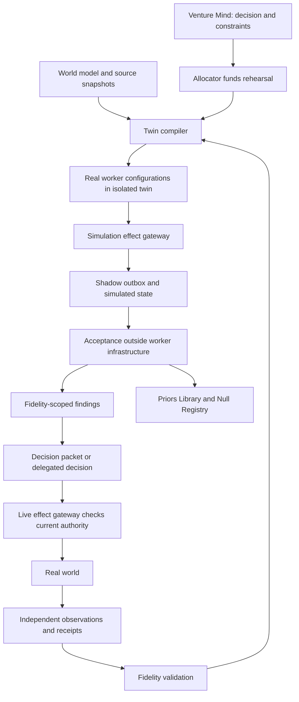
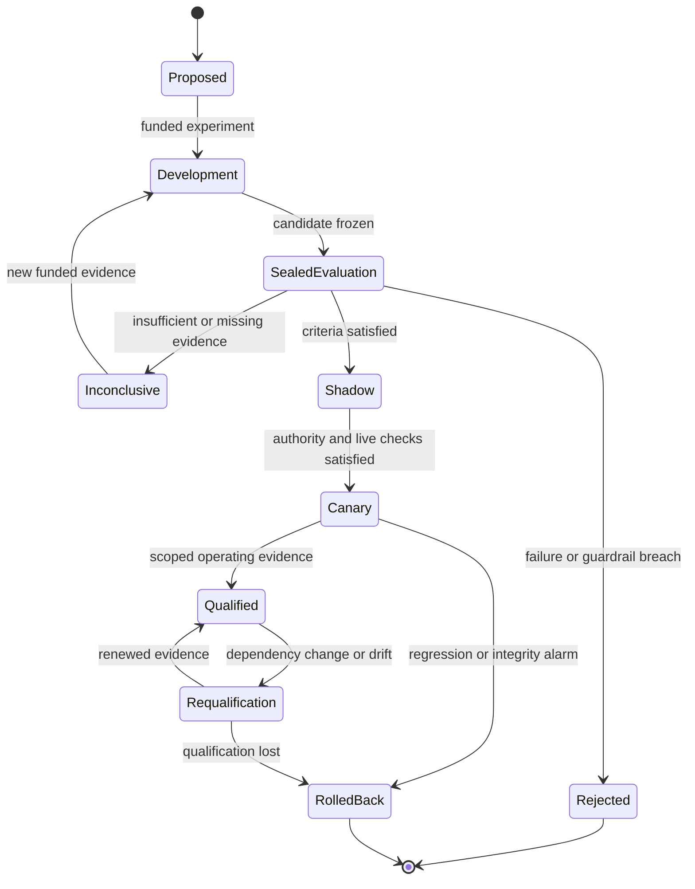

# R2 — Simulation and evals engineer (Codex seat)

## 1. Summary

1. Every Venture gets a versioned digital twin: executable operations, simulated collaborators, uncertain market models, and a clock.
2. Fidelity belongs to a particular prediction and decision scope; a convincing simulation earns no general certificate of realism.
3. Rehearsals use the production mission contracts, fenced leases, and effect gateway, with external effects captured in an isolated shadow outbox.
4. Evaluation separates historical regression, fresh capability tests, sealed promotion holdouts, and subsequent real-world outcomes.
5. Identities accumulate scoped track records; exact configurations carry reproducible manifests and their own qualification history.
6. Hybrid specialties, classic teams, Claude Code, and Codex compete on matched missions and total budgets.
7. Acceptance runs outside worker infrastructure, with protected graders, independent observations, and explicit defenses against evaluator manipulation.
8. Weekly scorecards report demonstrated gains, regressions, uncertainty, missing evidence, and weeks with no demonstrated improvement.
9. Model releases trigger configuration requalification and experiments on newly possible work; output leverage uses matched human effort per founder-hour.
10. Tested improvements return to the Priors Library, Null Registry, Backlot, and Calibration Ledger without silently expanding authority.

## 2. The design

### 2.1 Position in the Compounding Organisation

This seat supplies measurement and rehearsal across the synthesis’s four authorities. Intent defines desirable outcomes. Allocation purchases experiments. Execution produces artifacts and effects. Acceptance determines what the evidence establishes. An Org Scientist may propose a better organisation; it cannot certify its own improvement or grant itself more authority.

The design carries forward C4’s preregistration and configuration trials, C3’s receipts and execution boundaries, C2’s Fingerprint gate, and C5’s reusable Backlot. It preserves v1’s AD-008: protected acceptance dependencies require separately authorized changes. These are design precedents, not evidence of operating success. See [R1 synthesis](../r1-concepts/R1-SYNTHESIS.md), [C4 Lab](../r1-concepts/C4-lab.md), and [v1 decision records](../../vision-system/planning/site/explorer/data/decisions.json).

Two earlier choices change:

- [ENGINE-SPEC §11](../engineering/ENGINE-SPEC.md) says simulation never satisfies an evidence rung. Here, certified predictions may supply scoped L2 evidence, as C4 proposes. Uncalibrated synthetic reactions remain hypotheses.
- Routine configuration promotion follows a Standing Order when one authorizes it. Founder review is reserved for changed intent, consequential authority, protected boundaries, or exceptions; improvement should not become a weekly approval queue.

All budgets, sample sizes, thresholds, and example results below are proposed settings or fictional worked examples. They are not measured performance claims.

### 2.2 Venture Twin — an executable, bounded world

**Does:** forks the Venture’s relevant state and lets real worker configurations act through simulated interfaces.  
**Triggers:** risky decision rehearsal, configuration experiment, incident drill, new venture onboarding, or fidelity revalidation.

The twin is a collection of models with different fidelity, not one conversational agent pretending to be a company.

| Layer | What is simulated | Fidelity claim and limit |
|---|---|---|
| Technical | Repositories, databases, queues, deployments, tool responses | Execute actual code where possible; emulate unavailable services against contract fixtures |
| Operational | Customer commitments, support queues, delivery capacity, cash movements | Explicit state transitions, conservation rules, deadlines, reconciled opening balances |
| Organisational | Agent teams, leases, blackboard, interruptions, budgets, founder availability | Actual mission engine and worker adapters; controlled scheduling and faults |
| Counterparty | Customers, contractors, suppliers, counterpart agents | Actors with private information, bounded actions, and explicit behavioral assumptions |
| Commercial | Acquisition, conversion, retention, price response, competitor moves | Competing probabilistic models; no transfer beyond observed populations without new evidence |
| Strategic | Pivots, venture bundles, exits, founder absence, correlated shocks | Scenario ranges and sensitivity analysis; no claim to predict a single future |

AppWorld demonstrates state-based evaluation that checks both desired changes and collateral damage. This supports using executable state as the operational oracle. [AppWorld paper](https://arxiv.org/abs/2407.18901)

Counterparty simulators must act through constrained tools and visible state. They cannot invent that a refund happened or that a customer received a message. This follows the useful design distinction in τ²-bench, where users also act on the environment. [τ²-bench paper](https://arxiv.org/abs/2506.07982)

```yaml
twin:
  id: agency-twin-017
  venture_ref: agency
  purpose: rehearse-delivery-expansion
  snapshot:
    as_of: "2026-10-12T08:00:00Z"
    world_model_hash: sha256:...
    repo_commits: {delivery: "..."}
    source_watermarks: {crm: "...", payments: "..."}
    redaction_manifest: vault:...
  runtime:
    engine_hash: sha256:...
    tool_contract_hashes: ["sha256:..."]
    sandbox_image: sha256:...
    clock_policy: discrete-event-v2
    randomness_manifest: sealed:...
  models:
    - component: delivery-queue
      version: "4"
      fidelity_certificate: cert:delivery-004
    - component: buyer-response
      version: "2"
      fidelity_certificate: null
  effects: shadow-only
  allowed_egress: [approved-model-proxy]
  expires_at: "2026-10-19T08:00:00Z"
```

Each run receives isolated copies of mutable state and memory. Credentials, production DNS routes, payment authorizations, and live sending tools are absent. The effect gateway uses a distinct simulation namespace and signing identity. Production effectors reject simulation receipts even if copied into a live mission.

A rehearsal can produce an executable deployment plan, draft email, or payment proposal. Promoting the artifact creates a new live request with current preconditions and authority checks. A simulated approval never becomes a real approval.

The clock advances business time independently of inference time. Reports retain both: “seven simulated days” and “46 minutes elapsed.” Queue capacity, vendor delays, and human response times remain explicit; accelerating the clock must not erase them.

### 2.3 Fidelity Certificates — test the twin against reality

**Does:** states which predictions can inform which decisions, based on prospective comparison with observations.  
**Triggers:** a twin first claims decision weight, its dependencies change, its validity expires, or observed residuals drift.

A certificate covers a tuple: **component × population × intervention × horizon × observation process**. A support simulator calibrated on refund eligibility cannot validate demand forecasts. A market model that predicts existing prices does not automatically predict a new pricing intervention.

```yaml
fidelity_certificate:
  id: cert:delivery-004
  component_hash: sha256:...
  scope:
    population: existing-standard-plan-customers
    intervention: add-one-delivery-team
    horizon_days: 14
  calibration_data: dataset:weeks-01-06
  validation_data: sealed:weeks-07-08
  baseline: historical-queue-model-v1
  tests:
    invariants: {failures: 0, cases: 120}
    prediction_error: {metric: absolute-days, bound: 1.0}
    interval_coverage: {nominal: 0.90, estimate: null, interval: null}
    decision_agreement: {estimate: null, interval: null}
  sample_unit: customer-project
  effective_n: null
  selection_limits: [no-enterprise-projects]
  status: awaiting-validation
  valid_until: "2026-11-01T00:00:00Z"
  issuer: acceptance-service
```

Validation has four distinct jobs:

1. **Verify mechanics.** Replay known service behavior; test money conservation, duplicate requests, expired leases, delayed webhooks, and terminal states. These are software properties.
2. **Validate predictions.** Freeze predictions before observing later outcomes. Compare against simple baselines using proper scoring rules, error distributions, interval coverage, and subgroup results.
3. **Validate decisions.** Measure whether simulator-recommended choices survive bounded real experiments. Predictive fit alone cannot establish the effect of an unobserved intervention.
4. **Monitor transport.** Recheck after audience, offer, provider, tool, or operating-condition changes. Expired certification downgrades only affected claims; other twin capabilities remain usable.

Behavioral evidence must be distinguished from realistic dialogue. Interview-grounded simulations have been evaluated against surveys, personality measures, economic games, and experimental responses; that does not establish purchasing fidelity for this Venture. [Individual simulation study, revised paper](https://arxiv.org/abs/2411.10109)

A new venture begins with transferable technical fixtures and explicit commercial uncertainty. It buys calibration through actual interviews, pilots, deliveries, and retained customers. More simulated customers cannot substitute for missing real observations.

Sensitivity runs vary uncertain assumptions jointly. If a preferred action changes under plausible parameters, the twin returns the assumptions that determine the choice and the cheapest real observation likely to resolve them. The Allocator funds that observation rather than receiving false precision.

### 2.4 Benchmark Vault and Replay — remember the starting line

**Does:** preserves comparable tasks and distinguishes reproducing a historical run from testing a new team.  
**Triggers:** mission closure, qualifying incident, weekly evaluation, or promotion request.

Four collections have separate access and interpretation:

| Collection | Purpose | Access and lifecycle |
|---|---|---|
| Development | Diagnose failures and improve candidates | Optimizers may inspect tasks, traces, and detailed grades |
| Frozen anchor | Longitudinal comparison against a stable workload | Versioned weights and rubrics; repeated exposure is disclosed |
| Sealed holdout | Confirm a nominated candidate | Restricted custodian; limited submissions; no case-level feedback before retirement |
| Fresh transfer | Detect adaptation to yesterday’s benchmark | Recent missions, unseen ventures, changed tools, novel combinations |

Freeze an initial anchor of roughly 60 mission families spanning building, research, design, sales, operations, incidents, strategy, and learning. This is a coverage target, not a claim of statistical sufficiency. Add capability suites as the organisation expands. Keep old anchors for continuity and run overlap evaluations when introducing a new version.

Split by shared customer, repository lineage, incident, and underlying problem—not randomly by near-duplicate transcript. Use temporal separation for claims about future work. Check held-out material against Backlot assets, memory, retrieved documents, and skill examples.

```yaml
replay_capsule:
  mission_ref: mission:174
  cutoff: "2026-10-05T10:00:00Z"
  input_snapshot: blob:...
  memory_snapshot: blob:...
  acceptance_contract_hash: sha256:...
  event_tape: blob:...
  environment_hash: sha256:...
  modes: [engine-replay, team-rerun]
  historical_outcome: acceptance-only:...
  unsupported_branches: [new-market-demand]
  privacy_scope: venture-only
```

**Engine replay** feeds recorded model outputs and events into changed engine logic. It can establish that a new lease rule would block a stale worker. It does not establish how a new model would behave.

**Team rerun** launches fresh workers from the original information boundary. Remove later outcomes, solution commits, postmortems, and memories created after the cutoff. Reset state between runs. Seeds control simulators where possible; model nondeterminism still requires repeated trials.

After a candidate takes a different action, recorded downstream events may no longer apply. A validated environment model may generate the branch; otherwise the branch is labeled unsupported. Never attach the historical customer’s purchase to a newly invented offer and call it counterfactual revenue.

### 2.5 Acceptance Firewall — graders outside worker control

**Does:** independently establishes outcomes and the validity of the evaluation itself.  
**Triggers:** every submitted trial, mission acceptance, grader change, or suspected manipulation.

The worker and evaluator have separate credentials, writable stores, execution environments, and deployment permissions. A sibling directory or read-only prompt is insufficient.

Workers submit artifacts to an ingress store. A trusted controller copies allowed artifacts into a clean disposable execution sandbox, mounts protected fixtures, and observes resulting state. The controller compares results outside the worker process. It does not execute worker-authored commands with host privileges or load worker-modified grader dependencies.

This directly addresses the writable-test, unsandboxed-grader, and self-modifying-runner problems identified in the [v2 engineering review](../../vision-v2/reviews/02-engineering.md).

```yaml
evaluation_receipt:
  run_ref: trial:882
  submission_hash: sha256:...
  config_hash: sha256:...
  dataset_version: holdout-006
  grader_bundle_hash: sha256:...
  evidence_refs: [state:..., trace:..., system-record:...]
  result: inconclusive
  checks:
    outcome: unknown
    collateral_damage: pass
    authority: pass
    evaluation_integrity: pass
  missing_evidence: [delivery-observation]
  judge_assignment: sealed:...
  issued_by: acceptance-service
  signature: "..."
```

The firewall enforces:

- Acceptance criteria and protected test contents are frozen before production starts. Workers may improve public tests, but cannot replace acceptance fixtures.
- No worker access to holdout storage, grader configuration, service signing keys, adjudication records, or evaluator deployment.
- Code outputs, retrieved pages, screenshots, and transcripts remain untrusted input to model judges. Instructions embedded in them carry no authority.
- State and effect receipts outrank completion prose. Independent source queries verify consequential outcomes.
- Hidden canaries test tampering, false completion, data leakage, grader-prompt injection, and unauthorized effects. Legitimate paired cases test whether protections reject useful work.
- Grader deployments undergo their own benchmark and authorization path. An optimizer cannot promote its judge together with its candidate.
- A contaminated run cannot support promotion. Uncertain infrastructure failures remain visible and receive a recorded replacement attempt; retries do not erase the first run.

Model graders handle judgment that executable checks cannot resolve. They receive artifacts and rubrics without builder identity, preferred verdict, or persuasive self-assessment. Ambiguous results may remain inconclusive. Human adjudication samples ordinary passes as well as disputes; otherwise quiet false acceptance stays invisible.

Repeated-trial reliability and multiple grading methods are established evaluation practices, but neither makes a judge infallible. [Anthropic’s agent evaluation guide](https://www.anthropic.com/engineering/demystifying-evals-for-ai-agents)

#### Challenge to the synthesis

A mixed Claude/Codex team has no single “other family.” Extend cross-family Refereeing into **component review plus independent end-to-end acceptance**.

Claude-produced components receive Codex review and vice versa. For inseparable joint outputs, independent Claude and Codex judges both assess the whole artifact; neither alone satisfies the other-family condition. Deterministic observations settle objective checks. Material disagreement on opaque judgments reaches a separately qualified third-family or human adjudicator.

This strengthens Acceptance without restricting mixed teams. During provider outages, independent executable checks can still settle their own dimensions. Required unresolved judgment remains pending; provider availability never silently downgrades a binding criterion.

### 2.6 Configuration Trials — compare organisations fairly

**Does:** tests identities, implementations, and team composition without confusing model strength with budget or workload.  
**Triggers:** a proposed hybrid, changed prompt or skill, routing uncertainty, memory revision, or model release.

An **identity** is a versioned title and expertise record. A **configuration** is its complete executable realization. Renaming a role does not reset its lineage or adverse history.

```yaml
configuration:
  identity_ref: customer-economics-engineer@3
  title: Customer Economics Engineer
  expertise: [customer-research, pricing, instrumentation]
  model: {family: codex, resolved_version: "...", reasoning: "..."}
  runtime_hash: sha256:...
  instructions_hash: sha256:...
  skills: ["skill:experiment-design@sha256:..."]
  tools_hash: sha256:...
  memory_policy_hash: sha256:...
  sandbox_hash: sha256:...
  limits: {cash_usd: 8, elapsed_minutes: 30}
  lineage: {parent: config:prior, change_ref: proposal:42}
```

Track evidence by configuration × task family × Venture context × consequence class. Identity-level summaries aggregate these cells with uncertainty and show which configurations contributed. A strong coding record cannot qualify an identity for autonomous pricing.

The initial composition experiment crosses three role structures with both worker families:

- Classic single specialist.
- Classic complementary pair.
- Hybrid specialist covering the same expertise.

Mixed-family teams form additional explicit arms. Keep tools, relevant information, outcome criteria, and total mission budgets comparable. A pair shares the mission budget; it does not receive twice the allowance unnoticed. Report a second comparison at matched quality to expose cost and latency advantages.

```yaml
experiment:
  id: experiment:hybrid-014
  hypothesis: hybrid-reduces-handoff-loss
  population: pricing-instrumentation-missions
  arms: [classic-single, classic-pair, hybrid-single]
  families: [claude, codex]
  randomization_unit: mission-cluster
  block_by: [venture, difficulty, task-family]
  repetitions: 3
  primary: accepted-outcome-rate
  secondary: [total-cost, elapsed-time, founder-minutes]
  guardrails: [unauthorized-effects, privacy-leaks, collateral-damage]
  analysis_plan: sealed:...
  stopping_rule: preregistered-fixed-sample
  funding_ref: allocation:...
```

Three repeats estimate repeatability; they do not turn one task into three independent tasks. Confidence intervals cluster by mission and, where needed, by customer or venture. Determine confirmatory sample sizes from baseline variability and the smallest worthwhile improvement. A 20-task audition screens candidates; it does not automatically prove superiority.

For subjective comparisons, use a balanced, blinded judge panel across arms. Maintain cross-family acceptance separately so “Claude work judged by Codex” versus the reverse does not confound the experiment.

Preregister primary outcomes, noninferiority margins, stopping rules, exclusions, and multiple-comparison handling. Adaptive routing may explore in production; confirmatory claims use reserved random assignment or an appropriate logged-propensity analysis. Timeouts, refusals, and overruns remain in the assigned arm’s denominator.

### 2.7 Improvement Ledger — organisation-level proof

**Does:** measures whether changes improve useful outcomes, reliability, economics, and founder leverage.  
**Triggers:** weekly close, matured outcome cohort, or suspected regression.

The scorecard is a vector with guardrails. A revenue increase cannot cancel an unauthorized disclosure.

| Dimension | Measure | Evidence and interpretation |
|---|---|---|
| Venture progress | Accepted Charter outcomes; paid and retained results where relevant | Systems of record plus acceptance; research and learning use their own outcome contracts |
| Delivery | First-attempt acceptance; completion latency; obligation backlog | All admitted missions, including failed and abandoned work |
| Reliability | Fraction of tasks passing all three independent trials | Report alongside per-trial success; no best-of-three substitution |
| Harm and authority | Unauthorized effects, privacy failures, collateral changes | Effect reconciliation and independent incident evidence |
| Economics | Total cost per accepted outcome | Workers, judges, retries, tools, infrastructure, experiments, rework |
| Founder burden | Active minutes, interruptions, rescue work | Session instrumentation plus corrected founder log |
| Calibration | Forecast scoring and interval coverage | Predictions locked before outcome observation |
| Compounding | Validated skill/asset reuse and memory contribution | Downstream acceptance, citations, paired ablations |
| Measurement health | Collection coverage, unresolved outcomes, grader disagreement | Independent missing-evidence audit |
| Capacity | Verifier backlog and accepted outcomes per elapsed week | Reveals when fan-out exceeds acceptance capacity |

Report per-Venture results and a portfolio view. Freeze task-family weights for longitudinal comparisons; also show the current workload distribution. Easier work, better markets, or dropped obligations must not masquerade as a better organisation.

```yaml
weekly_improvement:
  week: "2026-W43"
  baseline_config_set: manifest:...
  candidate_config_set: manifest:...
  benchmark_versions: [anchor-001, transfer-004]
  deltas:
    accepted_outcome_rate: {estimate: null, interval: null, effective_n: 0}
    total_cost_per_outcome: {estimate: null, interval: null}
  live_cohorts: [cohort:...]
  regressions: []
  missingness_ref: audit:...
  conclusion: no-demonstrated-gain
  decisions: [continue-measuring]
```

Three labels prevent overclaiming:

- **Benchmark gain:** a prespecified comparison supports improvement in the tested workload.
- **Deployment gain:** a bounded real rollout supports improvement in operating conditions.
- **Business gain:** matured customer or Venture outcomes support additional value.

Weekly reporting can prove a particular improvement when evidence supports it; it cannot promise positive results every week. Underpowered, delayed, and null findings remain distinct. Matured retention cohorts are updated later, with revisions linked to the original report.

#### Measuring “out-building thousands”

Define **accepted human-equivalent hours**, \(H\), from matched deliverable classes. For each unique accepted deliverable, use a blinded baseline of competent human effort to reach the same quality and operating requirements. Record baseline sources, observed variation, required tooling, and uncertainty. Subtract later invalidations or rework credits rather than retaining inflated output.

Measure founder time \(F\) over the same interval, including direction, approvals, review, rescue work, and operation of the organisation. Report:

\[
\text{Founder leverage}=H/F
\]

\[
\text{FTE-equivalent output over period}=H/W
\]

Here \(W\) is the declared human working-hours convention for that period: for example, 40 hours per week. FTE-equivalent output per founder-hour is \(H/(W F)\); always print the period and convention.

Illustration: 400 accepted human-equivalent hours in one week, requiring five founder-hours, gives 80 equivalent hours per founder-hour and ten weekly FTE-equivalents. At $2,000 total operating cost, it costs $5 per equivalent hour. If the human baseline spans 280–520 hours, display that range.

Do not count lines, commits, tokens, synthetic benchmark completions, duplicate artifacts, or unsolicited deliverables as economic output. A useful killed hypothesis may count as an accepted research deliverable if defined beforehand. Reusing an asset counts its newly delivered value, not recreating its original development hours at every copy.

“Thousands” remains a falsifiable ambition. Claiming 1,000 weekly FTE-equivalents requires evidence for roughly 40,000 matched hours under the stated convention, alongside quality, cost, demand, and obligation coverage. FTE-equivalence does not establish equivalent revenue, judgment, or market power.

### 2.8 Model-release Reflex — requalify and expand

**Does:** responds to new models, changed aliases, runtime releases, and observed behavioral drift.  
**Triggers:** verified release notice, resolved-version change, or sentinel regression.

```yaml
release_assessment:
  release_ref: provider-release:...
  affected_configs: [config:...]
  incumbent_manifest: manifest:...
  new_capability_hypotheses: [hypothesis:...]
  qualification:
    contract_checks: pending
    config_benchmarks: pending
    sealed_confirmation: pending
    shadow: pending
    canary: pending
  rollout_cohorts: []
  rollback_manifest: manifest:...
```

Enumerate every active configuration. Rebenchmark each against the new candidate model where data and tool compatibility permit; record explicit ineligibility elsewhere. Sampling some configurations does not qualify untested ones. Retired configurations are retested when revived.

Run cheap compatibility and invariant checks first, then task-specific regression, reliability, fresh transfer, and selected sealed confirmation. A pinned incumbent remains in service while this happens. Silent alias changes invalidate the assumption of an unchanged configuration and trigger quarantine from new promotions.

A Capability Scout also asks: **what work was previously impossible or uneconomic?** Examples include longer autonomous investigations, new modalities, more accurate tool use, or reduced coordination overhead. These become funded Bets with new capability tests. The organisation should discover expanded opportunities rather than merely rerun yesterday’s leaderboard.

Roll out by distinct configuration and Venture cohorts. Keep a qualified fallback where feasible and avoid a simultaneous portfolio-wide switch. Model improvement cannot automatically expand permissions; the autonomy system applies the evidence ladder and Fingerprint gate.

### 2.9 Missing-evidence Audit — inspect what success metrics omit

**Does:** measures collection coverage and hunts for systematically absent outcomes.  
**Triggers:** weekly close, unexplained metric improvement, collection drift, or material acceptance decision.

```yaml
evidence_audit:
  id: audit:weekly-043
  population_ref: independent-admission-register:...
  expected_records: 240
  observed_records: 219
  missing_by_stratum: {abandoned: 12, unresolved: 9}
  sample_plan: stratified-random-plus-risk-census
  source_reconciliation: [gateway-vs-provider, mission-vs-runner]
  outcome_bounds: {optimistic: null, conservative: null}
  impact: qualification-suspended-for-affected-scope
  remediation_owner: Measurement Engineer
  due_at: "2026-10-26T12:00:00Z"
```

Build the population from admission records, provider receipts, deployment events, and customer obligations—not from workers’ submitted success reports. Sample abandoned checkouts, silent customers, cancelled jobs, unreported failures, and missions stopped before submission.

Different missingness gets different treatment. A missing acceptance record leaves work unaccepted. Missing customer feedback leaves satisfaction unknown. A collector outage can leave both success and failure unobserved. Show bounds and sensitivity assumptions instead of silently imputing favorable outcomes.

For money and consequential effects, reconcile the complete known population against independent provider records. A missing receipt becomes an unresolved effect requiring investigation; it is not evidence that nothing happened.

Where the population itself is uncertain, state that limitation and add independent detection channels. Trigger remediation when plausible missing outcomes could reverse a promotion decision. Customer contact, if needed, uses separately authorized channels; an audit does not grant outreach permission.

### 2.10 Promotion and Strike — make learning operational

**Does:** turns accepted findings into qualified configurations and reusable assets.  
**Triggers:** a successful trial, failed hypothesis, incident resolution, or matured outcome.

```yaml
promotion:
  proposal_ref: proposal:42
  fingerprint_diff: blob:...
  evidence: [evaluation:..., fidelity:..., live-cohort:...]
  permitted_scope: [venture:agency, task:delivery-planning]
  authority_ref: standing-order:config-promotion
  deployment_fraction: 0.10
  rollback:
    trigger: obligation-failure-above-bound
    config_manifest: manifest:incumbent
    state_compatibility: checked
  status: shadow
```

Progress through development, sealed evaluation, shadow, bounded canary, and qualified deployment. Each transition needs evidence appropriate to its claim. Shadow tests decisions and proposed effects; it cannot establish downstream commercial results.

A failed candidate writes the Null Registry with its tested scope and explanation. A successful candidate writes the Priors Library and Calibration Ledger, updates its identity/configuration record, and strikes reusable assets to the Backlot. Synthetic findings retain simulation provenance permanently.

Memory records include the decision they can inform, evidence references, uncertainty, expiry, reads, and downstream use. Retrieval frequency alone is not utility; paired ablations test whether memory helps. Held-out content and answer keys never enter ordinary memory.

Rollback restores qualified configuration and routing. External messages, disclosed data, and customer promises require explicit remediation; reverting a prompt cannot reverse those effects.

## 3. Diagrams

### Rehearsal, evidence, and real action



### Configuration qualification and failure handling



## 4. Interfaces

All records carry Venture scope, schema version, event time, causation ID, content hashes, and evidence provenance. Evals return evidence and qualification recommendations; they do not issue grants.

| Partner | Needs from partner | Gives to partner |
|---|---|---|
| Mission engine | Admission register, mission contracts, dependency graph, immutable starting state | Rehearsal requests, replay capsules, acceptance receipts, failure taxonomy |
| Agent organisation | Identity lineage, exact configurations, team composition, routing propensities | Scoped track records, capability gaps, hybrid comparisons, qualification limits |
| Autonomy | Charter, Standing Orders, door classification, current grants | Evidence level, Fingerprint differences, missing checks, canary and rollback signals |
| Memory/world model | Time-bounded snapshots, provenance, consent and retention boundaries | Tested findings, calibrated priors, nulls, corrections, retrieval-utility evidence |
| Skills/tools | Pinned implementations, tool contracts, acquisition candidates | Contract failures, evaluated skill deltas, dependency invalidations |
| Engineering | Isolated runners, signed receipts, trusted observation path, immutable manifests | Acceptance boundary contract, fault scenarios, reproducibility requirements |
| Economics/Allocator | Budget envelopes, actual invoices, subscription allocation, capacity reservations | Total experiment cost, value-of-information estimates, outcome efficiency |
| Surfaces | Founder attention log, artifact comparisons, adjudication controls | Scorecard, fidelity labels, uncertainty, “why qualified,” replay links |
| External world | Read-only systems-of-record access, effect reconciliation | Unknown-effect alerts, observation requests, consequential outcome evidence |
| Co-founder/Portfolio Mind | Theses, allocation questions, intended outcomes | Weekly gains and regressions, competing explanations, newly possible missions |

The main service operations are `create_rehearsal`, `submit_trial`, `read_evidence`, `request_qualification`, and `record_observed_outcome`. Submission is idempotent. Acceptance owns verdict writes. Engineering may choose the transport and storage without changing these authority boundaries.

Mission Control puts outcomes above scores: what improved, where, at what cost, with which uncertainty, and what is still unknown. One click reveals the originating Bet, manifests, receipts, grader versions, missingness audit, and rollout scope.

## 5. Worked examples

### 5.1 Rehearsing an agency’s delivery expansion

**Scenario:** an autonomous agency wants to accept more standard-plan customers. Its Standing Order permits internal experiments and a bounded delivery pilot; a broad customer promise requires founder approval.

**Models:** Customer Economics Engineer on Codex `gpt-6-astra`; Delivery Operations Analyst on Claude Opus 4.7. These names illustrate pinned configurations, not availability or pricing guarantees.

| Time | Launch and work | Evidence, cost, and authority |
|---|---|---|
| 08:00 | Venture Mind session proposes a Bet: additional delivery capacity improves margin without missing existing commitments | Allocator reserves $90 for rehearsal and validation; no customer effects |
| 08:05 | Simulation Engineer launches the twin with current projects, queues, cash, and obligations | $12 assumed cost; source reconciliation finds two missing support cases |
| 08:15 | Delivery Operations Analyst reconciles cases; Customer Economics Engineer proposes three capacity policies | $24; both operate on isolated state with identical demand scenarios |
| 08:40 | Twin injects contractor absence, payment delay, and simultaneous urgent requests | $18; one policy breaches a promised deadline despite attractive average margin |
| 09:00 | Independent Claude/Codex Referees assess joint results and component evidence | $16; queue behavior is certified for standard projects; demand response remains uncertified |
| 09:15 | Venture Mind selects a bounded live pilot under the Standing Order | $20 reserved for observation; any new contractor purchase uses its separate spending grant |
| Day 14 | Referee reads delivery records and customer outcomes | Pilot evidence updates the certificate; no simulated revenue enters the business scorecard |

Total assumed evaluation cost is $90. The founder spends four minutes reviewing the Dailies Reel; no new approval is needed for the authorized pilot. A proposed permanent turnaround guarantee arrives separately for explicit founder approval.

The twin reveals that demand uncertainty matters less than contractor availability at the proposed scale. The real experiment therefore measures delivery reliability first.

Memory writes are a scoped queue finding in the Priors Library, a rejected capacity policy in the Null Registry, a reusable absence scenario in the Backlot, and forecast residuals in the Calibration Ledger. Synthetic customer enthusiasm stays attached to the rehearsal as an assumption.

### 5.2 A model release challenges both provider and role structure

**Scenario:** a new Codex model version becomes eligible for evaluation. The organisation also suspects that a Reliability Experience Engineer can outperform a conventional Reliability Engineer plus Product Designer on customer-facing recovery work.

**Launch:** the scheduled Org Scientist runs on Claude Opus 4.7. It registers six arms: classic single, classic pair, and hybrid single, each implemented with pinned Claude and Codex candidates. The incumbent configuration is retained as the reference. Execution families are equal participants.

**Day 1, 18:00–21:00:** 24 development mission capsules receive three trials per arm: 432 trials. At an assumed $0.80 average worker cost, execution costs $345.60. Independent grading costs $86.40 and simulation infrastructure $28, totaling $460. The founder reviews four ambiguous artifact comparisons in six minutes.

The development result favors the Codex hybrid on speed. It also reveals a stale-message failure: the hybrid sometimes reassures customers before recovery is confirmed. That failure blocks nomination despite good average scores. The team fixes the configuration and reruns the affected development cases; those cases are no longer held-out evidence.

**Days 2–3:** the revised candidate and incumbent enter a reserved confirmation set. Suppose the preregistered design calls for 80 independent mission clusters, three trials each, two arms: 480 trials. Under the same illustrative unit costs, workers cost $384, grading $96, and infrastructure $32: $512.

Suppose the observed result supports lower cost but leaves the quality difference uncertain. The promotion statement is then “quality noninferiority supported within the registered margin; cost reduced,” only if both prespecified criteria pass. It does not say that one provider is generally smarter.

**Days 4–10:** shadow on new incident inputs, then a 10% canary on eligible reversible recovery work. The canary has a $150 observation reserve and automatic rollback on premature customer reassurance. Total planned evaluation spend is $1,122, including that reserve.

No founder approval is required for qualification within the existing Standing Order. Customer messages still pass the live effect gateway and existing communication policy. Widening spending or outbound authority would require a separate decision.

The release reflex also opens a new Bet: can the candidate diagnose a previously impractical cross-service failure? That capability experiment has its own budget and criteria; success on old missions does not settle it.

Memory writes preserve the failed original hybrid in the Null Registry, the corrected skill in the Backlot, scoped cost and quality evidence in the Priors Library, and all forecasts in the Calibration Ledger. The held-out incidents remain sealed.

## 6. Ideas the founder did not ask for

These are proposed extensions, not claims of novelty or established benefit.

| Idea | Mechanism and data shape | Trigger and value |
|---|---|---|
| **Measurement debt register** | `{decision, missing_sensor, possible_reversal, owner, due}` | A consequential decision lacks observable outcomes; funds instrumentation before uncertainty becomes permanent |
| **Founder absence examinations** | `{absence_window, pending_decisions, surviving_obligations, rescue_minutes}` | Before extended autonomous operation; tests whether work continues without inventing founder consent |
| **Transferable-company examination** | `{operator_snapshot, handover_tasks, undocumented_dependencies, acceptance}` | Before acquisition, sale, or operator change; rehearses whether someone else can operate the Venture |
| **Correlated failure map** | `{dependency, ventures, exposure, common_failures, alternative_config}` | Shared skill/model changes; identifies whether apparently diverse teams fail together |
| **Evaluator challenge programme** | `{grader_candidate, blinded_cases, later_outcomes, disagreement_delta}` | Judge drift or poor predictive value; evaluates evaluators without giving workers control over acceptance |
| **Opportunity regret archive** | `{declined_option, forecast, revisit_date, later_observation}` | A promising mission is declined; learns from missed opportunities as well as funded failures |
| **Complementary-investment simulator** | `{bundle, dependency_graph, joint_outcome, isolated_outcomes}` | Individually weak proposals may enable each other; tests instrumentation, distribution, and offer design as a bundle |

The absence and handover examinations measure undocumented founder dependence directly. The regret archive prevents the system from learning only from ideas its current Allocator already likes.

## 7. Risks

| Risk | Design answer |
|---|---|
| The twin rewards behavior that fails in reality | Scope fidelity certificates, validate prospectively, compare against simple baselines, and require real rollout evidence |
| Simulated customers flatter every proposal | Treat dialogue as assumption generation; validate decision-relevant behavior against actual observations |
| Repeated benchmark use teaches the answers | Separate development, anchors, sealed confirmation, and fresh transfer; track exposure and retire compromised holdouts |
| The team manipulates tests or persuades its judge | Independent infrastructure, clean execution images, protected observations, blinded artifacts, and explicit integrity tests |
| Cross-family judges still share blind spots | Objective checks, balanced panels, independent human samples, calibrated disagreement, and adversarial cases |
| Small samples produce confident winners | Preregister meaningful effects, account for clustering, report intervals, and retain inconclusive outcomes |
| Weekly improvement pressure hides failure | Immutable admission denominators, Null Registry, missingness audits, and explicit no-gain reporting |
| Novel work cannot be scored with an existing rubric | Fund a Framing Contract that establishes useful outcomes and discriminators before comparing solutions |
| Broad averages hide damage to one Venture | Stratify by Venture, task, customer cohort, and consequence class; guardrails block promotion independently |
| Evaluation consumes all useful capacity | Reserve verifier capacity before fan-out, stage expensive trials, and budget by decision value while protecting critical checks |
| One release creates correlated portfolio failure | Cohort rollout, dependency exposure maps, qualified fallbacks, and fleet-wide revocation signals |
| Replay leaks private records or future answers | Time-bounded snapshots, split-aware retrieval, redaction manifests, scoped storage, and access auditing |
| Reversion cannot undo real consequences | Separate configuration rollback from customer, financial, and data remediation missions |
| FTE-equivalence becomes vanity accounting | Matched human baselines, unique accepted outcomes, uncertainty ranges, rework debits, and separately reported business value |

## 8. Open decisions

1. **Who holds evaluator custody?**  
   **Recommendation:** a dedicated acceptance service with separate credentials and deployment permissions, owned through a protected engineering role. Workers and optimizers cannot administer it. Founder override remains possible, but is recorded as an override and never rewritten as a passing evaluation.

2. **How much capacity belongs to organisational learning?**  
   **Recommendation:** begin with 10% of discretionary execution spend for experiments, with acceptance and critical regression checks budgeted separately as delivery costs. Adjust using demonstrated gains and decision value. Obligations retain reserved capacity; investment trials pause when that reserve is threatened.

3. **When may simulation influence consequential decisions?**  
   **Recommendation:** only through a scoped, current fidelity certificate and the existing evidence-ladder × door-type policy. Certified simulation can supply L2 evidence; it cannot impersonate a paid pilot, retained customer, real approval, or amended grant. Where fidelity is insufficient, the twin should identify the next real observation worth buying.