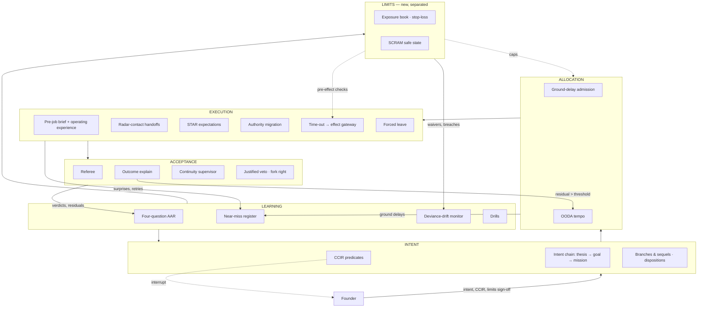

# S10 — Organisation theory: how the Compounding Organisation delegates, coordinates and learns under pressure

*Round 2 seat · Organisation Theorist (from outside software) · 2026-09-30. Builds on R0-B (`r0-outward/R0-B-organisations.md`),
designs inside R1-SYNTHESIS, reads ENGINE-SPEC §3–5. Sources accessed 2026-09-30 and listed at the end. **[spec]** marks
speculation; every cost/time figure in the worked examples is an estimate, not a measurement.*

---

## 1. Summary — the design in ten lines

1. Armies, film sets, kernels, trading floors, hospitals, towers and reactors converged on the same **seven laws**; the
   carried-forward architecture honours four and **violates three** (§2.2). Each violation gets a mechanism, not a warning.
2. **Challenge to the synthesis (upward): add a fifth separated authority — LIMITS.** Every trading firm separates the
   desk that takes risk from the function that *sets and enforces* its limits. R1 lets the Allocator fund work *and*
   implicitly bound its exposure. That is the front office setting its own risk limits (§7).
3. **Intent layer** gains **CCIR** (the founder's pre-declared "wake me if…" list) and **two-levels-up intent** in every brief.
4. **Allocation** gains **ground-delay admission**: no mission launches if the Referee queue cannot accept its output in time
   (air traffic control holds aircraft at the gate, not in the air).
5. **Execution** gains **radar-contact handoffs** (ownership never lapses between agents), **pre-job briefs with operating
   experience**, a **hospital time-out** at every R3/R4 effect, and **authority migration** in incidents.
6. **Acceptance** gains **independent outcome explain** (trading P&L attribution): every metric move is decomposed; an
   unexplained residual means the world model is wrong and triggers an orientation mission (Boyd).
7. **Learning** gains a **four-question AAR** on every mission, a **near-miss register** fed by events the Referee passed,
   and a **deviance-drift monitor** that watches waiver and override *rates* (Vaughan's normalisation of deviance).
8. **Series-mode ventures get forced leave**: the running configuration is periodically replaced by a fresh one reading
   only systems of record — the bank's two-week absence rule, applied to agents at zero cost.
9. Every venture declares a **SCRAM safe state** in its Charter — what "shut down safely" means — reachable automatically,
   without permission, by any agent that sees a trip condition.
10. With tireless near-free workers, five new organisational forms open (§6.9): the shadow org, the standing OPFOR, the
    forked command, the drill-saturated org, and the many-critics-per-maker inverse span.

---

## 2. The design

### 2.1 Seven laws that recur across every high-pressure organisation

| # | Law | Where it was paid for | Status in R1 architecture |
|---|---|---|---|
| L1 | **Intent travels, instructions rot** | Moltke's mission command; Rust RFC dispositions | Honoured (Standing Orders are policies, not methods) |
| L2 | **Ownership never lapses at a seam** | ATC position relief — both controllers share responsibility for the briefing; I-PASS | *Partially* — leases exist, but handoff acceptance is undefined |
| L3 | **Whoever takes risk does not set their own limits** | Trading middle office; SEC Rule 15c3-5 (Knight Capital, $460M in ~45 min, $12M penalty) | **Violated** — no independent limits authority |
| L4 | **Authority flows to the expertise nearest the event** | Weick & Sutcliffe's *deference to expertise*; carrier flight decks where anyone may foul the deck | **Violated** — authority is static by layer |
| L5 | **Deviance normalises unless its *rate* is watched** | Vaughan on Challenger: repeated anomaly without consequence became "acceptable risk" | **Violated** — shadow-mode, waivers and overrides are counted per event, never as a trend |
| L6 | **Pace is set by the downstream bottleneck** | ATC ground-delay programmes; Toyota pull | Honoured in principle (fan-out bounded by verifier capacity) — needs a mechanism |
| L7 | **Learning counts only when a mechanism changes** | AAR, M&M, INPO operating experience | Honoured in principle (Learn move always runs) — needs a closure rule |

Two more are latent: **L8 — hidden dependence surfaces only in absence** (bank block leave; see §2.6.4) and **L9 — orientation,
not speed, decides tempo** (Boyd: the Orient step shapes every other step).

### 2.2 Where the architecture violates a hard-won law, and the fix

| Violation | Evidence it matters | Fix (mechanism, layer) |
|---|---|---|
| **V1. Allocator bounds its own exposure.** Budgets are tokens/USD, but the real exposures are outbound volume, open customer promises, reputation surface, irreversible effects in flight. Nobody independent of the funder sets those. | Knight: controls existed but were not *pre-trade* and not independently reviewed (SEC order). Rogue-trader cases share one trait: the risk-taker could touch the controls. | **LIMITS authority** (§2.6.1) — a fifth separated authority owning an exposure book and hard pre-effect checks in the gateway. |
| **V2. Static authority in incidents.** The Mind owns thesis, Allocator owns capacity, Referee owns verdict. At 3 a.m. the agent holding the live picture has none of them. | HRO research (carriers, ATC): authority migrates down to the operator during high tempo and back up afterwards. | **Authority migration** (§2.6.2) with an explicit return. |
| **V3. Learning is fed only by Acceptance.** R1's arrow runs Referee → Learning. Anything the Referee passed never teaches — including near misses, retries, lucky saves. | Preoccupation with failure: small deviations are symptoms. Vaughan: "mistakes are socially organized and systematically produced." | **Near-miss register + deviance-drift monitor** (§2.7.2–2.7.3). Every layer writes to Learning, not only Acceptance. |
| **V4. Handoffs are implied, not accepted.** A lease expires and a new job starts; nobody affirmatively *took* the state. | FAA JO 7110.65: relief briefing with a displayed checklist; relieving and relieved controller share responsibility. I-PASS: −23% medical errors (NEJM 2014, via R0-B). | **Radar-contact handoff** (§2.6.3). |
| **V5. The Referee is a terminal gate.** Inspection at the end is the weakest reliability pattern; HROs rely on *sensitivity to operations* during the work. | Weick & Sutcliffe; STAR self-checking in nuclear operations ("verify the actual response is the expected response"). | **In-flight expectation checks** — every Execute move declares its expected observable before acting (§2.6.3, pre-job brief). |

### 2.3 Mechanism map

Mechanisms are grouped below by the layer that owns them (§2.4 Intent · §2.5 Allocation · §2.6 Limits, Execution,
Acceptance · §2.7 Learning); each states its trigger. Diagram 3.1 shows the whole map.

### 2.4 Intent layer

**2.4.1 CCIR — the founder's "wake me if" list.** Mission command pairs freedom of method with a short list of facts the
commander must hear at once. That list is the cleanest answer yet to founder direction #2 ("the right altitude"): altitude
is not a volume setting, it is a *named set of predicates* the founder owns.

```yaml
ccir:                               # per venture, in the Charter; founder-authored, versioned
  venture: ven_agency-02
  version: 4
  priority_intel:                   # PIR — about the world
    - id: pir-1
      predicate: "competitor.pricing_change AND competitor.id in watchlist"
      why: "Our pricing thesis assumes a 30% premium holds"
    - id: pir-2
      predicate: "customer.churn_notice AND customer.mrr >= 2000"
  friendly_force:                   # FFIR — about us
    - id: ffir-1
      predicate: "exposure.reputation_surface_increase > 0 AND brand == founder_name"
    - id: ffir-2
      predicate: "scram.tripped"
  delivery: interrupt               # always interrupt class; never batched into dailies
  valid_until: 2026-12-31           # an expired CCIR forces a review, never silently persists
```

**Trigger:** every event on the bus is matched against active CCIR predicates by a deterministic matcher (no model in the
loop). **Anti-drift rule:** a CCIR that fired ≥5 times in 30 days with the founder taking no action is proposed for
demotion; one that never fired in 90 days is proposed for retirement. The founder's interrupt budget stays honest.

**2.4.2 Two-levels-up intent.** Every compiled brief carries the intent of the mission *and* of its parent goal *and* of
the venture thesis above it. When the plan breaks, the worker reasons from the grandparent, which is exactly how mission
command survives lost communications. Data: `brief.intent_chain: [mission, goal, thesis]`, each ≤ 400 chars.

**2.4.3 Decision points, branches and sequels.** Plans name in advance the signal at which they fork ("if signups < 40 by
day 10, branch B: switch channel"). Branches are pre-costed so the Allocator can reserve for them; a fired branch needs no
new approval if it was approved as part of the plan. This converts many would-be founder asks into pre-authorised forks.

**2.4.4 Disposition-first decisions.** The Rust RFC process proposes a *disposition* — merge, close, **postpone** — before a
ten-day final comment window. Adopted for every DecisionPacket: the proposing seat states the disposition up front;
*postpone* is a first-class outcome that files the item into the idea board with a revisit trigger, rather than a decision
that silently rots.

### 2.5 Allocation layer

**2.5.1 Ground-delay admission.** ATC holds aircraft on the ground when arrival capacity drops, because holding in the air
burns fuel and multiplies risk. The equivalent: work finished but awaiting acceptance rots (merge conflicts, stale premises,
leases held). So admission control is set by **downstream acceptance capacity**, not by budget alone.

```ts
interface AdmissionCheck {
  mission_id: string;
  expected_output_at: string;          // ISO time the mission expects to hand to Referee
  referee_family_required: 'claude' | 'codex' | 'either';
  referee_queue_forecast_min: number;  // from Referee capacity model
  acceptance_sla_min: number;          // venture policy, e.g. 120
  decision: 'launch' | 'ground_delay' | 'reroute_family';
  release_at?: string;                 // for ground_delay: the slot
}
```

**Trigger:** every investment-lane launch. **Never applies to the obligations lane** (incidents are the equivalent of
emergency aircraft — they land first). This is R1 resolved-conflict 7 made operational.

**2.5.2 OODA tempo as an allocation input.** Boyd's claim is that the side whose *orientation* updates faster wins. Measure
per venture: `signal→orientation_update` latency (how long before a relevant signal changes the world model) and
`orientation→effect` latency. Allocation favours missions that shorten the slower of the two. Ventures in contested markets
declare a target tempo in the Charter.

### 2.6 Execution, Limits and Acceptance

**2.6.1 LIMITS — the fifth authority (the exposure book).** Modelled on the trading middle office: limits are nested
(firm → desk → trader ≈ portfolio → venture → mission), measured daily, and the risk function can force a flattening.
Exposure is not spend. It is what could go wrong *outside* if everything in flight went bad at once.

```yaml
exposure_book:                     # owned by LIMITS; read-only to Mind and Allocator
  scope: ven_saas-01
  limits:
    outbound_messages_per_day: {limit: 400, used: 212}
    open_customer_promises:     {limit: 25, used: 19}          # promises with dates
    irreversible_effects_in_flight: {limit: 3, used: 1}        # R4 queued/executing
    reputation_surface:         {limit: 2, used: 1}            # public channels posting under brand
    money_at_risk_usd:          {limit: 1500, used: 380}       # ad spend + refunds + commitments
    correlated_config_share:    {limit: 0.6, used: 0.72}       # share of missions on one skill@version or model
  stop_loss:                                                   # trip → forced flatten
    - metric: refunds_24h_usd
      threshold: 500
      action: scram_partial:payments
  breach_policy: {soft: notify_mind, hard: gateway_refuse, stop_loss: scram}
  set_by: founder_or_limits_seat   # never by Allocator or Mind
  reviewed: weekly                 # 15c3-5 lesson: the controls themselves get reviewed
```

Enforced **pre-effect in the effect gateway** (15c3-5 is a *pre-trade* rule: Knight's controls did not block orders before
they reached the market). The Limits seat is launched on demand like any seat, but its record may not share a model family
with the Allocator run it is checking that week, and it cannot fund anything. `correlated_config_share` operationalises R1
resolved-conflict 8.

**2.6.2 Authority migration.** When an incident is declared (obligations lane, severity ≥ S2), authority over the affected
resources **migrates to an Incident Lead seat** launched with the live picture; the Mind's thesis authority and the
Allocator's queue are suspended *for those resources only*. Authority returns on a written "stand-down" record. Two rules
from carriers and ICS: (a) migration is to a *named role*, never to "whoever", so authority stays legible (Valve's failure);
(b) any agent may trigger SCRAM regardless of rank, but only the Incident Lead may *restart*.

```yaml
authority_migration:
  incident: inc_2026-10-04-0312
  resources: [deploy:prod, domain:send.brand.io, lease:repo/api/**]
  from: {mind: ven_saas-01, allocator: portfolio}
  to: incident_lead@rec_reliability-designer@2
  suspended: [investment_missions touching resources]
  return_condition: "error_rate < 0.5% for 30m AND referee.verified_fix"
  stand_down_record: required
```

**2.6.3 Radar-contact handoff, pre-job brief and in-flight expectations.**

- **Radar contact.** A transfer of any lease, role or open obligation is a two-phase commit: sender posts an I-PASS-shaped
  packet; receiver produces a **read-back** (a machine diff of what it understood vs what was sent — cheap for agents, R0-B
  §5); only on `accept` does ownership move. Until then the sender still owns it and its lease cannot expire.
- **Pre-job brief (nuclear).** Before any mission and any R2+ job: critical steps, error-likely situations, **operating
  experience** (the three most similar AARs and near misses across *all* ventures, redacted per data boundary), and a
  "what if" for each critical step. INPO's industry-wide operating-experience sharing is the model for cross-venture
  learning without leaking.
- **In-flight expectations (STAR).** Every Execute move declares `expected_observable` before acting; the runner compares.
  Unexpected response → the move stops and conservative action applies ("conservative actions are taken when understanding
  is incomplete" — INPO traits). Surprise is data: it goes to the near-miss register even if the task later succeeds.

```ts
interface HandoffPacket {
  from_job: string; to_seat: string;
  illness_severity: 'stable' | 'watch' | 'unstable';      // I-PASS "I"
  summary: string;                                          // P
  action_list: {item: string; due?: string}[];              // A
  situation_awareness: {contingencies: string[]; leases: string[]; open_promises: string[]}; // S
  readback?: {diff: string[]; accepted: boolean; at: string};   // S — synthesis by receiver
}
```

**2.6.4 Forced leave.** Banks require people in sensitive positions to be absent for two consecutive weeks, because
concealment usually needs the concealer's constant presence (Fed SR 96-37; FDIC). A Series-mode venture run for weeks by
one configuration accumulates the agent equivalent: context held only in summaries, conventions nobody wrote down, a
workaround only that record knows. **Mechanism:** every N weeks (randomised 2–5), the venture is operated for 48 hours by a
different record — ideally the other model family — loading *only* systems of record and the world model, never the
outgoing record's notes. Every question it has to ask, every task it cannot continue, is a **hidden-dependence finding**
written to the world model. This is J2's "transferable operating-company package" tested continuously instead of once.

**2.6.5 SCRAM safe state.** Reactors do not ask permission to scram. Every venture Charter declares its safe state, and trip
conditions any agent can fire:

```yaml
scram:
  venture: ven_saas-01
  safe_state:
    keep: [serve_existing_customers, support_inbox_triage, billing_readonly]
    stop: [outbound_all, deploys, ad_spend, new_missions]
    hold: [open_promises -> wind_down_owner]             # R1 conflict 4: obligations survive
  partial_scopes: [payments, outbound, deploy]
  trips:
    - "limits.stop_loss.any"
    - "gateway.refusals_10m > 20"
    - "referee.integrity_failure"                          # e.g. evidence from a system of record disagrees with receipts
    - "any_agent.manual"                                   # andon, R0-B
  restart: incident_lead + referee_pass; founder if trip was manual by the Limits seat
```

**2.6.6 Time-out at the gateway.** Wrong-site surgery is the canonical "right action, wrong target" failure; the Universal
Protocol's time-out has the team stop and confirm identity and site aloud. For every R3/R4 effect the gateway renders a
target card — *which* account, environment, recipient list (count + 3 samples), amount, brand — and a second-family agent
confirms it against the intent chain. Cost: one small model call; it catches the Knight-class "old flag on one server"
error where the action is valid and the target is wrong.

**2.6.7 Second unit and continuity supervisor (film).** A second unit shoots under the director's intent in parallel —
inserts, establishing shots — freeing the main unit for the hard scenes. Mission shape `lead+second_unit`: the second unit
takes the parallelisable low-stakes work (variants, localisation, fixtures) under the same intent chain. The **continuity
supervisor** is an Acceptance-side seat that checks parallel outputs for mutual consistency — pricing stated identically
across landing page, email and docs; claims matching the world model — which no single-output Referee sees.

**2.6.8 Independent outcome explain (P&L attribution).** Trading desks explain every day's P&L into components (market
moves, new trades, carry, residual) and a large *unexplained* residual is investigated, because it means the risk model is
wrong. Per venture, daily:

```yaml
outcome_explain:
  venture: ven_saas-01
  metric: mrr
  delta: +420
  attributed:
    - {cause: mission:msn_pricing-page-v3, amount: +260, method: holdout, confidence: 0.7}
    - {cause: external:seasonality, amount: +90, method: prior_year, confidence: 0.5}
    - {cause: churn:cust_118, amount: -110, method: record}
  residual: +180                       # 43% of delta — unexplained
  residual_threshold: 0.25
  action: open_orientation_mission     # Boyd: the world model is mis-oriented
  computed_by: referee_family != mission_builder_family
```

Attribution also feeds the calibration ledger: a Bet credited with an outcome must survive the explain, or its credit is
provisional. This answers J2's "authoritative database still describes a biased slice" at the metric level.

**2.6.9 Justified veto and fork right.** Apache voids a -1 without technical justification; open source keeps maintainers
honest because anyone can fork. With near-free workers, a blocked disagreement is resolved by **forking the work, not the
argument**: a vetoing critic may request a funded fork (capped at 20% of the mission budget) that builds its alternative;
the Referee judges both against the preregistered criteria. Unjustified vetoes are void; repeatedly losing forks lower the
critic's calibration.

### 2.7 Learning layer

**2.7.1 Four-question AAR, hot and cold.** TC 25-20 begins by restating the commander's mission and intent — "what was
supposed to happen" — then what happened, why the difference, and what to sustain/improve. Every mission conclusion runs a
**hot wash** (automatic, minutes); ventures run a **formal AAR** weekly across missions.

```yaml
aar:
  mission: msn_outreach-q4-03
  supposed_to_happen: "<intent chain + preregistered criteria, copied, not paraphrased>"
  happened: "<receipts + outcome_explain refs only — no agent narrative>"
  why_different:
    - {factor: "list decay 31% vs assumed 10%", evidence: rcpt_…}
  opfor: "<what the world/competitor/customer was trying to do>"   # TC 25-20 includes the opposing force's intent
  sustain: [...]
  improve:
    - change: {kind: standing_order | skill | record | limit | ccir | world_model, target: ..., diff: ...}
      owner_role: ...
      due: 2026-10-14
  closure: open | changed | rejected_with_reason
```

**Closure rule (L7):** an `improve` item without a `change` of a named kind is not accepted by the lint. **KPI:** closure
rate (changed mechanisms ÷ AARs with findings), tracked beside the M&M figure R0-B cites (7.6% of residents saying issues
"always" lead to change).

**2.7.2 Near-miss register.** Written by *every* layer: retries, gateway refusals, time-out catches, surprises from STAR,
overrides, lucky saves, lease contentions, handoff read-back diffs. Weighted by "how close" (distance to a limit, to a trip,
to an irreversible effect). A cluster of near misses on one mechanism opens a mission even though nothing failed.

**2.7.3 Deviance-drift monitor.** Normalisation of deviance is a *rate* phenomenon: each waiver looks reasonable. The
monitor tracks, per rule/limit/check: waivers, overrides, shadow `would_block` events, SLA extensions. **Trigger:** a
rising 4-week trend or >3 waivers in 30 days on one rule. **Output:** a forced disposition — either the rule changes (it
was wrong) or the waivers stop (the rule is right) — never a fourth waiver. This harness already has the raw material: its
own shadow-mode `claim.would_block` stream and dated waivers are precisely the series Vaughan says to watch.

**2.7.4 Drills.** Nuclear crews, flight decks and armies drill because reliability decays without rehearsal. Agents make
drills nearly free. Weekly per autonomous venture, in the twin: an injected incident (bad deploy, payment dispute,
impersonation, provider outage), scored on time-to-SCRAM, handoff completeness and CCIR routing. **After every model
release** (R1's model-release reflex) a full drill set runs before the new model enters any Series-mode venture.

---

## 3. Diagrams

### 3.1 Where the mechanisms sit — five authorities, learning fed by all



### 3.2 Radar-contact handoff state machine

```mermaid
stateDiagram-v2
  [*] --> Owned_by_sender
  Owned_by_sender --> Offered: sender posts HandoffPacket
  Offered --> ReadBack: receiver loads trace + packet
  ReadBack --> Accepted: diff empty or resolved
  ReadBack --> Offered: diff → sender clarifies
  Offered --> Owned_by_sender: timeout (lease NOT released)
  Accepted --> Owned_by_receiver: lease transferred atomically
  Owned_by_receiver --> [*]
  note right of Offered: sender keeps lease + heartbeat;\nownership never lapses
```



### 3.3 SCRAM and authority migration in an incident

```mermaid
sequenceDiagram
  participant W as Support Triage agent (any)
  participant G as Effect gateway
  participant LM as Limits seat
  participant IL as Incident Lead (other family)
  participant M as Venture Mind
  participant F as Founder
  W->>G: refund pattern anomalous (STAR surprise)
  G->>LM: stop_loss refunds_24h_usd ≥ 500
  LM->>G: SCRAM partial:payments
  G-->>M: investment missions on payments suspended
  LM->>IL: launch with live picture; authority migrates
  G-->>F: CCIR ffir-2 (scram.tripped) — interrupt
  IL->>IL: pre-job brief with operating experience
  IL->>G: fix via time-out-confirmed effects
  IL->>LM: stand-down record + referee pass
  LM->>G: restart payments
  IL->>M: authority returns; AAR opened
```

---

## 4. Interfaces

| Part | S10 needs from it | S10 gives to it |
|---|---|---|
| **Mission engine** | Move library hooks for pre-job brief, STAR `expected_observable`, AAR as the Learn move; branch/sequel support in plans | Admission decision (ground delay), AAR schema, fork-right funding rule, disposition-first DecisionPackets |
| **Agent organisation / identity** | Records for Incident Lead, Limits seat, Continuity Supervisor; family tags per record | Calibration updates from forks, AAR closure, forced-leave findings; the rule that Limits ≠ Allocator family in a given week |
| **Autonomy** | Door types, risk classes R0–R4, contact classes | CCIR as the founder's owned altitude predicates; SCRAM as the autonomy floor at every level; authority migration as a defined A-level override |
| **Memory / world model** | Similarity retrieval over AARs and near misses across ventures under data boundary; read-tracking | Operating experience packets; hidden-dependence findings; residual-triggered orientation missions |
| **Engineering / runner** | Event bus with deterministic CCIR matcher; gateway pre-effect hook; atomic lease transfer; twin for drills | Exposure book schema; time-out card spec; handoff two-phase commit semantics |
| **Surfaces (Mission Control)** | Pages to render | An **Exposure page** (limits used/limit, stop-loss distance), a **Near-miss heatmap**, **CCIR editor**, **AAR closure board**, **Incident mode** that re-skins the app when authority has migrated |
| **Economics** | Referee capacity model per family; cost per drill | Ground-delay reduces wasted in-flight work; `money_at_risk_usd` as a first-class line beside spend |
| **Evals / self-improvement** | Twin and replay | Drill scores; closure rate; deviance-drift trends as organisation-health metrics |
| **External world** | Gateway, receipts, systems of record | Time-out target cards; stop-loss definitions for money and outbound channels |

---

## 5. Worked examples

### 5.1 3:12 a.m. — refund storm in an autonomous SaaS venture (A3, founder asleep)

| Time | What happens | Who (title · model) | Cost (est.) |
|---|---|---|---|
| 03:12 | Support Triage agent sees 9 refund requests in 20 min citing "charged twice". Its STAR expectation for the hour was ≤1. Surprise → near-miss entry | Support Triage · claude-haiku-4-5 | $0.02 |
| 03:14 | Refunds processed so far total $520 → `stop_loss refunds_24h_usd` trips; Limits seat fires **SCRAM partial:payments**: billing to read-only, outbound paused, customers still served | Limits seat · gpt-6-astra (Codex) — Allocator ran on Claude this week | $0.05 |
| 03:14 | CCIR `ffir-2` matches → **interrupt** to founder's phone with a two-line card: "Payments scrammed; suspected double charge; Incident Lead running; no action needed unless you want to take it." | deterministic matcher | — |
| 03:15 | **Authority migrates** to Incident Lead over `deploy:prod`, `stripe:write`, `repo/billing/**`; two investment missions touching billing are suspended | Incident Lead (Reliability Designer record) · claude-opus-5 | — |
| 03:16 | Pre-job brief pulls operating experience: a similar idempotency-key bug in another venture's AAR from August (redacted) | Incident Lead | $0.30 |
| 03:40 | Root cause: a retry in yesterday's merged webhook handler without idempotency key. Fix built by Maker (Codex), reviewed by Referee (Claude) reading Stripe as system of record | Maker · gpt-6-astra; Referee · claude-opus-5 | $3.10 |
| 03:55 | Refund effect for 23 affected customers passes **time-out**: target card shows 23 charge ids, total $1,104, 3 samples; second-family confirm | gateway + claude-sonnet-5 | $0.04 |
| 04:20 | Stand-down: error rate 0 for 30 min, Referee pass; Limits restarts payments; authority returns to the Mind | — | — |
| 04:25 | Hot-wash AAR: *improve* → skill `webhook-idempotency@1.3` adds a done-test; **Limits** adds `duplicate_charge_rate` stop-loss; relationship-repair mission queued for 08:00 (apology + credit, R3 → asks founder at wake) | Learning | $0.40 |

Total ≈ **$4**, 73 minutes, one founder interrupt with no decision required, one decision queued for morning. Memory writes:
near-miss, AAR with two mechanism changes, world-model update (customer list flagged), operating-experience packet shared
portfolio-wide.

### 5.2 An agency venture's outreach — limits, drift and forced leave

Venture: a B2B content agency at A2. The Growth Engineer (hybrid: analytics × copy × experiments; claude-opus-5) proposes
a 1,200-message outbound campaign over four days.

1. **Allocation:** Admission check forecasts the Referee (Codex) queue at 40 min vs a 120-min SLA → `launch`.
2. **Limits:** exposure book has `outbound_messages_per_day: 400`. The plan is re-split into 3 × 400 automatically — no
   founder ask. `reputation_surface` unchanged (sent from the agency brand, not the founder's name; CCIR `ffir-1` would
   have interrupted otherwise).
3. **Branch pre-authorised:** "if reply rate < 1.5% after batch 1, branch B: switch to the second ICP segment" — costed and
   approved with the plan.
4. **Time-out** before batch 1: target card shows the list is from `crm:agency-02`, 400 recipients, 3 samples. The confirmer
   (gpt-6-astra) flags that 11 recipients also appear as *customers* in another venture's CRM — data-boundary conflict →
   removed. A near-miss is written.
5. **Deviance drift:** over the past month the "cold-send volume" limit had been waived three times by the founder at the
   Mind's request. The monitor forces a disposition in this week's board pack: raise the limit to 600 permanently (with the
   reply-rate evidence) or stop requesting waivers. Founder picks "raise to 500" — 1 minute of his time.
6. **Outcome explain** after day 4: pipeline +9 meetings; attribution credits 6 to the campaign (holdout segment), 2 to a
   referral, residual 1 → within threshold.
7. **Forced leave (week 5):** the Growth Engineer record is swapped for a classic Copywriter + Analyst pair on Codex for 48
   hours. They cannot find where the "do not contact competitors' employees" rule lives — it existed only in the prior
   record's session notes. Finding promoted into a Standing Order; hidden-dependence count for the venture drops from 4 to 3.

Estimated cost: ≈ $18 in model calls over four days plus sending costs; founder time ≈ 3 minutes.

---

## 6. Ideas the founder did not ask for

1. **Limits as a fifth authority** (§2.6.1, §7).
2. **Forced leave for agents** — the continuous test of "could someone else run this company tomorrow?" (§2.6.4).
3. **CCIR editor as the founder's altitude control** — predicates, not notification settings; ignored ones retire (§2.4.1).
4. **Outcome explain → orientation mission** — the organisation notices when it no longer understands its numbers (§2.6.8).
5. **Deviance-drift monitor pointed at this harness** — its dated waivers and shadow `would_block` stream are Vaughan's
   pattern in miniature; run the monitor on the repo before any venture.
6. **Fork right** — fund the dissenter's build, capped, judged on preregistered criteria (§2.6.9).
7. **Drill after every model release** before the model enters any Series-mode venture (§2.7.4).
8. **Incident mode for Mission Control** — the whole app changes posture when authority has migrated, as a control room does.
9. **Operating-experience digest** — INPO-style weekly cross-venture digest of top near misses, redacted by data boundary.

### 6.9 New organisational forms possible only when workers are tireless, parallel and near-free

| Form | What it is | Why humans could not | Mechanism hook |
|---|---|---|---|
| **Shadow organisation** | A second org design runs every mission on recorded inputs alongside the live one; outcomes compared weekly | Doubling staff to run a counterfactual company is absurd for humans | Replay in the twin; ENGINE-SPEC §11 |
| **Standing OPFOR** | A permanent opposing force — competitor, regulator, hostile customer — with its own intent statement, playing against every plan | Red cells are expensive and get captured by the home team | AAR `opfor` field; Challenge moves |
| **Forked command** | Three leads run the same mission under different intents for an hour; the best trajectory continues | A human commander cannot be copied | Mission shape `audition` with lead-level fork |
| **Drill-saturated org** | More rehearsal than operation: every week more incidents are drilled than occur | Drills cost people's time and morale | §2.7.4 |
| **Inverse span of control** | Many critics per maker (5–9 lenses on one draft) rather than many reports per manager | Reviewer time is the scarcest human resource | Bounded by Referee capacity, via ground-delay |
| **Zero-tenure crews** | No agent holds a role long enough to accumulate private context; forced leave is the norm, not the check | Humans need tenure to be productive | Forced leave + radar-contact handoffs |
| **Precedent court** | Every past decision with its outcome is citable; a new decision must cite or distinguish precedent | Human institutions cannot retrieve all precedent | Priors Library + dispositions |

---

## 7. Challenge to the synthesis

**Add LIMITS as a fifth separated authority.** R1's principle is that no agent both decides what matters, funds it, does it
and judges it. That covers *doing* and *judging*. It misses **bounding**. Every mature risk-taking organisation separates
the unit that takes positions from the unit that sets and enforces their limits; SEC Rule 15c3-5 made pre-trade controls
compulsory after the flash-crash era, and Knight Capital was fined under it for controls that were neither in the path nor
reviewed. In R1 the Allocator funds a mission and the effect gateway checks "budget and policy" — but who writes that policy,
and who can force a flatten when the combined exposure of five individually reasonable missions is unacceptable? Today the
answer is the Allocator or the Mind, both of which want the missions to run.

**Proposal.** Five authorities: **Intent · Allocation · Limits · Execution · Acceptance**, with Learning fed by *all five*
(not only Acceptance). Limits owns the exposure book, stop-losses, SCRAM trips, correlated-config caps and the review of its
own controls; the founder signs limits the way he signs a Charter. It never funds, never builds, never judges quality. Cost:
one on-demand seat and a deterministic checker in the gateway.

**Second, smaller challenge: Learning's input arrow.** R1 draws receipts and outcomes flowing from Acceptance to Learning.
HRO research says the richest signal is what *did not* fail: near misses, surprises, waivers. Every layer must write to the
near-miss register (§2.7.2), or the organisation learns only from its disasters.

---

## 8. Risks — each with a design answer

| Risk | Design answer |
|---|---|
| **Limits seat strangles the ventures** (risk functions become the "department of no") | Limits are founder-signed and reviewed weekly with utilisation data; a limit at <30% use for 8 weeks is proposed for tightening, one breached-then-waived is surfaced by the drift monitor for raising. Limits bound exposure, never method. |
| **CCIR becomes a notification firehose** | Deterministic matcher; auto-demotion of ignored predicates; interrupt count is a founder-attention line in the ledger. |
| **Authority migration gets stuck** (incident authority never returns) | Return condition is declared at migration; a migration open > 24 h forces a founder-visible DecisionPacket; stand-down record required. |
| **Forced leave disrupts a live venture** | 48-hour windows, obligations lane unaffected, outgoing record on call for *read-back only*, never for doing the work; windows skip weeks with open incidents. |
| **AARs become ceremony** (the M&M failure) | Closure lint: an `improve` without a typed mechanism change is rejected; closure rate is a published KPI. |
| **Time-out confirmer rubber-stamps** | Confirmer is other-family, sees only the target card and intent chain (not the maker's narrative); seeded mismatches in drills measure its catch rate. |
| **Outcome explain gives false precision on sparse data** | Confidence per attribution; residual threshold scales with sample size; "not yet observable" is a legal attribution (J2's point about delayed retention). |
| **Fork right wastes budget on sore losers** | Cap at 20% of mission budget; fork only on a justified veto; critics whose forks lose repeatedly lose calibration weight. |
| **Correlated failure in the controls themselves** (one bug in the gateway checker) | The gateway checker is deterministic, versioned, drilled; Limits reviews it quarterly with seeded violations — the 15c3-5 "review your controls" duty. |

---

## 9. Open decisions (≤3)

1. **Is LIMITS a fifth authority or a sub-authority of Acceptance?** *Recommendation: fifth authority.* Acceptance judges
   work already done; Limits bounds work not yet done. Merging them repeats the design where one function both clears and
   caps, and the Referee's queue would then gate every effect's exposure check — a throughput hazard.
2. **Forced-leave cadence for Series-mode ventures.** *Recommendation: randomised every 2–5 weeks, 48 hours, other model
   family where possible;* tighten to every 2 weeks for any venture handling money autonomously.
3. **Who may restart after a SCRAM tripped by the Limits seat?** *Recommendation:* Incident Lead + Referee pass for automatic
   trips; the founder for trips caused by a limit he signed at the R4 level (money, legal, identity).

---

## Sources (accessed 2026-09-30)

- Round 0 sources as cited in `r0-outward/R0-B-organisations.md` (Moltke/Bungay, ICS, film, Toyota, Amazon, Apache, I-PASS/NEJM, Linux, Pixar).
- Knight Capital: SEC administrative proceeding, market access rule violation, ~45 minutes, >$460M loss — [sec.gov/files/litigation/admin/2013/34-70694.pdf](https://www.sec.gov/files/litigation/admin/2013/34-70694.pdf); $12M penalty — [Finance Magnates](https://www.financemagnates.com/forex/regulation/a-costly-error-knight-capital-to-pay-12-million-to-sec-as-penalty-for-catastrophic-2012-trading-incident/); [PRMIA case study](https://prmia.org/common/Uploaded%20files/eAI/PRMIA%20Case%20study%20-%20Knight%20Trading.pdf).
- Trading limit hierarchies and stop-loss limits — [Federal Reserve Trading Manual §2000.1](https://www.federalreserve.gov/boarddocs/supmanual/trading/2000p1.pdf); [value-at-risk.net: Risk limits](https://www.value-at-risk.net/risk-limit/); desk VaR limits as binding constraint — [Fed FEDS 2025-034](https://www.federalreserve.gov/econres/feds/files/2025034pap.pdf).
- Required absence (two consecutive weeks) — [Fed SR 96-37](https://www.federalreserve.gov/supervisionreg/srletters/SR9637.htm); [FDIC FIL-52-95](https://www.fdic.gov/news/financial-institution-letters/1995/fil9552.html); [NY Fed circular 10923](https://www.newyorkfed.org/banking/circulars/10923.html).
- HRO five principles — [high-reliability.org](https://www.high-reliability.org/the-five-principles-of-weick-sutcliffe); [PSL Hub](https://www.pslhub.org/learn/improving-patient-safety/design-for-safety/processes/the-five-principles-of-weick-sutcliffe-high-reliability-organizing-9-november-2020-r5296/).
- Carrier flight operations as a self-designing HRO — Rochlin, La Porte, Roberts, *Naval War College Review* 40(4), 1987 — [USNWC digital commons](https://digital-commons.usnwc.edu/nwc-review/vol40/iss4/7/).
- Normalisation of deviance — [Wikipedia: Diane Vaughan](https://en.wikipedia.org/wiki/Diane_Vaughan); [Columbia Magazine](https://magazine.columbia.edu/article/challenger-disaster-normalization-deviance).
- AAR — [TC 25-20 (1993)](https://nick.groenen.me/attachments/public/gitignored/TC%2025-20%20A%20Leader's%20Guide%20to%20After-Action%20Reviews.pdf); [Wikipedia: After-action review](https://en.wikipedia.org/wiki/After-action_review).
- OODA — [Chet Richards, "Boyd's OODA Loop"](https://gamechanger.nu/wp-content/uploads/2025/10/Boyds-OODA-Loop-Necesse-vol-5-nr-1.pdf); [The Decision Lab](https://thedecisionlab.com/reference-guide/computer-science/the-ooda-loop).
- ATC position relief — [FAA JO 7110.65 (current change)](https://www.faa.gov/documentLibrary/media/Order/7110.65BB_Chg_3_dtd_7-9-26.pdf); [FAA Order, Ch. 2 §2 Administration of Facilities](https://www.faa.gov/air_traffic/publications/atpubs/foa_html/chap2_section_2.html). *Ground-delay programmes cited from general knowledge of FAA traffic flow management — not re-sourced here.*
- Nuclear conservative decision-making, questioning attitude, STAR — [NRC: Human Performance Tools](https://www.nrc.gov/docs/ML1021/ML102120052.pdf); [INPO 12-012 Traits of a Healthy Nuclear Safety Culture](https://www.nrc.gov/docs/ml1303/ml13031a707.pdf).
- Rust RFC final comment period, dispositions merge/close/postpone, ten days — [The Rust RFC Book](https://rust-lang.github.io/rfcs/).
- *Surgical Universal Protocol time-out and film second-unit/script-supervisor practice cited from general knowledge — not re-sourced here.*
