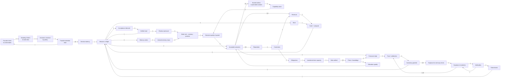
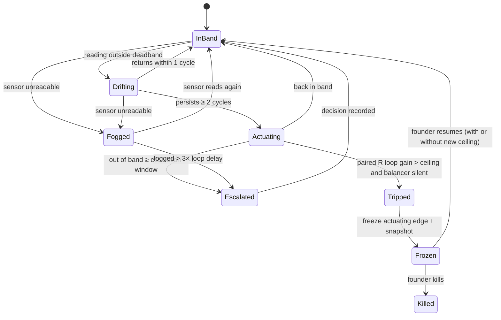
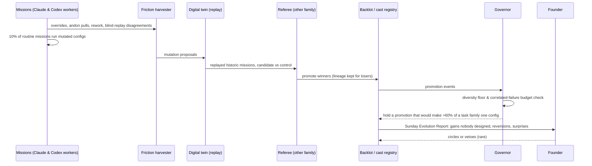

# S11 — Wildcard: the Compounding Organisation as a living system

*Round 2 seat · game designer + complex-systems scientist · 2026-09-30*

## 1. Summary
1. **Model the organisation as stocks and flows, not as agents.** Agents are ephemeral; what persists and compounds are ten
   stocks — Founder Attention, Trust, Capability, Knowledge, Cash+Compute, Reputation, Obligations, Verifier Capacity,
   Debt, and the Option Pool. Every mechanism in the synthesis is a flow into or out of one of them.
2. **Loops are first-class records.** A **Loop Registry** names every reinforcing (R) and balancing (B) loop, its sensors,
   its measured gain and its delay. The system watches its own loops the way an SRE watches latency.
3. **Homeostats with set-points and bands** regulate the stocks (verifier saturation, spend, founder load, memory mass,
   exploration temperature, work-in-progress). They can only **slow, stop or re-route — never start work or accept it.**
4. **A two-tier immune system**: innate (gateway, leases, lint) plus adaptive (every incident mints an **antibody** — a
   detector with a test, a false-positive budget and an expiry). Autoimmunity is budgeted, not ignored.
5. **Legibility by deviation, not by activity.** Hundreds of agents are rendered as **the Map**: loops and stocks, lit only
   where they leave their band. Unknown state is drawn as **fog**, never interpolated.
6. **The founder's game is interesting choices with real stakes** — decision cards, tempo control, a Chronicle — and an
   **Honest Scoreboard rule**: every number on screen resolves to a system of record. No XP, no streaks, no badges.
7. **Trust is a stock earned by calibrated prediction** (predict → reveal → score), spent as autonomy, and drained
   asymmetrically by surprises.
8. **Improvement nobody designed** comes from four standing evolutionary loops — variation, selection by the Referee,
   retention in the Backlot, decay by disuse — fed by harvested friction.
9. **Twelve Meadows leverage points** mapped to concrete levers; **eleven failure attractors** with signatures and escapes.
10. **Challenge (upward): add a fifth separated authority, Regulation** — the Governor — which owns set-points and breakers.

## 2. The design
A game designer and a systems scientist ask the same first question: *what accumulates?* An agent that runs for forty
minutes and dissolves is weather. The climate is what those forty minutes leave behind. The synthesis already says
"departments are stores and policies, not standing agents" — this seat takes that literally and builds the regulation,
immunity, legibility and motivation layers on top of the stores.

### M1 — The Stock Register (the organisation's state vector)

Ten stocks, each owned by a store the synthesis already names. Each has a unit, a sensor that reads it **from a system
of record**, a healthy band, and the flows that change it.

| Stock | Unit | Store / sensor | In-flows | Out-flows |
|---|---|---|---|---|
| **Founder Attention** (FA) | minutes/day | Attention Exchange | sleep, delegation via Standing Orders | decision cards, reading dailies, interrupts |
| **Trust** (T) | calibration score per (venture × task family × config) | Calibration ledger | kept forecasts, clean receipts | surprises, reversals, incidents |
| **Capability** (K) | accepted assets × reuse | Backlot, skills, Standing Orders, cast registry | strikes on wrap, promoted variants | decay, retirement, model-release obsolescence |
| **Knowledge** (Kn) | cited priors × evidence rung | Priors Library, Null Registry, world model | settled bets, observations | forgetting by disuse, falsification |
| **Cash + Compute** (C) | $ and token-hours | Ledger, provider usage | revenue (treasury rule), budget top-up | missions, retries, waste |
| **Reputation** (Rep) | per-brand external signal | reviews, reply rates, complaint rate, unsubscribes | delivered promises | outbound errors, spam, broken promises |
| **Obligations** (O) | open commitments weighted by due date | Attention field | sales, promises, incidents | fulfilment, wind-down |
| **Verifier Capacity** (V) | Referee-verified outcomes/day | Referee queue | new verifiers, cheaper checks | every mission that needs acceptance |
| **Debt** (D) | tech + memory + promise debt | lint counts, unread memory mass, overdue obligations | shortcuts, unconsolidated writes | repair missions, decay |
| **Option Pool** (OP) | live ideas with triggers | Idea board, turnaround list | scanning, founder ideas, spinoffs | greenlight, expiry |

```yaml
# stock.yml — one record per stock per venture (and one portfolio roll-up)
stock:
  id: verifier_capacity
  venture: dental-receptionist        # or "portfolio"
  unit: verified_outcomes_per_day
  sensor: { source: referee.queue, query: "throughput_24h", system_of_record: true }
  value: 38
  band: { floor: 20, set_point: 40, ceiling: null }  # a band per stock, not a target
  pressure: { inflow_24h: 51, outflow_24h: 38 }       # queue grows 13/day → saturation in n days
  time_to_boundary_days: 2.1
  owner_store: referee
  last_read: 2026-09-30T07:40:00Z
  fog: false                                         # true when the sensor could not be read
```

**Trigger:** every sensor is read on the heartbeat (default 15 min; obligations stocks 1 min). A sensor that fails to
read sets `fog: true` — it is never carried forward as the last value (the harness's own Rule 10, generalised: *a sensor
never reports what it could not read*).

### M2 — The Loop Registry

Every causal loop is a record, discovered by design or detected in the event log. A loop is a closed path through stocks
with a polarity. The registry measures each loop's **gain** (how much a unit change comes back around per cycle) and
**delay** (cycle time), because nearly every organisational pathology is a loop whose gain or delay nobody knew.

```ts
interface LoopRecord {
  id: string;                     // "R1-capability-compounding"
  polarity: 'R' | 'B';
  path: string[];                 // stock ids in order, e.g. ["K","speed","outcomes","T","autonomy","missions","K"]
  sensors: string[];              // events that evidence each edge
  gain_estimate: number;          // per cycle; >1 on R means growth, <1 on B means it is failing to correct
  delay_days: number;
  health: 'dormant' | 'active' | 'saturating' | 'runaway' | 'broken';
  paired_balancer?: string;       // every R loop must name the B loop that bounds it — lint fails otherwise
  last_measured: string;
}
```

**The pairing rule (lint):** *no reinforcing loop without a named balancing loop.* A new R loop — a new growth channel,
a new self-improvement mechanism — cannot be enabled until the loop that bounds it exists and has a live sensor. This is
the single most important structural rule in this seat; it is how runaway prevention becomes a property of the design
rather than a hope.

**Trigger:** gains recomputed nightly from the event log (edge = correlated deltas with the recorded delay, sanity-checked
against the declared path; a loop whose edges stop producing events is marked `broken`, which is often more alarming
than `runaway`).

### M3 — Homeostats (the Governor)

A homeostat holds a stock inside its band. It has a sensor, a set-point, a band, an actuator, and a **gain limit** so it
does not oscillate (the classic failure of a thermostat with no deadband). Actuators are deliberately weak: **throttle,
pause, re-route, degrade, page.** They cannot originate or accept work — the fifth authority (§10).

| Homeostat | Holds | Actuator when above band | Actuator when below band |
|---|---|---|---|
| **Verifier governor** | fan-out ≤ verifier capacity (synthesis §4.7) | cap new missions needing acceptance; shift to cheaper checks; fund a verifier-building mission | release queued missions |
| **Spend governor** | burn/day per venture inside budget band | degrade model tier; batch; pause investment lane (never obligations lane) | nothing — underspend is not a problem unless the Option Pool is starving |
| **Attention governor** | founder load ≈ 20 min/day, ≤ 5 open decisions | raise the silence-proceeds threshold for two-way doors; bundle cards; defer | surface circled-take requests and "choices you might enjoy" |
| **Memory-mass governor** | unread memory ≤ 15% of written mass | consolidation mission; decay sweep | nothing |
| **Exploration temperature** | share of investment lane on novel bets ∈ [15%, 35%] | slow new bets; promote exploitation | fund cheap scout bets from the Option Pool |
| **WIP governor** | open missions per venture ≤ Little's-law bound from verified throughput | stop starting, start finishing | allow new starts |
| **Reputation governor** | complaint rate, unsubscribes, reply sentiment inside band | pause outbound for that brand; route through a stricter gateway policy | none |

```yaml
homeostat:
  id: verifier-governor
  stock: verifier_capacity
  set_point: { load_ratio: 0.8 }   # demand / capacity
  deadband: 0.1                    # no action between 0.7 and 0.9 — prevents hunting
  max_actuation_per_hour: 1        # gain limit
  actuators: [throttle_acceptance_missions, prefer_cheap_checks, propose_verifier_mission]
  escalation: { after_hours_out_of_band: 24, to: founder, as: decision_card }
  can_start_work: false            # structural; checked by schema lint
  can_accept_work: false
```

**Runaway breaker.** A loop marked `runaway` (gain above its declared ceiling for two consecutive cycles while its paired
balancer shows no response) trips a breaker: the loop's actuating edge is frozen, the state is snapshotted, and the
founder receives one card: *"Loop R4 (ad spend → leads → revenue → ad spend) grew 3.1× in 36 h; its balancer B6 (CAC
ceiling) did not engage because its sensor is fogged. Frozen at current spend. Resume / resume with ceiling / kill."*

### M4 — The Immune System

Borrowed from immunology because the metaphor is structurally exact: innate defences are generic and fast, adaptive
defences are specific and learned, and the characteristic failure of a strong immune system is autoimmunity.

- **Innate** (exists in the synthesis): the effect gateway, fenced leases, receipts, schema lint, sandboxes, the Referee.
- **Adaptive — antibodies.** Every incident, reversal, andon pull or Referee rejection with a root cause mints an
  **antibody**: a detector (a query, test, or lint rule) that would have caught it, plus a **positive control** that proves
  the detector fires. Antibodies are shared across ventures by pattern, never by data (the Null Registry's privacy rules).
- **Memory cells.** Antibodies that fire more than once in 90 days are promoted to the innate layer (a gateway policy or
  a lint rule) by the normal promotion trial.
- **Autoimmunity budget.** Each antibody carries a false-positive rate; the immune system as a whole has a budget (target
  ≤ 5% of blocked actions later judged harmless). Over budget → the worst antibodies are put on probation (warn, not block).
  An immune system that blocks everything looks safe and is dead — the organisational version of this is the harness's own
  "a gate that reviewed nothing was indistinguishable from one that found defects".
- **Vaccination.** Weekly **fault injection**: known-bad artifacts (a poisoned skill, a fabricated metric, a stale lease, a
  prompt-injected inbound email) are fed through in a sandbox. A detector that fails to fire on its own vaccine is marked
  `broken` — the living descendant of this repo's deliberate canary claim.
- **Fever.** When two or more immune signals fire across ventures within an hour — the signature of a correlated failure
  (synthesis §4.8) — the whole organisation drops one autonomy level for 6 h and freezes promotions. Fever is cheap,
  reversible and visible; it is the right default when you do not yet know what is wrong.

```yaml
antibody:
  id: ab-2026-10-04-refund-promise
  born_from: incident/2026-10-04/support-agent-promised-refund-outside-policy
  detector: { kind: gateway_policy_dry_run, rule: "outbound text matches refund commitment AND no ledger authority" }
  positive_control: fixtures/vaccines/refund-promise.eml
  scope: pattern          # shared across ventures as a pattern, never with customer data
  mode: block             # block | warn | probation
  fp_rate_30d: 0.02
  fired_30d: 3
  expires: 2027-01-04     # renewed only if it fired or its vaccine still exercises it
```

### M5 — Legibility: the Map, fog, and semantic zoom

Strategy games solved the problem of "hundreds of units, one player" decades ago, and the solution was not a longer list.
It was **aggregation by meaning, exception-first rendering, and honest fog of war**.

- **The Map** (the default view of Mission Control's Home when more than ~20 agents are live): the causal-loop diagram of
  the organisation (§3) drawn as a live instrument. Stocks are vessels with a fill level and a band; loops are arcs whose
  thickness is measured gain; colour appears **only where something is out of band**. A calm organisation is a nearly
  grey picture — the calm itself is information.
- **Semantic zoom, five altitudes:** Portfolio → Venture → Loop/Stock → Mission → Agent trace. Agents are not individually
  visible above the Mission altitude — hundreds of agents become ~12 loops and ~10 stocks per venture. This is the
  legibility claim, and it is checkable: the Home view must fit the whole portfolio in ≤ 60 glyphs.
- **Fog.** Any stock whose sensor did not read, any loop with no events for 3× its delay, any venture with no Referee
  verdict in its cadence window is drawn **fogged**. The system never paints a plausible value over missing data. Fog
  is the most important honesty device in the design: it makes *not knowing* visible, which is what distinguishes a
  trustworthy instrument from a reassuring one.
- **Three numbers.** Every altitude answers the same three questions: *Are we closer?* (goal-tree distance, from
  ENGINE-SPEC §3.4), *What is it costing?* (C and FA spent), *What surprised us?* (forecast misses). Everything else is
  one click down.
- **Why-trails.** Clicking any lit arc answers "why is this glowing?" with the edge events, which link to SURFACES-SPEC
  §2.12 (Why — timeline, causality, replay).

### M6 — The Founder's Game (meaning without lies)

Sid Meier's working definition — a game is a series of interesting choices — is the right target. The failure mode is
gamification: points and streaks laid over reality, which reward the proxy and make the operator a Goodhart engine.
This design takes the *structure* of good strategy games and refuses their *rewards*.

**Taken from games:**
1. **Interesting choices only.** A decision card reaches the founder only if (a) it is a one-way door or a taste call, and
   (b) the options genuinely differ in outcome under the forecast. Cards where the system's forecasts for all options sit
   inside each other's confidence bands are resolved by policy — they are not interesting, they are noise.
2. **Tempo control.** Pause / play / fast-forward per venture — the autonomy switch rendered as the most intuitive control
   in strategy games. Pause freezes the investment lane but never the obligations lane (synthesis §4.4).
3. **The Season.** A quarter is a season with stated objectives set by the founder at the start and a **Season Review** at
   the end: forecast vs actual, loops that strengthened, attractors escaped, what was learned. Seasons give the endless
   work of Series ventures a shape — beginnings and endings are how humans make meaning from continuous time.
4. **The Chronicle.** An auto-written, evidence-linked narrative of each venture (the Dwarf Fortress "legends" idea): not
   a log but a story — turning points, reversals, the bet that failed and what it bought. Every sentence footnotes a
   receipt. It is what the founder reads on a Sunday, and what a future co-founder or acquirer reads to understand a
   company.
5. **Surprise as a feature.** A small daily "you might not expect this" slot: the most informative forecast miss of the
   day. Surprise is what makes strategy games alive, and in a real organisation it is also the cheapest source of learning.
6. **Flow pacing.** The Attention governor targets a load that keeps the founder in flow (challenge ≈ skill), not maximal
   throughput — like a game director pacing encounters. Too many cards → bundling; too few → it offers optional high-taste
   choices (circling takes, naming things, choosing between two landing pages).

**The Honest Scoreboard rules (linted on every surface component):**
- H1. Every displayed number carries a `source` that resolves to a system of record or a Referee verdict. No derived
  "health score" without its formula one click away.
- H2. No points, levels, XP, streaks, badges, leaderboards among agents, or celebration animations tied to activity
  counts. Activity is not achievement.
- H3. Celebrations are allowed only for **externally verified outcomes** (first paying customer, a kill that saved money
  with the counterfactual stated).
- H4. A killed bet is displayed with the same visual weight as a won one — both bought knowledge. The Null Registry is on
  the Map, not in a drawer.
- H5. Fog is never hidden, never interpolated.

### M7 — The Trust Ledger (what makes the founder trust it)

Trust is not a feeling the UI can create; it is a stock the organisation earns by being **predictable about its own
performance**. The mechanism is predict → reveal → score:

1. Before a mission, the lead records a forecast: outcome, cost, time, probability of Referee PASS.
2. After acceptance, the ledger scores it (Brier score for probabilities, ratio error for cost/time).
3. Calibration per (venture × task family × config) sets the **autonomy ceiling** the autonomy seat may grant. Trust is
   spent as autonomy; autonomy is bought with calibration, not with confidence.
4. **Asymmetric drain.** A surprise (an outcome outside the forecast's 90% band) drains trust three times faster than a
   kept forecast fills it — matching how humans actually update, and preventing a long run of easy wins from buying
   autonomy for a hard task family.
5. **Blind replay.** Weekly, the founder is shown three decisions the system made alone, without the system's choice,
   and chooses himself. Agreement rate per task family is a trust sensor; disagreement becomes a Standing-Order candidate
   or a taste datum. This is the single most direct instrument of "would I have done that?".

```yaml
trust_cell:
  venture: dental-receptionist
  task_family: outbound-email-copy
  config: claude-opus-5@copywriter-v7
  brier_90d: 0.11
  surprises_90d: 1
  blind_replay_agreement: 0.83   # 10 of 12
  autonomy_ceiling: A3
  drain_multiplier: 3.0
```

### M8 — Loops that improve the organisation without anyone designing the improvement

Designed improvement is limited by the designer's imagination. Evolution is not. Four conditions make undesigned
improvement reliable (R0-E: AlphaEvolve, Voyager, DGM all share "propose alternatives, retain what survives an external
criterion"): **variation, selection by an external criterion, retention, and decay.** The organisation runs all four as
standing loops.

| Loop | Variation source | Selection | Retention | Decay |
|---|---|---|---|---|
| **R-evo-1 Config drift** | 10% of routine missions run a mutated config (prompt, skill version, model, team shape) | Referee verdict + cost, paired against control | promoted to the cast registry by trial | configs not used for 60 days archived (kept as lineage, per DGM ablations) |
| **R-evo-2 Friction harvest** | every founder override, andon pull, rework, and blind-replay disagreement is a mutation proposal | trial on replayed historic missions (digital twin) | Standing Order or skill patch | Standing Orders expire at `valid_until` unless re-cited |
| **R-evo-3 Cross-venture migration** | an asset/antibody/Standing Order that wins in one venture is offered to structurally similar ventures | local Referee in the receiving venture | Backlot entry gains `ventures_used[]` | never auto-applied; declined offers are logged |
| **R-evo-4 Exaptation** | a scanner looks for assets used for purposes other than their declared one | usage evidence | re-labelled, new affordance recorded | — |

**Diversity floor.** Selection pressure destroys diversity, and diversity is what future selection needs. At least two
live lineages per task family, and at least one of each model family (founder direction 6) must remain in the cast pool
even when one is behind — the monoculture attractor (§4) is the price of skipping this.

**Weekly Evolution Report** (the measure of "better every week", owned by the evals seat): accepted outcomes per dollar,
per founder-minute, repeatability, promotions, reversions, and **the share of this week's gains that no one designed**
(gains attributable to R-evo loops vs to named missions).

### M9 — Attractor Watch

Each failure attractor in §4 has a **signature** — a combination of stock and loop readings — that the Attractor Watch
evaluates nightly. A signature match does not act; it writes one line to the Chronicle and, if it persists for its
confirmation window, one card. Watching for attractors is cheap; being inside one unnoticed is the most expensive state
an autonomous organisation can be in, because every local metric can stay green while it happens.

## 3. Diagrams
### 3.1 The causal-loop diagram of the whole Compounding Organisation

Edge label `+` means "same direction" (more causes more), `−` means "opposite direction". `‖` marks a significant delay.
Loops are named in the table beneath; the letters match the Loop Registry.



| Loop | Path | Polarity | Delay | Paired balancer |
|---|---|---|---|---|
| **R1 Capability compounding** | outcomes → strikes → capability → quality → outcomes | R | weeks | B4 debt, B1 verifier |
| **R2 Trust–autonomy flywheel** | outcomes → forecasts kept → trust → autonomy → missions → outcomes | R | weeks | B5 surprise drain |
| **R3 Self-funding** | outcomes → revenue → cash → missions → outcomes | R | months | B3 burn / spend governor |
| **R4 Reputation–growth** | outcomes → reputation → customers → revenue | R | months | B6 obligations crowd-out |
| **R5 Policy compilation** | intent → Standing Orders → policy resolution → attention freed → more intent | R | weeks | B2 Standing-Order expiry |
| **R6 Knowledge** | bets → priors → allocation & forecasts → outcomes | R | months | B6, Null-Registry falsification |
| **B1 Verifier limit** | missions → demand → verifier load → missions | B | hours | — (this *is* the bound on fan-out) |
| **B2 Founder bottleneck** | missions → cards → attention load → latency → missions | B | days | — |
| **B3 Burn** | missions → burn → cash → missions | B | days | — |
| **B4 Debt drag** | verifier load → shortcuts → debt → quality | B (pathological when it dominates) | weeks | repair missions |
| **B5 Surprise drain** | autonomy → exposure → surprises → trust → autonomy | B | days–months | — |
| **B6 Obligations crowd-out** | customers → obligations → investment capacity → bets | B | weeks | reserved investment floor |
| **B7 Immune** | surprises → antibodies → surprises | B | days | B8 autoimmunity |
| **B8 Autoimmunity** | antibodies → false blocks → missions | B (pathological) | days | FP budget |
| **B9 Memory mass** | missions → writes → unread mass → debt | B (pathological) | weeks | consolidation & decay |

The design's whole thesis in one sentence: **R1, R2 and R5 are the engine; B1, B2 and B5 are the regulators; B4, B8 and
B9 are the diseases** — balancing loops that are useful in small doses and fatal when they dominate.

### 3.2 Homeostat state machine



### 3.3 The weekly undesigned-improvement cycle



## 4. Leverage points and failure attractors
### 4.1 Meadows' twelve leverage points, mapped (12 = weakest, 1 = strongest)

Meadows' list is ordered from the places everyone pushes (numbers) to the places almost nobody does (goals, paradigms).
The design error in most agent systems is spending all their effort at 12 and 11 — budgets and caps — while the leverage
lives at 6, 5, 4 and 3.

| # | Meadows' leverage point | In the Compounding Organisation | Who pulls it | Cadence |
|---|---|---|---|---|
| 12 | Constants, parameters, numbers | budgets, caps, `maxTurns`, cost tiers | Governor, auto | continuous |
| 11 | Sizes of buffers | reserved obligations capacity, cash runway floor, verifier headroom | Allocator | weekly |
| 10 | Structure of stocks and flows | which stores exist; Backlot strike on wrap; memory decay | architecture | per season |
| 9 | Lengths of delays | time from outcome to Referee verdict; outcome to trust update; incident to antibody | engineering | monthly |
| 8 | Strength of balancing loops | homeostat gains; surprise drain multiplier; kill dates | Governor | monthly |
| 7 | Gain of reinforcing loops | promotion rate; reuse; mutation share; treasury recycle % | Allocator + evals | monthly |
| 6 | **Structure of information flows** | who sees which sensor; fog rendering; blind replay; Referee reads systems of record not worker claims | surfaces + Referee | per season |
| 5 | **Rules of the system** | separated authorities; pairing rule; Honest Scoreboard; Standing Orders are policies | founder | rare |
| 4 | **Power to add, change or self-organise structure** | R-evo loops; agents authoring skills; hybrid roles audited against classic ones | evolution loops, bounded by Governor | continuous |
| 3 | **Goals of the system** | Venture Charters; Season objectives; "are we closer?" goal trees | founder + Venture Mind | per season |
| 2 | Paradigm | "the organisation is its stores, not its agents"; "evidence over activity" | founder | years |
| 1 | Transcending paradigms | the founder's freedom to shut, sell or rebuild any of it | founder | any time |

**The five highest-return levers for v3, in order:**
1. **Delay on the trust loop (9).** Today, outcome → trust update can take weeks because revenue and retention lag. Shorten
   it with **leading-indicator bets** registered with the forecast; the whole R2 flywheel speeds up proportionally.
2. **Information flow to the Referee (6).** A Referee that reads systems of record is what keeps R1 honest. It is the
   cheapest defence against the Goodhart well.
3. **The pairing rule (5).** No R without a B. Prevents a whole class of runaways at design time.
4. **Mutation share (7).** 10% of routine missions is a starting guess; the evals seat should tune it by measured
   gain-per-mutation. Too low → stagnation; too high → quality noise.
5. **Founder attention structure (6 + 3).** The Attention Exchange is the only place the scarcest stock is allocated; its
   rules decide whether R5 (policy compilation) runs or whether B2 (founder bottleneck) wins.

### 4.2 Failure attractors

An attractor is a state the system falls into and stays in without effort — the organisational version of a ditch. Each
matches a Senge system archetype or a known complex-systems failure. Signatures are evaluated by the Attractor Watch (M9).

| # | Attractor | Archetype | Signature (all from systems of record) | Escape / prevention |
|---|---|---|---|---|
| A1 | **Busywork Basin** — lots of missions, no distance closed | Drift to low performance | missions ↑, goal-tree distance flat for ≥ 2 cadences, accepted outcomes/$ ↓ | freeze investment-lane starts; force a Framing Contract mission; founder card "we are moving sideways" |
| A2 | **Goodhart Well** — optimising the Referee, not the world | Shifting the burden | Referee PASS ↑ while external outcome (revenue, retention, reply rate) flat; hidden-holdout pass rate diverges from visible | rotate hidden holdouts; Referee rewritten by other family; fine the lineage (demote) |
| A3 | **Monoculture Collapse** | Success to the successful | > 60% of a task family on one config; correlated failures across ventures | diversity floor; correlated-failure budget; fever |
| A4 | **Founder Bottleneck Spiral** | Shifting the burden / addiction | open cards > 5, median latency ↑, Standing-Order resolution share flat or ↓ | raise silence-proceeds threshold; compile policy from last 20 decisions; drop cards whose forecasts overlap |
| A5 | **Trust Bubble** — autonomy bought by easy wins, then a crash | Limits to growth | autonomy rising while calibration measured only on low-variance tasks | trust cells per task family (no transfer); asymmetric drain; one-way-door evidence ladder |
| A6 | **Memory Swamp** | Fixes that fail | unread mass > 30%; retrieval precision ↓; agents re-deriving known priors | decay sweep; consolidation; read-and-use tracking |
| A7 | **Arms Race** between workers and Referee | Escalation | Referee rejection ↑ and rework ↑ in lockstep; checks lengthening without defect-rate change | recalibrate the task; move the check to a system of record; split the mission |
| A8 | **Autoimmune Paralysis** | Fixes that fail | blocked actions ↑, later judged harmless > 5% | FP budget; antibodies to probation; expiry |
| A9 | **Obligation Lock-in** — a venture only services promises | Limits to growth | investment lane < floor for 3 weeks | reserved investment floor; wind-down or price the obligations |
| A10 | **Portfolio Starvation** | Success to the successful | one venture takes > 70% of spend while others fog out | per-venture floor; Season Review makes starvation a founder choice, not a drift |
| A11 | **Oscillation** — homeostats hunting | Balancing loop with delay | a stock crossing its band ≥ 3× in a week | widen deadband; lower actuation rate (the textbook fix for delayed negative feedback) |

## 5. Interfaces
| Part | This seat NEEDS from it | This seat GIVES to it |
|---|---|---|
| **Mission engine** | per-mission forecast (outcome, cost, time, P(PASS)) before start; goal-tree distance | WIP and verifier throttles; "sideways motion" signal (A1); mutation slot on 10% of routine missions |
| **Agent organisation / identity** | config ids (model × prompt × skills × shape) on every event | trust cells per config; lineage retention; diversity-floor holds |
| **Autonomy** | autonomy levels and risk classes | autonomy ceiling from calibration; fever drop-one-level; tempo control semantics |
| **Allocator (two lanes)** | lane split, reserved obligations capacity | exploration-temperature band; A9/A10 signals; buffer sizes |
| **Referee / acceptance** | verdicts + which system of record was read; hidden-holdout results | Goodhart-well detector; arms-race detector; verifier-capacity stock |
| **Memory** | read-and-use events per record | memory-mass governor; decay trigger; Memory Swamp detector |
| **Skills & tools** | promotion events, versions | antibody promotion into lint/gateway; correlated-failure budget |
| **Surfaces** | a Map renderer, fog, semantic zoom, Chronicle page, Season Review | the Honest Scoreboard lint (H1–H5); card eligibility rule ("interesting choices only") |
| **Engineering** | event log with edge-level causality (`caused_by`), a nightly batch slot, a snapshot/freeze primitive | Stock Register and Loop Registry schemas; breaker semantics |
| **Economics** | burn, revenue, treasury rule | spend governor; self-funding loop gain (R3) |
| **Evals / self-improvement** | Weekly Evolution Report ownership | share-of-gains-undesigned metric; mutation-share tuning |
| **Simulation / digital twin** | replay of historic missions with config swapped | the mutation trials in R-evo-2; vaccine fixtures for the immune system |
| **External world** | gateway receipts; complaint/unsubscribe/reply sensors | reputation governor; outbound pause actuator |

## 6. Worked examples
*Costs and timings are design estimates, not measurements.*

### Example 1 — Monday 07:40, the founder opens Mission Control with 140 agents live

- **What he sees:** the Map, 44 glyphs for 4 ventures. Three are almost grey. The agency venture has one amber vessel
  (Verifier Capacity at load ratio 1.3) and one amber arc (B4 Debt drag, gain rising). The research venture is **fogged**
  on Reputation: the newsletter platform's API did not read for 9 hours.
- **Three numbers, portfolio altitude:** closer (+2 goal-tree nodes this week), cost ($412 / 38 founder-minutes this week),
  surprise ("the pricing-page variant with *fewer* plans converted 2.1× — outside the 90% band").
- **What already happened without him:** at 02:10 the verifier governor saw the agency's acceptance demand exceed capacity
  for two cycles. It throttled new acceptance-requiring missions (actuator 1), shifted three code missions to a cheaper
  check — a CI system-of-record read instead of a full cross-family Referee pass — (actuator 2), and proposed a
  verifier-building mission: a Test Engineer on `gpt-6-astra` to build contract tests for the client's API, est. 55 min,
  $6. It launched on silence at 06:00 because it is a two-way door under the agency's A2 level.
- **One card** (the only one this morning): *"Agency: Debt drag rising because shortcut pressure followed verifier load.
  Option A: pause two lowest-value missions for 48 h (forecast: debt back in band Wed). Option B: raise the agency's
  verification budget +$40/week (forecast: in band Tue, cost +$40)."* Forecasts differ outside each other's bands, so the
  card is eligible. He picks B in 12 seconds. **Memory writes:** decision to Venture Mind; the Standing-Order candidate
  "fund verification before pausing client work when budget headroom > 20%" (3rd similar decision → proposed for
  compilation).
- **The fog:** the Chronicle notes "Reputation unknown since 22:41 — sensor failure, not a reading". The Integration
  Engineer (Claude Code, `claude-sonnet-5`) was launched to fix the connector; nothing painted a number in the meantime.

### Example 2 — A runaway, caught at 3 a.m.

- The autonomous DTC venture (A3, Series mode) runs R4: ads → leads → revenue → ad budget via treasury rule. At 00:30 a
  creative goes viral; spend rises 3.1× in 36 h. Its balancer, B-CAC (CAC ceiling), should have engaged — but the
  attribution sensor is fogged (the analytics provider changed a field name).
- **Breaker trips** at 02:58: R4 gain above ceiling for two cycles, paired balancer silent. The spend edge is frozen at
  current rate (not zero — obligations to live campaigns continue), state is snapshotted, fever does **not** trigger
  (single venture, single signal).
- The Growth Analyst (Codex, `gpt-6-astra`) is launched with read-only scope to reconstruct CAC from Stripe + the ad
  platform's own reporting: 18 min, $2.40. Result: CAC is actually 40% *below* ceiling — the spike is good.
- **Card at 07:00, not at 3 a.m.** (a frozen edge is a safe state; no page needed): "Resume / resume with ceiling $X /
  kill". He resumes with a ceiling. **Antibody minted:** "attribution field schema drift" detector, with a vaccine that
  renames the field in the twin. **Loop Registry:** B-CAC gets a second, independent sensor (the pairing rule now
  requires two sensors for any balancer guarding a spend loop above $500/day — an idea the incident produced, not a
  designer).

### Example 3 — An improvement nobody designed

- Week 14, R-evo-2 harvests 11 founder overrides on outbound copy across two ventures; 8 of them shorten the first line.
- The friction harvester proposes a skill patch to the Copywriter-Analyst hybrid: "open with the customer's own words
  from the world model". The twin replays 40 historic outbound missions; the Referee (Claude family, because the
  candidate was produced by a Codex session) scores candidate vs control on blind reply-rate predictions and the real
  historic replies where known. Candidate wins on 29 of 40. Cost of trial: $11, 25 min.
- Promotion is offered to the third venture (R-evo-3); its local Referee rejects it (B2B procurement audience; replies
  worse). The rejection is logged — the Null Registry now holds a boundary for the pattern.
- Sunday's Evolution Report: "+14% predicted reply rate in two ventures from a change nobody specified; did not transfer
  to procurement buyers". The founder circles it. Nobody designed the improvement; the loop did.

## 7. Ideas the founder did not ask for
1. **Loop X-ray on every new mechanism.** Any Round 2+ proposal that adds a mechanism must declare which stocks it moves and
   which loop it joins, in the Loop Registry format, before it is built. Mechanisms that join no loop are decoration;
   mechanisms that create an R loop without a B loop are refused by the pairing rule.
2. **The "calm is information" test.** A weekly check that the Map was mostly grey most of the time. A permanently
   colourful Map means the bands are wrong, and bands that are always breached are as useless as a car alarm.
3. **Counterfactual ghosts.** On the Map, a faint ghost line shows where a stock *would* be under the policy the founder
   rejected (from the twin). Over a season, ghosts make the value of his own decisions visible and calibrate *him* — the
   founder is a trust cell too (synthesis already lists founder calibration; this renders it).
4. **Seasonal "new game plus".** At each Season Review the founder may change one rule (Meadows 5) or one goal (Meadows 3)
   per venture, and nothing else structural. Scarcity of structural change makes each one deliberate and measurable,
   exactly as a new-game-plus modifier does.
5. **Organisational "save states".** A snapshot of stocks, loop gains, Standing Orders and configs at every Season boundary,
   restorable into the twin. "What if we had not pivoted in Season 3?" becomes a replayable question.
6. **The organism's vital signs line** — five stocks as a single sparkline strip on the phone lock-screen widget
   (Attention, Trust, Cash, Verifier headroom, Surprise). Glanceable in one second; drill-down on tap.
7. **Deliberate small fires.** Borrowing forest ecology: suppressing all small fires builds fuel for a catastrophic one. A
   budget of small, safe, reversible failures (bets designed to fail cheaply, chaos drills) keeps the immune and learning
   systems exercised. An organisation with zero incidents for a quarter should be *more* suspicious, not less.
8. **Emergence census.** A monthly scan for behaviour no mechanism specified — new collaboration patterns in the event log,
   hybrid roles appearing through config drift, assets used for undeclared purposes (R-evo-4). Good emergence gets named
   and registered; bad emergence gets an antibody.
9. **Sound as an instrument.** An optional ambient audio channel — a low tone per venture that shifts only on out-of-band
   stocks. Air-traffic and trading floors use peripheral audio because it is monitored without attention. Speculative;
   worth a spike.

## 8. Risks
| Risk | Design answer |
|---|---|
| **Loop gains are hard to estimate from noisy event logs** — spurious loops, missed ones | Declared loops are primary; detected loops are proposals. Gains carry confidence intervals; breakers use conservative thresholds and need two consecutive cycles. Twin replays validate an estimated edge before a breaker relies on it |
| **The Map becomes a beautiful lie** (smooth vessels over bad sensors) | Honest Scoreboard lint H1–H5 on every component; fog is structural; every glyph links to its source query; a quarterly audit samples 20 glyphs and re-derives them from raw systems of record |
| **Homeostats fight each other** (spend governor degrades models while verifier governor funds verification) | Governor arbitration order fixed in policy: obligations > reputation > verifier > spend > exploration > memory; conflicts logged as a Loop Registry event and surfaced at Season Review |
| **Founder finds it boring** once it works — calm Map, few cards — and disengages; disengagement is itself a founder-continuity risk | Flow pacing offers optional high-taste choices; Chronicle and Surprise slot keep the story moving; Season objectives renew meaning; nothing invents urgency |
| **Founder finds it too much like a game** and treats real decisions casually | No rewards on activity (H2); every card states consequence in money, time and door type; one-way doors require a typed reason |
| **Evolution loops drift into Goodhart** (mutations that please the Referee) | Selection against hidden holdouts and systems of record; the Referee is outside the lineage being selected; A2 signature watched nightly |
| **Autoimmunity after a bad month** (antibody explosion) | FP budget; antibody expiry; probation mode; the budget itself is a homeostat |
| **Fever as a denial-of-service vector** (an attacker trips two signals to force the org down a level) | Fever is cheap and reversible by design; triggering signals must come from independent sensors; repeated fevers from the same source mint an antibody against the source |
| **Governor becomes a hidden boss** | It cannot start or accept work (schema-checked); every actuation is a Chronicle line; the founder can override any band |


## 9. Open decisions
1. **Is the Governor a fifth authority or a function of Allocation?** *Recommendation:* a fifth authority (§10). Folding
   it into the Allocator gives one component both the power to fund and the power to throttle, and the synthesis's own
   principle forbids that concentration.
2. **Initial mutation share for R-evo-1.** *Recommendation:* 10% of routine two-way missions, per venture, tuned monthly by
   the evals seat on gain-per-mutation; never applied to obligations-lane or one-way-door missions.
3. **Surprise drain multiplier.** *Recommendation:* 3× to start (drain three times faster than fill), per task family,
   revisited at the first Season Review with the founder's blind-replay agreement as the check.

## 10. Challenge to the synthesis
**Add a fifth separated authority: Regulation (the Governor).** The synthesis separates Intent, Allocation, Execution and
Acceptance so that no agent both decides, funds, does and judges. It leaves one power unassigned: **the power to slow
down.** Today it is scattered — budgets in Allocation, kill dates in bets, caps in Execution, fan-out limits by verifier
capacity — and scattered brakes are the classic precondition for runaway, because each brake assumes another one holds.

Regulation owns: the Stock Register, the Loop Registry, the homeostats, the breakers, the immune system's fever, and the
Attractor Watch. It has exactly the powers of a thermostat and a circuit breaker — **throttle, pause, freeze, degrade,
page** — and none of the others: it cannot originate a mission, fund one, or accept one. Anyone can stop; only
Regulation stops *automatically across ventures*; nobody but the founder restarts a frozen edge. This matches the R0-B law
"anyone can stop; few can start the irreversible", and makes it structural.

**Add the pairing rule to the synthesis's binding list** (§4): *no reinforcing loop enabled without a named balancing loop
with a live sensor.* It is the synthesis's "correlated failure is budgeted" (§4.8) generalised from one loop to all.

**Rename the organising principle's last line upward:** "everything learned flows back as tested policy, reusable assets
and calibrated priors" — *and every loop that carries it is registered, measured and bounded.* Compounding without a
governor is not an organisation; it is a chain reaction.

## Sources
- Donella Meadows, *Leverage Points: Places to Intervene in a System* (1999) — the twelve-point list used in §4.1.
  <https://donellameadows.org/archives/leverage-points-places-to-intervene-in-a-system/>
- Peter Senge, *The Fifth Discipline* (1990) — system archetypes (drift to low performance, shifting the burden, success to
  the successful, escalation, fixes that fail, limits to growth) used to classify §4.2. Book; no URL.
- W. Ross Ashby, *An Introduction to Cybernetics* (1956) — homeostat and requisite variety, the basis of M3 and the
  diversity floor. Book; no URL.
- Sid Meier's "a game is a series of interesting choices" (GDC 2012 talk, *Interesting Decisions*) — the card-eligibility
  rule in M6. Quoted from memory; treat as attribution, not a sourced quotation.
- Tynan Sylvester, *Designing Games* (2013) and RimWorld's storyteller — pacing events to the player's state, adapted as flow
  pacing in M6. Book; no URL.
- Dwarf Fortress "legends" mode — procedurally written history, the model for the Chronicle. General knowledge.
- Evolutionary-improvement evidence (AlphaEvolve, Voyager, DGM lineage retention) — via this repo's
  `docs/vision-v3/r0-outward/R0-E-self-improving-codex.md` §2, which carries the URLs.
- Authority legibility and "anyone can stop" — `docs/vision-v3/r0-outward/R0-B-organisations.md` §2.
- Fire-suppression paradox (forest ecology) in idea 7 — general knowledge; used as analogy, not evidence.
- All numeric set-points, costs and timings in this document are **design targets or estimates**, not measurements.
