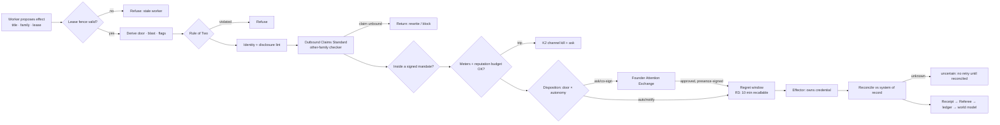
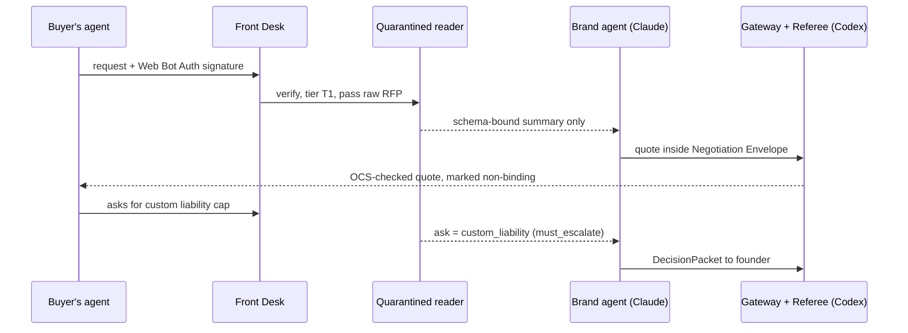

# S13 — External World and Human Collaborators

*Round 2 seat · 2026-09-30 · designs inside R1-SYNTHESIS (effect gateway, door types, Referee, ledger). Autonomy levels are
quoted from ENGINE-SPEC §5 (A0–A4) as placeholders; the autonomy seat owns their final shape.*

## 1. Summary

1. **One door out, one door in.** Effects leave only through the **Effect Gateway**; arrivals enter only through the
   **Front Desk**. No worker ever holds a credential. Workers propose, effectors act, the Referee verifies from the system of record.
2. **Consequence is derived, not declared:** door type (two-way · costly-reversible · one-way) + blast radius, crossed with
   autonomy level and live meters → auto · notify · ask · co-sign · never.
3. **Mandates, not approvals.** The founder signs **Effect Mandates** — AP2's intent → cart → execution chain generalised
   to every channel — bounding a class of effects. Instances inside flow; the first outside asks.
4. **Identity registry; the founder's voice is never synthesised.** Agents speak as disclosed **brand agents**; disclosure
   at first contact is a gateway lint (EU AI Act Art. 50, FCC 24-17, CA BPC §17941).
5. **One Outbound Claims Standard:** every factual claim binds to world-model evidence or is rewritten/blocked by a
   cross-family checker.
6. **Reputation is metered and breakable**, held in per-venture **brand cells** with circuit breakers and a five-level
   **kill switch** (effect → channel → identity → venture → world).
7. **Humans are Principals with scoped Rooms**; the **Human Task Market** prices, accepts and pays human-only work on the
   same ledger as agent work.
8. **Counterparty agents** are identified (Web Bot Auth, A2A cards, Visa TAP), quarantined (Rule of Two) and bounded by
   a **Negotiation Envelope**.
9. **Every effect names a legal actor of record** (entity + accountable human).
10. **Kill never abandons obligations** — commitments move to a founder-run **Obligation Keeper** mode.

## 2. The design

### 2.1 Effect Gateway (the one door out)

Turns `effect.proposed` into one real action, exactly once, with a receipt — ENGINE-SPEC's outbox plus consequence,
mandates, identity, claims and meters.

```ts
interface Effect {                       // the only way anything leaves the organisation
  id: string;                            // idempotency key = hash(venture, verb, target, payload_hash, mandate_id)
  venture: string; verb: string;         // 'email.send' | 'voice.call' | 'payment.pay' | 'dns.update' | 'esign.send' …
  channel: string; identity: string;     // effector+account in a brand cell; who it speaks as (2.4)
  target: { kind: 'person'|'org'|'agent'|'system'|'public'; ref: string; audience_size: number; jurisdiction?: string[] };
  payload: { artifact_hash: string; claims: ClaimRef[]; money?: { amount: number; currency: string; direction: 'in'|'out' } };
  derived: { door: 'two-way'|'costly-reversible'|'one-way'; risk: 'R0'|'R1'|'R2'|'R3'|'R4'; blast: number; flags: string[] }; // gateway-computed
  mandate_id?: string;
  actor_of_record: { entity: string; principal: string };             // legal person + accountable human
  proposer: { title: string; family: 'claude'|'codex'; mission: string; lease_token: number };
  state: 'proposed'|'held'|'approved'|'sending'|'sent'|'uncertain'|'reconciled'|'failed'|'recalled';
}
```

**Pipeline:** see diagram 3.1. Every stage but the effector is a pure check.

**Channel catalogue** — each row is an effector owning credential, rate limit and reconciliation.

| Channel | Verbs → door | Reconcile from | Notes |
|---|---|---|---|
| Email, transactional | receipts, onboarding → two-way | ESP events | Opt-in; RFC 8058 one-click unsubscribe; Gmail spam <0.3% (target <0.1%) |
| Email, 1:1 first touch | → costly-reversible | mailbox | Never via transactional ESP (Resend AUP bans cold outreach); warmed per-venture mailbox, daily cap |
| Email, reply | → two-way | thread | Bulk of volume; mandate-driven |
| Voice / phone | inbound two-way; outbound costly-reversible | recording + transcript | US outbound AI voice needs prior express consent (FCC 24-17); disclose in sentence one |
| Web actions | browse two-way; signup under terms one-way | page confirmation | Browser effector signs with Web Bot Auth; never defeats anti-bot controls |
| Payments in | refund ≤ cap two-way; price change costly-reversible | Stripe | Refunds are money-out, metered |
| Payments out / banking | spend, payouts, transfers → one-way | bank ledger | Agent cards: human-issued, limits the agent cannot change (Mercury); treasury always R4 |
| Agentic buying | ACP / AP2 / x402 purchase → one-way | mandate + receipt | Shared Payment Tokens: one seller, amount, expiry |
| Social | post two-way; DM/reply to a person costly-reversible | platform API | Screenshots outlive deletion |
| Ads | draft two-way; launch/raise costly-reversible | spend report | Spend + disapproval meters |
| Code hosting | branch two-way; release costly-reversible; make public one-way | GitHub | Forks and caches make visibility irreversible |
| Deploys | preview two-way; prod costly-reversible | health checks | Standing incident grant permits rollback (C3) |
| Domains / DNS | purchase one-way; MX/SPF costly-reversible | resolver | A bad MX silently breaks a venture's email |
| E-signature / legal | send, sign, file → one-way | Docusign / Dropbox Sign status | Agents draft and send; **only a human signs** |
| Human task market | post costly-reversible; pay one-way | evidence + payout | §2.9 |

### 2.2 Consequence Engine

**Door type is derived** from five inputs; a reversal *cost* model, not a label:

```yaml
door_rules:                         # first match wins; lint refuses a rule that downgrades a hard floor
  hard_one_way:                     # never lower than one-way, any level, any mandate
    - money.direction == out and not refund_within_cap
    - verb in [esign.send, legal.*, dns.transfer, repo.make_public, credential.create, account.close]
    - identity == founder-self
    - target.kind == public and payload.claims has kind in [health, finance_advice, legal, comparative]
  costly_reversible:
    - target.kind in [person, org] and first_contact     # you cannot un-meet someone
    - verb in [deploy.prod, ads.launch, social.dm, price.change]
    - audience_size > 100
  two_way: default
blast = log10(audience_size+1)*20 + money_usd^0.5 + 25*identity_is_brand_new + 30*jurisdiction_unknown   # capped 100
```

**Disposition matrix** (placeholder levels from ENGINE-SPEC; autonomy seat may rename):

| Door × blast | A0 | A1 | A2 | A3 | A4 |
|---|---|---|---|---|---|
| two-way, blast < 40 | ask | notify | auto | auto | auto |
| two-way, blast ≥ 40 | ask | ask | notify (inside mandate) | auto (inside mandate) | auto (inside mandate) |
| costly-reversible | ask | ask | mandate or ask | mandate or notify | mandate or notify |
| one-way | ask | ask | ask | ask | co-sign (founder + AI Co-founder charter) |
| hard floor list (never-list) | never auto — founder presence-signed (Touch ID, ENGINE-SPEC) at every level |

The **Founder Attention Exchange** prices each ask; one whose cost of delay is below its minute-price waits for the
daily batch.

### 2.3 Effect Mandates (approval by class, not by instance)

Borrowed from AP2's three-mandate chain (Intent → Cart → Payment, cryptographically signed) and widened to every channel.

```yaml
EffectMandate:
  id: mnd-sigstudio-inbound-replies-v3
  venture: signal-studio
  signed_by: founder            # presence-signed; or a human co-founder within their charter
  intent: "Reply to inbound leads and book discovery calls"
  verbs: [email.reply, calendar.invite]
  identity: brand-agent:signal-studio
  audience: { source: inbound_only, max_per_day: 40, jurisdictions: [US, EU, IL] }
  claims_allowed: [ev-portfolio-3, ev-price-sheet-2026q3, ev-turnaround-5d]   # world-model evidence ids
  money: none
  meters: { spam_rate_max: 0.001, reply_negative_max: 0.05 }
  valid_until: 2026-12-31
  revoke_on: [meter_trip, charter_change, claims_evidence_expired]
  review: circled-takes weekly sample of 10 sends in the Dailies Reel
```

Each instance carries a **Cart** (artifact hash + target), so a changed draft voids approval. Agents may only *propose*
a mandate, as a DecisionPacket stating the asks it saves.

### 2.4 Identity Registry and AI-Disclosure Policy

Identity kinds: **founder-self** (agents may draft into his drafts folder, never send) · **brand-agent** (e.g. "Studio
assistant (AI) · Signal Studio") · **brand-team** (shared inbox of agents and humans; disclosure per message) ·
**collaborator** (a human's own voice; agents never send as them) · **system** (receipts, alerts).

**Policy (binding, linted at the gateway):**
1. **Disclose at first contact, in the channel itself** — signature line, first spoken sentence, bio + first DM. Terms,
   metadata or a bare "assistant" fail (Art. 50 guidance). Strings live in a versioned locale library.
2. **Never synthesise the founder's voice or face.** His identity is shared by every venture: stolen once, lost everywhere.
3. **Announce human handoff** in-thread, both directions.
4. **No sock puppets**, astroturf reviews or undeclared personas.
5. **"Are you a bot?" always gets "Yes"** — tested nightly by a red-team suite on every brand agent.

### 2.5 Outbound Claims Standard (OCS)

Every sentence in outbound content that asserts a fact is extracted into a `ClaimRef` and must resolve:

| Claim class | Must bind to | Checker | Failure |
|---|---|---|---|
| Capability | passing test or live flag | CI / flags | block |
| Numbers | metric snapshot ≤30 days, with query | analytics | rewrite without number |
| Testimonial / logo | signed permission from that principal | registry | block |
| Comparative | sourced competitor evidence ≤30 days | world model | block |
| Price / terms | current price version | Stripe | block |
| Scarcity / urgency | a real, evidenced constraint | world model | block |
| Health / finance / legal | founder or licensed human | HumanTask | ask |

The checker is the *other* model family from the writer. Every claim ever made is kept in a **Claims Ledger**; when its
evidence expires, a correction mission opens.

### 2.6 Reputation Firewall — brand cells, meters, breakers

**Brand cell** = the complete set of reputation-bearing accounts for one venture, provisioned by a one-way-door onboarding
task and never shared across cells:

```yaml
BrandCell:
  venture: beacon-saas
  entity: beacon-labs-llc
  sending: { domains: [beaconmail.io], warmup: { day: 23, daily_cap: 120 }, spf_dkim_dmarc: pass }
  phone: { numbers: ["+1-5xx"], a2p_10dlc_registered: true }
  social: { x: "@beaconhq", linkedin_page: beacon }
  ads: { google: acct-…, meta: acct-… }
  merchant: { stripe_account: acct_…, descriptor: "BEACON" }
  code: { github_org: beacon-hq }
  shared_with_other_cells: []            # lint: must be empty (no shared IPs, descriptors, pixels, payment methods)
```

**Meters** per cell: spam, bounce, unsubscribe, negative-reply, chargeback/dispute and refund rates, ad disapprovals,
reviews, social reports, support SLA, mention sentiment. Each has **warn** (throttle 50%), **trip** (K2, ask) and **floor**
(K3, interrupt); Gmail's 0.1% is a warn, 0.3% a trip. **Reputation budget:** a weekly cap on summed blast of
costly-reversible effects; new cells start small and earn headroom from clean meters.

### 2.7 Kill switch hierarchy

| Level | Pulled by | Effect | Undo |
|---|---|---|---|
| K1 effect | any worker, Referee, meter | recall / hold | re-propose |
| K2 channel (one cell) | meter trip, Referee, founder | effector refuses; outbox → `held` | re-grant |
| K3 identity | meter floor, founder | every mandate using it revoked | founder, presence-signed |
| K4 venture | founder, dead-man (AI Co-founder may propose) | Obligation Keeper mode | founder |
| K5 world | founder: `av stop --all`, Mission Control, phone hotword, SMS | revoke all grants, rotate effector tokens | founder, after written incident review |

**Obligation Keeper.** A kill freezes *new* effects; each existing commitment (paid service, contracted delivery, legal
deadline) gets one-tap "continue under founder watch" or an OCS-checked holding message. Kills are checked at admission
*and* at the effector.

### 2.8 Human collaborators — Principals and Rooms

`Principal {kind, identity_proof (passkey|oauth), rooms[{venture, room, scope, visibility: summary|artifacts|raw, until}],
agreements {nda, contractor, dpa}, authority {doors[], ventures[], money_cap_usd}, may_direct_agents, appeal_route (always a
human — R0-D), expires}`.

| Principal | Room(s) | Sees | Can do | Never sees |
|---|---|---|---|---|
| Human co-founder | Venture room, board meeting | Venture Mind, ledger, dissent register | approve/co-sign doors per charter; direct agents; sign mandates | other ventures, founder's personal memory |
| Contractor | Mission room | assigned missions, backlot assets, its agents | claim tasks, submit, chat with agents, raise hazards | PII (field-redacted unless needed), finances |
| Advisor | Question room | a ≤2-page packet, then the decision record | answer, dissent (non-binding) | raw data |
| Investor | Reporting room | metrics reconciled from systems of record, never agent narratives | ask (routed to a mission); data room at raise | ops chatter, customers |
| Customer | Account room | their account, commitments, whether AI or human handled each message | escalate to a human, export/delete data | everything else |
| Task worker | Task card | one task, pay, evidence required | accept, submit, dispute | venture context |

Agents in a Room show title, family, mission and "why is it asking me this?". Collaborators may **circle** takes; circles
train *venture* taste, attributed, never the founder's personal model.

### 2.9 Human Task Market (same ledger as agents)

A **HumanTask** is a Mission contribution whose worker is a person.

```yaml
HumanTask:
  id: ht-…
  kind: signature | notarization | physical | human_only_call | verification | licensed_review | taste_panel | kyc
  venture: beacon-saas
  why_human: "bank form requires a notarised signature"     # mandatory; lint rejects 'faster' or 'easier'
  spec: { deliverable: "notarised PDF", evidence: [signed_pdf, notary_commission_id] }
  route: [founder, principal:ops-contractor, market:notary-ron, market:general]     # tried in order
  price: { max_usd: 60, pay_floor_usd_per_hour: 25 }            # illustrative
  sla: 48h
  disclosure_to_worker: "Posted by an AI agent for Beacon Labs LLC; a named human is accountable."
  acceptance: referee_reads_evidence
```

Routing prefers principals under agreement, then marketplaces. Agent-to-human hiring marketplaces now exist (RentAHuman,
Feb 2026, per Built In); treat them as one supplier, with **our** worker rules: pay floor, no deception, no impersonation,
no platform-rule evasion, a named accountable human on every task.

### 2.10 Front Desk — the inbound side and counterparty agents

Every arrival is classified before any model reads it:

| Class | Detected by | Lane |
|---|---|---|
| Known principal | passkey / OAuth / verified mailbox | their Room |
| Human, unknown | default | quarantined reader → summary → mission |
| Declared agent, signed | Web Bot Auth (RFC 9421), signed A2A card, Visa TAP | Counterparty lane |
| Declared agent, unsigned | self-declared UA / card | Counterparty lane, lower tier |
| Payment-bearing | ACP token, AP2 Cart Mandate, x402 header | Commerce lane (payment verified first) |
| Hostile / spam | rate, reputation, injection classifier | drop + log |

**Quarantine rule** (Rule of Two at the door): a **reader** with no secrets and no send grant turns untrusted content into
schema-bound fields; only those reach senders. **Counterparty Registry:** identity, principal behind it, history,
commitments, tier T0 (unknown) → T3 (contracted); negotiation behaviour is venture-scoped memory.

**Negotiation Envelope** — what our brand agent may agree to with another agent:

```yaml
NegotiationEnvelope:
  venture: beacon-saas
  counterparty_min_tier: T1
  may_agree: { discount_max_pct: 15, term_months: [1, 12], payment_terms: [prepaid, net15], sla: standard }
  must_escalate: [custom_liability, data_residency, exclusivity, any_term_not_in_template]
  binding_rule: "Nothing binds until an e-signed order form or a settled payment; all agent chat is non-binding and says so"
```

Ventures also **publish** themselves: `/.well-known/agent-card.json` (A2A, signed), machine-readable pricing and terms,
and an ACP/AP2/x402 checkout where the product fits — agent-buyers are a customer segment.

### 2.11 Legal-financial body (actor of record)

Every Effect names `actor_of_record`. Pre-entity ventures act under the founder's holding entity with a smaller envelope;
each entity has its own bank account and agent cards; books reconcile nightly from bank + Stripe against the ledger, and
any unexplained difference is a K2 on payments-out until resolved.
Formation, tax and licensed advice are Human Tasks with licensed collaborators; the system prepares, humans sign.

## 3. Diagrams

### 3.1 An effect's path through the gateway



### 3.2 Kill-switch and meter state machine (per channel in a brand cell)

```mermaid
stateDiagram-v2
  [*] --> Warming: cell provisioned
  Warming --> Healthy: warm-up complete, meters clean 7d
  Healthy --> Throttled: meter WARN (e.g. spam > 0.1%)
  Throttled --> Healthy: 7 clean days
  Throttled --> Tripped: meter TRIP (e.g. spam > 0.3%)
  Healthy --> Tripped: founder / Referee pulls K2
  Tripped --> ObligationKeeper: obligations exist
  Tripped --> Frozen: no obligations
  ObligationKeeper --> Frozen: obligations served or handed off
  Frozen --> Warming: founder re-grant after incident review
  Healthy --> Burned: meter FLOOR (blocklist, account ban)
  Burned --> [*]: identity retired; relationship-repair mission opened
```

### 3.3 A counterparty agent arrives



## 4. Interfaces

| Part | Needs from it | Gives to it |
|---|---|---|
| Mission engine | Effect footprint (verbs × channels × max blast) declared at funding | Consequence previews ("needs 2 asks"), HumanTasks as contributions, receipts as evidence |
| Autonomy | Final A-levels, contact classes, trust ladder, presence signing | Door/blast derivation; mandates as the main autonomy lever; meter trips as demotion signals |
| Agent organisation | Brand-agent titles; family diversity for OCS | Counterparty lane as a mission source; mixed human/agent Rooms |
| Referee | Other-family checkers; system-of-record readers | Receipts, reconciliations, uncertain effects |
| Memory / world model | Evidence ids with freshness; commitments | Claims Ledger, reputation history, counterparty behaviour, collaborator circles |
| Skills / MCP | Effectors as MCP servers reachable only by the gateway | Channel catalogue as the effector spec |
| Surfaces | Kill everywhere; ask rendering; collaborator portal | Meters page, mandate manager, Claims Ledger, Human Task board |
| Engineering | Outbox idempotency + reconciliation (ENGINE-SPEC M5), P3 credential isolation, fencing | Effect schema; door rules as a linted data file |
| Economics | Budgets, treasury rules | Real money flows; human task spend; cost of each ask in founder minutes |
| Safety / data | Data boundary, retention | Quarantine lane, Room redaction, jurisdiction tags |
| Simulation | A twin per channel (test-mode Stripe, fake ESP) | Shadow sends for every new mandate |

## 5. Worked examples

### 5.1 Signal Studio (agency, A2) — inbound replies on a normal Tuesday

- **09:02** 11 inbound emails. Quarantined reader (Claude Sonnet 5, no secrets, no send) emits 11 summaries: 2 spam,
  1 a signed prospect's scheduling agent (T1).
- **09:05** Standing obligations-lane mission launches **Client Partner (AI)** on Codex (`gpt-6-astra`), chosen by the
  calibration ledger.
- **09:09** 8 replies proposed. The OCS checker (Claude Opus 5) catches "shipped for 3 Fortune 500 clients" — evidence
  supports 1 — and forces a rewrite. All 8 fall inside `mnd-sigstudio-inbound-replies-v3` → auto; regret window; sent 09:19.
  ~$0.90 tokens (illustrative), 0 founder minutes; 8 counterparty records written; the rewrite logged against the writer
  config. At 18:00 the founder circles one sampled send and strikes one for tone (a taste datum).
- **14:30** A prospect wants an $18k fixed-price proposal: money + contract = one-way. Proposal and Docusign envelope
  drafted; 1-page ask; founder approves on phone with Touch ID. **4 founder minutes.**

### 5.2 Beacon SaaS (A3) — a spam spike, then a buyer's agent

- **Mon 03:10** Spam complaints 0.14% (warn) → Throttled 50%. **Lifecycle Deliverability Analyst (AI)** — a hybrid of
  email ops and product analytics, Claude — finds a "trial ending" email going to converted users. PR fixed; Referee
  (Codex) verifies by replaying the event log.
- **Mon 11:00** The tail of the batch pushes 0.31% → Tripped: K2 on Beacon marketing email only. Transactional mail runs
  on a separate subdomain; Signal Studio is untouched (different cell). One ask: resume now or after 7 clean days?
  Founder picks 7 days (1 minute).
- **Wed 15:40** A customer's procurement agent (Web Bot Auth-signed, T1) asks for 40 annual seats. Inside the Negotiation
  Envelope the brand agent quotes 10% off; the buyer pays with an ACP Shared Payment Token; the Referee reconciles from
  Stripe. The order form still needs a human signature (hard one-way): the founder's ask arrives with payment settled
  and the form pre-filled. **2 founder minutes; ≈$3 of tokens (illustrative).**

### 5.3 Incorporating a new venture — the Human Task Market

**Company Formation Specialist (AI)** (Claude) prepares filings, operating agreement (backlot template) and a bank pack.
Three HumanTasks follow: founder e-signs (3 min); a remote online notary for a bank form ($25, 24h SLA, illustrative);
the founder's accountant reviews the tax election (Room: that one document, 7-day expiry, $150 illustrative) — all on the
mission ledger beside ~$6 of tokens. Then the brand cell is provisioned (domain purchase asked; warm-up at 20/day) and
the first mandate runs 48h in **shadow** before it may send.

## 6. Ideas the founder did not ask for

1. **Effect Mandates on every channel** — AP2's signed intent/cart chain generalised beyond payments; hundreds of
   approvals become a handful of signed policies. The biggest founder-attention lever in this seat.
2. **Regret window** — every R3 effect is recallable for 10 minutes from any surface, turning many costly-reversible
   actions into near two-way ones.
3. **Shadow sends** — a new mandate spends 48h writing what it *would* send into the Dailies Reel before it can send.
4. **Public Claims Page per brand** — the Claims Ledger rendered as "what we claim and why", with evidence links.
5. **Agent-readiness as a growth channel** — signed A2A card, machine-readable terms, ACP/x402 checkout, and a
   "counterparty-agent conversion" metric next to web conversion.
6. **Relationship repair missions** — a meter trip or a harmful effect opens a mission to find every affected party and
   propose a human-reviewed remedy.
7. **Trust ladder for identities** — new brand cells earn send volume from clean meters, as agents earn autonomy.
8. **Collaborator circles train venture taste**, attributed and weighted — humans improve the system, not only use it.
9. **"Why a human?" lint** on HumanTasks — the list of habit-only human steps is the next capability backlog.
10. **Phone hotword kill** — a registered phrase on the founder's voice line, or a 3-word SMS, triggers K4/K5.
11. **Inter-venture commerce through both gateways**, with receipts — the internal economy audited like the external one.

## 7. Risks

| Risk | Design answer |
|---|---|
| Inbound prompt injection drives a sender | Quarantined reader, schema-bound summaries, Rule of Two at admission, nightly injection red-team per brand agent |
| A worker obtains a credential | Credentials only in the effector process; worker egress allowlisted; canary token in every worker env — any use trips K5 |
| Mandate drift (inside the letter, outside the spirit) | Weekly 10-instance sample in the Dailies Reel; one strike narrows the mandate pending re-sign; mandates expire |
| Approval fatigue (v2 red team #5) | Mandates collapse classes; Attention Exchange prices asks; uninspected approvals earn no trust |
| Correlated reputation loss across ventures | No shared accounts; per-venture template forks; configs roll out to a canary cell first |
| Regulatory breach (US/EU/IL) | Jurisdiction on every target, unknown raises blast; disclosure lint; TCPA consent record for AI voice; licensed-review HumanTask per new channel × jurisdiction |
| Provider terms ban an account | Per-channel `terms_profile` of permitted verbs (Resend: no cold outreach); refused at the gateway; terms diffed monthly |
| Duplicate payment on retry | Idempotency keys; `uncertain` blocks retry until reconciled |
| Collaborator over-access | Field redaction, expiring grants, read receipts, NDA/DPA before `raw` |
| Exploiting task workers | Pay floor, AI-posted disclosure, named accountable human, banned task shapes, human appeal |
| Liability for an autonomous commitment | Actor of record; agent chat non-binding; binding acts always human-signed |
| Kill switch unreachable | Four surfaces incl. SMS; effector self-freezes without a signed world-state heartbeat within 15 min (A3+) |
| Counterparty agent flood | Tiered rate limits; T0 gets a static price sheet; paid intent unlocks negotiation time |

## 8. Open decisions

1. **Cold outbound under brand agents: allowed at A2+ inside a mandate, or founder-sent only?** *Recommendation:* allowed
   1:1 only (no bulk), from warmed per-venture mailboxes, disclosed, ≤30/day/cell initially, jurisdictions US + consenting B2B
   contexts; EU/IL cold outreach stays founder-approved per batch until a licensed review clears it. Bulk cold email: never.
2. **Can a human co-founder or the AI Co-founder co-sign one-way doors without the founder?** *Recommendation:* a human
   co-founder may, inside their venture and under a money cap set in the charter; the AI Co-founder never signs — it may
   *propose* and pre-fill, and at A4 its co-sign is required *in addition to* a human's, not instead.
3. **Where effectors run: the founder's Mac (ENGINE-SPEC) or a small always-on cloud host?** *Recommendation:* cloud host
   for effectors and the Front Desk (inbound needs 24/7 presence and a stable IP reputation), with credentials in a managed
   secret store and the kill-switch heartbeat signed from the founder's devices; workers may stay local.

## Challenge to the synthesis

Upward: the gateway is not plumbing inside Execution — it is a **fifth authority, Exposure**, beside Intent, Allocation,
Execution and Acceptance. Nobody in the four-authority model owns the reputation budget, brand cells, mandates or kill
hierarchy, and the synthesis's own rule (no agent both decides and acts) breaks if the limiter sits inside what it limits.
Exposure (a) holds every external credential, (b) owns mandates and meters, (c) is overrulable only by the founder, and
(d) also owns the Front Desk, where injection, counterparty commitments and legal notices arrive. The Referee judges
*whether work is good*; Exposure judges *whether the world may see it*.

Second: counterparty agents are also a **market**, not only a threat — publishing ventures to buyer agents (A2A card,
ACP/AP2/x402 checkout) belongs in the operator and economics plans.

## Sources

All accessed 2026-09-30.
- AP2 signed Intent/Cart/Payment mandates; v0.2 to FIDO Alliance Apr 2026 — https://eco.com/support/en/articles/15192002-ap2-protocol-explained-google-s-agentic-commerce-standard-2026
- EU AI Act Art. 50 from 2 Aug 2026; disclosure in the interaction from first contact — https://www.traverssmith.com/knowledge/knowledge-container/is-it-a-bot-eu-ai-act-transparency-rules-take-effect-2-august-2026/ · https://digital-strategy.ec.europa.eu/en/faqs/transparency-obligations-under-article-50-ai-act
- FCC 24-17, AI voices under TCPA, prior express consent — https://www.fcc.gov/document/fcc-makes-ai-generated-voices-robocalls-illegal
- CA BPC §17941 bot disclosure — https://leginfo.legislature.ca.gov/faces/codes_displaySection.xhtml?lawCode=BPC&sectionNum=17941.
- Stripe Shared Payment Tokens (seller, currency, max amount, expiry, revocable) — https://docs.stripe.com/agentic-commerce/concepts/shared-payment-tokens
- Gmail sender guidelines (<0.3% spam, RFC 8058 unsubscribe) — https://support.google.com/a/answer/81126
- Resend AUP bans cold outreach — quoted in `docs/vision-v2/reviews/04-professional-advisor.md`
- Mercury agent cards (human-issued; limits the agent cannot change) — https://support.mercury.com/hc/en-us/articles/51299754284948-Agent-cards-Giving-AI-agents-a-card-of-their-own
- Web Bot Auth (RFC 9421) and Visa TAP — https://blog.cloudflare.com/signed-agents/ · https://blog.cloudflare.com/secure-agentic-commerce/
- x402 — https://docs.cdp.coinbase.com/x402/core-concepts/http-402
- Docusign embedded signing — https://developers.docusign.com/docs/esign-rest-api/esign101/concepts/embedding/embedded-signing/
- RentAHuman (agents hiring humans, Feb 2026) — https://builtin.com/articles/what-is-rentahuman
- Internal: ENGINE-SPEC §5; C3 §5–6; R0-A (A2A cards); R0-D (appeal route, receipts before completion)

*Numbers marked "illustrative" in §5 are speculation for scale, not measurements.*
