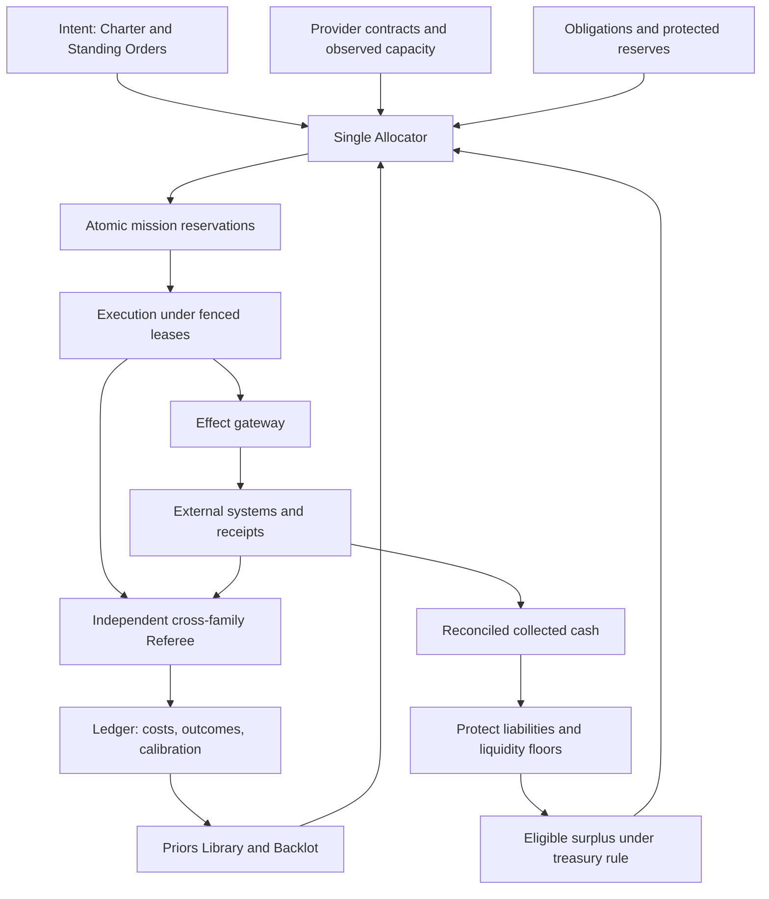
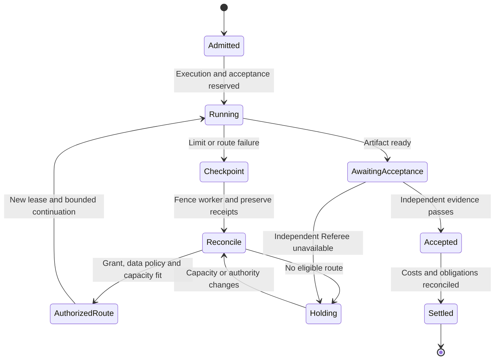

# R2 — Economics and capacity planner (Codex seat)

## 1. Summary

1. Fund independently accepted outcomes; count failed attempts, recovery and founder time.
2. Keep cash, subscription allowance, API throughput and attention as separate resources.
3. Buy subscriptions for permitted internal work; authorize metered execution through explicit, bounded grants.
4. Reserve obligations, acceptance and recovery before admitting investment work.
5. Forecast complete missions, including review, retries, context rebuilding and delayed outcomes.
6. On exhaustion, checkpoint and reroute within authority; preserve the Referee’s independence.
7. Budget failures across shared providers, skills, infrastructure and commercial dependencies.
8. Recycle collected surplus into compute through a treasury Standing Order.
9. Fund complementary bundles and make sale, spin-out and responsible closure designed outcomes.
10. Prove “out-build thousands” through matched deliverables, full costs and sustainable founder attention.

**Status:** proposed design, 2026-09-30. Provider facts below come from official pages opened for this seat. Budgets, thresholds, workload quantities and business examples are illustrative policy candidates, not observed performance or spending authorization.

## 2. The design

### 2.1. Economic boundary and inherited decisions

This design implements the synthesis’s four authorities: Intent proposes value; Allocation funds; Execution consumes bounded resources; Acceptance establishes outcomes. The Ledger records their separate actions. No transferable internal rewards or invented agent currencies.

Relevant inheritance:

| Material | Preserve | Change or extend |
|---|---|---|
| [R1 synthesis](../r1-concepts/R1-SYNTHESIS.md), C3 and C4 | Two lanes, fenced leases, independent Referee, calibrated bets | Reserve the resources needed to finish, judge and unwind work |
| [R0 platform research](../r0-outward/R0-A-agent-platforms.md) | Team shape depends on task; coordination and verification have costs | Measure complete mission economics rather than multiplying worker counts |
| [R0 tiny-team research](../r0-outward/R0-D-tiny-teams-codex.md) | Revenue is not profit; human intervention belongs in the denominator | Measure cash contribution, obligations and founder dependence together |
| [v1 economics](../../vision-system/research/L10-economics.md) | Separate money, allowance, execution rights and attention | Add autonomous treasury grants and portfolio stress reserves |
| [v2 vision](../../vision-v2/01-VISION.md) | Shared subscription baseline and venture attribution | Replace “$0 marginal model cost” as the economic headline |
| [ENGINE-SPEC §10](../engineering/ENGINE-SPEC.md) | Provider buckets, admission reservations, degraded modes | Remove hardcoded Codex windows, token-only reservations and automatic same-family acceptance |

There is no challenge to the synthesis. There are two substantive corrections to the engineering sketch: API capacity includes throughput and availability, not just dollars; provider exhaustion cannot silently relax the synthesis’s cross-family acceptance requirement.

The existing `scripts/ledger.mjs` is a **claim ledger**. The economic Ledger below is a proposed transactional subsystem linked to claims and evidence. Calling both “ledger” must not imply that financial reservations already exist.

### 2.2. Mechanism: Provider Contract Registry

**Purpose:** describe exactly what execution can be purchased or consumed.  
**Trigger:** onboarding, renewal, model release, pricing change, authentication change, or stale evidence.

Current public facts:

| Route | Published price or limit | Consequence |
|---|---|---|
| Claude Pro | $20 monthly; $200 paid annually | Annual cash payment and monthly expense differ. [Claude pricing](https://claude.com/pricing) |
| Claude Max | $100/month for 5x; $200/month for 20x. Five-hour session limits and an account-assigned weekly reset apply. | Multipliers describe allowance, not a guaranteed token inventory. [Max plan](https://support.claude.com/en/articles/11049741-what-is-the-max-plan) |
| Claude Team | Standard: $25 monthly or $20/month annually; Premium: $125 or $100 respectively; advertised for 2–150 people | Purchase for actual collaboration and administration needs. [Claude pricing](https://claude.com/pricing) |
| ChatGPT with Codex | Plus $20/month; Pro options $100, $200 and $500; Business $25/user monthly or $20 annually, minimum two users | Account and plan identity belong in every execution receipt. [Codex pricing](https://learn.chatgpt.com/docs/pricing) |
| Codex allowance | Pro currently has no five-hour limit. Plus/Standard Business publish workload-dependent five-hour estimates; weekly limits may apply. Local/cloud work share allowance. | Do not retain ENGINE-SPEC’s universal five-hour Codex bucket. [Codex pricing](https://learn.chatgpt.com/docs/pricing) |

Claude’s current SDK notice says the announced billing change remains paused: Agent SDK and `claude -p` usage still consume subscription allowance; the proposed separate monthly SDK credit is unavailable. Do not implement the superseded table below that notice. [Claude SDK notice](https://support.claude.com/en/articles/15036540-use-the-claude-agent-sdk-with-your-claude-plan)

Codex API-key execution is separately metered. Additional subscription credits are another spending route; API prices cannot predict included subscription tasks. [Codex pricing](https://learn.chatgpt.com/docs/pricing)

**Selected API rate cards, USD per million tokens, standard service:**

| Model | Uncached input | Cache read | Cache write | Output |
|---|---:|---:|---:|---:|
| Claude Sonnet 4.6 | 3.00 | 0.30 | 3.75 / 6.00¹ | 15.00 |
| Claude Opus 4.7 | 5.00 | 0.50 | 6.25 / 10.00¹ | 25.00 |
| GPT-6 Astra | 10.00 | 1.00 | 12.50 | 50.00 |
| GPT-6.1 Sol | 2.00 | 0.10 | 2.50 | 10.00 |
| GPT-6 Luna | 0.10 | 0.01 | 0.125 | 0.50 |

¹ Claude five-minute / one-hour cache writes. Sources: [Claude API pricing](https://platform.claude.com/docs/en/about-claude/pricing), [OpenAI API pricing](https://developers.openai.com/api/docs/pricing).

Astra requests above 272K input tokens multiply input/cache rates by two and output by 1.5. Batch/Flex cost half Standard; Fast costs twice the applicable rate. These modifiers must be attached to requests, not inferred from model names. [Astra model reference](https://developers.openai.com/api/docs/models/gpt-6-astra)

Claude API limits distinguish requests, input tokens and output tokens per minute; organization and workspace limits interact. Published Start/Build/Scale monthly caps are $500/$1,000/$200,000, but actual account limits control admission. [Claude rate limits](https://platform.claude.com/docs/en/api/rate-limits)

Astra’s published Tier 1 example is 500 RPM and 500,000 TPM. This is neither an account observation nor a service guarantee. [Astra model reference](https://developers.openai.com/api/docs/models/gpt-6-astra)

```ts
type ProviderContract = {
  id: string;
  provider: "anthropic" | "openai";
  accountRef: string;                 // opaque; never credentials
  route: "subscription" | "credits" | "api";
  plan: string;
  currency: string;
  fixedFeeMinor: number | null;
  rateCardRef: string;
  allowedSurfaces: string[];
  workloadAndDataPolicyRef: string;
  allowanceBuckets: string[];         // observed, never assumed universal
  throughputBuckets: string[];
  overflowGrantRef: string | null;
  evidence: { url: string; fetchedAt: string; hash: string }[];
  validUntil: string;
};
```

**Purchase policy:** retain a candidate $400/month baseline—Claude Max 20x plus Codex Pro $200—only after checking actual invoices and account eligibility. This is a baseline to evaluate, not a claim that two subscriptions provide production capacity.

At renewal, compare plans over the same workload distribution: subscription fee, permitted overflow, missed deadlines, idle allowance and accepted outcomes. An upgrade wins only if its expected reduction in metered cost and delay exceeds its incremental fee with uncertainty included.

Internal native work may use admitted subscription routes. Shared customer execution receives a separately approved commercial route and continuity design. A working login is not evidence of rights to pool, share or resell capacity. The registry stores the external-world seat’s rights determination; this seat does not invent it.

### 2.3. Mechanism: Resource Ledger and settlement

**Purpose:** produce one auditable account without turning unlike resources into one balance.  
**Trigger:** funding, admission, each request/effect, checkpoint, acceptance, invoice or correction.

Four linked books share venture, mission, attempt and receipt identifiers:

| Book | Unit | Meaning |
|---|---|---|
| Cash and expense | Original currency; reporting currency separately | Payments, accruals, prepaid credits, invoices, refunds |
| Capacity | Provider bucket units, timestamps, throughput | Allowance consumed and reserved; reset and uncertainty |
| Attention | Human minutes and interruption count | Founder and collaborator effort |
| Outcomes and forecasts | Accepted units, observations, probabilities | What spending bought and whether forecasts were calibrated |

A subscription payment is booked once. Its expense is attributed across work using a frozen allocation policy; idle capacity stays visible as portfolio overhead. API-equivalent cost is a **counterfactual estimate**, never a second invoice.

```ts
type EconomicEvent = {
  id: string; idempotencyKey: string;
  ventureId: string; missionId: string; attemptId: string;
  kind: "reserve" | "consume" | "release" | "accrue"
      | "pay" | "refund" | "allocate" | "correct" | "accept";
  resource: "cash" | "quota" | "throughput" | "attention";
  quantity: string; unit: string;     // fixed precision; no float money
  contractRef: string; grantRef: string;
  requestRef?: string; effectReceiptRef?: string;
  source: "provider" | "invoice" | "measured" | "estimated";
  observedAt: string; effectiveAt: string;
  rateCardRef?: string;
  replacesEventRef?: string;
};
```

Financial entries use balanced postings. Resource reservations are encumbrances, not expenses. Prepaid credit purchases exchange cash for an asset; consumption recognizes expense. Invoice reconciliation replaces estimates through correction entries rather than rewriting history.

For each API request:

`estimated charge = uncached input × rate + cache writes × rate + cache reads × rate + billable output × rate + tools + runtime + modifiers`

Normalize provider usage into disjoint categories first. Count reasoning tokens according to the provider’s billing definition; never add a reasoning subset twice. Cache-write rates are applied to write tokens, not added again as ordinary input charges.

A crashed run with missing usage goes to **unreconciled exposure**, not zero cost. Duplicate webhooks cannot create duplicate charges. A retry gets its own attempt identifier, while the logical external effect retains its idempotency key.

Three cost views appear together:

- **Incremental cash:** the extra payable amount from undertaking the mission.
- **Fully allocated cost:** variable expense plus subscription, infrastructure, human and portfolio overhead allocations.
- **Decision cost:** incremental cost plus founder-time and scarce-capacity opportunity costs, with assumptions shown.

Only the first two reconcile to financial accounts. Shadow prices help choose work; they cannot authorize spending.

Cost per accepted outcome includes failures, abandoned attempts, review, recovery and late rework attributable to the cohort. When nothing is accepted, display “no accepted outcomes; $X spent,” not a flattering zero. Keep decision-producing research outcomes separate from commercial wins.

### 2.4. Mechanism: Admission with completion reserves

**Purpose:** ensure a launched mission can reach acceptance or an orderly checkpoint.  
**Trigger:** mission start, fan-out, tranche release, external commitment or route change.

One Allocator owns both lanes. Admission checks a resource vector against every applicable bucket:

```yaml
funding:
  mission: agency/offer-validation
  lane: investment
  charter_revision: 8
  cash_cap_usd: 120
  holds_usd:
    execution: 80
    acceptance: 20
    checkpoint_and_recovery: 20
  capacity_holds:
    - bucket_ref: claude/account-a/weekly
      forecast_ref: forecast-142
    - bucket_ref: openai/account-b/observed-limit
      forecast_ref: forecast-143
  founder_minutes_cap: 8
  deadline: 2026-10-07T18:00:00Z
  allowed_billing_routes: [subscription, api]
  overflow_grant_ref: grant-42
  acceptance_family_rule: opposite_to_contribution_author
  lease_epoch: 12
```

**Admission invariant:** consumed resources plus unsettled exposure plus active reservations plus protected reserves must fit the current authorized envelope. Check portfolio, venture, mission and provider constraints atomically. Subagents and retries debit their parent mission; nesting never creates budget.

Reserve execution, independent acceptance and recovery together. Funding a writer without a feasible Referee is an incomplete allocation. For a mixed-family team, reserve an opposite-family Referee for each contribution; a worker cannot adjudicate its own dependent artifact.

Proposed monthly **cash authorization**, separate from liquidity held in the bank:

| Purpose | USD ceiling |
|---|---:|
| Two subscriptions | 400 |
| Shared infrastructure, tools and storage | 300 |
| Obligations: variable execution and service | 450 |
| Investment missions | 400 |
| Evaluations and shared capability investment | 150 |
| Incident and recovery spending contingency | 300 |
| **Total** | **2,000** |

These are starting envelopes, not fixed percentages of company revenue. Acceptance costs live inside the relevant mission; they are not added again to the evaluation line.

For capacity, protect forecast obligations through the next reset, acceptance for active work, recovery, and scheduled founder sessions. As an initial heuristic, reserve 30% of the relevant allowance during declared founder work periods; replace this with observed demand. Cash percentages do not translate into quota percentages.

Investment may borrow unused operational headroom only if it can checkpoint before the obligation’s latest safe start. Irreversible commitments cannot borrow recallable capacity. If obligations exceed the envelope, start authorized continuity work and raise a capital decision; the allocator cannot solve a cash deficit by declaring incidents unlimited.

The investment lane retains a proposed 15% exploration share after obligations and reserve floors. Persistent consumption of that share by obligations triggers a structural capacity proposal, preventing a permanently reactive organisation.

### 2.5. Mechanism: Capacity Forecast and degraded execution

**Purpose:** predict accepted throughput and preserve missions when limits move.  
**Trigger:** telemetry, queue changes, incident arrival, provider failure, or new model configuration.

```ts
type CapacityForecast = {
  bucketRef: string;
  observedAt: string;
  resetAt: string | null;
  remaining: number | null;
  unit: string;
  confidence: "observed" | "inferred" | "unknown";
  sampleCount: number;
  workloadClass: string;
  configHash: string;
  demandP50: number;
  demandP90: number;
  deadlineSuccessProbability: number;
  bottleneck: "quota" | "rate" | "review" | "host" | "attention";
  scenarioRefs: string[];
};
```

Codex’s documented app-server interface exposes `account/rateLimits/read`, bucket information and reset timestamps. Its example durations are examples, not entitlements. [Codex app server](https://learn.chatgpt.com/docs/app-server)

For Claude, use supported telemetry or an explicitly timestamped account-usage observation. Local token logs do not establish remaining subscription allowance. Unknown capacity receives bounded probes and conservative admission; it never becomes “100% free.”

Forecast by workload, model, effort, context regime, skill version and team shape. Include worker requests, reviewer demand, retries, cache misses, continuation costs, host time and founder interruptions. Reset priors on material configuration changes.

Maintain three horizons:

- **Next hour:** concurrency, rate buckets, urgent obligations and review queue.
- **Next seven days:** reset windows, deadlines, promised customer capacity and founder calendar.
- **Next thirteen weeks:** cash runway, renewals, demand growth, price shocks and capital needs.

Use simulation with correlated arrivals and failures. Summing individual P90 costs is a conservative heuristic, not a portfolio P90. Report forecast coverage and sample counts beside every percentile.

The practical concurrency ceiling is the smallest bottleneck across throughput, hosts, leases, reviewers and attention. Thirty possible workers with capacity to accept four outputs are not thirty productive workers.

| State | Entry signal | Permitted response |
|---|---|---|
| Normal | Complete missions fit protected envelopes | Launch any funded shape |
| Conserve | Forecast deadline or reserve pressure | Reduce speculative fan-out; compact context; batch eligible work |
| Essential | Reserve breach forecast | Admit obligations, active acceptance and recovery; checkpoint investment |
| Route unavailable | Limit, outage, expired rights or authentication mismatch | Select an admitted route; retain data and authority constraints |
| Acceptance waiting | Qualified opposite-family Referee unavailable | Preserve artifacts; no new acceptance-dependent effect |
| Hold | No route fits authority and resources | Persist state; expose deadline impact; request a bounded decision |

This replaces automatic same-family sign-off in ENGINE-SPEC D3. Another family may prepare work, but exhaustion does not redefine acceptance. A preauthorized deterministic rollback may still run because it restores an already accepted state; it does not certify new work.

Recovery procedure is enforced by the runner:

1. Stop new side effects and preserve artifacts, request IDs and unresolved effects.
2. Fence the previous worker; keep uncertain financial exposure reserved.
3. Classify the failure: rate, allowance, spend cap, availability or permission.
4. Wait with bounded backoff, switch within an existing grant, or hold.
5. Reconcile external effects before resuming; never replay a purchase blindly.
6. Acquire a new lease and revalidate current policy and world-model versions.

Claude distinguishes a spend-cap 429 from ordinary rate limiting; retrying the former cannot restore capacity. [Claude rate-limit behavior](https://platform.claude.com/docs/en/api/rate-limits)

Metered fallback requires an existing grant naming provider, model range, data classes, expiry and maximum cash. An API key’s presence or enabled credit reload is not such a grant. Provider-side limits are backstops; local admission must account for in-flight exposure and billing lag.

### 2.6. Mechanism: Portfolio failure reserve

**Purpose:** fund simultaneous damage from shared dependencies.  
**Trigger:** dependency promotion, new venture admission, weekly review or incident.

```yaml
stress_case:
  id: shared-pricing-skill-defect
  dependency_refs: [skill/pricing@7, gateway/payments@3]
  exposed_ventures: [agency, analytics, commerce]
  scenario_loss_usd:
    refunds_and_remediation: 1800
    emergency_compute: 200
    outside_specialist: 400
    continuity_infrastructure: 300
  liquid_requirement_usd: 2700
  recovery_capacity_ref: reserve-window-17
  confidence: low
  action: staged_rollout_until_funded
```

Map model families, skill versions, payment systems, credentials, hosts, networks, gateways, data sources and demand channels. Two model vendors on one failed laptop are not independent execution routes. Two ventures selling to the same segment are not independent revenue streams.

Set a liquid reserve floor from named stress losses and cash-flow timing. With enough evidence, supplement scenario floors with tail-loss estimates; do not give a precise probability to an unobserved catastrophe.

The illustrative $2,700 above is **cash retained**, not a monthly expense and not $2,700 of prepaid tokens. The $300 monthly recovery authorization is a separate permission boundary. Holding cash does not authorize the allocator to spend all of it.

Reserve computation uses combined scenarios so the same refund obligation is not counted twice. Already-reserved customer liabilities are identified explicitly. Lost revenue affects runway forecasts but is not posted as a cash expense.

Limit exposure through staged skill promotion, separate credentials, independent restores and alternate execution hosts. Fund repair of customer relationships as well as technical rollback. Cross-family acceptance reduces one failure channel; it does not remove shared assumptions or defective evidence.

### 2.7. Mechanism: Treasury recycling rule

**Purpose:** let successful ventures finance greater capability without recursive overspending.  
**Trigger:** reconciled receipts and a scheduled treasury close.

```yaml
treasury_rule:
  venture: agency
  revision: 4
  settlement_basis: reconciled_collected_cash
  protected:
    - unpaid_delivery_commitments
    - refunds_and_chargebacks
    - tax_and_other_restricted_balances
    - operating_runway_floor
    - portfolio_stress_reserve
  eligible_surplus:
    compute_and_capability: 0.30
    distribution_and_product: 0.40
    retained_liquidity: 0.30
  compute_release_usd:
    weekly_max: 300
    monthly_max: 1200
  parent_portfolio_cap_applies: true
  amendments_require: founder
```

The operator and finance seats determine tax, entity, contract and restricted-cash treatment. Economics consumes those determinations.

`eligible surplus = max(0, unrestricted settled cash − existing encumbrances − required reserve top-ups)`

Use disjoint deductions and reconcile them to the cash forecast. Never recycle signed contracts, unpaid invoices, gross booking value or simulated revenue.

Illustration: $10,000 collected, less $300 fees, $2,700 delivery costs, $1,000 newly required restricted balances and $2,000 runway/reserve top-up leaves $4,000. The rule allocates $1,200 to compute/capability, $1,600 to distribution/product and $1,200 to retained liquidity. These percentages are a founder policy proposal, not a tax assumption.

Treasury allocation creates eligibility. The Allocator still releases mission tranches against evidence and capacity. A more profitable month therefore expands the opportunity set without forcing consumption.

Refunds, reconciliation failures or a runway breach freeze new releases and recall unspent grants. Work already promised survives through the obligations lane. Same-day receipt loops cannot repeatedly recycle the same dollars.

Inter-venture purchases require a real deliverable and acceptance. Consolidated reporting eliminates internal revenue and expense; ventures cannot manufacture portfolio growth by invoicing each other. Shared assets receive transparent cost attribution, not tradable agent rewards.

### 2.8. Mechanism: Complementary-investment bundles

**Purpose:** fund combinations whose prerequisites appear unattractive in isolation.  
**Trigger:** dependency analysis shows that isolated mission rankings reject a valuable joint outcome.

```yaml
bundle:
  id: agency/paid-intake
  outcome: three paid pilots with deliverable capacity
  members:
    - {id: instrumentation, cap_usd: 40}
    - {id: offer_and_delivery, cap_usd: 80}
    - {id: distribution_test, cap_usd: 180}
  dependencies:
    - [instrumentation, distribution_test]
    - [offer_and_delivery, distribution_test]
  acceptance_and_recovery_usd: 60
  total_cap_usd: 360
  demand_gate: independently_verified_paid_pilots
  kill_date: 2026-10-21
  residual_obligations_ref: obligation-register
  reusable_assets_ref: backlot/intake
```

Evaluate joint expected value against doing nothing, outsourcing and alternative bundles. Record the assumptions that make complements valuable; do not invent independent success probabilities and multiply them when demand is shared.

Release the first $120 for instrumentation and delivery feasibility. Release the $180 distribution tranche only after those dependencies are accepted. Protect the $60 acceptance/recovery hold throughout. The full bundle is reserved once; children draw from it.

If a dependency fails, stop downstream investment and retain a funded customer wind-down. Salvage useful assets into the Backlot, but count their value only when later work uses them. “Reusable” is not revenue.

The mission-engine seat owns the ranking algorithm. This seat supplies joint costs, dependencies, opportunity costs and liquidity constraints so either VoI ranking or sampling can evaluate the bundle correctly.

### 2.9. Mechanism: Economic exit contract

**Purpose:** design sale, spin-out and closure before founder dependence makes them impossible.  
**Trigger:** venture formation, scale tranche, acquisition offer, sustained underperformance or founder direction.

```ts
type ExitContract = {
  ventureId: string;
  routes: ("continue" | "sell" | "spin_out" | "close")[];
  continuationValueRange: [number, number];
  netProceedsRange: [number, number] | null;
  transferCostCap: number;
  windDownReserve: number;
  ongoingObligationsRef: string;
  transferableAssetsRef: string;
  excludedRightsAndDataRef: string;
  replacementOperatorTrialRef: string | null;
  founderApprovalRequired: true;
};
```

Maintain comparable scenarios: continued operation, sale proceeds net of transaction costs and retained liabilities, spin-out funding requirements, and responsible closure cost. Use risk-adjusted cash flows and sensitivity ranges; do not choose an exit from an unsupported revenue multiple.

The transferable operating-company package includes accepted assets, customer economics, dependency licenses, financial records, obligations, authority policies, recovery evidence and measured founder workload. Provider logins and nontransferable rights are excluded; successor execution costs are modeled explicitly.

A replacement operator rehearses operation using its own authorized accounts. Differences in model access, subscription pricing and founder knowledge become transfer costs. A failed rehearsal funds documentation or capability work instead of hiding dependence.

Illustration: an $80,000 offer less $8,000 transaction work, $12,000 retained-obligation escrow and $5,000 transition cost yields $55,000 initially available, before any separately determined tax. Compare that with a modeled continuation range of $40,000–$90,000 and its capital/attention demands. The founder decides the one-way door.

Closure stops investment but preserves refunds, delivery, retention and supplier cancellation duties. Reserve release requires evidence that liabilities were settled or transferred.

### 2.10. Mechanism: Outcome economics and the thousand-person test

**Purpose:** make the ambition falsifiable in money and productive capacity.  
**Trigger:** weekly cohort settlement and monthly matched evaluation.

```yaml
outcome_cohort:
  workload_definition_ref: matched-suite-9
  attempted: 200
  accepted: 160
  later_reopened: 0
  cash_cost_usd: 4200
  founder_hours: 20
  founder_shadow_usd_per_hour: 100
  matched_human_hours_per_accepted: 16
  matched_human_cost_per_hour: 75
  observation_window_days: 30
  evidence_status: illustrative
```

Illustrative arithmetic:

| Item | Calculation | Result |
|---|---|---:|
| Variable mission expense, failures included | 200 × $12 | $2,400 |
| Subscriptions + infrastructure + outside humans | $400 + $600 + $800 | $1,800 |
| Fully allocated cash cost | $4,200 / 160 accepted | $26.25/outcome |
| Economic cost with founder time | ($4,200 + 20 × $100) / 160 | $38.75/outcome |
| Matched human task cost | 16 hours × $75 | $1,200/outcome |
| Illustrative cost advantage | $1,200 / $38.75 | 31× |

This scenario requires a larger grant than the earlier $2,000 envelope. It demonstrates arithmetic, not permission to exceed that envelope.

The comparator must use matched scope, quality, delivery time, maintenance and risk. The assumed $75/hour is not a claim about any company’s wages. Count contractors and founder effort on both sides. Accepted artifacts remain provisional against a defined defect/retention window.

At 16 matched hours per outcome, 160 outcomes represent 2,560 matched hours: **16 person-months at an assumed 160 hours**, not thousands.

To match 1,000 such person-months requires 10,000 accepted outcomes monthly. Holding the illustrative $26.25 cash cost constant would require $262,500/month. Holding founder involvement at 7.5 minutes per outcome would require 1,250 founder hours—impossible for one person. A 20-hour founder budget requires an average of **7.2 seconds per outcome**, achieved through policy, trustworthy acceptance and exception handling.

The destination therefore needs all of these proofs:

- Accepted throughput across the claimed disciplines, not lines of code.
- Founder intervention falling much faster than output grows.
- Marginal acceptance and recovery costs remaining controlled.
- Customer demand and distribution capable of monetizing useful output.
- Capacity contracts and infrastructure supporting the measured scale.
- Defect, retention and tail-loss performance surviving that scale.

Publish cash advantage, throughput equivalence and founder leverage separately. A strong result on one does not establish the other two.

## 3. Diagrams

### Funding, execution and recycling



### Exhaustion during a mission



A deterministic, preauthorized restoration can run alongside the holding state. It cannot mark unfinished work accepted.

## 4. Interfaces

| Counterpart | Economics needs | Economics provides |
|---|---|---|
| Mission engine / Allocator | Outcome, deadline, dependencies, proposed shape, kill criteria | Feasibility vector, joint bundle cost, reservations, delay cost |
| Agent organisation | Model/config identity, measured quality, team proposals | Permitted routes, funded concurrency, cost/acceptance history |
| Autonomy | Versioned spending and effect authority; founder-contact rules | Cap breaches, bounded exception packets, grant revocations |
| Referee / evals | Independent verdict, evidence window, rework attribution | Reserved review capacity; complete attempt/cohort costs |
| Memory / World model | Evidence lineage, retention rules, actual reuse | Calibrated cost priors, null economics, forecast errors |
| Skills / tools | Version, dependency graph, evaluation results | Acquisition budget, amortized use cost, correlated exposure |
| Engineering | Trusted usage, lease fencing, request/effect identifiers | Admission API, rate cards, reconciliation invariants |
| External world / operator | Bank receipts, invoices, commitments, entity rules | Margin floors, funding availability, treasury and exit economics |
| Surfaces | Founder sessions, decisions, attention measurements | Spend, remaining authority, capacity uncertainty, deadline forecasts |

Core service operations:

```ts
quote(mission, candidates): ResourceForecast
reserve(quote, grant, expectedVersion): Reservation | Denial
consume(reservation, providerReceipt): Reconciliation
checkpoint(reservation, unresolvedEffects): RecoveryState
settle(mission, independentVerdict, invoices): Settlement
release(reservation, reconciledExposure): ReleasedResources
```

Quotes expire; reservations use compare-and-swap or equivalent transactional isolation. Neither a stale quote nor a dashboard drag authorizes spending. The gateway validates the live grant immediately before a billable request or external effect.

Mission Control shows three distinct numbers: **spent**, **committed**, **available to authorize**. Capacity shows timestamp and uncertainty, with “unknown” supported. The founder sees the binding constraint and options—wait, purchase bounded capacity, change timing—without reviewing ordinary routing decisions.

## 5. Worked examples

### A. An agency validates a paid offer

**Launch:** the **Venture Steward**, running Claude Opus 4.7, detects repeated demand for intake reporting. Its autonomous Charter permits a $120 validation mission, approved advertising categories and standard pilot terms. New contractual terms would require founder approval.

The Allocator reserves $80 execution, $20 acceptance and $20 recovery. These are allocations within $120.

| Elapsed time | Title and model | Work |
|---|---|---|
| 0–35 min | Customer Economics Engineer — Claude Sonnet 4.6 | Produces the offer, delivery model and instrumented page |
| 35–55 min | Outcome Referee — Codex GPT-6 Astra | Independently checks implementation, pricing arithmetic and measurement |
| 55–65 min | Treasury Analyst — Claude Opus 4.7 | Reconciles projected delivery commitments against available capital |
| Next 72 hours | Deterministic telemetry | Collects visits and payments; no standing agent |
| At evidence threshold | Outcome Referee — Codex GPT-6 Astra | Reads payment and analytics records before settling the demand claim |

Illustrative aggregate API token quantities, in millions:

| Role | Uncached / cache-read / cache-write / output | Inference charge |
|---|---|---:|
| Customer Economics Engineer | 0.18 / 0.30 / 0.04 / 0.03 | $1.23 |
| Outcome Referee, both activations combined | 0.12 / 0.25 / 0.04 / 0.02 | $2.95 |
| Treasury Analyst | 0.10 / 0.10 / 0.02 / 0.015 | $1.05 |
| **Total** | Standard rates; Claude five-minute writes | **$5.23** |

All individual Astra requests remain below the long-context threshold. Token quantities include the role’s full observed request stream in this hypothetical example.

Add $40 advertising, $15 bounded external delivery validation and $4.77 tooling: **$65 incremental cash**. An illustrative $2 shared subscription allocation makes fully allocated expense $67. Unused reservations are released only after invoices and external commitments reconcile.

Three $200 pilots produce $600 collected revenue. That is not $535 profit: the operator reserves future fulfillment, refunds and restricted balances before treasury recycling. The Referee records paid demand separately from retention.

**Memory writes:** accepted cost cohort; demand evidence and uncertainty in the Priors Library; offer and instrumentation in the Backlot; treasury forecast error in the calibration Ledger. A failed offer would enter the Null Registry with its costs intact.

**Approvals:** none beyond the existing Charter for the specified actions. Crossing the grant, data boundary or contract authority creates one bounded founder packet. Founder taste review is budgeted at eight minutes.

### B. A 03:00 incident exhausts subscriptions

**Launch:** a monitoring signal activates the **Incident Reliability Engineer**, using Codex GPT-6 Astra. A deployed pricing defect affects two ventures. The obligations lane has a Standing Order for $40 recovery execution plus up to $80 customer remedies.

At minute six, the active subscription route becomes unavailable. Claude’s subscription allowance is also exhausted. The runner fences the worker, preserves the patch and reconciles a pending payment effect. It does not assume the missing acknowledgement means failure.

Both APIs are currently healthy and already covered by the incident grant. The engineer resumes through the Astra API. An independent **Release Referee**, using Claude Opus 4.7 through the API, checks authoritative tests and the rollback plan.

| Step | Time | Illustrative variable cost |
|---|---:|---:|
| Detection, checkpoint and effect reconciliation | 8 min | Included in tooling below |
| Astra repair continuation: 0.08M uncached, 0.15M read, 0.02M write, 0.012M output | 10 min | $1.80 |
| Opus Referee: 0.06M uncached, 0.08M read, 0.01M write, 0.008M output | 7 min | $0.6025 |
| Runtime and observability | — | $0.5975 |
| **Total** | **25 min** | **$3.00** |

A $0.25 allocation for prior subscription work makes fully allocated expense $3.25. The possible $80 remedies remain separately reserved; they are not counted as spent until an actual liability or payment is recorded.

**Approvals:** the existing recovery Standing Order authorizes the route change and reversible deployment. The founder receives a morning brief. A new irreversible change or insufficient reserve would require a decision.

**Memory writes:** incident receipts, full cost including the interrupted attempt, exhausted-bucket observations, revised recovery prior, and the defective skill/version’s portfolio exposure. The repair becomes a candidate evaluation case.

If one API were also unavailable, the prepared change would wait for its required Referee. A previously approved deterministic rollback could restore service; the mission would remain unresolved until acceptance and customer impact were verified.

## 6. Ideas the founder did not ask for

1. **Capacity options at renewal.** Compare a higher subscription tier, prepaid credit and pay-as-you-go as alternative ways to cover demand uncertainty. Include unused commitment and supplier concentration.
2. **Promise pricing.** Before offering an SLA or delivery date, price the review capacity, incident reserve and human availability it creates. A sale must reserve fulfillment capacity.
3. **Compute payback experiments.** Randomize eligible missions between two bounded compute budgets. Measure additional accepted value per additional dollar; do not assume more reasoning always pays.
4. **Founder absence economics.** Run a week with a synthetic unavailable founder. Measure cash required for continuity, decisions deferred and promises at risk.
5. **Commercial dependency tomography.** Stress a simultaneous provider outage, payment hold and demand-channel loss. Discover dependencies invisible in software architecture diagrams.
6. **Transferability dividend.** Track whether a successful replacement-operator rehearsal reduces support cost and increases credible exit options. Fund improvements against both uses.
7. **Memory maintenance budget.** Compare retrieval and consolidation expense with measured avoided rework. Preserve legal records independently of their apparent retrieval return.
8. **Reserve-funded relationship repair.** Give qualified customer operations roles bounded authority for remedies, follow-up and verified resolution after a shared failure.

These are proposed experiments and controls, not claims of demonstrated profitability.

## 7. Risks

| Risk | Design answer |
|---|---|
| Pricing and plan rules change faster than specs | Versioned evidence, short validity periods, renewal checks and route re-admission |
| Subscription usage cannot be reliably measured | Explicit unknown state, conservative probes, deadline forecasts and funded alternatives |
| Low-cost models create expensive mistakes | Route by accepted outcome cost and risk; preserve qualified acceptance |
| Concurrent agents overspend before billing catches up | Atomic parent budgets, request bounds, in-flight exposure and hard gateway checks |
| Paid fallback silently activates | Billing-route attestation and explicit overflow grants; treat credit reload as spending |
| Investment starves beneath growing obligations | Expose structural deficit; fund capacity expansion and keep an exploration policy |
| Shared models or skills damage every venture | Dependency stress scenarios, staged rollout and funded portfolio recovery |
| Revenue recycling consumes customer money | Reconciled surplus only, obligation holds, restricted balances and recallable grants |
| Cheap acceptance is gamed | Independent systems-of-record checks, frozen criteria and reopened-outcome attribution |
| Complement bundles hide sunk-cost escalation | Joint cap, dependency gates, kill criteria and independent tranche acceptance |
| Exit valuation hides founder dependence | Replacement-operator trial, net proceeds ranges and retained-liability reserves |
| Thousand-person claims reward easy task volume | Matched workload mix, quality windows, founder-time limits and commercial evidence |

Required implementation proofs are bounded: simultaneous reservation races; duplicate and late billing receipts; crashes with unresolved usage; stale-worker effects; subscription exhaustion with independent review; correlated provider/host failure; refund reversal of a treasury release; and closure with residual obligations.

A proof failure produces an engineering obligation and funded remediation. It does not become a reason to remove autonomous ventures from the destination.

## 8. Open decisions

1. **Initial capital and reserve envelope.** Recommend the illustrative $2,000 monthly authorization plus a separately funded scenario-based liquidity reserve. Confirm account invoices and business obligations before setting actual amounts. The $400 subscription baseline alone is not the operating budget.

2. **Treasury recycling and growth appetite.** Recommend 30% of eligible surplus to compute/capability, 40% to distribution/product and 30% retained, subject to runway and portfolio floors. Recalibrate monthly using marginal accepted value and cash collection, not token utilization.

3. **Acceptance during extended provider failure.** Recommend preserving cross-family acceptance, funding alternate authorized routes and allowing only previously authorized deterministic restoration while acceptance waits. Any founder exception should remain explicit, bounded and visible in the outcome record; exhaustion must never manufacture an independent verdict.